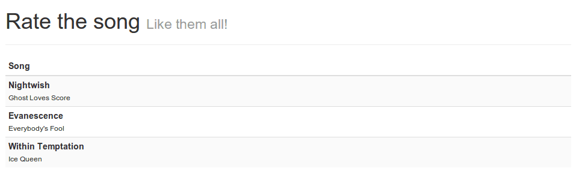

In my previous tutorial I explained how to create a simple song rating app using AngularJS and storing the data in the HTML5 LocalStorage. Today I'm going to do the same thing, but this time I will be using Ember.js. The setup is quite easy, I'm going to write an app that allows you to add songs, rate them and delete them.


### Project setup

So let's start! The first step is setting up our project. In this example I will be talking about several aspects of Ember.js, each of them seperated in a different file, so let's start by creating our project and inside create a file **assets/css/style.css**, the main HTML file **index.html** and the folder that will contain our application logic, called **app**. Inside the **app** directory we're going to add several files:

- **app.js**: Contains our main application logic and application setup
- **components.js**: This file will contain our components, in this case a rating component. Components are small (re-usable) chunks of user interface + logic (similar to widgets or directives in AngularJS)
- **controllers.js**: Contains Ember.js controllers, a controller will "control" certain part of the application. In this case I'm only going to write a single controller for our application.
- **helpers.js**: Ember.js uses Handlebars.js to render the view. If you need to add extra functionality to your Handlebars templates, you do that by writing your own Handlebars helper. You can compare these helpers to filters (and directives in some cases) in AngularJS.
- **models.js**: With ember-data (a project next to Ember.js), you can easily provide models and create/update/delete those. In this file I'm going to list the models that we're going to use in our application.
- **routes.js**: When writing single page applications, you still want to provide a way to switch between controllers and their views. A pattern commonly used is the router pattern where you describe the routes and the controller that is attached to that route. In this application we will only have one (main) route, but we do need one (it's not optional like in AngularJS).
- **views.js**: A view is a small piece of user interface. It's very similar to a component (in fact, a component is an extension to a view) but allows better event handling.


I'm also going to add several libraries to our application, like:

- **Ember.js**: JavaScript MVC framework
- **Ember-data**: Extra library for Ember.js to make it easier to work with data (models, persistence, services, ...). This project is (at this moment) still in beta, but I'm still going to use it in this application
- **Ember-localstorage-adapter**:  This is an extra library above ember-data that allows us to persist our models to the HTML5 LocalStorage
- **Handlebars**: Handlebars is a templating engine and used by Ember.js
- **jQuery**: Ember.js requires jQuery to work with
- **Bootstrap**: An UI library made by Twitter. I'm using this library to make the application look great without having to write additional CSS
- **Font Awesome**: An iconic font allowing you to add additional icons to your web application
- **Lo-Dash**: Lo-Dash is one of the popular utility belts for JavaScript (next to Underscore.js) providing utilities to work with objects, functions and collections
- **Underscore.string**: Underscore.string is an extension to Underscore (or can be used standalone) and adds String utilities to your app. In this case I’m going to extend lo-dash with it, which is also perfectly compatible with Underscore.string.

I'm using Bower to load my dependencies, and here is the configuration:

```json
{
  "name": "ember-song-rate",
  "version": "0.0.1",
  "dependencies": {
    "ember": "~1.5.0",
    "ember-data": "1.0.0-beta.7",
    "ember-localstorage-adapter": "latest",
    "handlebars": "~1.3.0",
    "jquery": "~2.1.0",
    "bootstrap": "latest",
    "lodash": "latest",
    "underscore.string": "latest",
    "font-awesome": "latest"
  }
}
```

I'm also customizing the Bower installation directory to **libs**, you can do that by adding a file called **.bowerrc** and provide the following contents:

```json
{
  "directory": "libs",
  "json": "bower.json"
}
```

After configuring the application it's time to move on and start developing!

### Providing a way to your controller!

There are many JavaScript MVC frameworks out there. They may all help you to achieve a certain goal, but the way to do it might be very different. When developing an application using Ember.js, you start by writing a router that maps a route to a specific controller. Before we do that, let's open up **app.js** and let's bootstrap our application by adding the following:

```javascript
App = Ember.Application.create();
_.mixin(_.string.exports());
```

Only the first line is important here, the second line is just there to integrate Underscore.string with Lo-Dash. The next step is creating our router. Many JavaScript MVC frameworks allow you to switch between controllers by using routers. In Ember.js you're always obligated to write a router, even if you don't need to switch. So in this case we just map the root (`/`) to a new route which we will call "songs".

```javascript
App.Router.map(function() {
  this.resource('songs', {
    path: '/'
  });
});
```

So, our router is complete, now it's time to write a route itself. Open up **routes.js** and add the following code:

```javascript
App.SongsRoute = Ember.Route.extend({
  model: function() {
    return [{
      artist: "Nightwish",
      title: "Ghost Loves Score"
    }, {
      artist: "Evanescence",
      title: "Everybody's Fool"
    }, {
      artist: "Within Temptation",
      title: "Ice Queen"
    }]
  }
});
```

So, as you can see here we added a `SongsRoute`. The naming convention here is **very important**. Earlier in our router we defined the "songs" route, which corresponds to a route called **SongsRoute** like in this example. I'm also providing a model to the route as well. In this case it's a simple array of songs (we will later improve that).

### The controller

The next step is writing our controller. The controller controls the action on the view and provides the model to the view. In this case we're going to write a simple controller that shows us the list of songs which we defined earlier. This is really easy, just add the following to **controllers.js**:

```javascript
App.SongsController = Ember.ArrayController.extend({

});
```

That's all we need. Notice that the naming convention is important here as well. A route called "songs" corresponds to a controller called `SongsController`. Another thing to notice here is that we're extending from `Ember.ArrayController`. When you're displaying a list (your model), then you want to extend `Ember.ArrayController`. For a single object you would be extending `Ember.ObjectController`.

### Look! No Handlebars!

The next thing to do is writing our view. Open **index.html** and let's start writing! First thing to write is some basic markup (a `<head>` and adding the `<script>` tags),:

```html
<!DOCTYPE html>
<html>
  <head>
    <meta charset="utf-8" />
    <meta name="viewport" content="initial-scale=1, maximum-scale=1, user-scalable=no, width=device-width" />
    <title>Rate the song</title>
    <link rel="stylesheet" href="libs/bootstrap/dist/css/bootstrap.min.css" />
    <link rel="stylesheet" href="libs/font-awesome/css/font-awesome.min.css" />
    <link rel="stylesheet" href="assets/css/style.css" />
  </head>

  <body>
    <!-- Write your code here -->

    <script type="text/javascript" src="libs/jquery/dist/jquery.min.js"></script>
    <script type="text/javascript" src="libs/handlebars/handlebars.min.js"></script>
    <script type="text/javascript" src="libs/ember/ember.js"></script>
    <script type="text/javascript" src="libs/ember-data/ember-data.min.js"></script>
    <script type="text/javascript" src="libs/ember-localstorage-adapter/localstorage_adapter.js"></script>
    <script type="text/javascript" src="libs/lodash/dist/lodash.min.js"></script>
    <script type="text/javascript" src="libs/underscore.string/dist/underscore.string.min.js"></script>
    <script type="text/javascript" src="app/app.js"></script>
    <script type="text/javascript" src="app/routes.js"></script>
    <script type="text/javascript" src="app/models.js"></script>
    <script type="text/javascript" src="app/controllers.js"></script>
    <script type="text/javascript" src="app/components.js"></script>
    <script type="text/javascript" src="app/views.js"></script>
    <script type="text/javascript" src="app/helpers.js"></script>
  </body>
</html>
```

Nothing special here, we're just loading all the files we need. The next part is that we're going to define the template for the songs route. To write a template, we add a `<script>` tag to the `<body>`, for example:

```html
<script type="text/x-handlebars" data-template-name="songs">
  <div class="container">
    <div class="page-header">
      <h1>Rate the song <small>Like them all!</small></h1>
    </div>
    <!-- Write code here -->
  </div>
</script>
```

If we open our browser now, we will see that our template is loaded.


If you're using Google Chrome, you can also install the [Ember inspector](https://chrome.google.com/webstore/detail/ember-inspector/bmdblncegkenkacieihfhpjfppoconhi) plugin. If you install it and open your console, you will be able to see all Ember.js routes, if you hover over one, you can see more information.


Our app is still quite boring now, so let's start by showing a list of songs. To do that, we're just going to show a table with a row for each song.

```html
<table class="table table-striped table-condensed">
  <thead>
    <tr>
      <th>Song</th>
    </tr>
  </thead>
  <tbody>
    {{#each}}
      <tr>
        <td>
          <div class="pull-left">
            <strong>{{artist}}</strong><br />
            <small>{{title}}</small>
          </div>
        </td>
      </tr>
    {{/each}}
  </tbody>
</table>
```

As you can see, we start of by defining a normal `<table>`. From the `<tbody>` tag it gets interesting. We want to show a row for each song in the model, so we just use the `{{#each}}` handlebars expression. For each song we're going to show the artist and title field, so we use `{{artist}}` and `{{title}}` respectively. If we open our app again, we can see the result:



### Improving the model

Sweet! We already did a lot of work in just a few lines of code. But now we're going to add the possibility to add new songs to the list. To do that, we first have to change the model from just a simple array, to a real store. Let's start by opening **models.js** and adding the following code:

```javascript
App.Song = DS.Model.extend({
  title: DS.attr('string'),
  artist: DS.attr('string')
});
```

In Ember.js, this is the way to define your model. The only downside is that it relies on the **ember-data** project, which is (at the moment) still in beta. The next step is to change the model passed to the songs route. Open **routes.js** and in stead of using an array of songs, we're going to use:

```javascript
model: function() {
  return this.store.all('song');
}
```

If we now open our app again, we will see that all songs disappeared:


I think this is pretty ugly, such an empty screen, so let's add a message that only pops up if the store is really empty. To do that, open up **index.html** and add the following code just before the `<table>`:

```html
{{#if isEmpty}}
  <div class="alert alert-info"><strong>First!</strong> You're the first one using this app. Make sure to add some songs to the list!</div>
{{/if}}
```

So here we're using another Handlebars expression called `{{#if}}`, which will only show the content if the condition is met. The condition in this case (`isEmpty`) has to be defined though, so let's open **controllers.js** and add the following code to the controller:

```javascript
isEmpty: function() {
  return !this.get('length');
}.property('length')
```

This will return true if the length of the songs collection is zero, `undefined` or `null`. To make sure the `isEmpty` is called always when the length is being updated, we add the `.property('length')` to the end of the function.

If we open the app again, we can now see the message:


### Adding a form

The next step is that we add a small form to add songs to the list. To do that, open **index.html** again and add the following form below the `<table>`:

```html
<form role="form" {{action "addSong" on="submit"}}>
  <div class="row">
    <div class="col-sm-5">
      <label class="sr-only" for="artist">Artist</label>
      {{input type="text" value=newArtist class="form-control" placeholder="Name of the artist, band, ..." autofocus="autofocus"}}
    </div>
    <div class="col-sm-5">
      <label class="sr-only" for="song">Song</label>
      {{input type="text" value=newTitle class="form-control" placeholder="Enter the name of the song..."}}
    </div>
    <div class="col-sm-2">
      <button type="submit" class="btn btn-default form-control">Add</button>
    </div>
  </div>
</form>
```

You will notice several things here which aren't just plain HTML. Let's start by talking about the `{{input}}` elements. If you want to bind a specific value to a control, you use components. In this case we're using the predefined `{{input}}` control, using the value attribute to bind it to either `newArtist` or `newTitle`.

The next thing we have to do is adding the song to the list when the form is submitted. To do that we use the `{{action}}` Handlebars helper. In this case it will call the **addSong** action on our controller if it's the submit-event.

So let's go and define that action in our controller:

```javascript
actions: {
  addSong: function() {
    this.store.createRecord('song', {
      artist: this.get('newArtist'),
      title: this.get('newTitle')
    }).save();

    this.set('newArtist', '');
    this.set('newTitle', '');
  }
}
```

So, what we're going here is that we're adding a new record to the store, containing the name of the artist and the name of the song. After saving it we reset the form fields by setting **newArtist** and **newTitle** to an empty string.

If we open our newly updated app in our browser, we will notice that a form has been added to the bottom.


Add the name of an artist/song and submit it and you will notice that it's now added to the list and the values are no longer there inside the form fields.


The message that we implemented earlier is now disappeared, because the collection is no longer empty.

So, that's it for this tutorial. We're already able to create a cool application using Ember.js and adding data to it. The next tutorial is going to be a bit smaller, but will tell you how to delete songs from the list, how to format the output using Handlebars helpers and how to store the data using the HTML5 LocalStorage.

### Ember.js in action: The series

1. [Ember.js in action: Routes and controllers](/ember-routes-controllers/ "Ember.js in action: Routes and controllers")
2. [Ember.js in action: Helpers and adapters](/ember-helpers-adapters/ "Ember.js in action: Helpers and adapters")
3. [Ember.js in action: Components and views](/ember-components-views/ "Ember.js in action: Components and views")
