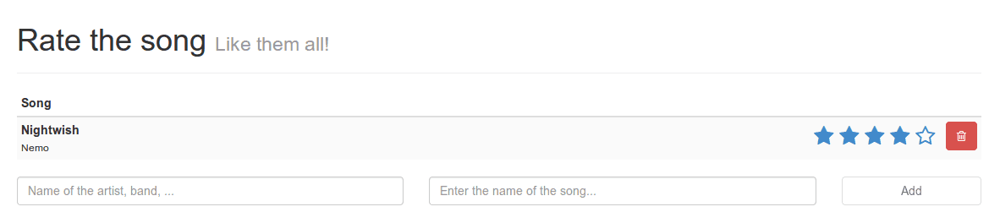

In our last two tutorials we made a simple song list app where you could add/delete songs from a list. To make the app really good we're going to add a rating component to the app, allowing us to rate the songs and eventually sort them based on their rating. So let's start!

### Changing the model

You may remember the **models.js** file from the first tutorial that contained the description of what a song really is. Today we're going to extend the model a bit and add a score field, like this:

```javascript
App.Song = DS.Model.extend({
  title: DS.attr('string'),
  artist: DS.attr('string'),
  score: DS.attr('number')
});
```

The next step is that we're going to sort the list of songs based on their score. To do that, we have to open **controllers.js** and add the following properties to it:

```javascript
sortProperties: [ 'score' ],
sortAscending: false,
```

We're also going to initialize the score of each song with 0, so replace the `createRecord()` function in the **addSong** action by:

```javascript
this.store.createRecord('song', {
  artist: this.get('newArtist'),
  title: this.get('newTitle'),
  score: 0
}).save();
```

### Writing a component

So right now, we made the changes to the data. The next step is to implement a view that shows us that score. Let's start by editing **index.html**. Locate the delete button of each song and put the following content before the `<button>` tag:

```html
{{rating-stars score=score max=5 class="pull-left" action="updateScore" param=this}}
```

This piece of code is similar to the `{{input}}` components we used in the first tutorial, the only difference now is that the **rating-stars** component is a custom component we're going to create.

As you can see we're passing several things to it, we pass the score (`score`), the maximum score (`max`), the action that should be executed when the score is changed (`updateScore`) and the parameter that we're going to pass to that function (`param`). All of these are custom parameters which we are going to use later on in our implementation.

Let's start by adding our component Handlebars template. Right below the closing `</script>` tag of the main template, put a new template:

```html
<script type="text/x-handlebars" id="components/rating-stars">
  {{score}}/{{max}}
</script>
```

The only thing we need now is to create the JavaScript code for our component. So let's open **components.js** and add the following piece of code:

App.RatingStarsComponent = Ember.Component.extend({

});

As you can see we're extending an `Ember.Component` here. The naming of the component is really important again, we used `{{rating-stars}}` so the ID of the template has to be `id="components/rating-stars"` and the name of the component has to be `App.RatingStarsComponent`.

If we now run our app and delete the old songs and add some new ones in stead, you will notice that they all get a score 0/5 (because we initialized it that way).


### Looking at the stars

Of course, this is just a simple component, we have to improve that! Somehow we have to replace the score to stars. If we have a score of 3, then it means that we have to show 3 full stars and 2 empty stars. To do that, we're going to add a property function to our component just like we earlier did in our controller (for example `isEmpty`). This one will be a bit more complex though:

```javascript
setStars: function() {
  var idx = 0, stars = [];
  for (idx = 0; idx < this.get("max"); idx += 1) {
     stars.push({
       index: idx,
       full: this.get("score") > idx
    });
  }
  this.set('stars', stars);
}.observes("score", "max").on("didInsertElement")
```

This piece of code will create the **stars** field. It will add a star object for each number below the maximum score and depending on the current score it will set the `full` property to `true` or `false`. We end the function by saying that it should observe changes at the **score** and **max** field. We're also using `on("didInsertElement")` to execute the code on the initial load.

The next step is that we're going to change the template a bit, so open **index.html** and replace the component template by:

```html
<div class="rating">
  {{#each star in stars}}
    <i {{bind-attr class=":fa star.full:fa-star:fa-star-o"}}></i>
  {{/each}}
</div>
```

We already used the `{{#each}}` helper before, but because we don't have a single model here, we also have to define what we're going to loop through, in this case `stars`. Something else that should be familiar is the `{{bind-attr}}`. We used it before to disable a specific form element and in this case we're using it to use a specific classname depending on the full property of a star. The class names will make sure the correct icon is being loaded from the **Font Awesome** set. In this case it will load **fa-star** if the full property returns `true` and **fa-star-o** if it's `false`. The **fa** classname will always be there.

Before we actually test the app, let's add some CSS as well. Edit **style.css** and add the following:

```css
.rating {
  font-size: 175%;
  padding: 0 0.5em;
}

.rating > a {
  text-decoration: none;
}

.rating .rating-highlight, .rating.rating-highlight:hover {
  color: #F4914E;
}

.rating .rating-normal, .rating.rating-normal:hover {
  color: #3C3C3C;
}
```

So now it's time to test out the application. If we open the app we will see that the songs now have some stars next to them.


Obviously, it's still not possible to edit the score and so all stars will be empty, but we can test it a bit by replacing the `score=score` attribute in the `{{rating-stars}}` component in our main template and replace it (for example) by `score=3`. If we then run our app again, we will notice that it already works pretty good:


Don't forget to restore the value afterwards.

### Adjusting the score

The next step is that we're going to make it possible to click a star and update the score depending on the star that is being clicked. We could simply use the `{{action}}` Handlebars helper here which we already used before (for adding and deleting songs), but in this case we're going to do something different. The reason behind this is that we can only specify one event handler when we use the `{{action}}` helper, but in the next part I also want to add additional event handlers which you can only make if you use a view.

So let's start by adjusting the component template a bit again and adding an element to it so the code becomes:

```html
<div class="rating">
  {{#each star in stars}}
    {{#view App.StarView star=star}}
      <i {{bind-attr class=":fa star.full:fa-star:fa-star-o"}}></i>
    {{/view}}
  {{/each}}
</div>
```

So right now we wrapped the star inside a view, called the `App.StarView`. Just like our component we're passing something to it as well, in this case it will be our current star (`star=star`). So let's start by defining our view by opening **views.js**.

The view itself should not really do a lot by itself, it will just propagate the events to the parent "controller", in this case it's not a controller, but a component though. The code for the view is:

```javascript
App.StarView = Ember.View.extend({
  
  tagName: "a",
    
  click: function(evt) {
    this.get('controller').send('click', this.get('star'));
  }
});
```

As you can see here we added a simple `click` event handler that propagates it to our controller (in this case the component). We're also adding a parameter to it, namely the current star (`this.get('star')`. Another thing to notice here is that the view is based upon the `<a>` element, as you can see in the `tagName` property. Being propagated to the component, means that we still have to write some code that will be executed inside the component to handle this event. Just like in our controller we will add an `actions` object containing our different event handlers. In our view we're sending the current star to the component using the `'click'` action (first parameter), so we have to define an action with the same name here:

```javascript
actions: {
  click: function(star) {
    var score = star.index + 1;
    this.set('score', score);
    this.sendAction('action', this.get('param'), score);
  }
},
```

The new score is based upon the `index` property. However, we're working with a zero based index here, so the first star actually has index 0. This means that score itself is the index + 1. We're then setting the score inside the component and then propagate this to our controller as well by using the `this.sendAction()` function. This will send it to the `updateScore` action in the controller, passing the parameter (the star) and the score to it.

So the next step is that we have to update and save the record in our store. Open **controllers.js** and add the following action:

```javascript
updateScore: function(song, score) {
  song.set('score', score);
  song.save();
}
```

Nothing spectacular here, we're just setting the `score` property and saving the song afterwards.

So now it's time again to test our application. If we open our app and click on the score, you will see that the score is being updated. Even when reloading the page, the score is still there.



If we have multiple songs, we will also notice that they're being sorted based upon the score as we defined earlier in our controller. For example:


And after changing the score of the second song we get:


The songs are being sorted based upon their score, without having to refresh your page.

### Making it look good

So right now everything is working pretty good, but I don't really like how the rating widget looks. It would be way better that if you hover a specific star, all stars up to that star are being highlighted. So if you hover over the fourth star, the first four stars will be highlighted. This is where we're going to need our view for, to propagate the `mouseEnter` and `mouseLeave` events to the component as well.

So let's open **views.js** and do that:

```javascript
mouseLeave: function(evt) {
  this.get('controller').send('mouseLeave', this.get('star'));
},
  
mouseEnter: function(evt) {
  this.get('controller').send('mouseEnter', this.get('star'));
}
```

Nothing spectacular here, this is just the same we did earlier when defining our click event handler. The next step is that we have to change **components.js** as well (obviously). But before that, let's explain first what we're going to do. I'm going to keep track of the currently highlighted star by introducing a property on our component called `hoverIdx`. This property will always contain the currently hovered index of the star and if no star is being hovered, it will return -1.

In the second phase I'm going to add a property `highlight` to each star which will be `true` if the index of the star is lower or equal to the `hoverIdx`. If we do that, we can simply use `{{bind-attr}}` to use a specific classname for a highlighted star.

The first step is that we're going to keep track of the index of the currently hovered star by defining our actions at our component:

```javascript
mouseEnter: function(star) {
  this.set('hoverIdx', star.index);
},
   
mouseLeave: function(star) {
  this.set('hoverIdx', -1);
},
```

The next step is that we're going to add the `highlight` property to each star by modifying the `setStars` function. In stead of using:

```javascript
stars.push({
  index : idx,
  full : this.get("score") > idx
});
```

We will be using:

```javascript
stars.push({
  index: idx,
  highlight: idx <= this.get("hoverIdx"),
  full: this.get("score") > idx || idx <= this.get("hoverIdx")
});
```

As you can see we introduced the `highlight` property, but I'm also modifying the `full`

Finally we also have to change the `observes()` part after the `setStars()` function a bit to also observe the `hoverIdx`:

```javascript
.observes("score", "max", "hoverIdx")
```

Then the only thing that rests us is to modify the `{{bind-attr}}star.highlight:rating-highlight:rating-normal` so it becomes:

```html
<i {{bind-attr class=":fa star.full:fa-star:fa-star-o star.highlight:rating-highlight:rating-normal"}}></i>
```

That's all! If we run our app now, we will notice that the stars got a different color. THat's because the **rating-normal** class is now applied, which is a custom class I defined earlier in **style.css** which will make the stars look a bit black/greyish.


The moment we hover over a specific star, the highlighting class will take over:


### Summarizing

This also means our tutorial series about Ember.js has come to an end. Before actually ending this tutorial I'm going to wrap everything up.

- In Ember.js we work with **Handlebars.js templates**, using helpers and expressions.
- When creating an application we define a **route** and then the **controller**.
- Custom Handlebars **helper functions** can be written to format certain fields
- Ember.js has a side project called **ember-data** which allows us to create more complex models and allowing us to persist them using adapters (REST, LocalStorage, ...)
- The **ember-data** project is currently still in beta.
- **Components** and **views** are similar (in fact, a component is an extension to a view), but in a view you're restricted to an actual HTML tag BUT you can add multiple event handlers to it
- Complex properties add the `.property()` to the end of the function to indicate on what fields they're based on.
- Functions that should be execute when a field changes will add the `.observes()` to the end of the function.
- **Naming **is very important in Ember.js, there are naming conventions for routes, components, ... and the JavaScript business logic is connected to the template through these naming conventions.

#### Achievement: Introduced to AngularJS

This means it's the end of the Ember.js in action tutorial series. If you're interested in the full code example, you can find it on [GitHub](https://github.com/song-rate-mvc/ember-song-rate). If you want to try out the code yourself, you can download an archive from [Github](https://github.com/song-rate-mvc/ember-song-rate/archive/master.zip).

You can also find the demo on [Github](https://song-rate-mvc.github.io/ember-song-rate).

### Ember.js in action: The series

1. [Ember.js in action: Routes and controllers](/ember-routes-controllers/ "Ember.js in action: Routes and controllers")
2. [Ember.js in action: Helpers and adapters](/ember-helpers-adapters/ "Ember.js in action: Helpers and adapters")
3. [Ember.js in action: Components and views](/ember-components-views/ "Ember.js in action: Components and views")
