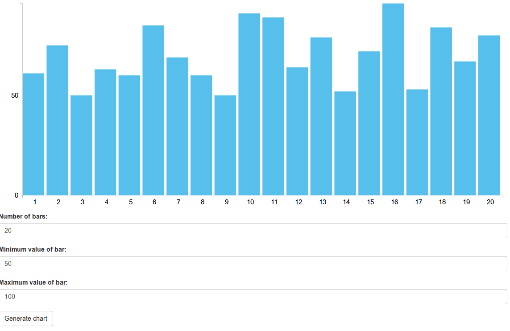

In my previous tutorials I covered the basics of creating a basic AngularJS application containing services, controllers, filters and directives. It explained most of the basic parts, but in a real application you usually combine many frameworks together to form a solid webapplication. In this tutorial I'm going to show you how you could combine AngularJS and the D3 framework.

The D3 framework is a framework that can be used for data driven applications. The entire framework centralizes the data that is being used to form a document. The most common use case it's used for is for creating charts, graphs and so on. So let's do that and "Angularify" it as well.

### Project setup

First let's start of by defining our project. For this tutorial I'm going to use four frameworks:

- D3: Drawing a chart
- AngularJS: Model-View-Controller
- LoDash: Utilities
- Twitter Bootstrap: User interface

I'm going to use **Bower** to load my dependencies, so I added a file called bower.json with the following contents:

```json
{
  "name": "angular-d3-demo",
  "version": "0.0.1",
  "dependencies": {
    "angular": "latest",
    "bootstrap-css-only": "latest",
    "lodash": "latest",
    "d3": "latest"
  }
}
```

The structure of my app is going to be quite simple, I'm going to write a simple controller to create a random set of data and I'm also going to write a directive that wraps the D3 logic for our chart.

I'm not going to explain this into detail, but I created the following structure:


### Simple controller

For generating the data on our chart, I'm going to use a simple form that has three fields for controlling how many bars should be displayed and the minimum and maximum values of each bar. The controller for this is quite simple:

```javascript
angular.module("d3App.controllers").controller("HomeCtrl", function($scope) {
    
  $scope.set = {
    x: [ ],
    y: [ ]
  };
    
  $scope.n = 5;
    
  $scope.min = 0;
    
  $scope.max = 100;
    
  $scope.randomize = function() {
    $scope.set.x = [ ];
    $scope.set.y = [ ];
    _.times($scope.n, function(n) {
      $scope.set.x.push(n + 1);
      $scope.set.y.push(_.random($scope.min, $scope.max));
    });
  };
});
```

In this example, I'm using `$scope.n`, `$scope.min` and `$scope.max` to represent the model of the three fields on the form.

The `$scope.randomize()` function will use these parameters to generate a set of X- and a set of Y-values.

### ... and a simple view

The view itself is also quite simple:

```html
<div class="container" ng-controller="HomeCtrl">
  <div bar-chart="set.y" x="set.x" class="content"></div>
  <form role="form" ng-submit="randomize()" ng-init="randomize()">
    <div class="form-group">
      <label>Number of bars:</label>
      <input type="number" class="form-control" ng-model="n" />
    </div>
    <div class="form-group">
      <label>Minimum value of bar:</label>
      <input type="number" class="form-control" ng-model="min" />
    </div>
    <div class="form-group">
      <label>Maximum value of bar:</label>
      <input type="number" class="form-control" ng-model="max" />
    </div>
    <button type="submit" class="btn btn-default">Generate chart</button>
  </form>
</div>
```

The view contains a form, using the Twitter Bootstrap markup for my form fields. The form has three fields, which matches the parameters we earlier defined in our controller. We're using the `ng-model` attribute/directive to tell which property is bound to it. When you use this kind of statement, then each time you change the value of the field, the model (the property in the controller) will change as well. The other way around will also work, if you change the property in the controller, the view will also be updated.

Other than the `ng-model` attributes there's nothing special, except the `ng-submit` on the form element, which will call the `$scope.randomize()` function as soon as the form is submitted.

For the D3 barchart I'm going to define a directive which will use the `$scope.set.x` and `$scope.set.y` arrays to show the chart. The directive will be called `barChart`, which means that in the HTML we will use `bar-chart` (camel case is being translated to this, so be aware if you're using it). We can also provide the chart with some additional X-values, which we provide by using the `x` attribute as in the code above.

### Initializing the directive

The first step we will take is defining the directive. Defining a directive is not that hard, we just tell AngularJS how we can use the directive, in which we have three choices:

- As element name (`E`)
- As attribute name (`A`)
- As class name (`C`)

Of course, you can also pick a combination of it, in my example I will make my directive available as both an element as an attribute, so I write the following code:

```javascript
angular.module("d3App.directives", []).directive("barChart", function() {
  var directive = { };
  directive.restrict = 'AE';

  // Other code
     
  return directive; 
});
```

The next thing is that we're going to configure which attributes will be available and how they're bound. In my case the X, and Y values will be bound in two ways, which means that both the directive can change it (which will be applied in the controller), but also the controller can change the model at any time, which will update the directive.

To do that I'm going to add the following to the directive:

```javascript
directive.scope = {
  x: '=?',
  y: '=barChart',
  options: '=?'
};
```

This will create directive scoped property called `x`, mapped on an attribtue with the same name (that's where the `?` is for). The `y` property on the other hand will be mapped onto the `bar-chart` attribute, which is the same as the name of the directive. I'm also going to add the possibility to add some options (like margins), which is mapped in the same way as the `x` property.

### The almighty `link()`

One of the most important functions in a directive is the `link()` function where all magic will happen. In this function, we will use D3 to draw our barchart, but before we do that we must prepare some things, like adding some properties for our SVG element (which will be used to draw on):

```javascript
angular.module("d3App.directives", []).directive("barChart", function() {
  var directive = { };
     
  directive.restrict = 'AE';   
  directive.scope = {
    x: '=?',
    y: '=barChart',
    options: '=?'
  };
     
  directive.link = function(scope, elements, attr) {
    scope.svg = null;
    scope.container = null;
  };
     
  return directive; 
});
```

Next thing we do is providing some functions to get the X-values and the options. These are a bit special, because I made them optional. If I don't provide a valid `x` model, then the indexes of the `y` model will be used, so I created a function called `scope.getX()` which will do that for us:

```javascript
scope.getX = function() {
  var x = null;
  if (scope.x) {
    x = scope.x;
  } else {
    x = _.keys(scope.y);
  }
  return x;
};
```

The options are optional as well, so I provided some default values for when a specific option is not set. To get the real options I created a function called `scope.getOptions()`:

```javascript
scope.getOptions = function() {
  return _.merge({
    width: 1000,
    height: 400,
    margin: {
      top: 10,
      right: 10,
      bottom: 30,
      left: 50
    }  
  }, scope.options || { });
};
```

### Initializing the SVG

Now we will start initializing the SVG using D3. The SVG element will contain three `<g>` elements:

- One will be used to draw the X axis
- Another one will be used to draw the Y axis
- The last one will be used to draw the bars themself

I created a function called `scope.initialize()` that will draw the three "layers". We will also automatically call the function when the `link()` function is executed, so that the SVG is automatically initialized:

```javascript
angular.module("d3App.directives", []).directive("barChart", function() {
  var directive = { };
     
  directive.restrict = 'AE';
  directive.scope = {
    x: '=?',
    y: '=barChart',
    options: '=?'
  };
     
  directive.link = function(scope, elements, attr) {
    scope.svg = null;
    scope.container = null;
       
    scope.getX = function() {
      var x = null;
      if (scope.x) {
        x = scope.x;
      } else {
        x = _.keys(scope.y);
      }
      return x;
    };
       
    scope.getOptions = function() {
      return _.merge({
        width: 1000,
        height: 400,
        margin: {
          top: 10,
          right: 10,
          bottom: 30,
          left: 50
        }  
      }, scope.options || { });
    };

    scope.initialize = function() {
      scope.svg = d3.select(elements[0]).append("svg").attr("class", "chart");
      scope.container = scope.svg.append("g");
      scope.container.append("g").attr("class", "x");
      scope.container.append("g").attr("class", "y");
      scope.setSvgSize();
    };

    scope.initialize();
  };
     
  return directive; 
});
```

You can also see I'm calling a function called `scope.setSvgSize()` inside the `scope.initialize()` function. This function will change the size of the SVG depending on the options that were provided:

```javascript
scope.setSvgSize = function() {
  var options = scope.getOptions();
  scope.container.attr("transform", "translate(" + options.margin.left + ", " + options.margin.right + ")");
  scope.svg.attr('viewBox','0 0 '+ (options.width + options.margin.left + options.margin.right) + ' ' +
      (options.height + options.margin.top + options.margin.bottom))
    .attr('preserveAspectRatio','xMinYMin');
  scope.redraw();
};
```

This function will use the options and create a viewbox of that width/height. By using the viewbox we can make our chart responsive, while preserving the aspect ratio provided in the viewbox. By splitting the initialization up into two functions, we can later call the `scope.setSvgSize()` function as soon as a change is detected in the `scope.options` object.

### Adding the D3 magic to our application

The last function we have to write is the `scope.redraw()` function which will use D3 to draw our bars.

```javascript
angular.module("d3App.directives", []).directive("barChart", function() {
  var directive = { };
     
  directive.restrict = 'AE';
  directive.scope = {
    x: '=?',
    y: '=barChart',
    options: '=?'
  };
     
  directive.link = function(scope, elements, attr) {
    scope.svg = null;
    scope.container = null;
       
    scope.getX = function() {
      var x = null;
      if (scope.x) {
        x = scope.x;
      } else {
        x = _.keys(scope.y);
      }
      return x;
    };
       
    scope.getOptions = function() {
      return _.merge({
        width: 1000,
        height: 400,
        margin: {
          top: 10,
          right: 10,
          bottom: 30,
          left: 50
        }  
      }, scope.options || { });
    };

    scope.initialize = function() {
      scope.svg = d3.select(elements[0]).append("svg").attr("class", "chart");
      scope.container = scope.svg.append("g");
      scope.container.append("g").attr("class", "x");
      scope.container.append("g").attr("class", "y");
      scope.setSvgSize();
    };

    scope.setSvgSize = function() {
      var options = scope.getOptions();
      scope.container.attr("transform", "translate(" + options.margin.left + ", " + options.margin.right + ")");
      scope.svg.attr('viewBox','0 0 '+ (options.width + options.margin.left + options.margin.right) + ' ' +
          (options.height + options.margin.top + options.margin.bottom))
        .attr('preserveAspectRatio','xMinYMin');
      scope.redraw();
    };

    scope.initialize();
  };

  scope.redraw = function() {
    // More stuff will come
  };
     
  return directive; 
});
```

First of all, we have to verify if there are X and Y values:

```javascript
var x, y, xAxis, yAxis, dataset, options = scope.getOptions(), xValues = scope.getX(), yValues = scope.y;
if (xValues && yValues) {
  // More here
}
```

Then we can draw our X- and Y-axis. To do that, we have to create a scale which is able to convert our data (`xValues` or `yValues`) into pixels (`options.width` or `options.height`). Then we can create an axis (`xAxis` and `yAxis`) based on those scales.

```javascript
x = d3.scale.ordinal().domain(xValues).rangeRoundBands([ 0, options.width ], 0);
y = d3.scale.linear().domain([0, d3.max(yValues)]).range([ options.height, 0]);
xAxis = d3.svg.axis().scale(x).orient("bottom").ticks(5);
yAxis = d3.svg.axis().scale(y).orient("left").ticks(2);
```

Now all we have to do is draw these axis':

```javascript
scope.container.selectAll("g.x").attr("transform", "translate(0, " + options.height + ")").call(xAxis);
scope.container.selectAll("g.y").call(yAxis);
```

As you can see I'm using the elements we defined earlier in the `scope.initialize()` function.

Now we can start by choosing our data and selecting on which element they will appear:

```javascript
dataset = scope.container.selectAll(".bar").data(yValues);
```

The next step is that we have to add a rectangle for each item in the `yValues` array, which we will do by using:

```javascript
dataset.enter().append("rect").attr("class", "bar");
```

As you can see we're adding the `enter()` function to the chain. All fields that will change due to changes in the data will be placed outside the `enter()` chain, while adding rectangles with a specific classname (`.bar`) does not change based on the data.

On the other hand, the X, Y, width and height of the bars will change depending on the data, so they're placed outside the `enter()` function:

```javascript
dataset.transition().attr("x", function(d, i) {
  return i * x.rangeBand();
}).attr("width", function() {
  return x.rangeBand() - 5;
}).attr("height", function(d) {
  return options.height - y(d);
}).attr("y", function(d) {
  return y(d);
});
```

We end the chain using: `dataset.exit().remove()`

This will tell D3 that this is the end of the nodes that are added by D3, and it also says that each time new data is added, the old nodes should be removed.

### I'm watching you!

Finally, we're going to make sure that each time the X, Y or options changes, the chart is being redrawn or the size of the SVG is changed. To do that, we use the `scope.$watch()` function, for example:

```javascript
scope.$watch('x', scope.redraw);
scope.$watch('y', scope.redraw);
scope.$watch('options', scope.setSvgSize);
```

That's all code we need in our directive, which should now look like:

```javascript
angular.module("d3App.directives", []).directive("barChart", function() {
  var directive = { };
     
  directive.restrict = 'AE';
  directive.scope = {
    x: '=?',
    y: '=barChart',
    options: '=?'
  };
     
  directive.link = function(scope, elements, attr) {
    scope.svg = null;
    scope.container = null;
       
    scope.getX = function() {
      var x = null;
      if (scope.x) {
        x = scope.x;
      } else {
        x = _.keys(scope.y);
      }
      return x;
    };
       
    scope.getOptions = function() {
      return _.merge({
        width: 1000,
        height: 400,
        margin: {
          top: 10,
          right: 10,
          bottom: 30,
          left: 50
        }  
      }, scope.options || { });
    };

    scope.initialize = function() {
      scope.svg = d3.select(elements[0]).append("svg").attr("class", "chart");
      scope.container = scope.svg.append("g");
      scope.container.append("g").attr("class", "x");
      scope.container.append("g").attr("class", "y");
      scope.setSvgSize();
    };

    scope.setSvgSize = function() {
      var options = scope.getOptions();
      scope.container.attr("transform", "translate(" + options.margin.left + ", " + options.margin.right + ")");
      scope.svg.attr('viewBox','0 0 '+ (options.width + options.margin.left + options.margin.right) + ' ' +
          (options.height + options.margin.top + options.margin.bottom))
        .attr('preserveAspectRatio','xMinYMin');
      scope.redraw();
    };

    scope.redraw = function() {
      var x, y, xAxis, yAxis, dataset, options = scope.getOptions(), xValues = scope.getX(), yValues = scope.y;
      if (xValues && yValues) {
        x = d3.scale.ordinal().domain(xValues).rangeRoundBands([ 0, options.width ], 0);
        y = d3.scale.linear().domain([0, d3.max(yValues)]).range([ options.height, 0]);
        xAxis = d3.svg.axis().scale(x).orient("bottom").ticks(5);
        yAxis = d3.svg.axis().scale(y).orient("left").ticks(2); 
        
        scope.container.selectAll("g.x").attr("transform", "translate(0, " + options.height + ")").call(xAxis);
        scope.container.selectAll("g.y").call(yAxis);
        dataset = scope.container.selectAll(".bar").data(yValues);
        dataset.enter().append("rect").attr("class", "bar");
        dataset.transition().attr("x", function(d, i) {
          return i * x.rangeBand();
        }).attr("width", function() {
          return x.rangeBand() - 5;
        }).attr("height", function(d) {
          return options.height - y(d);
        }).attr("y", function(d) {
          return y(d);
        });
        dataset.exit().remove();
      }
    };

    scope.$watch('x', scope.redraw);
    scope.$watch('y', scope.redraw);
    scope.$watch('options', scope.setSvgSize);

    scope.initialize();
  };
     
  return directive; 
});
```

### Some styling

Finally, we're also going to add some styling as well:

```css
.chart .domain {
  fill: none;
  stroke-width: 1;
  stroke: #D4D4D1;
}
  
.chart .bar {
  fill: #56BEEB;
}
```

### Wrapping up

When we launch our application now, we will see that the chart is already being drawn based on the default parameters:


If we press the "Generate chart" button again, other random values will be used and the chart will smoothly animate to its new data:


We can also toy around with the parameters and click the "Generate chart" button again:



#### Achievement: Added D3 magic to AngularJS

This means it's the end of the tutorial about the integration of D3.js and AngularJS by using directives. if you're interested in the full code example, you can find it on [Github](https://github.com/g00glen00b/angular-d3-demo). If you want to try out the code yourself, you can download an archive from [Github](https://github.com/g00glen00b/angular-d3-demo/archive/master.zip).

You can also find the demo on [Github](https://g00glen00b.github.io/angular-d3-demo).
