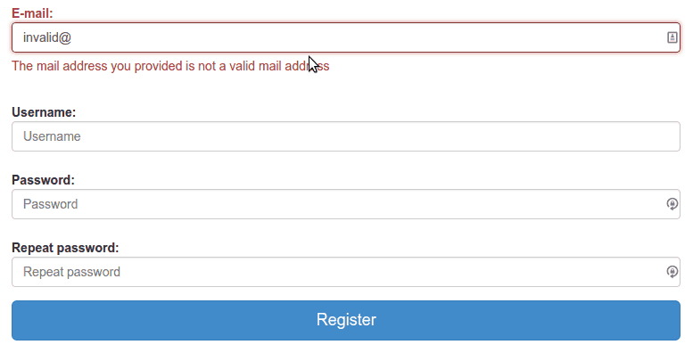
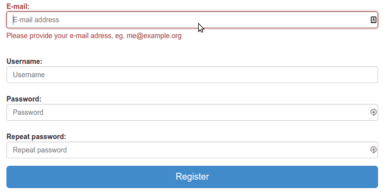
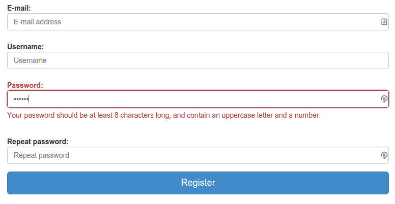

In the previous tutorials about AngularJS I already used some forms, but I never went into detail about them or about form validation. In this tutorial that will probably change, as I will explain you how you could use AngularJS validation and write your own custom validators.

### Project setup

The project setup is quite simple, I'm going to write an application containing a single HTML file (index.html), a JavaScript file for the AngularJS controllers and one for the directives, and also a JavaScript file for the application itself.

Obviously I'm going to use the AngularJS framework, and next to that I will also use the Twitter Bootstrap CSS to create a good-looking form.

In the application JavaScript file I'm also going to define packages for the application, the controllers and the directives, to do that you should write the following

```javascript
angular.module("myApp.controllers", []);
angular.module("myApp.directives", []);
  
angular.module("myApp", [
  "myApp.controllers",
  "myApp.directives"
});
```

### The form

First thing to do is to add the form itself. The form is going to be a simple Twitter Bootstrap based horizontal form, but it can be anything:

```html
<div class="container" ng-controller="RegisterCtrl">
  <form role="form" class="form-horizontal" name="form">
    <div class="form-group">
      <label class="control-label">E-mail:</label>
      <input type="email" name="mail" class="form-control" placeholder="E-mail address" />
    </div>
    <div class="form-group">
      <label class="control-label">Username:</label>
      <input type="text" name="username" class="form-control" placeholder="Username" />
    </div>
    <div class="form-group">
      <label class="control-label">Password:</label>
      <input type="password" name="password" class="form-control" placeholder="Password" />
    </div>
    <div class="form-group">
      <label class="control-label">Repeat password:</label>
      <input type="password" name="password2" class="form-control" placeholder="Repeat password" />
    </div>
    <div class="form-group">
      <button type="submit" class="btn btn-primary btn-block btn-lg">Register</button>
    </div>
  </form>
</div>
```

As you can see, it's a simple registration form containing 4 elements, the username, e-mail password and the repeat password field. In its current state, you can simply press the button even if you didn't even enter any information. That's what we're going to change in this tutorial.

### HTML5 validation

Before we start writing custom validators, you should also be aware of the fact that HTML5 allows browsers to support validation. For example, if you add the `required` attribute to a form element, it should be entered before the form can be submitted. Every `<input>` element is required, so add a `required` attribute to all elements. The username also has a maximum length of 16 characters, so add the `maxlength="16"` attribute to it.

### Angularify the HTML validation attributes

The good thing about AngularJS forms is that it uses these attributes to add some basic validation to the form, so, this means that right now we're already using AngularJS form validation. Before we try it out in our browser, make sure you create a "dummy controller, like the one below:

```javascript
angular.module("myApp.controllers").controller("RegisterCtrl", function($scope, $q) {
    
});
```

Next to that, we also have to bind the values of this form to a model, which we will do by adding the `ng-model` attribute to all form elements, for example:

```html
<form role="form" class="form-horizontal" name="form">
  <div class="form-group">
    <label class="control-label">E-mail:</label>
    <input type="email" name="mail" class="form-control" placeholder="E-mail address" required ng-model="email" />
  </div>
  <div class="form-group">
    <label class="control-label">Username:</label>
    <input type="text" name="username" class="form-control" placeholder="Username" required maxlength="16" ng-model="username" />
  </div>
  <div class="form-group" >
    <label class="control-label">Password:</label>
    <input type="password" name="password" class="form-control" placeholder="Password" required ng-model="password" />
  </div>
  <div class="form-group">
    <label class="control-label">Repeat password:</label>
    <input type="password" name="password2" class="form-control" placeholder="Repeat password" required ng-model="password2" />
  </div>
  <div class="form-group">
    <button type="submit" class="btn btn-primary btn-block btn-lg" >Register</button>
  </div>
</form>
```

So, if we run it in our browser now, and enter an invalid e-mail address, AngularJS will change a specific model in your controller, for example:


**Heads up!** The weird symbols you see at the right end of the form fields are part of a browser plugin, I forgot to disable it and only noticed it afterwards.

Based on this model we can add some colours and other stuff to indicate that the form is valid or not. For example, I'm going to change the form into this:

```html
<form role="form" class="form-horizontal" name="form">
  <div class="form-group" ng-class="{'has-error': form.mail.$dirty && form.mail.$invalid}">
    <label class="control-label">E-mail:</label>
    <input type="email" name="mail" class="form-control" placeholder="E-mail address" required ng-model="email" />
  </div>
  <div class="form-group" ng-class="{'has-error': form.username.$dirty && form.username.$invalid}">
    <label class="control-label">Username:</label>
    <input type="text" name="username" class="form-control" placeholder="Username" required maxlength="16" ng-model="username" />
  </div>
  <div class="form-group" ng-class="{'has-error': form.password.$dirty && form.password.$invalid}">
    <label class="control-label">Password:</label>
    <input type="password" name="password" class="form-control" placeholder="Password" required ng-model="password" />
  </div>
  <div class="form-group" ng-class="{'has-error': form.password2.$dirty && form.password2.$invalid}">
    <label class="control-label">Repeat password:</label>
    <input type="password" name="password2" class="form-control" placeholder="Repeat password" required ng-model="password2" />
  </div>
  <div class="form-group">
    <button type="submit" class="btn btn-primary btn-block btn-lg" >Register</button>
  </div>
</form>
```

By using the **ngClass** directive, I'm adding the `.has-error` class to the form element as soon as the field is invalid (`$invalid`) and dirty (`$dirty`). The dirty-check is here to validate if the form field has been altered. If the form field is not altered yet, we don't want show the errors yet.

### Error messages

Each validation also sets its own property, for example, when you enter an invalid mail, it will set the `form.mail.$error.email` property to `true`, while if you leave the mail field empty, it will set the `form.mail.$error.required` property to `true`.

Thanks to this, we can provide some individual error messages as well, for example:

```html
<form role="form" class="form-horizontal" name="form">
  <div class="form-group" ng-class="{'has-error': form.mail.$dirty && form.mail.$invalid}">
    <label class="control-label">E-mail:</label>
    <input type="email" name="mail" class="form-control" placeholder="E-mail address" required ng-model="email" />
    <span class="help-block" ng-show="form.mail.$dirty && form.mail.$error.required">Please provide your e-mail adress, eg. me@example.org</span>
    <span class="help-block" ng-show="form.mail.$dirty && form.mail.$error.email">The mail address you provided is not a valid mail address</span>
  </div>
  <div class="form-group" ng-class="{'has-error': form.username.$dirty && form.username.$invalid}">
    <label class="control-label">Username:</label>
    <input type="text" name="username" class="form-control" placeholder="Username" required maxlength="16" ng-model="username" />
    <span class="help-block" ng-show="form.username.$dirty && form.username.$error.required">Please provide the username you would like to have</span>
    <span class="help-block" ng-show="form.username.$dirty && form.username.$error.maxlength">Your username should be no longer than 16 characters</span>
  </div>
  <div class="form-group" ng-class="{'has-error': form.password.$dirty && form.password.$invalid}">
    <label class="control-label">Password:</label>
    <input type="password" name="password" class="form-control" placeholder="Password" required ng-model="password" />
    <span class="help-block" ng-show="form.password.$dirty && form.password.$error.required">Please enter a password</span>
  </div>
  <div class="form-group" ng-class="{'has-error': form.password2.$dirty && form.password2.$invalid}">
    <label class="control-label">Repeat password:</label>
    <input type="password" name="password2" class="form-control" placeholder="Repeat password" required ng-model="password2" />
    <span class="help-block" ng-show="form.password2.$dirty && form.password2.$error.required">Please enter a password</span>
  </div>
  <div class="form-group">
    <button type="submit" class="btn btn-primary btn-block btn-lg" >Register</button>
  </div>
</form>
```

Just like before, we're also checking if the field is dirty, because we don't want to show all these error messages if the user didn't change the form yet. If you run it in your browser, and enter an invalid mail address, you will get the following message:



While if you leave the mail address away, you will get another message:



### Angular validations

Other than that, AngularJS also has some validation directives, which usually make it easier to bind some additional information to the controller. An example is the **ngPattern** directive. If we want to validate that the password has at least one uppercase letter, one lowercase letter, one digit and is at least 8 characters long, then we can write a regular expression to match that, add it to the controller and bind it using this directive.

So, let's add the `ng-pattern` attribute to the password field like this:

```html
<div class="form-group" ng-class="{'has-error': form.password.$dirty && form.password.$invalid}">
  <label class="control-label">Password:</label>
  <input type="password" name="password" class="form-control" ng-model="password" placeholder="Password" required ng-model="password" ng-pattern="passwordPattern" />
  <span class="help-block" ng-show="form.password.$dirty && form.password.$error.required">Please enter a password</span>
  <span class="help-block" ng-show="form.password.$dirty && form.password.$error.pattern">Your password should be at least 8 characters long, and contain an uppercase letter and a number</span>
</div>
```

I also added an extra message to indicate that the given password does not match the given pattern. The only thing we have to do now is to add the pattern on our controller, for example:

```javascript
$scope.passwordPattern = /(?=^.{8,}$)((?=.*\d)|(?=.*\W+))(?![.\n])(?=.*[A-Z])(?=.*[a-z]).*$/;
```

If we enter an invalid password now, we will see that an error message will be displayed:



### Custom validations

Well, I covered most parts of form validation now, but the most fun one, writing your own validator is another option you have when validating forms. For example, let's say that we want to write a validator to check if the second password field contains the same value as the first one (something what happens often in a registration form). To validate this, we can write our own directive, so let's try it out! First thing to do is to define a directive, I'm going to call my directive **ngEquals**, so I wrote the following piece of code:

```javascript
angular.module("myApp.directives", []).directive("ngEquals", function() {
  var directive = {};
  // Custom code
  return directive;
});
```

Pretty simple, the second thing we have to do is to tell our directive that it can only be applied to an **attribute**, requires a parameter and that it needs the **ngModel** directive for processing the value. We do that by writing:

```javascript
angular.module("myApp.directives", []).directive("ngEquals", function() {
  var directive = { };
   
  directive.restrict = 'A';
  directive.require = 'ngModel';
  directive.scope = {
    original: '=ngEquals'
  };
});
```

By using the character "A" in the `directive.restrict` property, we tell AngularJS that the directive should only be used as an attribute. The `directive.require` property indicates that we need the **ngModel** model to be present and finally, the `directive.scope` property allows us to map parameters onto the scope.

In this case we're two-way binding the value of the `ng-equals` directive/attribute to the `scope.original` value.

An important function in a directive is the link function, where all magic happens. In this case, we will use the link function to call the `ngModel.$parsers.unshift()` function to set the validity of the value to true or false:

```javascript
directive.link = function(scope, elm, attrs, ngModel) {
  ngModel.$parsers.unshift(function(value) {
    ngModel.$setValidity('equals', scope.original === value);
    return value;
  });
};
```

The link-function normally allows three parameters, the private scope of the directive (containing the `scope.original` property for example), the element on which the directive was used and the attributes it has. However, because we said we need the ngModel directive, it also adds an extra parameter, allowing is to call the function to set the validity of our field. We can do that, by calling the `ngModel.$setValidity()` function, which allows two parameters. The first one being the name of the validator, and the second one being true or false (indicating if the field is valid). Validation is quite simple since we have the original value (we added it to our scope) and the new value, which we receive from the `ngModel.$parsers.unshift()` callback, so comparing them is a piece of cake now.

That's all we need! So let's return to the HTML document and test our directive out. We first need to add it as an attribute to the password2 field, then we can also add a custom message:

```html
<div class="form-group" ng-class="{'has-error': form.password2.$dirty && form.password2.$invalid}">
  <label class="control-label">Repeat password:</label>
  <input type="password" name="password2" class="form-control" ng-model="password2" placeholder="Repeat password" required ng-equals="password" />
  <span class="help-block" ng-show="form.password2.$dirty && form.password2.$error.required">Please enter a password</span>
  <span class="help-block" ng-show="form.password2.$dirty && form.password2.$error.equals">Passwords do not match</span>
</div>
```

So, as you can see I added the `ng-equals` attribute to the form element, remember that in AngularJS you should use camel case in the directive name, but when you use it as an attribute, you have to convert it and split it by using the dash, so in this case "ngEquals" becomes "ng-equals".

We also made it so that the directive requires a parameter, the original value. In our case, we bound the original password to a model called password, so we can simply use that one to compare the passwords.

If we run our application now, and enter different passwords, you will see the error message:


### Deferreds

So, while we're busy, we can write a second directive as well to finish our validations. Another pretty common validation is to use a RESTful webservice to check if the given username is already taken or not. We're not going to write an entire REST service here, but in stead of that, let's "mock" it by writing a method in our controller that returns a deferred object that later returns a boolean true or false, indicating if the given username is available or not, so open your controller and add the following function:

```javascript
$scope.validUsername = function(username) {
  var dfd = $q.defer();
  setTimeout(function() {
    dfd.resolve([ "g00glen00b", "Dimitri" ].indexOf(username) === -1);
  }, 1000);
  return dfd.promise;
};
```

What this does is quite simple, it uses the `$q` module to create a deferred object, which allows you to work with asynchronous data. In this case our asynchronous data is simply a timed out function by using the `setTimeout` function, but in reality this could be a call to a real service.

To return the value to a deferred, you use the `dfd.resolve()` function containing the data, in this case a true if the username is available and false if the username is either "g00glen00b" or "Dimitri".

That's all we really need, so let's go back to our directives and start write a second directive. This directive should be quite easy now, if you understood the previous part of the tutorial, so I'm going to post the entire code at once:

```javascript
angular.module("myApp.directives").directive("ngFiltered", function() {
  var directive = { };
    
  directive.restrict = 'A';
  directive.require = 'ngModel';
  directive.scope = {
    filter: '&ngFiltered'
  };
    
  directive.link = function(scope, elm, attrs, ngModel) {
    ngModel.$parsers.unshift(function(value) {
      var result = scope.filter({
        $value: value
      });
      if (typeof result.then === "function") {
        result.then(function(result) {
          ngModel.$setValidity('filtered', result);
        });
      } else {
        ngModel.$setValidity('filtered', result);
      }
      return value;
    });
  };
    
  return directive;
});
```

Most of this directive should be clear, but a few things should be noticed. First of all, in stead of binding a value, we're binding a function to the directive's scope, which we indicate by using the ampersand (`&ngFiltered`). To call the function, we use the following code:

```javascript
scope.filter({
  $value: value
});
```

The `$value` in this case is acting as a placeholder. The reason it's there is that we want to call a function in our controller that requires a parameter (the username), so in order to pass that parameter, we're going to use a placeholder. I'm going to show you how to use it in the next part.

But first I may have to explain what I'm doing in the `directive.link()` function. The `if` statement in it might be quite confusing, but what it does is that it detects if the result of the filter function (from our controller for example) returns either a deferred or a simple boolean true or false. If it returns a deferred, we have to use the `then()` function to retrieve the data from it.

So, what happens if the function is called is that the controller will return a deferred. The directive will know that it is a deferred, since each deferred has a function called `then()` (which we check for using the if-statement). It will add a callback function as a parameter to the `then()` function. As soon as the deferred is resolved, in this case after 1 second when the `dfd.resolve()` function in the controller is called, then the callback function will be executed. The result data will be added as a parameter to the callback function, allowing is to retrieve it in the function itself, using it to set the validity of the field like we did in our first directive.

If the result data of the function is not a deferred, then we can directly set the validity of the field, since we don't have any asynchronous threads to "wait" for.

Now, to use the directive we go back to the HTML and add the `ng-filtered="validUsername($value)"` attribute to it. As you can see here, we're using the `$value` placeholder here, so that when the function is called, it's actually calling the function `validUsername("text in form field")`, allowing us to properly pass a parameter, like the username is this case.

We can also set an error message, so that the HTML for the username becomes:

```html
<div class="form-group" ng-class="{'has-error': form.username.$dirty && form.username.$invalid}">
  <label class="control-label">Username:</label>
  <input type="text" name="username" class="form-control" ng-model="username" placeholder="Username" required maxlength="16" ng-filtered="validUsername($value)" />
  <span class="help-block" ng-show="form.username.$dirty && form.username.$error.required">Please provide the username you would like to have</span>
  <span class="help-block" ng-show="form.username.$dirty && form.username.$error.maxlength">Your username should be no longer than 16 characters</span>
  <span class="help-block" ng-show="form.username.$dirty && form.username.$error.filtered">That username is already taken</span>
</div>
```

If we run our web application now, and enter the username "g00glen00b", you will notice that about 1 second later it will show the error message. The reason should be clear by now, because we used the `setTimeout` function, it's delaying the validation a bit, but it works fine as you can see.


### Disabling the button

So, that's all for validations in this tutorial. But one issue remains, we wrote some really cool validations, but even when the form is invalid, we can still press the "Register" button. To disable the button as long as the form is invalid, you can use the **ngDisabled** directive, for example:

```html
<button type="submit" class="btn btn-primary btn-block btn-lg" ng-disabled="form.$invalid">Register</button>
```

If we run the application now, you will see that the button is disabled as long as the form is not valid:


But as soon the form is valid, the button is enabled as well:


With this, I would like to end this tutorial about form validation. You're now ready to use form validation in any Angular-powered web application.

#### Achievement: Wrote a directive for custom form validation using AngularJS

This means it's the end of the tutorial about AngularJS form validation. if you're interested in the full code example, you can find it on [Github](https://github.com/g00glen00b/angular-forms). If you want to try out the code yourself, you can download an archive from [Github](https://github.com/g00glen00b/angular-forms/archive/master.zip).

You can also find the demo on [Github](https://g00glen00b.github.io/angular-forms).
