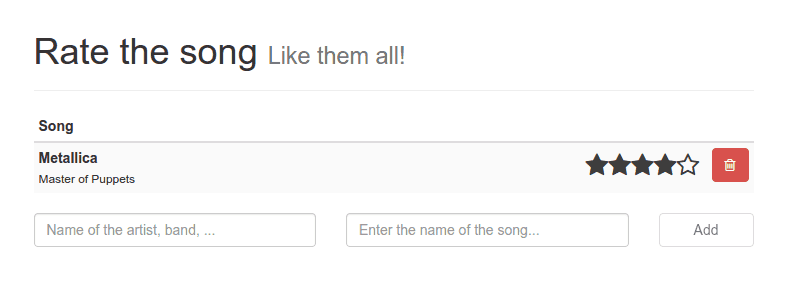

In my [previous tutorial](/reactjs-gulp-browserify/ "Writing apps with React.js: Build using gulp.js and Browserify"), I've set up gulp.js to build my React.js application, now it's time to write that application. Like I said before, the app I'm going to build in this tutorial, is an application where you can add/remove songs and rate those. We have several components to implement, so let's start.

 

### JSX

First of all let's talk about JSX. React.js works with components, and these components contain both the representation (HTML) and the logic behind it. Obviously we have to set up certain objects to render our HTML, and React.js provides two ways to do that. First of all, you can construct objects using a simple JavaScript syntax:

```javascript
React.createElement('a', {
  href: 'https://dimitr.im'
}, 'Hello world')
```

But you can also create objects using JSX, like this:

```html
<a href="">Hello world</a>
```

Doesn't look so special, but you can mix this with JavaScript code and write components really easily and clean.

### Song component

Let's start with the most important component first, the song component (**Song.jsx**), which will look like this:

```javascript
(function(React, module, undefined) {
  var Rating = require("./Rating.jsx");
  module.exports = React.createClass({
    render: function() {
      return (
        <tr>
          <td>
            <div className="pull-left">
              <strong>{this.props.data.artist}</strong><br />
              <small>{this.props.data.title}</small>
            </div>
            <div className="pull-right">
              <Rating data={this.props.data} />
              <button type="button" className="btn btn-danger pull-right" onClick={this.deleteSong}>
                <i className="fa fa-trash-o"></i>
              </button>
            </div>
          </td>
        </tr> 
      );
    },
    deleteSong: function() {
      this.props.data.delete();
    }
  });
}(React, module));
```

What we do here isn't that difficult, we create a new class/component and fill in the HTML in the `render()` function using JSX. I'm using several placeholders here, like `{this.props.data.artist}`. This data will be provided by the upper components. In React.js there are two kinds of data, you have the state and the properties of a component. The properties of a component represent more static data, while the state will automatically cause the component to trigger the `render()`, so that it updates the user interface.

The JSX template looks quite similar to HTML, but there are some differences. Make sure that you use the `className` attribute\` to set the classes of the HTML node.

We have a delete button inside the JSX code. To make it do something, we use a placeholder as well, like `onClick={this.deleteSong}`. This will refer to the `deleteSong()` function inside the component. Which in this case calls `this.props.data.delete()`, which means the `delete()` function is called on our model.

What you can also see is that I'm using browserify and `require()` to include the Rating.jsx component. as a variable called `Rating`. As soon as you have a component available in a variable, you can use it directly in your template, for example:

```html
<Rating data={this.props.data} />
```

What happens on that line is that we create an instance of the Rating.jsx component and pass it the current data.

### Making a list of songs

If you understand what we just did, then the next component will be peanuts. This component actually has an entire array of songs inside `this.props.data` and uses the `map()` function to convert it to a list of Song components, like this:

```javascript
(function(React, module, undefined) {
  var Song = require('./Song.jsx');
  
  module.exports = React.createClass({
    render: function() {
      var stars = [];
      return (
        <table className="table table-striped table-condensed">
          <thead>
            <tr>
              <th>Song</th>
            </tr>
          </thead>
          <tbody>
            {this.props.data.map(function(song) {
              return <Song key={song.id} data={song}/>;
            })}
          </tbody>
        </table>
      );
    }
  });
}(React, module));
```

Quite simple, don't you think? All we do is create a Song component for each song and add some extra markup to it (table heading).

### We continue our way up with the App component

Like I said in the previous tutorial, we defined a root component called **App.jsx**. This component will be the root and will contain several other components. In our case it will contain three components:

- The **Songs.jsx** component we defined earlier to show our list of songs.
- The **SongForm.jsx** component to add new songs to the list.
- And also the **SongAlert.jsx** component, which will be used to show some information if the songs array is empty.

Well, displaying the Songs and SongForm component isn't that hard, the SongAlert component on the other hand has to be displayed conditionally, but with JSX it's quite easy as well, you just write a simple if-structure and that's it:

```javascript
(function(React, module, undefined) {
  var Songs = require('./Songs.jsx'),
      SongForm = require('./SongForm.jsx'),
      SongAlert = require('./SongAlert.jsx');
  
  module.exports = React.createClass({
    render: function() {
      var alert;
      if (!this.props.songs || this.props.songs.length === 0) {
        alert = <SongAlert />;
      }
      return (
        <div className="container">
          <div className="page-header">
            <h1>Rate the song <small>Like them all!</small></h1>
          </div>
          
          {alert}
          <Songs data={this.props.songs} />
          <SongForm />
        </div>
      );
    }
  });
}(React, module));
```

So, as you can see, we're importing all the components we need into the variables `Songs`, `SongForm` and `SongAlert`. The alert only has to be showed in case if there are no songs, so all we have to do is write a simple if, using `!this.props.songs || this.props.songs.length === 0` as expression to validate if the songs array is empty or not. If it's empty, we fill up the variable called `alert`, which we later use in our template as `{alert}`.

### The easiest component, the SongAlert

I was first thinking if it was worth creating a component for it, but I decided to do it after all... because I like components! However, this one is simple enough to leave it like that without any other explanation:

```javascript
(function(React, module, undefined) {
  module.exports = React.createClass({
    render: function() {
      return (
        <div className="alert alert-info">
          <strong>First!</strong> You're the first one using this app. Make sure to add some songs to the list!
        </div>
      );
    }
  });
}(React, module));
```

### Adding new songs with the SongForm

Before we start with the rating, we're going to make it possible to add new songs. To do so, I created a form. This one has quite a lot behavior, because there are several things we want to do. For example, if no artist or title is entered, the button to add a new song should be disabled (there's really no point in adding a song that is blank). So... we have data that will change (new artist and new title) and when it changes we have to update the view... hmmm... . You may have guessed it already, it's time to use the state in stead of properties.

Because this component is quite large, I'm going to split it in smaller chunks. Let's start with something that's familiar by now, the `render()` function:

```javascript
render: function() {
  var disabled = this.isDisabled();
  return (
    <form role="form" onSubmit={this.addSong}>
      <div className="row">
        <div className="col-sm-5">
          <label className="sr-only" htmlFor="artist">Artist</label>
          <input type="text" className="form-control" name="artist" value={this.state.artist}
            placeholder="Name of the artist, band, ..." autofocus onChange={this.handleNewArtist} />
        </div>
        <div className="col-sm-5">
          <label className="sr-only" htmlFor="song">Song</label>
          <input type="text" className="form-control" name="song" value={this.state.title}
            placeholder="Enter the name of the song..." onChange={this.handleNewTitle} />
        </div>
        <div className="col-sm-2">
          <button type="submit" className="btn btn-default form-control" disabled={disabled}>Add</button>
        </div>
      </div>
    </form>
  );
},
```

What we notice here is that we will add the new song the moment the form is submitted by using `onSubmit={this.addSong}`. This will call a function called `addSong` in our component which we will define later on.

We're also going to track changes in both text fields (artist + title), by using the `onChange` event. Unlike normal JavaScript, this will trigger at each change in the textbox, without having to lose/gain focus. We need to track these changes to update the state with the new value from the form fields. Unlike MVC frameworks two way binding doesn't apply here, so we have to update the state manually.

Then finally we have the submit button itself, note that we're disabling the form as soon as the `disabled` variable is `true`. Determining whether the form should be disabled or not, happens in the `this.isDisabled()` function.

The next function I'm going to talk about is the `getInitialState()` function. With this function we can set up our initial state, in this case it will be an object containing properties for both the artist and the title:

```javascript
getInitialState: function() {
  return {
    artist: "",
    title: ""
  };
}
```

Now, when the artist or title field changes, we have to update the state, which we will do by using the functions `handleNewArtist()` and `handleNewTitle()`:

```javascript
handleNewArtist: function(event) {
  this.setState(_.extend(this.state, {
    artist: event.target.value
  }));
},
handleNewTitle: function(event) {
  this.setState(_.extend(this.state, {
    title: event.target.value
  }));
},
```

We're using Lo-Dash here to extend the state (`this.state`) with either the new artist or title. Then we use `this.setState()` to update the state of the component, which will trigger the rendering of the component.

The next function we need is the `isDisabled()` function to determine whether or not the artist/title field are blank. This is quite easy now that we know how to use the state of a component:

```javascript
isDisabled:  function() {
  return _.isBlank(this.state.artist) || _.isBlank(this.state.title);
},
```

Then the last function is the function to add new songs:

```javascript
addSong: function(event) {
  var song = new Song(this.state);
  song.save();
  this.setState(this.getInitialState());
      
  event.preventDefault();
  event.stopPropagation();
},
```

What happens here is that we create a new Song model (which I will explain later). After creating the new song, we can reset the form, which we do by resetting the state of the component back to its initial state. Don't forget to stop the event after adding a new song, or it might refresh the page.

All together the SongForm component will look like this:

```javascript
(function(React, _) {
  var Song = require('../models/SongModel.js');
  module.exports = React.createClass({
    isDisabled:  function() {
      return _.isBlank(this.state.artist) || _.isBlank(this.state.title);
    },
    handleNewArtist: function() {
      this.setState(_.extend(this.state, {
        artist: event.target.value
      }));
    },
    handleNewTitle: function(event) {
      this.setState(_.extend(this.state, {
        title: event.target.value
      }));
    },
    addSong: function(event) {
      var song = new Song(this.state);
      song.save();
      this.setState(this.getInitialState());
      
      event.preventDefault();
      event.stopPropagation();
    },
    render: function() {
      var disabled = this.isDisabled();
      return (
        <form role="form" onSubmit={this.addSong}>
          <div className="row">
            <div className="col-sm-5">
              <label className="sr-only" htmlFor="artist">Artist</label>
              <input type="text" className="form-control" name="artist" value={this.state.artist}
                placeholder="Name of the artist, band, ..." autofocus onChange={this.handleNewArtist} />
            </div>
            <div className="col-sm-5">
              <label className="sr-only" htmlFor="song">Song</label>
              <input type="text" className="form-control" name="song" value={this.state.title}
                placeholder="Enter the name of the song..." onChange={this.handleNewTitle} />
            </div>
            <div className="col-sm-2">
              <button type="submit" className="btn btn-default form-control" disabled={disabled}>Add</button>
            </div>
          </div>
        </form>
      );
    },
    getInitialState: function() {
      return {
        artist: "",
        title: ""
      };
    }
  });
}(React, _));
```

### Let's rate the songs

The rating component will contain two parts, the **Rating** component/container which will contain the stars and "manages" the score, and then we will have the **RatingStar** component which will simply show a star with the properties passed by the Rating component, and will propagate the hovering over a star. This propagation is necessary, so that if we hover over the third star, the first two get highlighted as well.


So, back to the Rating component. The Rating component is a bit complex as well, so let's split this one into chunks as well. However, in stead of starting with the `render()` function, let's talk about the `getInitialState()` function.

When we think about the rating component, we will notice that we need three things to know:

- What song is being rated
- What is the maximum score (= how many stars do we have to show)
- What is the currently hovered index (so we can pass all stars that have the same or a smaller index that they have to be highlighted)

So, our state will represent an object with properties for these three things:

```javascript
getInitialState: function() {
  return {
    song: this.props.data,
    max: 5,
    hoverIndex: -1
  };
},
```

The song is simple, it's being propagated from the Song component to the rating. If you want to know why we initialize the `hoverIndex` on -1, well, that's because there will be no star with an index that is equal or lower to -1, because we start with 0.

The next functions we're going to define are the `hoverStar()` and `leaveStar()` functions. When a star is hovered, we want to update the `hoverIndex` property of our state, so we're going to make our RatingStar component propagate this information back to the Rating component in this two functions:

```javascript
hoverStar: function(index) {
  this.setState(_.extend(this.state, {
    hoverIndex: index
  }));
},
leaveStar: function() {
  this.setState(_.extend(this.state, {
    hoverIndex: -1
  }));
},
```

Similar to how we updated the state of the SongForm component, we're using this as well.

Then finally, we have the `render()` function:

```javascript
render: function() {
  var stars = [];
  for (var idx = 1; idx <= this.state.max; idx++) {
    var fill = idx <= this.props.data.score;
    var hover = idx <= this.state.hoverIndex;
    stars.push(<RatingStar fill={fill} index={idx} data={this.props.data} hoverFill={hover} hover={this.hoverStar} leave={this.leaveStar} />);
  }
  return (
    <div className="rating pull-left">
      {stars}
    </div>
  );
}
```

First we will fill an array of RatingStar comonents into `stars`. To do so, we will have to loop from 1 to the maximum score defined in our state. Then for each star we will define if it's filled (check if the score of the song is higher than the current index or if the star is highlighted, by checking if the `hoverIndex` is higher than the current index.

Then we pass all these parameters together with the `this.hoverStar()` and `this.leaveStar()` functions for propagations to the RatingStar component.

After filling the `stars` array we can simply use `{stars}` to display the entire array of star components.

Everything together we get:

```javascript
(function(React) {
  var RatingStar = require('./RatingStar.jsx');
  module.exports = React.createClass({
    getInitialState: function() {
      return {
        song: this.props.data,
        max: 5,
        hoverIndex: -1
      };
    },
    hoverStar: function(index) {
      this.setState(_.extend(this.state, {
        hoverIndex: index
      }));
    },
    leaveStar: function() {
      this.setState(_.extend(this.state, {
        hoverIndex: -1
      }));
    },
    render: function() {
      var stars = [];
      for (var idx = 1; idx <= this.state.max; idx++) {
        var fill = idx <= this.props.data.score;
        var hover = idx <= this.state.hoverIndex;
        stars.push(<RatingStar fill={fill} index={idx} data={this.props.data} hoverFill={hover} hover={this.hoverStar} leave={this.leaveStar} />);
      }
      return (
        <div className="rating pull-left">
          {stars}
        </div>
      );
    }
  })
}(React));
```

### I'm a star

The last component we have to define is the RatingStar component. Like I said before with the Rating component, this component will be quite simple. Most of the "calculations" of how to show the stars is decided from within the Rating component, so all it has to do is show these properties correctly and set the score when clicking on the star.

So, let's start by showing how the `render()` function looks like:

```javascript
render: function() {
  var starClasses = this.getClasses().join(' ');
  return (
    <a onClick={this.setScore} onMouseOver={this.hoverStar} onMouseLeave={this.leaveStar} href="#">
      <i className={starClasses}></i>
    </a>
  );
}
```

We have a simple link with in it an icon. For the icon itself I will use the Font Awesome iconset, which makes it possible to show a font-based icon just by providing some classes. The classes are determined within the `this.getClasses()` function which I will show next.

For handling the hover/leave actions on the star I have to use the `onMouseOver` and `onMouseLeave` events. Setting the score happens when the star is clicked, so that's why we also need an `onClick` handler.

There are several classes we need. First of all we have to show a star-shaped icon, which can be either empty or filled depending on the `this.props.fill` property. Then we also need to change the color depending on if the icon is hovered or not. The complete function looks like this:

```javascript
getClasses: function() {
  var classes = ['fa'];
  if (this.props.fill || this.props.hoverFill) {
    classes.push('fa-star');
  } else {
    classes.push('fa-star-o');
  }
  if (this.props.hoverFill) {
    classes.push('rating-highlight')
  } else {
    classes.push('rating-normal');
  }
  return classes;
},
```

For the mouse over and mouse leave events we simply need to forward the events to the Rating component, so these functions are quite easy:

```javascript
hoverStar: function() {
  this.props.hover(this.props.index);
},
leaveStar: function() {
  this.props.leave(this.props.index);
},
```

Then finally we have the `setStar()` function which will update the model:

```javascript
setScore: function(event) {
  this.props.data.score = this.props.index;
  this.props.data.save();
     
  event.preventDefault();
},
```

Everything together we get:

```javascript
(function(React) {
  module.exports = React.createClass({
    setScore: function(event) {
      this.props.data.score = this.props.index;
      this.props.data.save();
      
      event.preventDefault();
    },
    getClasses: function() {
      var classes = ['fa'];
      if (this.props.fill || this.props.hoverFill) {
        classes.push('fa-star');
      } else {
        classes.push('fa-star-o');
      }
      if (this.props.hoverFill) {
        classes.push('rating-highlight')
      } else {
        classes.push('rating-normal');
      }
      return classes;
    },
    hoverStar: function() {
      this.props.hover(this.props.index);
    },
    leaveStar: function() {
      this.props.leave(this.props.index);
    },
    render: function() {
      var starClasses = this.getClasses().join(' ');
      return (
        <a onClick={this.setScore} onMouseOver={this.hoverStar} onMouseLeave={this.leaveStar} href="#">
          <i className={starClasses}></i>
        </a>
      );
    }
  });
}(React));
```

### Storing and retrieving the songs, using the HTML5 localStorage API

We now have made all of the components we need, but the application isn't finished yet. First of all we're going to think about persisting our songs. To make sure that if the user reloads the page or revisits the application he still has all his rated songs available, we're going to store them inside the HTML5 localStorage.

To do so I created a separate service which you can find in **services/LSService.js**. This service is quite simple and it can do only two things... storing and reading:

```javascript
(function(JSON) {
  var STORAGE_ID = "myApp.songs";
  var LSService = function() {
    this.store = function(data) {
      localStorage.setItem(STORAGE_ID, JSON.stringify(data));
    };
    
    this.read = function() {
      return JSON.parse(localStorage.getItem(STORAGE_ID) || '[]');
    };
  };
  module.exports = new LSService();
}(JSON));
```

### The center-part of our application, the model

As you've seen now, everything in this application circles around the model. Within the SongForm component we create new SongModel's, within Song we delete SongModels from the list and within the RatingStar component we update the score of the SongModel.

Like I said in my first tutorial, React.js is a view-oriented language, so models do not exist within the library itself. You can either choose to use other MVC frameworks like Ember.js or AngularJS, or you can define the model by yourself, like we will do in this example.

To start, let's open **models/SongModel.js**. The model will have two parts, first of all it will define a prototype that all our songs have to use. Like we saw in the SongForm component we could use:

```javascript
var song = new Song(this.state);
song.save();
```

Then we will also have some static methods, which we will use for retrieving all the songs (for example with `SongModel.query()`) and we will also implement a basic publish/subscriber pattern so that with each change of the model we could re-render certain parts of the view.

First of all, the easiest part, the prototype:

```javascript
var SongModel = function(song) {
  this.id = song.id || statics.counter++;
  this.title = song.title || "";
  this.artist = song.artist || "";
  this.score = song.score || 0;
    
  this.delete = function() {
    statics.delete(this);
  };

  this.save = function() {
    statics.save(this);
  };
};
```

While constructing a `SongModel` object, you can simply pass an object that has a title, artist, score and id property. If it doesn't have one of these properties, it will set a default parameter which could be an empty string or zero. For the id we will use a special counter that increments with one each time a song is created. The Song model will have two functions, a `delete()` and `save()` function. The implementation itself however is defined within the static part of the model.

### The static counterpart of the model

The static part of the model is a bit more complex, but looks like this:

```javascript
var statics = {
  subscribers: [],
  counter: data && data.length > 0 ? data.slice(-1).pop().id + 1 : 1,
  query: function() {
    return _.map(data, function(song) {
      return new SongModel(song);
    });
  },
  publish: function(data) {
    _.each(this.subscribers, function(callback) {
      callback(data);
    });
    LSService.store(data);
  },
  subscribe: function(callback) {
    this.subscribers.push(callback);
  },
  delete: function(mySong) {
    data = _.filter(data, function(song) {
      return song.id !== mySong.id;
    });
    this.publish(data);
  },
  save: function(mySong) {
    var song = _.find(data, function(song) {
      return song.id === mySong.id;
    });
    if (song !== undefined) {
      _.extend(song, mySong);
    } else {
      data.push(mySong);
    }
    this.publish(data);
  }
};
```

First of all let's talk about the `delete()` function, since it's probably the easiest of all. When deleting a song model, we've seen that it calls the static `delete()` method. This function will in turn filter the current list of songs so only the songs remain that don't have the same ID as the current song. The result is that the current song is being removed from that list.

After updating the list of songs we publish the data, but don't worry about that yet, I'll explain that a bit later.

The `save()` function isn't hard either. What happens here is that we look for the same song in our list by using Lo-Dash's `_.find()` function. If the song is found, we update it with the most recent data from `mySong`. If the song wasn't found, it means it's a new song, so we have to add it to the list, this is what we do with the `data.push()` function.

Again, after updating the list of songs we also publish the data.

Now, to retrieve the list of songs we use the `query()` function. What happens here is that it retrieves a list of all songs (which could be either plain objects or instances of SongModel) and then converts it to SongModel instances (so they all have the `save()` and `delete()` functions.

So, before we start with the publish/subscribe functions, let's talk about the `counter`. Like I showed before, if a song does not have an ID yet, it will increment the static counter by 1 and use that as the ID. However, we cannot simply start the counter with zero, because it could be that there are already songs in the list if we retrieve them using the localStorage service. So, the correct way of setting the counter is to retrieve the ID of the last element of the array and increment it with one. This is what we do by using `data.splice(-1).pop().id + 1`. If we don't have a song in the list, we obviously have to initialize it to some value, which in this case will be 1.

### Publishing and subscribing

React.js does not automatically update its rendering when the data changes (unless it's part of the state of the application). So, to make sure that the view is updated, we allow the application to subscribe to data-changes. Subscribing is quite easy, you simply call the `subscribe()` function with a callback, which will be added to the array of subscribers. This is what we do by using `this.subscribers.push(callback);`.

On the other hand, we have to publish the data once it changes. We've already made it possible that each time a song gets updated/deleted, it calls the `publish()` function. So all we have to do now, is to loop through the list of subscribers and execute them:

```javascript
_.each(this.subscribers, function(callback) {
  callback(data);
});
```

So now we made both the static and the prototype part of the model, how do we combine these? Quite simple, we use Lo-Dash for it to extend the prototype with our static methods:

```javascript
_.extend(SongModel, statics);
module.exports = SongModel;
```

### Storing and reading the data

Our model is almost finished now, except the part that it doesn't use the LSService yet. If you look at the `publish` function carefully, you'll see that it does not only loop over the subscribers to send them the new information. No, it also stores the data using the LSService, by using `LSService.store(data);`. This means that storing is no longer a problem.

If you look at the rest of the code inside the model, you will see that we use the array `data` to add the songs to and stuff. But how do we initialize this array? Quite simple, we use the LSService here as well:

```javascript
var LSService = require('../services/LSService.js'),
data = LSService.read();
```

The entire SongModel will eventually look like this:

```javascript
(function(_) {
  var LSService = require('../services/LSService.js'),
      data = LSService.read();
  
  var statics = {
    subscribers: [],
    counter: data && data.length > 0 ? data.slice(-1).pop().id + 1 : 1,
    query: function() {
      return _.map(data, function(song) {
        return new SongModel(song);
      });
    },
    publish: function(data) {
      _.each(this.subscribers, function(callback) {
        callback(data);
      });
      LSService.store(data);
    },
    subscribe: function(callback) {
      this.subscribers.push(callback);
    },
    delete: function(mySong) {
      data = _.filter(data, function(song) {
        return song.id !== mySong.id;
      });
      this.publish(data);
    },
    save: function(mySong) {
      var song = _.find(data, function(song) {
        return song.id === mySong.id;
      });
      if (song !== undefined) {
        _.extend(song, mySong);
      } else {
        data.push(mySong);
      }
      this.publish(data);
    }
  };
  
  var SongModel = function(song) {
    this.id = song.id || statics.counter++;
    this.title = song.title || "";
    this.artist = song.artist || "";
    this.score = song.score || 0;
    
    this.delete = function() {
      statics.delete(this);
    };

    this.save = function() {
      statics.save(this);
    };
  };
  
  _.extend(SongModel, statics);
  module.exports = SongModel;
}(_));
```

### Starting up the application

Almost there! We defined all components and made it possible to work with our songs by writing a model and a service. However, we didn't make the application work yet. The components are not yet used and there is no subscriber yet to our model. Well... there is only one blank JavaScript file left, and that's **app.js**.

Implementation of this JavaScript file is quite easy though, since we already did all of the hard work:

```javascript
(function(React, _) {
  var App = require('./components/App.jsx'),
      Song = require('./models/SongModel.js');
  
  _.mixin(_.string.exports());
  
  var render = function() {
    React.render(React.createElement(App, { songs: Song.query() }), document.body);
  };
  render();
  Song.subscribe(render);
}(React, _));
```

What happens here is that we first add the Underscore.string capabilities to Lo-Dash by using `_.mixin()`. Then we use define a `render()` function which will render the App component with the songs from the SongModel (`Song.query()`). As you can see we're not using JSX here. We're using `React.createElement()` with just a reference to the component.

As the second parameter we provide the properties and in the third parameter we provide the DOM node it should be attached to, in this case the body (`document.body`).

### Markup + CSS

Our application behavior is ready, we only have to foresee the **index.html** markup:

```html
<!DOCTYPE html>
<html>
  <head>
    <meta charset="utf-8" />
    <meta name="viewport" content="initial-scale=1, maximum-scale=1, user-scalable=no, width=device-width" />
    <title>Rate the song</title>
    <link rel="stylesheet" href="bower_components/bootstrap/dist/css/bootstrap.min.css" />
    <link rel="stylesheet" href="bower_components/font-awesome/css/font-awesome.min.css" />
    <link rel="stylesheet" href="dist/style.css" />
  </head>

  <body>

    <script type="text/javascript" src="bower_components/jquery/dist/jquery.min.js"></script>
    <script type="text/javascript" src="bower_components/lodash/dist/lodash.min.js"></script>
    <script type="text/javascript" src="bower_components/underscore.string/dist/underscore.string.min.js"></script>
    <script type="text/javascript" src="bower_components/react/react.js"></script>
    <script type="text/javascript" src="dist/app.js"></script>
  </body>
</html>
```

As you can see this is quite simple, because most of the application resides in our components. The CSS code is also quite simple, we used Less in this case and split it up into two files. In **general.less** we will add a simple mixin:

```less
@orange: #F4914E;
@dark-grey: #3C3C3C;

.color-hover-mixin(@class; @color) {
  .@{class}, &.@{class}:hover {
    color: @color; 
  }
}
```

Then in **style.less** you will find our actual stylesheet:

```less
@import 'general.less';

.rating {
  font-size: 175%;
  padding: 0 0.5em;
  
  .color-hover-mixin(~'rating-highlight', @orange);
  .color-hover-mixin(~'rating-normal', @dark-grey);

  
  & > a {
    text-decoration: none;
  }
}
```

I'm not going into detail in the Less code here. However, I made [an entire tutorial about defining this Less stylesheet](/less-grunt/) (I used Grunt there, but that doesn't really matter). Make sure to check it out if you're interested in this kind of stuff.

### Demo

You probably won't believe it, but our application is ready now! So let's run our application using **gulp**:

gulp serve

It should open a new tab in your favourite browser with the application.


As you can see, it shows the **SongAlert **component because the list of songs is empty. Also, the "Add" button is disabled since there is no artist or title yet. However, if we start entering an artist and a title, you will see that the Add button becomes enabled.


As soon as we press the **Add** button, the form is cleared again (because we restored the initial state) and the song is added to our list. You will also see that the SongAlert component is no longer visible.


Also, try reloading the browser window, the songs are still displayed, because they were stored in the HTML5 localStorage. With Google Chrome you can see this in the **DevTools** (press F12). In here you can see a JSON serialized version of your songs.


So, let's rate a song! As soon as we hover over it, you will see that the stars turn orange (thanks to our custom Less stylesheet):


After clicking it and leaving the stars, you will see that there are certain stars filled now:



We can also delete the song by pressing the delete/trashcan button. You will see that the application is back in its original state and the SongAlert is visible again.

#### Achievement: Worked with React.js

Seeing this means you managed to read through the entire React.js tutorial. If you're interested in the full code example, you can find it on [GitHub](https://github.com/song-rate-mvc/react-song-rate). If you want to try out the code yourself, you can download an archive from [Github](https://github.com/song-rate-mvc/react-song-rate/archive/master.zip).

You can also find the demo on [Github](https://song-rate-mvc.github.io/react-song-rate).
