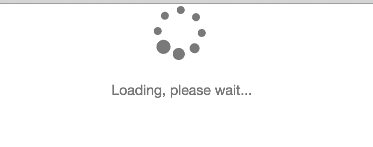

In [my previous tutorial](/angularjs-http-and-dates/) we used `$http` to create a utility that automatically converts all ISO 8601 date strings to proper JavaScript dates. `$http` allows us to do a lot of things. Ever wanted to create a "Loading, please wait..." indicator when your data is loading over your REST service?

With `$http` you can easily set something up like this, without having to create a lot of overhead in your controllers.

### How to show a loading indicator?

An often used principle is to work with certain booleans when your promise is loading, for example:

```javascript
function loadPage() {
  vm.loading = true;
  Tasks.query(function(tasks) {
    vm.tasks = tasks;
    vm.loading = false;
  }, function(err) {
    vm.loading = false;
  });
}
```

This is quite some overhead, because if you didn't want to show a progress screen, your code could be as simple as:

```
function loadPage() {
  vm.tasks = Tasks.query();
}
```

Also, if you have multiple REST calls running, you'll have to keep some kind of a counter to check how many requests are completed or not. Which is even more fuzzy than we already have now. To show a loading screen on multiple pages, you'll have to duplicate that code too. The question is, can we show a loading screen while still keeping the original, nice to read, code?

### A look into `$http`

Good news for the people who are trying to improve their code, with `$http` you can get a list of all pending requests. If you take a look at the **properties** section at the [API guide of $http](https://docs.angularjs.org/api/ng/service/$http), you'll see that they have a property called `pendingRequests`, containing a list of all requests made with `$http` (or `$resource`, since that's just an abstraction layer on top of `$http`).

Showing a loading screen would be a lot easier with this in mind. We can simply use `$http.pendingRequests.length > 0` to determine whether or not there are requests running.

### Abstraction using directives

The directive is not that hard either to implement. First we start off by setting up the directive structure itself:

```javascript
(function(angular) {
  'use strict';

  function ifLoading($http) {
    return {
      restrict: 'A',
      link: function(scope, elem) {
        // Code
      }
    };
  }

  ifLoading.$inject = ['$http'];

  angular
    .module('testApp')
    .directive('ifLoading', ifLoading);
}(angular));
```

Now, to detect changes in `$http.pendingRequests`, we'll have to use a watch expression using `scope.$watch()`. To do that we write the following code:

```javascript
scope.isLoading = isLoading;
scope.$watch(scope.isLoading, toggleElement);

function isLoading() {
  return $http.pendingRequests.length > 0;
}

Toggling the element is also quite simple:

function toggleElement(loading) {
  if (loading) {
    elem.show();
  } else {
    elem.hide();
  }
}
```

And that's it! The complete directive should look like this:

```javascript
(function(angular) {
  'use strict';

  function ifLoading($http) {
    return {
      restrict: 'A',
      link: function(scope, elem) {
        scope.isLoading = isLoading;

        scope.$watch(scope.isLoading, toggleElement);

        ////////

        function toggleElement(loading) {
          if (loading) {
            elem.show();
          } else {
            elem.hide();
          }
        }

        function isLoading() {
          return $http.pendingRequests.length > 0;
        }
      }
    };
  }

  ifLoading.$inject = ['$http'];

  angular
    .module('testApp')
    .directive('ifLoading', ifLoading);
}(angular));
```

Now we can use it in our HTML, for example:

```html
<p class="text-center text-muted" if-loading>
  <span class="fa fa-spinner fa-spin fa-4x"></span>
  <br /><br />
  Loading, please wait...
</p>
```

If you wonder what the `fa fa-spinner fa-spin fa-4x` classes mean, well, this is part of the [Font Awesome](http://fontawesome.io/) iconset and allows us to create a rotating spinner icon.

### Testing it out

Testing it out might be a bit difficult if you have a fast network connection. However, The Chrome DevTools allow you to throttle network requests, making it easier to test these features.


If you have configured it, reload the page (keep your DevTools open!) and you'll see that everything should load a bit slower. Normally this gives you enough time to properly see the loading icon.



#### Achievement: Master of `$http`

If you’re seeing this, then it means you successfully managed to make it through this article. If you’re interested in the full code example, you can find it on [GitHub](https://github.com/g00glen00b/angular-samples/tree/master/http-config-usage).
