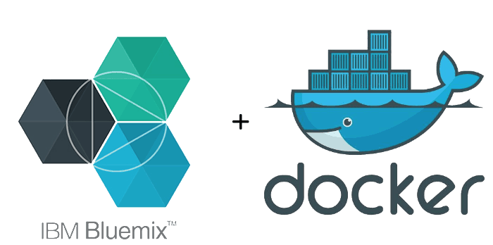
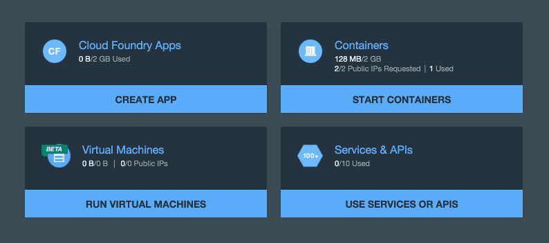

A few weeks ago I wrote [an article](http://wordpress.g00glen00b.be/docker-spring-boot/) about creating [Docker](http://docker.io/) images containing a [Spring boot](http://projects.spring.io/spring-boot/) application, introducing both Docker, Docker Machine and Docker Compose. Today I'm going to take those images (both the application image and the [MySQL](https://www.mysql.com/) image) to the cloud, using [Bluemix](http://bluemix.net/). [](https://wordpress.g00glen00b.be/wp-content/uploads/2016/02/bluemix-docker.png)

### Summarizing what we did so far

So, in my tutorial from last week I already made two Docker containers (application + MySQL database) and linked them together. First of all I used the [docker-maven-plugin](https://github.com/spotify/docker-maven-plugin) from Spotify to create a Docker image:

```xml
<plugin>
    <groupid>com.spotify</groupid>
    <artifactid>docker-maven-plugin</artifactid>
    <version>0.3.8</version>
    <configuration>
        <imagename>g00glen00b/${project.artifactId}</imagename>
        <dockerdirectory>src/main/docker</dockerdirectory>
        <resources>
            <resource>
                <targetpath>/</targetpath>
                <directory>${project.build.directory}</directory>
                <include>${project.build.finalName}.jar</include>
            </resource>
        </resources>
    </configuration>
</plugin>
```

I also created my own Docker file to run the application:

```dockerfile
FROM java:8
ADD spring-boot-jpa-docker-webapp.jar app.jar
RUN bash -c 'touch /app.jar'
ENTRYPOINT ["java","-Djava.security.egd=file:/dev/./urandom","-Dspring.profiles.active=container","-jar","/app.jar"]
```

To load the data, I created two files in my **src/main/resources** folder, called **schema-mysql.sql** and **data-mysql.sql**:

```sql
CREATE TABLE IF NOT EXISTS `superhero` (
  `id` INT(11) NOT NULL AUTO_INCREMENT,
  `name` VARCHAR(32) NOT NULL,
  `first_name` VARCHAR(32),
  `last_name` VARCHAR(32),
  `good` bit(1),
  PRIMARY KEY (`id`)
) ENGINE=InnoDB  DEFAULT CHARSET=latin1;

DELETE FROM `superhero`;
INSERT INTO `superhero` (`name`, `first_name`, `last_name`, `good`) VALUES
  ('Superman', 'Clark', 'Kent', 1),
  ('Silver Banshee', 'Siobhan', 'McDougal', 0);
```

To link a MySQL container to my Spring boot app container, I used Docker compose:

```yaml
demo-mysql:
  image: mysql:latest
  environment:
    - MYSQL_ROOT_PASSWORD=p4SSW0rd
    - MYSQL_DATABASE=demo
    - MYSQL_USER=dbuser
    - MYSQL_PASSWORD=dbp4ss

spring-boot-jpa-docker-webapp:
  image: g00glen00b/spring-boot-jpa-docker-webapp
  links:
    - demo-mysql:mysql
  ports:
    - 8080:8080
```

The environment variables provided by the MySQL container are now available in the other container. To use them, I created a separate Spring profile and entered the following properties in my **application.yml** file in my **src/main/resources** folder:

```yaml
spring:
  profiles: container
  datasource:
    url: jdbc:mysql://${MYSQL_PORT_3306_TCP_ADDR}:${MYSQL_PORT_3306_TCP_PORT}/${MYSQL_ENV_MYSQL_DATABASE}
    username: ${MYSQL_ENV_MYSQL_USER}
    password: ${MYSQL_ENV_MYSQL_PASSWORD}
    initialize: true
```

And that's about it. But make sure to check out my other article to get the full blown tutorial in stead of summarized version.

### What is Bluemix

Bluemix is IBM's answer to the ongoing battle between the Platform as a Service (PaaS) providers. Bluemix is built upon open technologies like [Cloud Foundry](https://www.cloudfoundry.org/) and brings all the trendy tools to you. Bluemix is built upon containers, and it also allows you to deploy your own containers, so let's give it a shot!

### Waiting for networking

Last time, we used quite a simple Docker file. However, I noticed that this will not always work on Bluemix. The reason for this is that it may take up to 30 - 60 seconds before networking starts after container creation. If the application starts before that networking started, it will throw an exception because it cannot reach the database.

So, what I did is, I wrote a simple shell script that checks if a TCP connection can be made to the MySQL container and executed my application after that:

```shell
#!/bin/bash

while ! exec 6<>/dev/tcp/${MYSQL_PORT_3306_TCP_ADDR}/${MYSQL_PORT_3306_TCP_PORT}; do
    echo "Trying to connect to MySQL at ${MYSQL_PORT}..."
    sleep 10
done

java -Djava.security.egd=file:/dev/./urandom -Dspring.profiles.active=container -jar /app.jar
```

This will try every 10 seconds to make a connection, and as soon as it can connect, it will launch the **app.jar**, running the application. I saved this file inside the **src/main/docker** directory, as a file called **init.sh**.

Now, that also means we have to alter the Dockerfile a bit:

```dockerfile
FROM java:8
ADD spring-boot-jpa-docker-webapp.jar app.jar
ADD init.sh init.sh
RUN chmod +x /init.sh
RUN bash -c 'touch /app.jar'
ENTRYPOINT ["/init.sh"]
```

So, next to the JAR itself I'm also adding the Shell script, altering its permissions to allow it to be executed, and I changed the entry point to be that script.

Finally, we also have to change the Maven plugin configuration a bit, because a new resource is required.

```xml
<plugin>
  <groupId>com.spotify</groupId>
  <artifactId>docker-maven-plugin</artifactId>
  <version>0.3.8</version>
  <configuration>
    <imageName>g00glen00b/${project.artifactId}</imageName>
    <dockerDirectory>src/main/docker</dockerDirectory>
    <resources>
      <resource>
        <targetPath>/</targetPath>
        <directory>${project.build.directory}</directory>
        <include>${project.build.finalName}.jar</include>
      </resource>
      <resource>
        <targetPath>/</targetPath>
        <directory>src/main/docker</directory>
        <include>init.sh</include>
      </resource>
    </resources>
  </configuration>
</plugin>
```

After that, rebuild the Docker image using the command:

```
mvn clean package docker:build
```

### Installing the Cloud Foundry CLI

There is a lot of [documentation](https://www.ng.bluemix.net/docs/containers/container_cli_ov.html#container_cli_cfic) you can read about how to get started with IBM Containers. First of all, you have to install the Cloud Foundry CLI. You can install it by downloading one of the releases at their [GitHub page](https://github.com/cloudfoundry/cli/releases).

After that you'll have to install the IBM Containers plugin for Cloud Foundry. For Mac OS X it is the following command:

```
cf install-plugin https://static-ice.ng.bluemix.net/ibm-containers-mac
```

For the other operating systems you can view the command at the [documentation](https://www.ng.bluemix.net/docs/containers/container_cli_ov.html#container_cli_cfic) (look at the third bullet).

After that you'll have to log in using the command line. First of all enter the following command:

```
cf login
```

It will prompt you for your e-mail address and password, simply provide the credentials you use to log in on Bluemix. If this was your first time running the Cloud Foundry tools it will also ask you to provide an API endpoint. I used the UK endpoint, which is `api.eu-gb.bluemix.net`. For the US endpoint you would be using `api.ng.bluemix.net`.

For the next step you need to have your Docker machine running. If that isn't the case, enter the following command:

```
docker-machine start default
```

It may happen that the IP address of the machine/VM changed, so after that enter the command:

```
eval "$(docker-machine env default)"
```

After that you probably have to create a namespace on Bluemix if you didn't already. You can do that using the following command:

```
cf ic namespace set <new_name>
```

After that enter the following command:

```
cf ic login
```

The `cf ic` commands work kinda like a Docker "proxy" CLI. From now on, every Docker command you know can also be used by entering the `cf ic` command, for example to list all running containers on Bluemix you'll use the `cf ic ps` command, similar to how `docker ps` works.

In fact, if you want to use the Docker CLI you even can, you just have to configure different environment variables.


### Uploading the Docker images

First of all you'll have to tag both the application and the MySQL image:

```
docker tag g00glen00b/spring-boot-jpa-docker-webapp registry.eu-gb.bluemix.net/g00glen00b/spring-boot-jpa-docker-webapp
docker tag mysql registry.eu-gb.bluemix.net/g00glen00b/mysql:latest
```

You'll have to replace `registry.eu-gb.bluemix.net/g00glen00b` by the name of your private repository. You can see which URL you have to point to when you logged in with the `cf ic login` command:


Then you can push both images to Bluemix using the following command:

```
docker push registry.eu-gb.bluemix.net/g00glen00b/spring-boot-jpa-docker-webapp
docker push registry.eu-gb.bluemix.net/g00glen00b/mysql:latest
```

This may actually take a while, because your images are now uploaded to the Bluemix registry. Remember to use **your own repository URL**. For more information about pushing your images to the Bluemix repository, you can view [this part of the documentation](https://www.ng.bluemix.net/docs/containers/container_images_adding_ov.html#container_images_pulling).

Anyhow, if you use the `cf ic images` command afterwards, you'll see that your images are now available on Bluemix:


Another way to verify that your images are uploaded is to go to the [Bluemix dashboard](https://console.ng.bluemix.net/) and to click on **Start containers**.



Normally, you'll see a list of all available images, containing the images you just uploaded to the repository.


If you can't see the images, you're probably looking at the wrong region. Click on the icon at the top right corner, normally a pane will slide open on the right side. Click on **Region** and select the proper region.

### Starting your containers

First of all, let's start the MySQL container:

```
cf ic run --name demo-mysql \
    -e MYSQL_ROOT_PASSWORD=rootpass \
    -e MYSQL_DATABASE=demo \
    -e MYSQL_USER=username \
    -e MYSQL_PASSWORD=password \
    -p 3306:3306 \
    registry.eu-gb.bluemix.net/g00glen00b/mysql:latest
```

If you followed [my previous tutorial](http://wordpress.g00glen00b.be/docker-spring-boot/), you should probably recognize this command slightly. Like I said before, the `cf ic` commands are very similar to the Docker CLI, so for running a Docker image on Bluemix, you use the same command, but you replace **docker** by **cf ic**.

Another thing you should change is that you should reference the image by using the **repository URL**, so don't forget to change that when you use the command.

Lastly, we can run the application container:

```
cf ic run --name demo-app \
    --link demo-mysql:mysql \
    -p 8080:8080 \
    registry.eu-gb.bluemix.net/g00glen00b/spring-boot-jpa-docker-webapp:latest
```

By now you probably already know, but don't forget to change the repository URL.

To see how your container is doing, you can use the following command:

```
cf ic logs --follow demo-app
```

At the first few seconds, you'll see the following logs pop up:


Like I mentioned before, networking isn't available directly, so if there's one thing you should remember from this article it is that you have to build some kind of polling mechanism first before starting your application, if it relies on another container.

Anyhow, if you look back at the Bluemix dashboard, you'll see that both containers are now up and running:


You can even click on them and view some more detailed information and monitoring:


### Assigning a public IP to your container

Now, to assign a public IP to your application container, go back to the Bluemix dashboard, click on the **demo-app** container.

At the top of the page you will be able to assign one of the few public IPs you can use to your container:


When it's done, the port number should be clickable now, allowing you to go to your application. Don't forget to append `/superhero` to the path, otherwise it won't work. If your public IP is 10.10.10.10, then you should be visiting `http://10.10.10.10:8080/superhero`.

If everything works, you should see the following:


Congratulations, you now have your application running on Bluemix, using a Docker container and linking it to another container containing your database.

#### Achievement: Shipping your apps to the cloud with Docker and Bluemix

If you’re seeing this, then it means you successfully managed to make it through this article. If you’re interested in the full code example, you can find it on [GitHub](https://github.com/g00glen00b/spring-samples/tree/master/spring-boot-jpa-docker-bluemix-webapp). All the Docker-related files can be found inside the **src/main/docker** directory.
