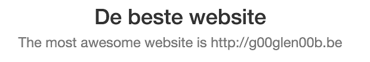

When developing applications, it can be interesting to put labels in a separate properties file, so that they can be re-used. For example, we often noticed that within our applications there were slight variations on specific words, which broke consistency. The easiest way to solve that is to centralize these labels. Another benefit you get by having these labels centralized is that it makes translating easier. Just switch the properties file and you can have your application translated in no time. If you're working with the Spring framework already, this is very easy to do, and is part of Spring MVC (internationalization or i18n).

### Project setup

I'm going to start with a simple Spring boot project, so open [start.spring.io](http://start.spring.io). Enter the project metadata, and as dependencies you choose **Web** and **Thymeleaf**. Once done, press the big **Generate project** button, unzip the archive and import it in your IDE. Well done, your project is set up!


### Creating a simple webpage

Now, let's create a simple webpage using Spring MVC. First we have to create a controller:

```java
@Controller
@RequestMapping
public class MainController {
    @Autowired
    private AwesomeWebsiteServiceImpl service;
    @RequestMapping
    public ModelAndView getAwesomeWebsite() {
        return new ModelAndView("awesomeWebsite", "website", "The most awesome website is " + service.getAwesomeWebsite());
    }
}
```

This controller is going to use a service called `AwesomeWebsiteServiceImpl` to retrieve the most awesome website. The view used withing the `getAwesomeWebsite()` method is `"awesomeWebsite"` and the model name is `"website"`.

So, let's create the `AwesomeWebsiteServiceImpl` first:

```java
@Service
public class AwesomeWebsiteServiceImpl {
    private String[] awesomeWebsites = new String[] { "http://g00glen00b.be", "http://start.spring.io" };
    @Autowired
    private Random random;

    public String getAwesomeWebsite() {
        return awesomeWebsites[random.nextInt(awesomeWebsites.length)];
    }
}
```

So, what happens here isn't that hard. We have an array of strings containing the most awesome websites (a bit opinionated though 😀). Then we use the `getAwesomeWebsite()` method to obtain a random website from that list.

We do have to inject the `Random` instance though, to do that you open the `Application` class (the class with the `@SpringBootApplication` annotation), and you add the following bean:

```java
@Bean
public Random randomGenerator() {
    return new Random();
}
```

Finally, we have to add the HTML template itself inside the **src/main/resoruces/templates** folder. We called the view "awesomeWebsite", so that means we have to create an HTML file called **awesomeWebsite.html**:

```html
<!DOCTYPE html>
<html lang="en">
  <head>
    <link rel="stylesheet" href="https://maxcdn.bootstrapcdn.com/bootstrap/3.3.6/css/bootstrap.min.css" />
  </head>
  <body>
    <div class="container">
      <h1 class="text-center">Most awesome website<br /><small th:text="${website}"></small></h1>
    </div>
  </body>
</html>
```

As you can see here, we're using the Thymeleaf `th:text` attribute, containing an expression that will be rendered when we view that page. In this case it contains `${website}` which is a placeholder for the **website** model we defined earlier in our controller (as part of the `ModelAndView`).

Now, if we run the application, we should see something like this:


### Internationalization

Now, is this application available in multiple languages? No. So let's do that now. Even if you won't have an application available in multiple languages, you can still profit from using Spring i18n, because now you have a centralized spot to change any label.

To do that, you first have to open **application.yml** or **application.properties** and then you have to add the following properties:

```yaml
spring:
  messages:
    basename: messages/messages
    cache-seconds: -1
    encoding: UTF-8 
```

Or in properties:

```
spring.messages.basename=messages/messages
spring.messages.cache-seconds=-1
spring.messages.encoding=UTF-8
```

Back in the early days you had to define your message resolver bean yourself, but now all you need is some properties, if you use Spring boot. So, what happens now is that we told Spring that inside **messages/** folder we have several properties files starting with **messages\_{code}.properties**. The code in this case is the locale code (for example nl, nl\_be, en, en\_us, ...) but make sure that you always use underscores.

First of all, let's create a default file called **messages.properties** inside the **src/main/resources/messages** folder:

```
label.mostAwesomeWebsite=Most awesome website
```

So, I just created a property called `label.mostAwesomeWebsite`, and it contains the text "Most awesome website", great!

**Note:** Always make sure you have a default `messages.properties`. Spring boot's autoconfiguration will only kick in if the default file exists.

Now, open the **awesomeWebsite.html** again, and remove the "Most awesome website" text and replace it by the following:

```html
<span th:text="#{label.mostAwesomeWebsite}"></span>
```

We do have to replace it by a separate HTML element, because otherwise the placeholder would replace the `<small>` tag as well. Anyways, if you run the application again, you'll see that it still looks the same, obviously.

So, let's create another file in your own language, for me it is Dutch, so I'm going to create a file called **messages\_nl.properties**.

If I provide the same labels now, but using a different value, I now have a translated version:

```
label.mostAwesomeWebsite=De beste website
```

If you now run the application again, and you make sure that you're using the correct language settings in your browser to see the different language, you'll see that it is now translated.


### Using internationalization in your code

There is one issue though, the programmatically defined message is still not translated.



Obviously, the most easy way to fix that is to move the message (except the website) to the HTML template as well. However, sometimes you need to provide translated messages programmatically as well, for example when showing error messages. So, let's see how you could fix that as well.

First of all, we're going to add another property to **messages.properties** and the translated **messages\_nl.properties**:

```
message.mostAwesomeWebsite=The most awesome website is {0}
message.mostAwesomeWebsite=De beste website is {0}
```

Now, open the `MainController`. First of all you have to autowire the `MessageSource` itself:

```java
@Autowired
private MessageSource messageSource;
```

Then, inside the `getAwesomeWebsite()` method we have to change a few things:

```java
@RequestMapping
public ModelAndView getAwesomeWebsite() {
    final String[] params = {service.getAwesomeWebsite()};
    final String msg = messageSource.getMessage("message.mostAwesomeWebsite", params, LocaleContextHolder.getLocale());
    return new ModelAndView("awesomeWebsite", "website", msg);
}
```

First of all, we have to create a new String array, containing the parameters we want to use. You may have noticed that we added the `{0}` thing to our message properties. This will be replaced by the first element in the given array, in this case, the website coming from the service.

Now, the next part is that we use the `messageSource` to obtain the message with the **message.mostAwesomeWebsite** key, provide the given parameters, and to provide the locale, you can use the `LocaleContextHolder` which contains the locale of the request. Now all you have to do is to replace original model with the new `msg`.

If you run the example again, you'll see that it is now properly translated.


### Using parameters in Thymeleaf

We kinda did two things here, we programmatically used the `MessageSource` and we provided parameters. Using parameters is also possible if you use Thymeleaf. So, if we undo all our changes and replace `getAwesomeWebsite()` in our controller by this:

return new ModelAndView("awesomeWebsite", "website", service.getAwesomeWebsite());

And then we go to **awesomeWebsite.html** and we replace the following:

```html
<small th:text="${website}"></small>
```

With this:

```html
<small th:text="#{message.mostAwesomeWebsite(${website})}"></small>
```

Then you'll see that it yields exactly the same result.

#### Achievement: Brought your application to the next level with Spring i18n

If you’re seeing this, then it means you successfully managed to make it through this article. If you’re interested in the full code example, you can find it on [GitHub](https://github.com/g00glen00b/spring-samples/tree/master/spring-boot-i18n-webapp).
