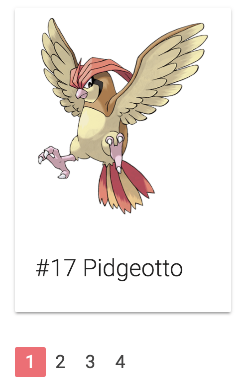
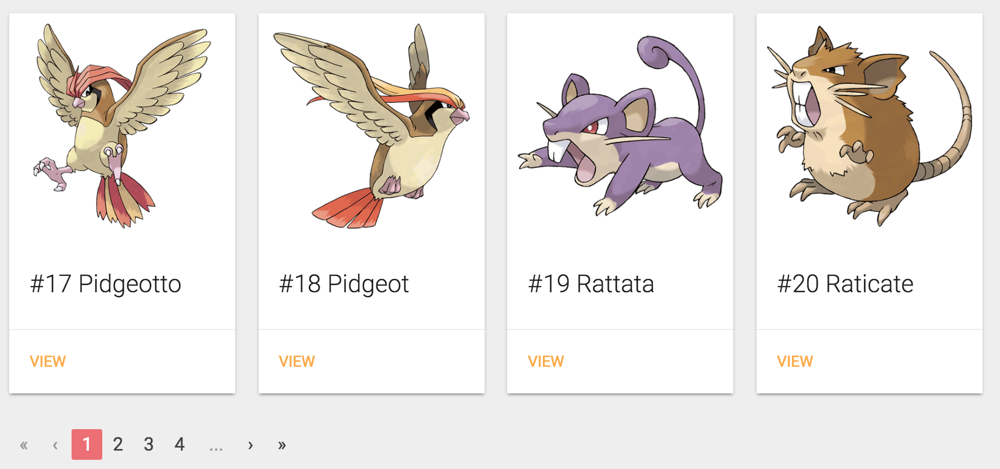

[Last time](/component-angular-2/), we made a simple pokédex overview, but we're missing something on our overview... . Right now, we're seeing only the first 20 pokémons, and we have no way to view any other pokémon. So let's change that!

### Creating a new component

Obviously, we want to create a new component for it so it can be reused. To generate a component you can use [Angular CLI](https://cli.angular.io/):

```
ng g component shared/pagination
```

This is a shorthand for writing the following:

```
ng generate component shared/pagination
```

This should have created four files withing the **app/shared/pagination** folder, of which I won't use the **pagination.component.spec.ts** and the **pagination.component.css**, so I deleted those. However, that also meant that I had to remove the `styleUrls` property on the `@Component` decorator in **pagination.component.ts**.

### Using the `OnChanges` hook

If we explore the default component, we can see that it already implements [`OnInit`](https://angular.io/docs/ts/latest/api/core/index/OnInit-class.html), which requires you to implement a function called `ngOnInit()` and which will be called as soon as the component is initialized. In our case we'll use this to generate the page numbers (1, 2, 3, ...) that have to be displayed based on three parameters:

- Offset: The offset that is used currently
- Limit: The limit or size of each page
- Size: The total amount of items within the collection. In my case this is the total amount of pokémons.

We already have these three parameters available from last time. However, if you calculate this quickly, we have about ~800 pokémons and a pagesize of 20, which means we'll get over 40 pages. We don't want to show all these pages directly in our pagination component. We want to work with "..." as soon as there are too many pages to show, and we only want to show the current page and three pages before and three pages ahead of that. So that's why I'll also create a fourth parameter called `range`:

```typescript
@Input() offset: number = 0;
@Input() limit: number = 1;
@Input() size: number = 1;
@Input() range: number = 3;
```

I initialized all values to a default, which allows us to view the pagination component correctly even if the user didn't bind any property. Make sure to import `@Input` by adding the following import:

```typescript
import {Input} from '@angular/core';
```

However, there's one issue... what are we going to do if any of our inputs changes? If the offset goes from 0 to 20 it means that we're now no longer on page 1, but on page 2, so we have to show different pages in our component.

If you remember AngularJS 1.x, you know that many people attempted to solve this by defining watches on their input parameters, luckily since AngularJS 1.5 we have lifecycle hooks for this, and so do we have with Angular 2. This lifecycle hook is called [`OnChanges`](https://angular.io/docs/ts/latest/api/core/index/OnChanges-class.html) and if we use it, we also have to implement a function called `ngOnChanges`, so let's do that:

```typescript
export class PaginationComponent implements OnInit, OnChanges {
  @Input() offset: number = 0;
  @Input() limit: number = 1;
  @Input() size: number = 1;
  @Input() range: number = 3;
  
  constructor() { }

  ngOnInit() {
  }
  
  ngOnChanges() {
    
  }
}
```

And again, don't forget to add the import, or make your IDE do it for you:

```typescript
import {OnChanges} from '@angular/core';
```

### Calculating pages

Since we want to generate the page numbers, I'm going to create a new function called `getPages()`:

```typescript
getPages(offset: number, limit: number, size: number) {
  // TODO
}
```

The first thing I'm going to do is determining what the current page is based on the offset and the limit, and determining what the total amount of pages is, based on the limit and the size. To do that, I wrote two new functions:

```typescript
getCurrentPage(offset: number, limit: number): number {
  return Math.floor(offset / limit) + 1;
}

getTotalPages(limit: number, size: number): number {
  return Math.ceil(Math.max(size, 1) / Math.max(limit, 1));
}
```

So, to get the current page, we divide the offset by the limit and then add 1. For example, if the offset is 20 and the limit is 10, then the page number would be 3 (because offset 0 = page 1, offset 10 = page 2 and offset 20 = page 3). To get the total amount of pages we divide the size by the limit. If there are 810 items and the page size is 20, then there are 41 pages, of which there are 40 whole pages and 1 half page. To be sure that we don't have a limit of 0 and we're dividing by zero, I'm using `Math.max()` to make sure that both the `size` and the `limit` are always at least 1.

I'm also going to need these two calculated values in my view, so I created two additional fields:

```typescript
currentPage: number;
totalPages: number;

And then I assigned them in the `getPages()` function:

getPages(offset: number, limit: number, size: number) {
  this.currentPage = this.getCurrentPage(offset, limit);
  this.totalPages = this.getTotalPages(limit, size);
}
```

### Using `Observable.range()`

The next part is to create the page numbers for the pagination component. If we have a range of 3, we'll show at most 7 pages, for example if the current page is 10, we'll show pages 7, 8, 9, 10, 11, 12 and 13. That means that for our range, the length will be `this.range * 2 + 1`. As the start of our range I'm going to use `-this.range`, so that our range will actually contain the relative offset towards our current page, for example -3, -2, -1, 0, 1, 2 and 3.

So, I did this using [`Observable.range()`](http://reactivex.io/documentation/operators/range.html):

```typescript
Observable.range(-this.range, this.range * 2 + 1)
```

To get the actual page numbers, I used this value and added it to `this.currentPage` by using the [`map()`](http://reactivex.io/documentation/operators/map.html) operator:

```typescript
Observable.range(-this.range, this.range * 2 + 1)
  .map(offset => this.currentPage + offset)
```

If our current page would be 1, we would get -2, -1, 0, 1, 2, 3 and 4 as pages, but obviously, pages below 1 do not count and shouldn't be visible. Similar, if our page would be 20 and there are 21 pages, we don't want the pagination to go above that, so that's why we should filter out those by using the [`filter()`](http://reactivex.io/documentation/operators/filter.html) operator:

```typescript
Observable.range(-this.range, this.range * 2 + 1)
  .map(offset => this.currentPage + offset)
  .filter(pageNr => pageNr > 0 && page <= this.totalPages)
```

This expression doesn't really say what it's really about, so I refactored this to a separate function:

```typescript
isValidPageNumber(page: number, totalPages: number): boolean {
  return page > 0 && page <= totalPages;
}
```

We also have to change our observable a bit as well:

```typescript
Observable.range(-this.range, this.range * 2 + 1)
  .map(offset => this.currentPage + offset)
  .filter(pageNr => this.isValidPageNumber(page, this.totalPages))
```

We only have one issue left. Right now, our `Observable` is of type `Observable<number>`. This means that it actually outputs every single page number individually. We want to wait until all numbers are passed and return an array of everything at once. To do that, we can use the [`toArray()`](http://reactivex.io/documentation/operators/to.html) operator:

```typescript
Observable.range(-this.range, this.range * 2 + 1)
  .map(offset => this.currentPage + offset)
  .filter(page => this.isValidPageNumber(page, this.totalPages))
  .toArray();
```

Great, now all we have to do is create a new field containing our observable, for example:

```typescript
pages: Observable<number[]>;
```

Then we can assign it in our `getPages()` function so that it becomes:

```typescript
getPages(offset: number, limit: number, size: number) {
  this.currentPage = this.getCurrentPage(offset, limit);
  this.totalPages = this.getTotalPages(limit, size);
  this.pages = Observable.range(-this.range, this.range * 2 + 1)
    .map(offset => this.currentPage + offset)
    .filter(page => this.isValidPageNumber(page, this.totalPages))
    .toArray();
}
```

Now that we have our logic, we can call it in our `ngOnInit()` and `ngOnChanges()` lifecycle hooks:

```typescript
ngOnInit() {
  this.getPages(this.offset, this.limit, this.size);
}

ngOnChanges() {
  this.getPages(this.offset, this.limit, this.size);
}
```

### Using the `async` pipe

With our model ready, it's time to show the page numbers on our application. First of all, let's add the pagination component to our **pokemon-list.component.html**:

```html
<app-pagination [offset]="offset" [limit]="limit" [size]="count"></app-pagination>
```

Since we didn't provide the `range` property here, it will take the default value of 3. Initially, our current page should be 1, meaning that we should see the pages 1, 2, 3 and 4. So, let's see if we get those by changing our **pagination.component.html**.

First of all, we have to use [`*ngFor`](https://angular.io/docs/ts/latest/api/common/index/NgFor-directive.html) to loop over the pages. However, since our pages are not a proper array, but an `Observable`, we'll have to use something special here, called the `async` pipe:

```html
<ul class="pagination">
  <li *ngFor="let page of pages | async">
    <a href="javascript:void(0)">
      {{page}}
    </a>
  </li>
</ul>
```

As you may realize by now, using `Observable` in Angular is pretty common, so to handle observables in your template, there is an `async` [pipe](https://angular.io/docs/ts/latest/guide/pipes.html) that can be used like we did. In this case it will subscribe to the `pages` observable and let the `*ngFor` do its job.

If we run the application, we'll see that the pagination is looking pretty great already, though unfinished:


### Using `class` property binding

The next step I'm going to implement is to make sure that the current page looks selected. Materialize has a class for that called `.active`, so let's apply that using the `[class]` [property binding](https://angular.io/docs/ts/latest/guide/template-syntax.html#!#property-binding). The `.active` class should only be visible when the `page` is equal to the `currentPage`, so let's do that:

```html
<ul class="pagination">
  <li *ngFor="let page of pages | async" [class.active]="page == currentPage">
    <a href="javascript:void(0)">
      {{page}}
    </a>
  </li>
</ul>
```

If we look at the application now, we can see that we're a step closer:



### Using `@Output`

We have our basic implementation of our pagination ready, but how do we react to page changes? Well, first of all, we want to define an `@Output` property in our **pagination.component.ts**. Just like `@Input` we can define what the `@Output`s should be. However, due to the unidirectional flow in Angular, we can send models in one way, but to get back to the parent, we'll have to use **events**. So, that's why you should define an output with the type [`EventEmitter`](https://angular.io/docs/ts/latest/api/core/index/EventEmitter-class.html).

So, let's get started:

```typescript
@Output() pageChange: EventEmitter<number> = new EventEmitter<number>();
```

As you can see, we have created a property called `pageChange` here, and it is of the type `EventEmitter` like I just mentioned. Just like an `Observable`, we can tell about what type of event it should be. This is what we call [generics](https://www.typescriptlang.org/docs/handbook/generics.html). In this case we will emit the new offset based on the selected page number, so that's why I've chosen it to be a `number`.

Don't forget to import both `Output` and `EventEmitter`:

```typescript
import {Output, EventEmitter} from '@angular/core';
```

All we have to do now, is to define a function that can be called in our pagination component and that will invoke the `EventEmitter`:

```typescript
selectPage(page: number) {
  this.pageChange.emit((page - 1) * this.limit);
}
```

To invoke an `EventEmitter`, we can simply use the `emit()` function and pass whatever we would like to pass. In this case it would be the selected page. For now, you don't have to worry how we'll get that page.

However, we can improve our code a bit further. Remember the `isValidPageNumber()` function we made earlier? Let's say that we somehow still got an invalid page in our pagination component (eg. -1), then we probably don't want to propagate this with our `EventEmitter`, so we can filter the "noise" out by using that function here as well:

```typescript
selectPage(page: number) {
  if (this.isValidPageNumber(page, this.totalPages)) {
    this.pageChange.emit((page - 1) * this.limit);
  }
}
```

### Using event binding

Now, before we'll actually go to bind our pagination event to our pokemon list component, we have to use the [event binding](https://angular.io/docs/ts/latest/guide/template-syntax.html#!#event-binding) to bind the click event of our `<a>` tag to invoke the function we just made. To do that, we just edit our template to do this:

```html
<ul class="pagination">
  <li *ngFor="let page of pages | async" [class.active]="page == currentPage">
    <a href="javascript:void(0)" (click)="selectPage(page)">
      {{page}}
    </a>
  </li>
</ul>
```

As you can see, we're using `(click)` here, a bit weird for someone who is used to plain HTML, but now you know it, square brackets \[\] are used for property binding (inputs), while round braces () are used for event binding (outputs).

Now that we know that, we can also bind our page change event in our **pokemon-list.component.html**:

```html
<app-pagination [offset]="offset" [limit]="limit" [size]="count" (pageChange)="onPageChange()"></app-pagination>
```

Now, let's define the `onPageChange()` function in our **pokemon-list.component.ts** to test it out:

```typescript
onPageChange() {
  console.log('changed page');
}
```

If we look at the application now, and we click a page number, you should see the text "changed page" appear in the logs. If you used AngularJS 1.x, you probably notice that this model is pretty clean. We have a flow of property binding in one direction, and a flow of event binding in another direction.


### Using `$event`

Now, we can already tell the `PokemonListComponent` when a page should be changed. The only question that remains is... how can we actually tell the component what the new page is?

Well, to do that, we can pass an object called `$event`, for example:

```html
<app-pagination [offset]="offset" [limit]="limit" [size]="count" (pageChange)="onPageChange($event)"></app-pagination>
```

The `$event` variable contains the data you actually emitted with the `EventEmitter`, so in our case, that will be the new offset. So, that also means we can start implementing `onPageChange()` within the **pokemon-list.component.ts**. First of all, we want to update the offset to the new offset:

```typescript
onPageChange(offset) {
  this.offset = offset;
}
```

This is important, since it will trigger the `OnChanges` lifecycle hook of the pagination component, and that means it will recalculate our pages and it will start showing page 2 as the active page.

After that, we would like to invoke the `findAll()` function as well, to retrieve the pokémons of the second page:

```typescript
onPageChange(offset) {
  this.offset = offset;
  this.findAll(offset, this.limit);
}
```

So, if we look at the application now, and click the second page, we can see that it actually works! Both the pokémons and the active page in the pagination component are changed, wonderful!


Now that we know how that `$event` works, we can actually use it on other places as well. Do you remember the `href` attribtue on the `<a>` element in the pagination? It contained something like `href="javascript:void(0)"`. The reason for this is that we're handling the click event using JavaScript, and the `<a>` element is not really linking to something. So, with this attribute we can tell it to do nothing at all, so the page doesn't change when we click the link.

However, we can now properly remove this code and use `$event` in stead:

```html
<a href="" (click)="selectPage(page, $event)">
  {{page}}
</a>
```

I'm going to leave the `href` attribute empty, because if we completely remove the `href` attribute, browsers usually don't show a special pointer cursor when hovering over it.

Well, we have the `$event` now, but that means we have to change the `selectPage()` function as well:

```typescript
selectPage(page: number, event) {
  event.preventDefault();
  if (this.isValidPageNumber(page, this.totalPages)) {
    this.pageChange.emit((page - 1) * this.limit);
  }
}
```

In the case of `(click)`, the `$event` actually contains the click event itself. If you know JavaScript, you know you can prevent the normal/default action from happening by using the [`preventDefault()`](https://developer.mozilla.org/en/docs/Web/API/Event/preventDefault) function, and so that's exactly what we want to do here as well.

### Creating the ... part of the pagination

Our pagination is working already, but it doesn't really look that great at the moment. First of all, we have no idea if there's anything behind the 4th page or not. To indicate that there are more pages, people usually use "...", so let's do that as well.

We want to put this part at both sides of the numbers, to indicate that there are either more pages before the current page, or after the current page.

```html
<ul class="pagination">
  <li class="disabled">
    <a href="">...</a>
  </li>
  <li *ngFor="let page of pages | async" [class.active]="page == currentPage">
    <a href="" (click)="selectPage(page, $event)">
      {{page}}
    </a>
  </li>
  <li class="disabled">
    <a href="">...</a>
  </li>
</ul>
```

Great! But we have two issues here. First of all, the "..." parts are now always visible, so we have to finetune that.

And second, we have to wrap the "..." parts in an `<a>` element if we want to make sure that Materialize correctly renders these parts of the pagination. Sadly, we don't really want to do anything to happen. So, we can use the old `href=""` trick here, or we can use the `event.preventDefault()` thingy here.

Now, we can't really use the `selectPage()` since we don't actually switch pages. So let's tweak the original code a bit so that the `event.preventDefault()` thingy is actually available in a separate function:

```typescript
selectPage(page: number, event) {
  this.cancelEvent(event);
  if (this.isValidPageNumber(page, this.totalPages)) {
    this.pageChange.emit((page - 1) * this.limit);
  }
}
  
cancelEvent(event) {
  event.preventDefault();
}
```

Great! One thing done, now we only have to make sure that the "..." elements only show when there are more pages at that side. To implement that, we can use `*ngIf`:

```html
<ul class="pagination">
  <li class="disabled" (click)="cancelEvent($event)" *ngIf="(currentPage - range) > 1">
    <a href="">...</a>
  </li>
  <li *ngFor="let page of pages | async" [class.active]="page == currentPage">
    <a href="" (click)="selectPage(page, $event)">
      {{page}}
    </a>
  </li>
  <li class="disabled" (click)="cancelEvent($event)" *ngIf="(currentPage + range) < totalPages">
    <a href="">...</a>
  </li>
</ul>
```

The expressions we used in our `*ngIf`'s arent that difficult. To know whether or not there are more pages at the left side, we take the `currentPage` and subtract the `range` from it. This number is equal to the leftmost visible page number on our pagination component. If this number is higher than 1, it means that there are more pages that are not visible.

For the other side we basically repeat the progress, but we **add** the range to the current page and check if it's smaller than `totalPages`.

If we take a look at the application now, we can see that it is correctly applying these elements:


### Implement previous and next page controls

The next thing I want to add is the previous/next controls at the begin and end of the pagination control. These controls are actually quite simple since we know the current page with `currentPage` and we know how to select another page with the `selectPage()` function. We can simply do something like this:

```html
<ul class="pagination">
  <li (click)="selectPage(currentPage - 1, $event)">
    <a href="">&lsaquo;</a>
  </li>
  <li class="disabled" (click)="cancelEvent($event)" *ngIf="(currentPage - range) > 1">
    <a href="">...</a>
  </li>
  <li *ngFor="let page of pages | async" [class.active]="page == currentPage">
    <a href="" (click)="selectPage(page, $event)">
      {{page}}
    </a>
  </li>
  <li class="disabled" (click)="cancelEvent($event)" *ngIf="(currentPage + range) < totalPages">
    <a href="">...</a>
  </li>
  <li (click)="selectPage(currentPage + 1, $event)">
    <a href="">&rsaquo;</a>
  </li>
</ul>
```

If you're concerned about the fact that `currentPage - 1` could be zero, well, no problem! If you remember our actual implementation of the `selectPage()`, you might remember that we added an `if()` statement to make sure that our page is valid. So this actually blocks those kind of things, so that's already handled!

We might want to disable these controls though when they should not be able to be used. There's indeed no point to going to the previous page when you're already at the first page. Neither is there any use for clicking on the next page when you are already on the last page.

To fix this, we can use the `[class.disabled]` property binding, similar to how we used `[class.active]` before:

```html
<ul class="pagination">
  <li (click)="selectPage(currentPage - 1, $event)" [class.disabled]="currentPage == 1">
    <a href="">&lsaquo;</a>
  </li>
  <li class="disabled" (click)="cancelEvent($event)" *ngIf="(currentPage - range) > 1">
    <a href="">...</a>
  </li>
  <li *ngFor="let page of pages | async" [class.active]="page == currentPage">
    <a href="" (click)="selectPage(page, $event)">
      {{page}}
    </a>
  </li>
  <li class="disabled" (click)="cancelEvent($event)" *ngIf="(currentPage + range) < totalPages">
    <a href="">...</a>
  </li>
  <li (click)="selectPage(currentPage + 1, $event)" [class.disabled]="currentPage == totalPages">
    <a href="">&rsaquo;</a>
  </li>
</ul>
```

Similar to this, we can also implement first/last page controls if we want to:

```html
<ul class="pagination">
  <li (click)="selectPage(1, $event)" [class.disabled]="currentPage == 1">
    <a href="" title="Go to first page">&laquo;</a>
  </li>
  <li (click)="selectPage(currentPage - 1, $event)" [class.disabled]="currentPage == 1">
    <a href="" title="Go to previous page">&lsaquo;</a>
  </li>
  <li class="disabled" (click)="cancelEvent($event)" *ngIf="(currentPage - range) > 1">
    <a href="">...</a>
  </li>
  <li *ngFor="let page of pages | async" [class.active]="page == currentPage">
    <a href="" (click)="selectPage(page, $event)">
      {{page}}
    </a>
  </li>
  <li class="disabled" (click)="cancelEvent($event)" *ngIf="(currentPage + range) < totalPages">
    <a href="">...</a>
  </li>
  <li (click)="selectPage(currentPage + 1, $event)" [class.disabled]="currentPage == totalPages">
    <a href="" title="Go to next page">&rsaquo;</a>
  </li>
  <li (click)="selectPage(totalPages, $event)" [class.disabled]="currentPage == totalPages">
    <a href="" title="Go to last page">&raquo;</a>
  </li>
</ul>
```

Well, with this, we finished our pagination component and we have a working pokédex overview. Great!



#### Achievement: Mastered pagination with Angular 2

If you’re seeing this, then it means you successfully managed to make it through this tutorial. If you're interested in the code, you can check it out at [Github](https://github.com/g00glen00b/ng2-pokedex).
