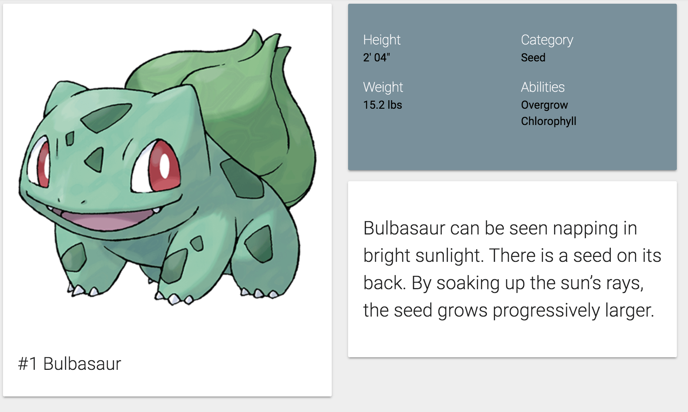

We're getting pretty far already with our Pokédex. We've already [implemented a service](/services-angular-rxjs/) with the [Pokéapi](https://pokeapi.co/), [an overview](/component-angular-2/) and a part of the detail page. The next thing I'm going to look at is how to animate stuff with [Angular 2](https://angular.io/). If you're just like me and enjoyed the good ol' days with AngularJS 1.x, you probably already know that AngularJS had support for it (eg. leave/enter). In Angular 2 there is also [support for animations](https://angular.io/docs/ts/latest/guide/animations.html), and in this article we'll find out how.

### Creating a new component

This time, I'm going to implement the game description for every game version. Luckily for us, we're already retrieving that information within our service, but the proper way to show this information would be to write a new component, so let's do that. Since we're using [Angular CLI](https://cli.angular.io/) throughout the project, I'm not going to change that:

```
ng g component pokemon-info/pokemon-description
```

Our component will need one thing, and only thing only... well, it's an array, so I guess it's multiple things, but we'll have to define it as an input of our component:

```typescript
@Input() descriptions: PokemonDescription[];
```

And I guess we can already put this component in our **pokemon-info.component.html** template:

```html
<app-pokemon-description [descriptions]="pokemon?.descriptions"></app-pokemon-description>
```

If we look at the application now, we should see that the component is properly added to our detail page, easy peasy:


### Setting an active description

My idea of implementing this component is to show only one description and to have a `<select>` element with all games to choose from and as soon as you change it, the other description will appear. Initially, I probably want to show a description by default, so I'm going to pick the first one. To do that, I'm going to implement both the `OnInit` and `OnChanges` lifecycle hooks:

```typescript
ngOnInit() {
  this.description = this.getDefaultDescription(this.descriptions);
}

ngOnChanges() {
  this.description = this.getDefaultDescription(this.descriptions);
}

getDefaultDescription(descriptions: PokemonDescription[]): PokemonDescription {
  if (descriptions == null || descriptions.length == 0) {
    return null;
  } else {
    return descriptions[0];
  }
}
```

Don't forget to add them to the class themself:

```typescript
export class PokemonDescriptionComponent implements OnInit, OnChanges {
  // ...
}
```

Now, for the template, I'm initially going to show just the description, like this:

```html
<div class="card-panel">
  <p class="flow-text">{{description?.description}}</p>
</div>
```

With that template, we should already get a pretty looking component if we look at our application.



### Using `ngModel`

To choose the game version, I'm going to use a small form with a select field. As soon as we change the value in that select field, I'm going to show the new description.

However, before we can do that, we have to add some CSS to our component. The `<select>` component of Materialize does not work without JavaScript, so by default it's going to hide it. I can live with a vanilla `<select>` element, so I'm going to show it regardless of what [Materialize](http://materializecss.com/) wants. To do that, I wrote the following CSS withing **pokemon-description.component.css**:

```css
select {
  display: block;
  background-color: transparent; 
}
```

The form itself will look like this:

```html
<form>
  <div class="input-field">
    <select id="gameVersion" name="gameVersion" [(ngModel)]="description">
      <option *ngFor="let description of descriptions" [ngValue]="description">
        {{description.version}}
      </option>
    </select>
  </div>
</form>
```

So, what's going on here. First of all we have the `[(ngModel)]` binding. If you recall, event binding uses round braces () and property binding uses square brackets \[\]. However, for [`ngModel`](https://angular.io/docs/ts/latest/api/forms/index/NgModel-directive.html) we defined both?! Well, as you know by now, property binding is used to pass an object to a child component, while event binding is used to pass a value to its parent component. If you use both of them together, you create two way binding, which is exactly what `[(ngModel)]` is. It's a directive for introducing two-way binding to Angular 2. In this case, the model object is the `description` we defined earlier.

Compared to AngularJS 1.x, looping over options just happens with the `*ngFor` directive. There's no special `ngOptions` here. However, if you want to be able to bind an object to your `<option>` you'll have to use `[ngValue]`, while for primitive values you could just use `[value]`.

If we look at the application again, we can see that there's now a dropdown below our description, that allows us to change game versions, so that's looking fine as well.


### Adding animations

To add an animation to a component with Angular 2, you have to add the `animations` property to the `@Component` decorator, like this:

```typescript
@Component({
  selector: 'app-pokemon-description',
  templateUrl: './pokemon-description.component.html',
  styleUrls: ['./pokemon-description.component.css'],
  animations: /** Todo */
})
```

With Angular 2, animations happen in a more declarative way. Let's try it out! First of all, we could make the description itself appear by changing the opacity from 0 to 1. To do that, we first have to define a new [`trigger()`](https://angular.io/docs/ts/latest/api/core/index/trigger-function.html):

```typescript
@Component({
  selector: 'app-pokemon-description',
  templateUrl: './pokemon-description.component.html',
  styleUrls: ['./pokemon-description.component.css'],
  animations: [
    trigger('descriptionState', [
      /** Todo */
    ])
  ]
})
```

This trigger allows us to link an animation trigger to an element in our template, but before we do that, we should define the transition itself.

```typescript
@Component({
  selector: 'app-pokemon-description',
  templateUrl: './pokemon-description.component.html',
  styleUrls: ['./pokemon-description.component.css'],
  animations: [
    trigger('descriptionState', [
      transition('void => *', [style({opacity: 0}), animate('500ms ease-in', style({opacity: 1}))])
    ])
  ]
})
```

Angular 2 has various [`transition()`](https://angular.io/docs/ts/latest/api/core/index/transition-function.html) definitions. The first one I'm going to talk about is `void => *`. A transition consists out of two states (in this case `void` and `*`) and a fat arrow between them, indicating that in this case we're going from `void` to `*`.

The `void` state means that the element is not attached yet. Examples of this are new elements within an `*ngFor`, or an element that appears due to the expression within an `*ngIf` changing from `false` to `true`.

After definining the transition itself, you can define the styles and animation type. In this case we're going from a transparent element (`opacity: 0`) to an opaque element (`opacity: 1`). The animation function goes with an ease-in [easing function](http://easings.net/) over a time of 500 ms.

### Applying an animation trigger to an element

In this case, we want to apply the animation to the `.flow-text` element:

```html
<p class="flow-text">
  {{description?.description}}
</p>
```

The way we do this is by adding the animation to the element:

```html
<p class="flow-text" [@descriptionState]="description">
  {{description?.description}}
</p>
```

However, this is not enough, because if we want a `void` state, we need to use `*ngIf` as well:

```html
<p class="flow-text" [@descriptionState]="description" *ngIf="description != null">
  {{description?.description}}
</p>
```

Initially, there will be no description, so the `*ngIf` directive won't render the DOM element. At that moment we're in the `void` state. When the description is loaded, the `*ngIf` directive will show the element and at that moment we're in a different state. That means our `transition()` will be called properly and normally that means that our text will appear slowly.

### Defining states

When the text appears, our state is equal to the expression that we provided to `[@descriptionState]`. In this case that means that it will be an object (`description`), but what if we used `description.version`?

For our next animation, I'm going to change the background color of the card depending on the game version (Red, Blue, Yellow, Gold, Silver, ...). To do that, we have to create another `trigger`:

```typescript
trigger('cardState', [

])
```

Before we start providing the `transition()`, we want to define some properties for every individual state:

```typescript
trigger('cardState', [
  state('Alpha Sapphire', style({ backgroundColor: '#304ffe' })),
  state('Omega Ruby', style({ backgroundColor: '#b71c1c' })),
  state('Y', style({ backgroundColor: '#1e88e5' })),
  state('X', style({ backgroundColor: '#b71c1c' })),
  state('White 2', style({ backgroundColor: '#ffccbc' })),
  state('Black 2', style({ backgroundColor: '#263238', color: '#eceff1' })),
  state('White', style({ backgroundColor: '#cfd8dc' })),
  state('Black', style({ backgroundColor: '#212121', color: '#eceff1' })),
  state('Soulsilver', style({ backgroundColor: '#b0bec5' })),
  state('Heartgold', style({ backgroundColor: '#ff7043' })),
  state('Platinum', style({ backgroundColor: '#673ab7', color: '#ede7f6' })),
  state('Diamond', style({ backgroundColor: '#1a237e', color: '#e8eaf6' })),
  state('Pearl', style({ backgroundColor: '#b388ff' })),
  state('Firered', style({ backgroundColor: '#ff5722' })),
  state('Leafgreen', style({ backgroundColor: '#9ccc65' })),
  state('Emerald', style({ backgroundColor: '#66bb6a' })),
  state('Ruby', style({ backgroundColor: '#b71c1c' })),
  state('Sapphire', style({ backgroundColor: '#1565c0', color: '#e3f2fd' })),
  state('Gold', style({ backgroundColor: '#ffab00' })),
  state('Silver', style({ backgroundColor: '#757575' })),
  state('Crystal', style({ backgroundColor: '#c5cae9' })),
  state('Red', style({ backgroundColor: '#d50000' })),
  state('Blue', style({ backgroundColor: '#0d47a1', color: '#e3f2fd' })),
  state('Yellow', style({ backgroundColor: '#fdd835' }))
]),
```

As you can see, we're using the [`state()`](https://angular.io/docs/ts/latest/api/core/index/state-function.html) function to define the style for every state. Since our game version will be our state, we have to list every game version. Someone should have warned me that there are this many Pokémon games on the market before I started this idea.

If you're wondering why some states have a `color` property and others won't, well, that's because the background color for those states is pretty dark, and the text would be hard to read. For those states I chose a light text color that would make it easy to read. The colors aren't chosen randomly either, I chose them from the color palette of [Materialize](http://materializecss.com/color.html) and tried to make them resemble the game as much as possible (eg. Pokémon red will have a red background).

Now all we have to do is to define the transition. This transition is only necessary for when we switch from one game version to another, so that's why we'll use the `* => *` transition:

```typescript
transition('* => *', animate('500ms ease-in'))
```

Having set up the complete trigger, it's time to bind it to an element in the template, in this case I'm going to add it to the upper div:

```html
<div class="card-panel" [@cardState]="description?.version">
  <!-- ... -->
</div>
```

I also applied the same `[@cardState]="description?.version"` to the `<select>` element, to be sure that it uses the same background color as the card itself.

If we take a look at our application now, we can see that the animation works fine. After selecting another game version, we can also see that the background changes, and when the background is too dark, that the text color will change as well.


With this animation in place, I think we can call it a day. We've seen most of the basics of Angular now, we've set up a project with Angular CLI, wrote services, components and pipes and we were able to set up routing and animations.

#### Achievement: Brought life to your Angular application with animations

If you’re seeing this, then it means you successfully managed to make it through this tutorial. If you're interested in the code, you can check it out at [Github](https://github.com/g00glen00b/ng2-pokedex).
