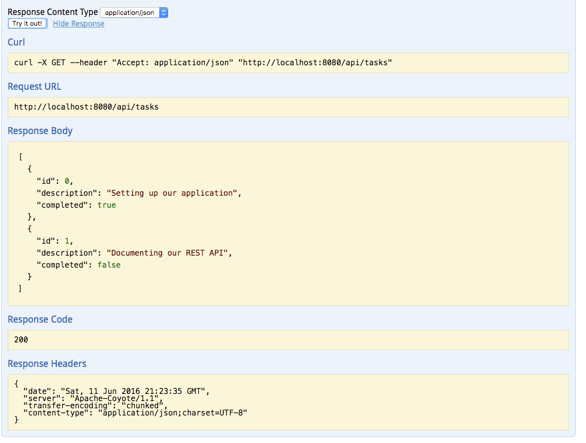

In my last tutorial I built [a REST service](/producing-rest-apis-with-spring/) together with [a REST client](/consuming-rest-apis-with-spring/). Like I said before, REST services are pretty great to allow reuse of your operations, however, to become reusable, you'll have to properly document the available endpoints in your REST API, which endpoints there are, what they can do, what they need as input parameters and what they will provide as output. A popular standard, that is used for this, is [Swagger](http://swagger.io/).

### What is Swagger?

[Swagger](http://swagger.io/) is a language-agnostic specification. With language-agnostic we mean that it's independent on the programming language, but that it's also readable by both computers and humans. Since the specification is readable by both humans and computers, it's not difficult to understand that there is an entire ecosystem of frameworks that work upon Swagger. There are code generators (contract first), but also a wide set of tools that can be used to provide the "link" between the specification (contract) and the code. The framework I will be using in this tutorial is [Springfox](https://springfox.github.io/springfox/). Springfox is a framework that acts as the "glue" between Swagger and Spring. It generates the specification (contract) based on your code and also deploys the Swagger UI client with your application, allowing you to immediately test your REST API.

Basically, the entire ecosystem around Swagger is in some ways comparable to the WSDL ecosystem. You have the contract (Swagger definition or the WSDL file itself), the code generators, and also tools to work code first.

### Setting up project

Once again we start our journey at the [Spring Initializr](http://start.spring.io/). Create a project and add the dependencies Web, JPA and HSQLDB (or any other database you like). Once you opened the project in your favourite editor, we're ready to go!


### Repository

The first thing we're going to create is the "data layer". First off, let's create an entity. In this example I'm going to create a simple entity called `Task` with three properties; an ID, a description and a boolean indicating if the task was completed or not.

```java
@Entity
@Table(name = "task")
public class Task {
    @Id
    @GeneratedValue(strategy = GenerationType.IDENTITY)
    @Column(name = "id")
    private Long id;
    @Column(name = "description")
    private String description;
    @Column(name = "completed")
    private boolean completed;

    public Task(Long id, String description, boolean completed) {
        this.id = id;
        this.description = description;
        this.completed = completed;
    }

    public Task() {
    }

    public Long getId() {
        return id;
    }

    public String getDescription() {
        return description;
    }
    public void setDescription(String description) {
        this.description = description;
    }

    public boolean isCompleted() {
        return completed;
    }
    public void setCompleted(boolean completed) {
        this.completed = completed;
    }
}
```

After that, it's time to create a repository. With Spring Data JPA that's pretty easily done by writing an interface and making it extend from `JpaRepository`. Make sure to check out my tutorial about Spring Data JPA if you're interested in more about this.

```java
public interface TaskRepository extends JpaRepository<Task, Long> {
}
```

Now all we need is to create a table in our HSQLDB in memory database I guess? Spring boot does this out of the box based on your entities. But I'm not really a fan of such a feature, so I usually disable it in my **application.properties** (or **application.yml**):

```
# application.properties
spring.jpa.hibernate.ddl-auto=none
```

```yaml
# application.yml
spring:
  jpa:
    hibernate:
      ddl-auto: none
```

And after that just create a file called **schema.sql** in the same folder (**src/main/resources**) like this:

```sql
CREATE TABLE task (
  id          INTEGER IDENTITY PRIMARY KEY,
  description VARCHAR(64) NOT NULL,
  completed   BIT NOT NULL);
```

Spring boot will automatically execute this on startup. You can also create a file called **data.sql** which can be used to insert some data on startup. So let's do that:

```sql
INSERT INTO task (description, completed) VALUES
  ('Setting up our application', 1),
  ('Documenting our REST API', 0);
```

### Writing a service

Now, one thing you shouldn't do in your REST service is exposing your entities. So in order to prevent that from happening, I created a separate class called `TaskDTO`:

```java
public class TaskDTO {
    private Long id;
    @NotNull(message = "NotNull.taskDTO.description")
    @Size(min = 1, max = 64, message = "Size.taskDTO.description")
    private String description;
    private boolean completed;

    public TaskDTO() {
    }

    public TaskDTO(Long id, String description, boolean completed) {
        this.id = id;
        this.description = description;
        this.completed = completed;
    }

    public Long getId() {
        return id;
    }

    public String getDescription() {
        return description;
    }
    public void setDescription(String description) {
        this.description = description;
    }

    public boolean isCompleted() {
        return completed;
    }
    public void setCompleted(boolean completed) {
        this.completed = completed;
    }
}
```

As you can see I added a few annotations like `@NotNull` and `Size`. These are validation annotations and I'll use them later to make sure that the description field is entered and does not exceed the database limit. If you want to read more about these I suggest reading my tutorial about validation or my follow-up tutorial about creating REST services with Spring boot.

Now that we have our DTO, we can write a service that uses the repository, maps the entities to DTOs and returns them:

```java
@Service
public class TaskServiceImpl {
    @Autowired
    private TaskRepository repository;

    public List<TaskDTO> findAll() {
        return repository.findAll().stream()
                .map(entity -> new TaskDTO(entity.getId(), entity.getDescription(), entity.isCompleted()))
                .collect(Collectors.toList());
    }

    @Transactional
    public TaskDTO create(TaskDTO task) {
        Task newTask = new Task();
        newTask.setDescription(task.getDescription());
        newTask.setCompleted(task.isCompleted());
        Task savedTask = repository.saveAndFlush(newTask);
        return new TaskDTO(savedTask.getId(), savedTask.getDescription(), savedTask.isCompleted());
    }

    @Transactional
    public TaskDTO update(Long id, TaskDTO task) {
        Task entity = findOneSafe(id);
        entity.setDescription(task.getDescription());
        entity.setCompleted(task.isCompleted());
        return new TaskDTO(entity.getId(), entity.getDescription(), entity.isCompleted());
    }

    @Transactional
    public void delete(Long id) {
        Task task = findOneSafe(id);
        repository.delete(task);
    }

    private Task findOneSafe(Long id) {
        Task task = repository.findOne(id);
        if (task == null) {
            throw new TaskNotFoundException(id);
        } else {
            return task;
        }
    }
}
```

As you can see, this service isn't really complex. The mapping happens by using constructors, but if you wish to use a bean mapping framework like Dozer, MapStruct, ... that's also possible. Make sure to read my articles about [Dozer](/mapping-with-dozer/) and [Mapstruct](/mapstruct/) if you're interested in such a feature.

For the `update()` and `delete()` methods I wrote a separate private method called `findOneSafe()` to make sure that if the given task does not exist, it throws an exception. The exception is a custom one, which I implemented like this:

```java
package be.g00glen00b.service;

public class TaskNotFoundException extends RuntimeException {
    private Long id;

    public TaskNotFoundException(Long id) {
        this.id = id;
    }

    public Long getId() {
        return id;
    }

    @Override
    public String getMessage() {
        return "Task with ID '" + id + "' not found";
    }
}
```

### Writing the controller

Now that we have a service that maps our entities to DTOs, it's time to write the REST controller. With Spring, you can easily create controllers using the `@RestController` and `@RequestMapping` annotations:

```java
@RestController
@RequestMapping("/api/tasks")
public class TaskController {
    @Autowired
    private TaskServiceImpl service;
    @Autowired
    private MessageSource messageSource;

    @RequestMapping(method = RequestMethod.GET, produces = MediaType.APPLICATION_JSON_VALUE)
    public List<TaskDTO> findAll() {
        return service.findAll();
    }

    @RequestMapping(method = RequestMethod.POST, consumes = MediaType.APPLICATION_JSON_VALUE, produces = MediaType.APPLICATION_JSON_VALUE)
    public TaskDTO create(@Valid @RequestBody TaskDTO dto) {
        return service.create(dto);
    }

    @RequestMapping(value = "/{id}", method = RequestMethod.PUT, consumes = MediaType.APPLICATION_JSON_VALUE, produces = MediaType.APPLICATION_JSON_VALUE)
    public TaskDTO update(@PathVariable Long id, @Valid @RequestBody TaskDTO dto) {
        return service.update(id, dto);
    }

    @RequestMapping(value = "/{id}", method = RequestMethod.DELETE, produces = MediaType.APPLICATION_JSON_VALUE)
    @ResponseStatus(HttpStatus.NO_CONTENT)
    public void delete(@PathVariable Long id) {
        service.delete(id);
    }
}
```

As you can see, nothing special here. In case you're wondering what we do here, I suggest you read my tutorial about writing a REST service with Spring.

Before we start documenting our REST API, we have to do a few things. Remember the `@NotNull` and `@Size` validations? Well, we have to handle the exceptions they throw. Talking about exceptions, we also have to handle the `TaskNotFoundException`. We can do that with the `@ExceptionHandler` annotation:

```java
@ResponseStatus(HttpStatus.BAD_REQUEST)
@ExceptionHandler(MethodArgumentNotValidException.class)
public MessageDTO handleValidationException(MethodArgumentNotValidException ex) {
    Locale locale = LocaleContextHolder.getLocale();
    String code = ex.getBindingResult().getFieldError().getDefaultMessage();
    return new MessageDTO(messageSource.getMessage(code, null, locale));
}

@ResponseStatus(HttpStatus.BAD_REQUEST)
@ExceptionHandler(TaskNotFoundException.class)
public MessageDTO handleNotFoundException(TaskNotFoundException ex) {
    String[] parameters = {Long.toString(ex.getId())};
    Locale locale = LocaleContextHolder.getLocale();
    return new MessageDTO(messageSource.getMessage("exception.TaskNotFound.description", parameters, locale));
}
```

For the validation errors I'm using the default message as the code for the `messageSource`, while for the `TaskNotFoundException` I'm using the code `exception.TaskNotFound.description`. However, I am passing the ID of the task (that does not exist) as a parameter.

So now we have to create a file called **messages.properties** in the **src/main/resources** folder with the following content:

```
NotNull.taskDTO.description=The description is a required field.
Size.taskDTO.description=The description should be between 1 and 64 characters.
exception.TaskNotFound.description=The task with ID {0} could not be found.
```

We'll also have to create a class called `MessageDTO`:

```java
public class MessageDTO {
    private String message;

    public MessageDTO(String message) {
        this.message = message;
    }

    public MessageDTO() {
    }

    public String getMessage() {
        return message;
    }
    public void setMessage(String message) {
        this.message = message;
    }
}
```

### Configuring Springfox

Now that we actually finished our REST API, it's time to start documenting it. The issue without documenting is that without knowledge of the code, you don't know which endpoints there are, what you have to send or what you will receive (`TaskDTO`). So let's start by adding Springfox as a dependency in **pom.xml**:

```xml
<dependency>
    <groupId>io.springfox</groupId>
    <artifactId>springfox-swagger2</artifactId>
    <version>2.3.1</version>
</dependency>
<dependency>
    <groupId>io.springfox</groupId>
    <artifactId>springfox-swagger-ui</artifactId>
    <version>2.3.1</version>
</dependency>
```

Great, now that we have that part done, create a new config class to configure Springfox:

```java
@Configuration
@EnableSwagger2
public class SwaggerConfig {

    @Bean
    public Docket taskApi() {
        return new Docket(DocumentationType.SWAGGER_2)
            .groupName("task-api")
            .useDefaultResponseMessages(false)
            .apiInfo(apiInfo())
            .select()
                .paths(regex("/api.*"))
            .build();
    }

    @Bean
    public UiConfiguration uiConfig() {
        return new UiConfiguration(null);
    }

    private ApiInfo apiInfo() {
        return new ApiInfoBuilder()
                .title("Simple task API")
                .description("API for managing user tasks")
                .version("1.0")
                .build();
    }
}
```

This part is used to tell Springfox which controllers/paths to scan (in this case everything starting with `/api`). We also give the API a title, description and version in the `apiInfo()` method. Make sure you don't forget to add the `@EnableSwagger2` annotation.

### Documenting your REST API

With the configuration ready, it's time to add some annotations to the controller. The final result will look like this:

```java
@RestController
@RequestMapping("/api/tasks")
@Api("/api/tasks")
public class TaskController {
    @Autowired
    private TaskServiceImpl service;
    @Autowired
    private MessageSource messageSource;

    @RequestMapping(method = RequestMethod.GET, produces = MediaType.APPLICATION_JSON_VALUE)
    @ApiOperation(value = "Find all tasks", notes = "Retrieving the collection of user tasks", response = TaskDTO[].class)
    @ApiResponses({
        @ApiResponse(code = 200, message = "Success", response = TaskDTO[].class)
    })
    public List<TaskDTO> findAll() {
        return service.findAll();
    }

    @RequestMapping(method = RequestMethod.POST, consumes = MediaType.APPLICATION_JSON_VALUE, produces = MediaType.APPLICATION_JSON_VALUE)
    @ApiOperation(value = "Create task", notes = "Creating a new user task", response = TaskDTO.class)
    @ApiResponses({
        @ApiResponse(code = 200, message = "Success", response = TaskDTO.class),
        @ApiResponse(code = 400, message = "Bad request", response = MessageDTO.class)
    })
    public TaskDTO create(
            @ApiParam(required = true, name = "task", value = "New task")
            @Valid @RequestBody TaskDTO dto) {
        return service.create(dto);
    }

    @RequestMapping(value = "/{id}", method = RequestMethod.PUT, consumes = MediaType.APPLICATION_JSON_VALUE, produces = MediaType.APPLICATION_JSON_VALUE)
    @ApiOperation(value = "Update task", notes = "Updating an existing user task", response = TaskDTO.class)
    @ApiResponses({
        @ApiResponse(code = 200, message = "Success", response = TaskDTO.class),
        @ApiResponse(code = 400, message = "Bad request", response = MessageDTO.class),
        @ApiResponse(code = 404, message = "Not found", response = MessageDTO.class)
    })
    public TaskDTO update(
            @ApiParam(required = true, name = "id", value = "ID of the task you want to update", defaultValue = "0")
            @PathVariable Long id,
            @ApiParam(required = true, name = "task", value = "Updated task")
            @Valid @RequestBody TaskDTO dto) {
        return service.update(id, dto);
    }

    @RequestMapping(value = "/{id}", method = RequestMethod.DELETE, produces = MediaType.APPLICATION_JSON_VALUE)
    @ResponseStatus(HttpStatus.NO_CONTENT)
    @ApiOperation(value = "Delete task", notes = "Deleting an existing user task")
    @ApiResponses({
        @ApiResponse(code = 204, message = "Success"),
        @ApiResponse(code = 404, message = "Not found", response = MessageDTO.class)
    })
    public void delete(
            @ApiParam(required = true, name = "id", value = "ID of the task you want to delete")
            @PathVariable Long id) {
        service.delete(id);
    }

    @ResponseStatus(HttpStatus.BAD_REQUEST)
    @ExceptionHandler(MethodArgumentNotValidException.class)
    public MessageDTO handleValidationException(MethodArgumentNotValidException ex) {
        Locale locale = LocaleContextHolder.getLocale();
        String code = ex.getBindingResult().getFieldError().getDefaultMessage();
        return new MessageDTO(messageSource.getMessage(code, null, locale));
    }

    @ResponseStatus(HttpStatus.BAD_REQUEST)
    @ExceptionHandler(TaskNotFoundException.class)
    public MessageDTO handleNotFoundException(TaskNotFoundException ex) {
        String[] parameters = {Long.toString(ex.getId())};
        Locale locale = LocaleContextHolder.getLocale();
        return new MessageDTO(messageSource.getMessage("exception.TaskNotFound.description", parameters, locale));
    }
}
```

So let's what annotations we added. On the controller itself, we added the `@Api` annotation telling which location we use. I don't think it's necessary (because Springfox should be capable of determining the path using the `@RequestMapping` annotation), but it also allows you to add additional info. On each method we added two annotations called `@ApiOperation` and `@ApiResponses`. The `@ApiOperation` describes what the endpoint/operation does exactly, while the `@ApiResponses` list which response is expected for each status code.

For the `findAll` method we only have one possible status code, being 200 (Success). In that case we return a list of `TaskDTO`, but since you can't write that, I wrote `TaskDTO[].class`, which serializes to the exact same response, so they're interchangeable.

The `create` method on the other hand can have the 200 status and the 400 (Bad request) status. This happens when the input `TaskDTO` does not meet the validation requirements. You can also see here that we annotate parameters with the `@ApiParam` annotation, describing what the parameter does and if it's required or not. Similarly, the `required` attribute could probably be derived from the Spring annotations as well.

Anyhow, on to the `update` method, which is very similar to the `create` method. However, when the ID does not exist and a `TaskNotFoundException` is thrown, then we use the 404 status code (Not found), so we're listing that as well within the `@ApiResponses`.

And last but not least we have the `delete` method. There's no validation error here, but the ID could lead to an non-existing task, so the 404 is present here.

Next to the controller, we can also annotate our DTOs, describing the DTO itself and the properties. Let's start with `TaskDTO`:

```java
@ApiModel(value = "Task", description = "A user task")
public class TaskDTO {
    @ApiModelProperty(value = "The unique identifier of the given task", readOnly = true)
    private Long id;
    @ApiModelProperty(value = "Description of the task", required = true)
    @NotNull(message = "NotNull.taskDTO.description")
    @Size(min = 1, max = 64, message = "Size.taskDTO.description")
    private String description;
    @ApiModelProperty(value = "Indication if the task was completed or not")
    private boolean completed;

    public TaskDTO() {
    }

    public TaskDTO(Long id, String description, boolean completed) {
        this.id = id;
        this.description = description;
        this.completed = completed;
    }

    public Long getId() {
        return id;
    }

    public String getDescription() {
        return description;
    }
    public void setDescription(String description) {
        this.description = description;
    }

    public boolean isCompleted() {
        return completed;
    }
    public void setCompleted(boolean completed) {
        this.completed = completed;
    }
}
```

As you can see, we're using the `@ApiModel` and `@ApiModelProperty` annotations to describe our DTO. The same can be done for `MessageDTO`:

```java
@ApiModel(value = "Message", description = "A message containing more info why the operation failed")
public class MessageDTO {
    @ApiModelProperty(value = "The message itself", readOnly = true)
    private String message;

    public MessageDTO(String message) {
        this.message = message;
    }

    public MessageDTO() {
    }

    public String getMessage() {
        return message;
    }
    public void setMessage(String message) {
        this.message = message;
    }
}
```

After that, we can see for ourselves what the result is by running the application. After running the application, go to [http://localhost:8080/swagger-ui.html](http://localhost:8080/swagger-ui.html). If you see a blank screen, you might have to refresh once, but normally you'll see a screen like this:


As you can see, the title and description here already match the details we provided in the `SwaggerConfig` class, so far so good. Now, if we click on **List operations** at the right side, you'll see that that section expands and our operations are visible:


You can see here that the value property of the `@ApiOperation` annotation is already visible. Now if we click on one of those operations, we see a lot more detail:


You can see a lot of the things we did with the Swagger annotations here. You can see the model schema (`TaskDTO[]`), you can click on **Model** to see the description of the model and the properties, you can see the notes, ... .


For the create, update and delete operations you can also see what the input parameters should be and what the possible status codes are and what response they'll return. The cool thing about Swagger is that every operation also has a **Try it out!** button. If we press that button on the findAll operation, you'll see that the dummy tasks we inserted using the **data.sql** file are already there:



We can also use Swagger to create new tasks. Open the **create** operation and enter the **task** parameter. You can look at the model on the right to see what you have to send. You can even click on it and it will insert the model schema into the edit area. Make sure to delete the ID property since that's read only. I also left the completed property away since that is optional:


Now, for the update operation you have to look at the ID of the response of the create operation, since we need that ID (probably 2) to update the task. Similar to before, we can click on the right side to copy the model schema into the edit area:


Same can be done with the delete operation:


With Swagger and Springfox we made the REST API we wrote a lot more accessible. When you run the application, you might encounter a weird exception like this:

```
java.lang.NumberFormatException: For input string: ""
```

This appears to be [a bug](https://github.com/springfox/springfox/issues/1100), so you can ignore that one. If it annoys you, you can always change the logging level of that file like they propose in that issue. You can do that in **application.properties** or **application.yml** as well:

```
# application.properties
logging.level.io.swagger.models.parameters.AbstractSerializableParameter=error
```

```yaml
# application.yml
logging:
  level:
    io.swagger.models.parameters.AbstractSerializableParameter: error
```

In [the next article](/exploring-contract-first-options-swagger/) I will be talking about using Swagger and Springfox in contract first approaches.

#### Achievement: Documented your REST API with Springfox

If you’re seeing this, then it means you successfully managed to make it through this tutorial. If you’re interested in the full code example, you can find it on [GitHub](https://github.com/g00glen00b/spring-samples/tree/master/spring-boot-swagger).
