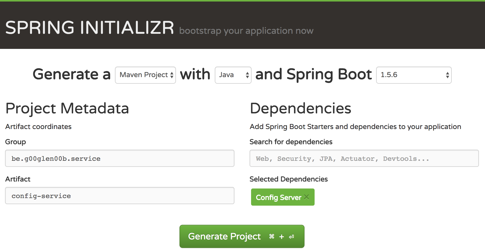
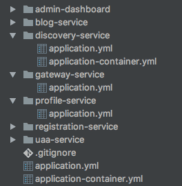

In my last few tutorials, I've covered some aspects that are really important with microservice, such as [a discovery service like Eureka](/using-the-netflix-stack-with-spring-boot-eureka/) and [a circuit breaker like Hystrix](/spring-boot-netflix-hystrix/). Another thing that might be useful when working with microservices is to provide your application configuration as a microservice as well.

For example, let's say that we have 10 [Spring boot](https://projects.spring.io/spring-boot/) applications or microservices. Every application has its own configuration, such as the port number, database settings, ... . The issue with that approach is that you sometimes have configuration that has to be applied to more than just one application, and that the decentralized approach doesn't work that great for configuration.

Another issue with configuration in general is that those properties files can be changed by anyone, so if someone changes something, and it fails, it's fairly difficult to track back what happened and why. But what if we would use version control for our configuration, like [Git](https://git-scm.com/)? That would allow us to roll back changes easily, it would allow us to easily migrate changes to other environments by merging commits to other branches, and you can see who changed something and why he or she did that using the commit message.

Also, if you start using containers like [Docker](https://www.docker.com/) for your applications, then you would have to add a separate volume for your configuration. If you manage it through Git, you no longer need that extra volume.

### Setting up a Spring boot application

Luckily of us, [Spring](https://cloud.spring.io/spring-cloud-config/) already has done quite a job to get this thing ready to use. All you need to do is to create a new Spring boot project. As usual, the best place to do that is by using the [Spring Initializr](https://start.spring.io/).



All you have to do is add the **Config Server** dependency. If you decide not to use the Spring Initialzr, you can just add the following dependency:

```xml
<dependency>
    <groupId>org.springframework.cloud</groupId>
    <artifactId>spring-cloud-config-server</artifactId>
</dependency>
```

### Configuring the service

After you created your project and imported it into your IDE, it's time to configure it. To do that, you need to edit the `application.properties` file in the **src/main/resources** folder. There are two things to configure:

- The location of the Git repository
- The structure you want to follow within that repository

To configure the location, you have to change the `spring.cloud.config.server.git` property. In this case, I created [a repository on GitHub](https://github.com/g00glen00b/microservice-demo-config), so I added the following property:

```
spring.cloud.config.server.git=git@github.com:g00glen00b/microservice-demo-config.git
```

The structure I chose is to have a folder for every application. And within each folder there will be an `application.yml` file (or `application.properties`) for every profile.



Every folder contains an `application.yml` file with the configuration for that specific application. The `application.yml` file in the root folder contains the global configuration that applies to all applications.

Additionally to that, we can have profile-specific configuration in both the root folder and the application-specific folders. In the screenshto above you can see that the **discovery-service** has configuration specific for the **container** profile. However, in the root folder there is also a file called `application-container.yml` that will apply to all applications using the container profile.

To configure that we'll use a separate folder for every application, you need to add the following property:

```
spring.cloud.config.server.git.searchPaths={application}
```

If you would be using YAML, you would have the following:

```yaml
spring:
  cloud:
    config:
      server:
        git:
          uri: git@github.com:g00glen00b/microservice-demo-config.git
          searchPaths: '{application}'
```

In this case, `{application}` is a placeholder referring to the name of the application, which can be set using the `spring.application.name` property (I'll show that later!).

Next to that, there are also a few other placeholders you can use, which you can find in the [documentation](https://cloud.spring.io/spring-cloud-static/spring-cloud-config/1.2.3.RELEASE/#_environment_repository).

### Testing out the config service

To test the configuration, you can run the application and call the REST API directly. The REST API has the following structure: `/{application}/{profiles}`. So, if we would retrieve the configuration for an application called **uaa-service** with the profile **dev**, we should call [http://localhost:8000/uaa-service/dev](http://localhost:8000/uaa-service/dev) (I'm using port 8000 here).


The result will be a list of property sources. In this case, it will retrieve the following property sources:

- uaa-service/[application.yml](https://github.com/g00glen00b/microservice-demo-config/blob/master/uaa-service/application.yml)
- [application.yml](https://github.com/g00glen00b/microservice-demo-config/blob/master/application.yml)

If you would run an application with multiple profiles and you want to see what configuration would apply, you have to separate all pofiles with a comma, for example [http://localhost:8000/uaa-service/dev,db,stream](http://localhost:8000/uaa-service/dev,db,stream).

### Using the configuration service

No worries, you don't have to call these APIs by yourself if you're using Spring boot. You just have to add the **Config client** dependency and you're ready.


Once you've set up your project, you need to create a file called `bootstrap.yml` (or `bootstrap.properties`) and add the `spring.application.name` property there. This name should be the same as the configuration folder you want to use. Additionally to that, you also need to configure the location of the config service, which can be done with the `spring.cloud.config.uri` property:

```yaml
spring:
  application:
    name: uaa-service
  cloud:
    config:
      uri: http://localhost:8000
```

If you run the application now, you'll see that it will fetch the configuration from the config service during startup. So make sure to run your config service before you run the other applications.


If you added the Actuator to your application, you can also view the result by going to the `/env` endpoint on your application.


With this, we've completely set up both the config service and we're able to set up applications using the config service. This allows us to get more control of what's happening, and you also don't need to deploy an external `application.properties` file with each application. Just let them refer to the config service!


If something doesn't work, you simply reverse the commit, restart the applications (or use the `@RefreshScope` annotation) and you're done.

#### Achievement: Configuration as a service

If you’re seeing this, then it means you successfully managed to make it through this tutorial. If you’re interested in the full code example, you can find it on [GitHub](https://github.com/g00glen00b/microservice-demo/tree/master/config-service).
