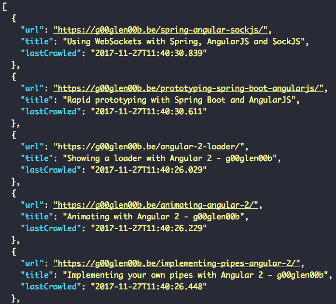

A few weeks back, I went to [Devoxx](https://blog.optis.be/spring-devoxx-7c0fa8a9dc9f), an annual Java conference located in Belgium. One of the few hypes there was [Spring framework 5](https://spring.io/blog/2017/09/28/spring-framework-5-0-goes-ga) and the upcoming release of [Spring boot 2.0](https://spring.io/blog/2017/05/16/spring-boot-2-0-0-m1-available-now). With this tutorial I'll show you how you can get started Spring boot 2.0.

### Second best place on the internet

Just like last year, Josh Long's second favourite place on the internet is still [start.spring.io](http://start.spring.io/), and just like before, it is the place to go if you want to create bootiful applications. To create a Spring boot 2.0 application, make sure to select the latest release (currently that's **2.0.0 M6**). After that, select the following dependencies:

- **Reactive Web**: This dependency is an alternative to the Spring Web MVC module, and allows you to write webapplications in a reactive way
- **Reactive MongoDB**: According to Josh Long, it's the best way to lose your data in a reactive way, but this is one of the few options if you want to utilize reactive programming at the persistence layer (the alternatives being Cassandra and Redis)
- **Lombok**: You don't need this, but this allows you to get more done with less boilerplate code (think about constructors, getters, setters, ...).


In this article, I'll be writing a web crawler (because why not?), so I'll also manually add the [**JSoup** library](https://jsoup.org/) afterwards to be able to parse webpages:

```xml
<dependency>
    <groupId>org.jsoup</groupId>
    <artifactId>jsoup</artifactId>
    <version>1.11.1</version>
</dependency>
```

### What is reactive programming?

If you know languages like JavaScript, you probably already noticed its asynchronous, non-blocking nature. Threads aren't blocked when you wait for a result, simply because you don't wait, you just **react** as soon as you get a result. In JavaScript, this usually happens by using callbacks, but callbacks can lead to callback hell, so now we have another issue. Actually, there are several solutions to this problem, like promises, or in the case of reactive programming, by using reactive streams and the toolbox that comes with it.

#### The concepts

There are various reactive programming libraries, such as [Vert.X](http://vertx.io/), [RxJava](https://github.com/ReactiveX/RxJava), [Akka](https://akka.io/) and [Project Reactor](https://projectreactor.io/). Spring itself uses the latter, which uses [reactive streams](http://www.reactive-streams.org/) at its core. There are a few important concepts to understand before you can get started:

- **Publisher**: This concept is quite simple, a `Publisher` transmits data.
- **Flux**: A `Flux` is an implementation of a `Publisher` (only in Project Reactor), basically a `Flux` means that you can expect zero to many items.
- **Mono**: Additionally to a `Flux`, there is also a `Mono`. When you subscribe to a `Mono`, you can expect zero or one item to return.
- **Subscriber**: A subscriber can subscribe to a `Publisher`, which allows it to receive the data.
- **Operator**: If you could only publish/subscribe, the world would be quite boring. Additionally to that, you can also apply operators to a publisher, such as `map()`, `filter()`, ... . Most of these should be familiar if you're into functional programming.


#### What is the difference between Java 8 streams and publishers/subscribers

If you know Java 8 streams, you should be aware that there are many similarities. However, there are also a few differences. On its own, Java 8 streams are not asynchronous and are blocking. To solve that issue, Java also introduces **parallel streams**. This allows you to use a thread pool and manipulate multiple objects at once. Creating threads however is a costly operation, and this doesn't mean that it becomes non-blocking, since the logic within those threads still block.

### Reactive repositories

Since Spring Data Kay, we're now able to create reactive repositories by extening from the `ReactiveCrudRepository` in stead of extending from the normal `CrudRepository`. This adds a bunch of additional methods using `Flux`/`Mono`.

Except from the different interface, creating repositories is still the same:

```java
public interface WebpageRepository extends ReactiveCrudRepository<Webpage, String> WebpageRepositoryCustom {
}
```

You can also still use custom implementations by using the `ReactiveMongoTemplate`. First you have to create an additional interface defining those custom methods:

```java
public interface WebpageRepositoryCustom {
    Flux<Webpage> findAllByContentLikeOrTitleLike(String search); // Custom
}
```

After that you can create an implementation and autowire `ReactiveMongoTemplate`:

```java
@AllArgsConstructor
public class WebpageRepositoryImpl implements WebpageRepositoryCustom {
    private ReactiveMongoTemplate mongoTemplate;

    @Override
    public Flux<Webpage> findAllByContentLikeOrTitleLike(String search) {
        Query query = query(new Criteria().orOperator(where("content").regex(search), (where("title").regex(search))));
        return mongoTemplate.find(query, Webpage.class);
    }
}
```

Alternatively you can use the `@Query` annotation:

```java
@Query("{ '$or': [{ 'content': {'$regex': ?0 } }, { 'title': { '$regex': ?0 } }] }")
Flux<Webpage> findAllByContentLikeOrTitleLike(String search);
```

### Router functions

The nice thing about Spring 5 is that, even though the reactive architecture changed a lot, you're still able to use controllers to the fullest extent. Additionally to that, there's also a new kid in town, the router API. This API allows you to programmatically define your routes, similar to how libraries like Express work on Node.js.

For example, if we want to define some routes to retrieve the `Webpage` objects returned from our custom repository implementation, we could write:

```java
@Component
@AllArgsConstructor
public class WebpageHandler {
    private static final String SEARCH_ATTRIBUTE = "search";
    private WebpageRepository repository;

    public Mono<ServerResponse> findAll(ServerRequest request) {
        String parameter = request.queryParam(SEARCH_ATTRIBUTE).orElse(".*");
        return ServerResponse.ok().body(repository.findAllByContentLikeOrTitleLike(parameter), Webpage.class);
    }
}
```

After that we can create a `RouterFunction` bean:

```java
@Bean
public RouterFunction<?> routes(WebpageHandler handler) {
    return route(GET("/api/webpage").and(accept(MediaType.APPLICATION_JSON)), handler::findAll);
}
```

And there you go, that's how you can define your new API endpoints with Spring 5's router functions.

### Writing your code... reactively

Obviously it doesn't stop here, your entire codebase could benefit from working in a reactive way as well. During this tutorial I will be using the inspiration I got from one of the latest [/r/dailyprogrammer challenges](https://www.reddit.com/r/dailyprogrammer/comments/7dlaeq/20171117_challenge_340_hard_write_a_web_crawler/?utm_content=title&utm_medium=hot&utm_source=reddit&utm_name=dailyprogrammer), and I'll be writing a simple web crawler.

Basically, the web crawler will start by retrieving the content of an initial webpage (the seed), it will store the content, and then it will crawl again, using the hyperlinks on the page.


You may realize that this is likely going to end up to be an infinite loop, considering that webpages are often links to several other webpages, which in turn are also linked... . That's why we also need to limit it somehow by providing a maximum depth and also keeping track of the depth when we crawl. To keep track of the depth I'll be using a class called `CrawlerCommand`:

```java
@AllArgsConstructor
@Data
public class CrawlerCommand {
    private String seed;
    private int depth;
}
```

Now, let's start with the begin, when we crawl, we want to retrieve the document using JSoup. As far as I know, JSoup does not support any form of reactive results, so we'll just wrap it ourselves:

```java
private Mono<Document> getDocument(String seed) {
    try {
        return Mono.just(Jsoup.connect(seed).validateTLSCertificates(false).get());
    } catch (IOException | IllegalArgumentException e) {
        return Mono.empty();
    }
}
```

We will only have one document (or none, if the request fails), so we'll use a `Mono` here.

The next step is that we're going to get a `CrawlerCommand` input, crawl the webpage using the method above, and then retrieve the hyperlinks on the page, the title, and the content of the webpage. To "store" that information, I'm going to create a separate class:

```java
@Data
@AllArgsConstructor
public class CrawlerResult {
    private String url;
    private String title;
    private String content;
    private List<String> hyperlinks;
    private int depth;
}
```

Now we can write the following methods:

```java
private Mono<CrawlerResult> getResult(CrawlerCommand command) {
    return Mono.just(command)
        .map(CrawlerCommand::getSeed)
        .flatMap(this::getDocument)
        .flatMap(document -> getCrawlerResult(document, command.getDepth()));
}

private Mono<CrawlerResult> getCrawlerResult(Document document, int depth) {
    return Flux.fromIterable(document.getElementsByTag("a"))
        .map(element -> element.absUrl("href"))
        .collectList()
        .map(hyperlinks -> new CrawlerResult(document.location(), document.title(), document.text(), hyperlinks, depth));
}
```

First we start off with the URL (in `CrawlerCommand`), we retrieve the URL, then we have to map it to the document, but since this is a `Mono`, we'll use the `flatMap` operator so that we just get a `Mono<Document>`, rather than a `Mono<Mono<Document>>`. Finally, we can use the `flatMap()` operator again to get a `CrawlerResult` object.

This object will use the `Document` to retrieve the information we need (aka the URL, title, text and the hyperlinks on the page). To do this, we start with the hyperlinks, then we use the `collectList()` operator to get a `Mono<List<String>>` and finally we map that to a `CrawlerResult`.

Now we can start writing the actual `crawl()` function:

```java
public Flux<CrawlerResult> crawl(Flux<CrawlerCommand> commands, int maxDepth) {
    return commands
        .filter(command -> command.getDepth() < = maxDepth)
        .flatMap(this::getResult);
```

When we start, we only have a single seed, and thus a single `CrawlerCommand`, but as soon as we start to use the hyperlinks from that page, we'll end up with multiple `CrawlerCommand` objects, so that's why we'll use a `Flux` rather than a `Mono`.

Other than that, we use a `filter()` operator here to filter out the commands as soon as they reach the `maxDepth` value, to prevent looping infinitely.

### Doing recursion with reactive code

The problem right now is that we have the result of the initial seed, but we aren't doing any recursion right now to get to the results of the linked pages. To implement that, I'm going to add the following methods:

```java
public Flux<CrawlerResult> crawl(CrawlerResult result, int maxDepth) {
    return Mono.just(result).mergeWith(crawl(getNextCommands(result), maxDepth));
}

private Flux<CrawlerCommand> getNextCommands(CrawlerResult result) {
    return Flux.fromIterable(result.getHyperlinks()).map(link -> new CrawlerCommand(link, result.getDepth() + 1));
}
```

What happens here is that we create a new `Flux` containing the original result, combined with the results from the linked pages. This is done by using the `mergeWith()` operator. Additionally to that, we have to convert the hyperlinks to new `CrawlerCommand` objects, which is what happens in the `getNextCommands` by using the `Flux.fromIterable()`.

### Implementing the scheduler

The last step is to schedule the crawling job by calling the `crawl()` function with the seed URL and the maximum depth. To do this, I'm going to define a configuration object:

```java
@AllArgsConstructor
@NoArgsConstructor
@Data
public class CrawlerOptions {
    private String seed;
    private int depth;
    private int scheduleDelayMillis;
}
```

Then I'm going to create a bean using `@ConfigurationProperties`:

```java
@Bean
@ConfigurationProperties(prefix = "crawler")
public CrawlerOptions crawlerOptions() {
    return new CrawlerOptions();
}
```

And the final step is to autowire this in our crawler, in addition to the repository we made earlier on and to use it in a method annotated with `@Scheduled`:

```java
@Scheduled(fixedDelayString = "${crawler.schedule-delay-millis}", initialDelay = 0)
public void crawl() {
    repository.saveAll(crawl(Flux.just(new CrawlerCommand(crawlerOptions.getSeed(), 1)), crawlerOptions.getDepth())
        .map(result -> new Webpage(result.getUrl(), result.getTitle(), result.getContent(), LocalDateTime.now()))
        .distinct(Webpage::getUrl))
        .subscribe(webpage -> logger.info("Webpage stored {} ({})", webpage.getTitle(), webpage.getUrl()));
}
```

Using the `repository.saveAll()` function we can save the results we retrieved. It may look as if we're saving all of these together in one call, but be aware that this doesn't happen since the code is working reactively. This means that as soon as a new webpage is retrieved, it is being saved, it doesn't wait until all other webpages are also retrieved.

Finally, we subscribe to the `repository.saveAll()` function, because reactive code will only work as soon as a subscriber is registered. With that, our flow is complete and we can start to run our application. But first, here's an overview of the flow:


### Running the application

If we run the application now, we can start to see it shine:

```
[      Thread-10] b.g.c.webcrawlerapi.crawler.Crawler      : Webpage stored Configuration as a microservice - g00glen00b (https://dimitr.im/configuration-as-a-microservice/)
[      Thread-11] b.g.c.webcrawlerapi.crawler.Crawler      : Webpage stored Using the Netflix stack with Spring boot: Hystrix - g00glen00b (https://dimitr.im/spring-boot-netflix-hystrix/)
[      Thread-12] b.g.c.webcrawlerapi.crawler.Crawler      : Webpage stored Showing a loader with Angular 2 - g00glen00b (https://dimitr.im/angular-2-loader/)
[      Thread-13] b.g.c.webcrawlerapi.crawler.Crawler      : Webpage stored Animating with Angular 2 - g00glen00b (https://dimitr.im/animating-angular-2/)
[      Thread-14] b.g.c.webcrawlerapi.crawler.Crawler      : Webpage stored Implementing your own pipes with Angular 2 - g00glen00b (https://dimitr.im/implementing-pipes-angular-2/)
[       Thread-9] b.g.c.webcrawlerapi.crawler.Crawler      : Webpage stored Changing your page title when a route changes with Angular 2 - g00glen00b (https://dimitr.im/page-title-route-change-angular-2/)
[       Thread-7] b.g.c.webcrawlerapi.crawler.Crawler      : Webpage stored Using routing with Angular 2 - g00glen00b (https://dimitr.im/routing-angular-2/)
[       Thread-8] b.g.c.webcrawlerapi.crawler.Crawler      : Webpage stored Creating a pagination component with Angular 2 - g00glen00b (https://dimitr.im/pagination-component-angular-2/)
[       Thread-6] b.g.c.webcrawlerapi.crawler.Crawler      : Webpage stored Writing your first component with Angular 2 - g00glen00b (https://dimitr.im/component-angular-2/)
```

From the logs, you can see that every step is running in its own thread. If you look at the threads in a tool like JVisualVM, you can see that every tasks runs on a thread and is only running for a while until it is parked again. This means that we aren't waiting for a proper response, we're just parking the thread and picking it up once we have the result.


If we make a call to the endpoint we defined, for example: [http://localhost:8080/api/webpage?search=angular](http://localhost:8080/api/webpage?search=angular), we can see that we have a working application:



And there you have it, a reactive application with Spring boot 2.0!

#### Achievement: Upgraded to Spring boot 2.0!

If you’re seeing this, then it means you successfully managed to make it through this tutorial. If you’re interested in the full code example, you can find it on [GitHub](https://github.com/g00glen00b/spring-samples/tree/master/spring-boot-2-web-crawler).
