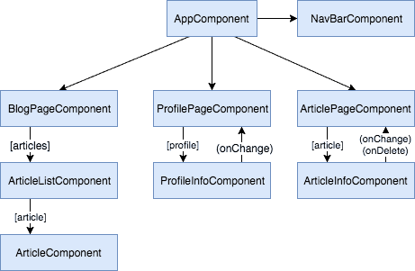

One of the major differences between AngularJS 1.x and Angular 2 and beyond is the shift to components. Even though components were introduced in AngularJS 1.5, controllers are still often used. Embracing components provides many advantages, such as proper loosely coupled components, re-usability and so on. One drawback to the component-based approach is state management and how to handle it. Luckily, people solved that problem already, and that's where things like ngrx pop up.

### The problem

Let's say you have a component-based application, where data is given to child components, and events bubble up to the parent component.



Things work fine, until you start to handle authentication and autorisation. The impact it has on all these components is gigantic, such as:

- **NavBarComponent**: Wants to show a logout button when the user is logged in.
- **ArticleInfoComponent**: Can only be changed when the user is logged in and the current user is the author of the aticle.
- **ProfilePageComponent**: Can only be used when the user is logged in, and needs to retrieve the profile information of the current user.
- **ArticleComponent**: Will only show a delete and an edit icon when the user is authenticated.

This state influences most components. That means that if you would like to manage it, you would have to do so in the first common ancestor component. Quite often, this would be `AppComponent`. This isn't great, because you would have to pass the state around through your entire application. **Application-wide state** shouldn't be managed in the `AppComponent`.

### ngrx

State management libraries like ngrx are the answer to this problem. Basically, it consists out of two elements:

- A **state** object, containing the current application state.
- **Reducers**, which will do something with the current state, and then provide a new state.

In functional programming, such a mechanism, where you have an old state and an accumulator to provide a new state, is called a **reduce** operation. I'll explain in a bit what this reducer does and how it works.


### Getting started

The first step to get started with **@ngrx/store** is to add it to your project. You can do that with npm:

```
npm install --save @ngrx/store
```

As a next step, I'm going to import the `StoreModule` into my `AppModule`:

```typescript
@NgModule({
  declarations: [
    AppComponent
  ],
  imports: [
    BrowserModule,
    StoreModule.forRoot({})
  ],
  providers: [],
  bootstrap: [AppComponent]
})
export class AppModule { }
```

The `StoreModule.forRoot()` function requires one argument, namely the reducers you want to add. But for now, let's leave it empty like that.

### Creating our state

After importing the `StoreModule`, it's time to create the state class. In this case, I'll use a wrapper that can hold many (sub)states. For this application, the wrapper will only hold the `Authentication` state.

```typescript
export class AppState {
  auth: Authentication;
  // ...
}
```

In this case, our state contains an `Authentication` state called `auth`, but it could contain multiple fields that could contain different things.

The implementation of `Authentication` on the other hand will look like this in my case:

```typescript
export class Authentication {
  token: string;
  error: string;
  claims: any;
}
```

This object contains three fields: - A `token` field, which will contain the JWT token that I'll use to authenticate all other requests. - The `claims` field, containing the decoded JWT as an array of claims. - And finally we have an `error`, which can be used if anything during the authentication process goes wrong.

### It's all about reducers

Now that we have our state, we have to act upon it. This action happens within a **reducer**. As said before, a reducer is a concept commonly used in functional programming. A reducer has two inputs, an accumulator, and the current value. The reducer produces a new value for the accumulator, and will be invoked as long as there is data to process.

A sum operation is a good example of a reducer to get the total value of an array of data. Let's say you have 2, 8, 9 and 3 as the incoming data, an accumulator starting with 0 as its initial value, and a reducer that does a + b. The first step is that it adds the first element (2) to the accumulator (0) and produces a new value for the accumulator (2). After that, it repeats the same process with the current value of the processed data and the accumulator. In this case, the next step would be 2 + 8, which would produce 10, and so on and so on.


A reducer with ngrx does the same, you start with your initial state (eg. not logged in) and on each action (login being processed, logging out, entering the wrong password, ...) you update the state using a reducer.


For example, in the situation above, a `LOGIN_COMPLETE` action is processed, the token is decoded and the reducer sees it's about a user called "g00glen00b", so he produces a new `AppState` with the given user and token. Then, the next time the user visits the application, his token could be expired, so the reducer does the following:


If a user tries to log in again, but uses the wrong password, the following could happen:


### Preparation

Before I'm going to write the actual reducer, I'm going to have to do some preparation. First of all, I need a library to handle [JWT tokens](https://tools.ietf.org/html/rfc7519). The library I chose is [jwt-decode](https://www.npmjs.com/package/jwt-decode). So I installed it using:

```
npm install --save jwt-decode @types/jwt-decode
```

Since jwt-decode isn't a TypeScript library, I had to add the TypeScript interfaces as well. That's why I added the `@types/jwt-decode` library.

When a user visits the application, his token could be stored in the local- or sessionstorage. The location of where to store the token, depends on if the user chose to remember his credentials. So, to handle this, I wrote the following functions:

```typescript
function saveToken(token: string, rememberMe: boolean) {
  if (rememberMe) {
    localStorage.setItem('token', token);
  } else {
    sessionStorage.setItem('token', token);
  }
}

function getToken(): string {
  let token = localStorage.getItem('token');
  if (token == null) {
    token = sessionStorage.getItem('token');
  }
  return token;
}
```

Additionally, since my JWT token can be expired already, I created a simple function that will return the proper authentication state:

```typescript
function getAuthentication(token): Authentication {
  if (token == null) {
    return { token: null, claims: null, error: null };
  } else {
    const claims = jwt_decode(token);
    if (claims['exp'] < new Date().getTime()/1000) {
      return { token: null, claims: null, error: null };
    } else {
      return {token: token, claims: jwt_decode(token), error: null};
    }
  }
}
```

To verify the validity of the token, I used the `jwt_decode()` function from the library I imported.

### Ready? Set... Action!

When writing a reducer, you first need to decide which actions we can handle. Considering that we're talking about authentication, I thought about the following actions:

- Logging in
- Login failed
- Login in progress
- The initial action
- Logout

So, that's why I created the following action constants:

```typescript
export const LOGIN = 'LOGIN';
export const LOGIN_FAILED = 'LOGIN_FAILED';
export const LOGIN_IN_PROGRESS = 'LOGIN_IN_PROGRESS';
export const LOGOUT = 'LOGOUT';
export const INIT = 'INIT';
```

I'm exporting these constants so that I can use them everywhere in my application to trigger the action.

You also have to create your own `Action` class implementation. Originally, ngrx had a property called `payload` on the `Action` interface, but this has been removed. That means that if we want to send a payload, we'll have to create our own implementation:

```typescript
export class AuthenticationAction implements Action {
  type: string;
  token?: string;
  rememberMe?: boolean;
  message?: string;
}
```

The payloads that can be used within this action, are:

- The `token` field: The JWT token that will be passed
- A `rememberMe` field: When a user decides to remember his credentials, this boolean will be `true`
- The `message` field: When anything goes wrong, this will be the field to check

### Writing the reducer

We'll start of with a function that has two parameters. These parameters being `state` and `action`. Both also have a default value, which can be used to trigger the initial state. For the initial state, I used the functions I defined earlier on. This will allow me to generate the initial state based on the token that could be stored locally.

```typescript
export const auth: ActionReducer<Authentication> = (state: Authentication = getAuthentication(getToken()), action: Action = {type: INIT}) => {
  // ...
}
```

The implementation of a reducer is usually quite simple. It consists of a `switch` statement and a `case` for each action which will return the new state. For example:

```typescript
export const auth: ActionReducer<Authentication> = (state: Authentication = getAuthentication(getToken()), action: Action = {type: INIT}) => {
  switch (action.type) {
    case LOGIN:
      saveToken(action.token, action.rememberMe);
      return getAuthentication(action.token);
    case LOGIN_FAILED:
      return { token: null, claims: null, error: action.message };
    case LOGOUT:
      localStorage.removeItem('token');
      sessionStorage.removeItem('token');
      return { token: null, claims: null, error: null};
    case INIT:
    case LOGIN_IN_PROGRESS:
      return { token: null, claims: null, error: null };
    default:
      return state;
  }
};
```

Additionally to returning the new state, some actions contain additional logic:

- The **LOGOUT** action will remove the token from the storage.
- The **LOGIN** action will store the token in the storage.

### Using the reducer

After completing the reducer, you have to import it in **app.module.ts**. This can be done by changing the `StoreModule.forRoot({})` like this:

```typescript
@NgModule({
  declarations: [
    AppComponent
  ],
  imports: [
    BrowserModule,
    StoreModule.forRoot({ auth }) // Make sure to include "auth"
  ],
  providers: [],
  bootstrap: [AppComponent]
})
export class AppModule { }
```

Now that we configured the `StoreModule` correctly, it's time to trigger the reducer when an action takes place. To do this, I wrote a service to handle authentication. When a user logs in, it will fetch the token from calling a REST API. Based on the response, it would trigger either the **LOGIN** or the **LOGIN\_FAILED** action:

```typescript
let headers = new HttpHeaders();
headers.append('Authorization', 'Basic ' + btoa(email + ':' + password));
this._store.dispatch({ type: LOGIN_IN_PROGRESS });
let observable = this._http.get(environment.apiUrl + '/uaa-service/api/token', {responseType: 'text', headers: headers})
  .share();
observable.subscribe(
  token => this._store.dispatch({ type: LOGIN, token: token, rememberMe: rememberMe }),
  err => this._store.dispatch({ type: LOGIN_FAILED, message: this.getMessage(err) }));
return observable;
```

The most important thing here is that I'm using `this._store.dispatch(..)` to actually create the action. To be able to use the store, you would have to inject it first though:

```typescript
constructor(private _store: Store<Authentication>, private _http: HttpClient) {
}
```

On the other side, we can also subscribe to changes to the state. This is done by injecting the store and subscribing to it. You can also use the `AppState` state to subscribe to, for example:

```typescript
this._store
  .select(state => state.auth) // Make sure to select the proper state
  .subscribe(auth => /** Do something */);
```

With that, we're now able to use @ngrx/store everywhere.

### Unsubscribing

An important thing to know is that you should always unsubscribe from your observables. There are some exceptions (like using the `Http` client), but observables from ngrx do not fall within the exceptional category, and thus, should be unsubscribed from.

To do this, you should implement the `OnDestroy` interface in your components, and unsubscribe from it by storing the subscriber first:

```typescript
// Storing the result in this.subscriber
this.subscriber = this._store
  .select(state => state.auth)
  .subscribe(auth => /** Do something */);
```

And then by unsubscribing in the `ngOnDestroy()` function:

```typescript
this.subscriber.unsubscribe();
```

#### Achievement: Easier state management with ngrx

If you’re seeing this, then it means you successfully managed to make it through this tutorial.
