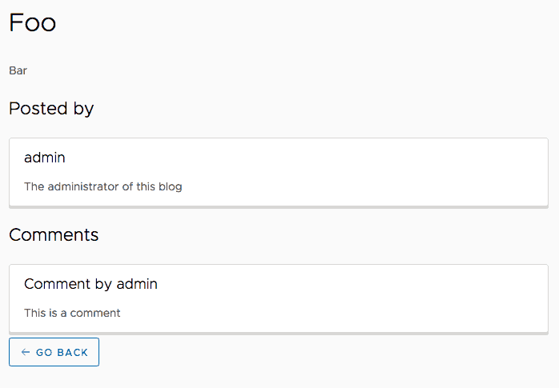

[Last time](https://wordpress.g00glen00b.be/graphql-spring-boot/), we wrote a GraphQL API using Spring boot and the graphql-java library. Today, we'll write a simple frontend application using [Angular](https://angular.io/). As mentioned in my previous article, there are few JavaScript libraries out there that we can use. Facebook, which is also behind the idea of [GraphQL](http://graphql.org/), wrote a library called [Relay](https://facebook.github.io/relay/). Additionally, the [group behind Meteor](https://www.meteor.io/) wrote their own library called [Apollo](https://www.apollographql.com/). In this example I'll be using Apollo as the GraphQL library.


### Getting started

To get started, I'll create a new Angular application using [Angular CLI](https://cli.angular.io/), using the following command:

```
ng new graphql-blog-app
```

After the project is generated, you need to install a few dependencies:

```
npm install apollo-angular apollo-angular-link-http apollo-client apollo-cache-inmemory graphql-tag graphql --save
```

Now that your project is ready, you can create your own `ApolloConfigModule` by using the following command:

```
ng g module apollo-config
```

In this module, you need to import both `ApolloModule` and `HttpLinkModule` and you have to set up Apollo by adding the following constructor:

```typescript
@NgModule({
  imports: [
    CommonModule,
    ApolloModule,
    HttpLinkModule
  ],
  declarations: []
})
export class ApolloConfigModule {

  constructor(apollo: Apollo, httpLink: HttpLink) {
    apollo.create({ link: httpLink.create({uri: 'http://localhost:4200/graphql' }), cache: new InMemoryCache() });
  }
}
```

The final step is to add `ApolloConfigModule` to the imports of your `AppModule`. Next to this module, you also have to include the `HttpClientModule`, because this module is required by the `HttpLinkModule`:

```typescript
@NgModule({
  declarations: [
    AppComponent
  ],
  imports: [
    BrowserModule,
    HttpClientModule, // Add this
    ApolloConfigModule // Add this
  ],
  providers: [],
  bootstrap: [AppComponent]
})
export class AppModule { }
```

### Writing your own queries

Last time, we wrote two queries:

1. One to obtain a list of all articles with their title and some basic information about who posted the article.
2. Another one to obtain more information about a single article, including the comments of the article.

In this tutorial, we'll be using both queries. To do this, I'll create a new TypeScript file where I can export all queries as constants:

```typescript
export const AllArticlesQuery = gql`query AllArticles {
  articles {
    id
    title
    author {
      id
      username
    }
  }
}`;

export const ArticleDetailQuery = gql`query Article($articleId: Int!) {
  article(id: $articleId) {
    id
    title
    text
    author {
      id
      username
      bio
    }
    comments {
      id
      text
      author {
        id
        username
      }
    }
  }
}`;
```

The `gql` function makes these string literals into GraphQL queries that can be used with Apollo. Make sure you don't forget to import it:

```typescript
import gql from 'graphql-tag';
```

### Making the calls

Now that we have our queries, it's time to use them to call the GraphQL API. But before we do this, I'm going to write the model interfaces for our responses. First of all we have the interfaces that match the query response themself:

```typescript
export interface AllArticlesQueryResponse {
  articles: Article[];
}

export interface ArticleDetailQueryResponse {
  article: Article;
}
```

Next to that, we also have the `Article`, `Comment` and `Profile` interfaces to implement:

```typescript
export interface Article {
  id: number;
  title: string;
  author: Profile;
  text?: string;
  comments?: Comment[];
}

export interface Profile {
  id: number;
  username: string;
  bio?: string;
}

export interface Comment {
  id: number;
  text: string;
  author: Profile;
}
```

Now that we have our model interfaces, we can actually make the call by writing our own service. So let's generate a service using Angular CLI:

```
ng g service article/article
```

In our service, inject the `Apollo` class into the constructor:

```typescript
constructor(private apollo: Apollo) { }
```

This service will contain two functions, a `findAll()` function and a `findOne()` function. The `findAll()` function is the easiest one since it doesn't require parameters:

```typescript
findAll(): Observable<AllArticlesQueryResponse> {
  return this.apollo
    .query<AllArticlesQueryResponse>({ query: AllArticlesQuery })
    .map(result => result.data);
}
```

By using the `apollo.query()` function, we can invoke GraphQL using the given query. The query in this case is `AllArticlesQuery`, which I imported from the TypeScript file I wrote earlier.

The `findOne()` function wil be similar, but will pass an additional parameter, being the `articleId`. You don't need to add the dollar sign (`$`) to the parameter name, unlike in our query:

```typescript
findOne(id: number): Observable<ArticleDetailQueryResponse> {
  return this.apollo
    .query<ArticleDetailQueryResponse>({ query: ArticleDetailQuery, variables: { articleId: id } })
    .map(result => result.data);
}
```

### Using the data

With our service complete, we can basically use it like any other service we would write. For example, I wrote an `ArticleOverviewComponent` that will show the title of each blog article in a list of cards:

```html
<h1>Blog articles</h1>
<div class="row">
  <div class="col-sm-4" *ngFor="let article of articles">
    <app-article-card [article]="article"></app-article-card>
  </div>
</div>
```

In the component we can inject the service and use the `findAll()` function in the `ngOnInit()` function:

```typescript
ngOnInit() {
  this.service.findAll().subscribe(result => this.articles = result.articles);
}
```

Similar to the article overview component, I wrote an `ArticleDetailComponent` with the following template:

```html
<h1>{{article?.title}}</h1>
<p>{{article?.text}}</p>
<h3>Posted by</h3>
<app-profile-card [profile]="article?.author"></app-profile-card>
<h3>Comments</h3>
<app-comments-card [comments]="article?.comments"></app-comments-card>
<a class="btn btn-outline" [routerLink]="['/articles']"><clr-icon shape="arrow left"></clr-icon> Go back</a>
```


Like the other component, we can retrieve the article using the service in our `ngOnInit()` function:

```typescript
ngOnInit() {
  this.route.paramMap
    .map((params: ParamMap) => params.get('id'))
    .map(articleId => parseInt(articleId, 10))
    .switchMap(articleId => this.service.findOne(articleId))
    .subscribe(response => this.article = response.article);
}
```

In this function I'm using the `ActivatedRoute` to retrieve the route parameters to obtain the ID of the given article. Then I use `switchMap()` to switch it by another observable, in this case the one from our service. Finally, I can subscribe to it to retrieve the result.



If you're intersted in the full code, you can find it on [GitHub](https://github.com/g00glen00b/blog-apollo-graphql-angular-app).
