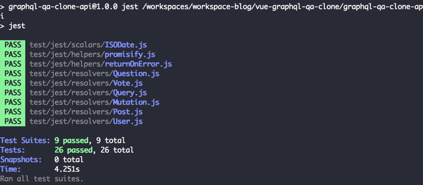

After checking out [AVA](/nodejs-ava/) and [tape](/testing-nodejs-tape/), it's time to check out [Jest](https://jestjs.io/). Jest is a testing framework developed by Facebook, and is often used to test React applications. However, it isn't limited to just React, so let's explore the features it has by testing a small Node.js application!

### Snapshot testing

One of the features that Jest introduced is a form of [characterization testing](https://en.wikipedia.org/wiki/Characterization_test), which they call [snapshot testing](https://jestjs.io/docs/en/snapshot-testing.html). Snapshot testing is really interesting when it comes to detecting regression bugs. Let's say that you take a screenshot of your rendered output once you finished developing the component. When someone makes a change, he takes a new screenshot and looks for differences between the original and the new screenshot. Either the output remains unchanged, which is good, or the output did change. In this case, it could mean two things, either you expected the difference(s), or you didn't. When you expected it, for example in the case of adding a new feature, you create a new "base" screenshot and move on. In the case of an unexpected change, it means the changes broke something, the developer should probably fix it. In this tutorial, I'll be testing a small Node.js application though, so I won't go further into detail in snapshot testing.

### Setting up the project

First of all, we have to add Jest. In my case, I used [Babel 7](https://babeljs.io/) to transpile my code, so I have to install **babel-jest**, **jest** and **babel-core**.

```
npm install --save-dev babel-jest jest 'babel-core@^7.0.0-0'
```

The reason why we have to install **babel-core** as well is due to the move of Babel to scoped packages (@babel/core). As a temporary solution to give all modules time to migrate, there is a bridge package.

After installing these dependencies, we have to make a slight modification toe the configuration of Jest. By default, it will load tests matching a certain pattern. However, I'll be using a different pattern, so that's why I added the following to my **package.json** file:

```json
{
  "name": "graphql-qa-clone-api",
  "version": "1.0.0",
  ...
  "jest": {
    "testMatch": [
      "**/test/jest/**/*.js?(x)"
    ]
  }
}
```

Next to that, we also have to define an npm script that will run our tests. I'll use the following command:

```
jest
```

Since all other configuration resides within package.json, we don't need to provide additional arguments when running Jest.

### Writing our first test

One of the smallest parts of our application is a helper that returns a default value when an error occurs. To do that, I wrote the following code:

```javascript
const returnOnError = (operation, alternative) => {
  try {
    return operation();
  } catch (e) {
    return alternative;
  }
};
```

So, to be able to test this, I'll need two tests. One test to verify that we're using the return value, and another one to verify that we're using the alternative value.

```javascript
test('returns the result if no error was thrown', () => {
  expect(returnOnError(() => 'foo', 'bar')).toEqual('foo');
});

test('returns the alternative if an error was thrown', () => {
  expect(returnOnError(() => {throw 'Foo'}, 'bar')).toEqual('bar');
});
```

As you can see, both tests are quite small. The expect API looks very similar to the one Jasmine uses. One downside is that both `test` and `expect` live on the global scope. Unlike AVA and tape, we have no imports here, except the import for our helper.

### Working with promises

Another helper I wrote is to convert a Mongoose result to a promise. A Mongoose result has an `exec()` function that requires a callback. So, I wrote the following code to either resolve or reject a promise:

```javascript
const promisify = query => new Promise((resolve, reject) => {
  query.exec((err, data) => {
    if (err) reject(err);
    else resolve(data);
  });
});
```

Now, just like before, we need two tests; one to test the resolved value and another one to test the rejected value. One issue is that we need to create a dummy Mongoose result to make this work. Luckily for us, Jest comes with a mocking/stubbing framework as part of its core.

```javascript
test('resolves promise if a result is returned', () => {
  const exec = jest.fn(cb => cb(null, 'foo'));
  return expect(promisify({exec})).resolves.toEqual('foo');
});

test('rejects promise if an error happens', () => {
  const exec = jest.fn(cb => cb('error'));
  return expect(promisify({exec})).rejects.toEqual('error');
});
```

Just like how AVA and blue-tape works, we can return the promise itself so the test runner knows when to finish the test. Additionally, the expect API of Jest has quite some functions, since we can use `expect().resolves` and `expect().rejects` to immediately write an assertion for our promise.

We can mock the `exec()` function using `jest.fn()`. Immediately, we can add some dummy behaviour. In my case, when the function is called, it will immediately invoke the callback that we passed to it, with either a result or an error.

### Testing mock arguments

The application I wrote is a small GraphQL API that contains a few resolvers to resolve certain properties. One of these resolvers will retrieve the user object for a specific vote object using its `userId` property:

```javascript
const resolvers = {
  author: vote => promisify(User.findById(vote.userId))
};

export default resolvers;
```

To be able to test this, I'll have to somehow mock the `findById()` function of the `User` module. Additionally, I want to write two expectations, to verify both the result and if the correct argument is passed to the mock. This is the test I eventually came up with:

```javascript
test('author resolver returns the author by its identifier', () => {
  const author = {_id: 'id-123'};
  const exec = jest.fn(cb => cb(null, author));
  const findUserById = UserModel.findById = jest.fn().mockReturnValue({exec});
  return Vote.author({userId: 'id-123'}).then(result => {
      expect(result).toBe(author);
      expect(findUserById).toHaveBeenLastCalledWith('id-123');
  });
});
```

As you can see, we're importing the `User` module as `UserModule`. Since Node.js loads modules only once, it passes the same `User` instance to both the test, as the actual implementation. That means that if we assign the `findById()` function to a mock function using Jest, everything should work out.

Additionally, you can see that the expect API has a matcher called `toHaveBeenLastCalledWith()` that we can use to verify that the arguments passed to it match the expected value.

### Working with wildcard matchers

Sometimes, you only want to check that certain parts of the actual value match the expected value. In those cases, you could use `**expect.objectContaining()**`:

```javascript
test('posts resolver returns a list of all user posts', () => {
  const handler = {};
  const postIds = ['id-123', 'id-234'];
  const posts = [{_id: 'id-123'}, {_id: 'id-234'}];
  const query = {offset: 0, limit: 10};
  const findPost = PostModel.find = jest.fn().mockReturnValue(handler);
  handler.skip = jest.fn().mockReturnValue(handler);
  handler.limit = jest.fn().mockReturnValue(handler);
  handler.exec = jest.fn(cb => cb(null, posts));
  return User.posts({postIds}, {query}).then(results => {
    expect(results).toBe(posts);
    expect(findPost).toHaveBeenLastCalledWith(expect.objectContaining({_id: {$in: postIds}}));
    expect(handler.skip).toHaveBeenLastCalledWith(0);
    expect(handler.limit).toHaveBeenLastCalledWith(10);
  });
});
```

In this test, we verify that `findPost` is called with an object that contains at least `{_id: {$in: ['id-123', 'id-234']}}`. That means that if it was actually called with `{_id: {$in: ['id-123', 'id-234']}, foo: 'bar'}`, it would still match. This could be useful in cases where you don't care about most of the object, except a specific part of it.

Another thing that could be useful is `**expect.anything()**`. As we've seen before, we can use `toHaveBeenLastCalledWith()` to tee if the arguments match the expected values. But what if we only care about one of 3 arguments? Well, then we could use `expect.anything()` for the other two arguments.

For example:

```javascript
test('createAnswer creates a new model', () => {
  const answer = {_id: 'id-123'};
  const input = {content: 'Content', authorId: 'id-234', questionId: 'id-345'};
  const createPost = PostModel.create = jest.fn((_, cb) => cb(null, answer));
  const updateUser = UserModel.update = jest.fn((_, __, cb) => cb(null, {_id: 'id-234'}));
  mongoose.Types.ObjectId = jest.fn().mockReturnValue('id-123');
  return Mutation.createAnswer(null, {input}).then(result => {
    expect(result).toBe(answer);
    expect(createPost).toHaveBeenLastCalledWith({
      _id: 'id-123',
      content: 'Content',
      isQuestion: false,
      authorId: 'id-234',
      questionId: 'id-345'
    }, expect.anything());
    expect(updateUser).toHaveBeenLastCalledWith({_id: 'id-234'}, expect.objectContaining({$push: {postIds: 'id-123'}}), expect.anything());
  });
});

```

In this test, we're making sure that `updateUser` is called with three arguments:

1. The first argument should be **exactly** `{_id: 'id-234'}`
2. The second argument **should contain at least** `{$push: {postIds: 'id-123'}}`
3. The third argument can be **anything**, but has to be defined

### Testing it out

To test it out, you can run the following command:

```
npm test
```

Additionally, if you want to run jest directly without having to install it globally, you can use **npx**:

```
npx jest
```



Additionally, Jest comes with support for Istanbul.js out of the box, so we can get a coverage report as well when we pass the `--coverage` flag:

```
npx jest --coverage
```


### Summarizing

Jest is a nice testing framework, and comes with a lot of features. For example, while we had to install Sinon.js with other testing frameworks to be able to mock or stub certain functions, with Jest we didn't have to. The benefits of it being integrated within the project itself is that you can use matchers, rather than having to call `myStub.lastCall.args`.

Additionally to that, it comes with a separate module for Babel-support, which made it easy to integrate. Next to stubbing and Babel-support it also comes out of the box with support for Istanbul.js, which we can use to see our testing coverage. Jest also made snapshot testing quite popular, having other testing frameworks follow them.

And if those features aren't enough, it also comes with a large amount of matchers, more than other frameworks have.

It also comes with a few downsides though. First of all, you can't run your tests in a browser. While this isn't important for this specific application (it's a Node.js application after all), it could be important when writing web applications. Some browsers have certain quirks, and the only way to know if you're affected by them, is by running tests on those browsers.

Another downside is the use of global scope. While this felt naturally in the early 2010's, by now, it feels really awkward to rely on things you haven't imported.

With that, I would like to wrap up this article. As usual, you can find the code on [GitHub](https://github.com/g00glen00b/apollo-express-vue-example), where you can find the tests I wrote for the same application, using three different testing frameworks, being AVA, tape and Jest.
