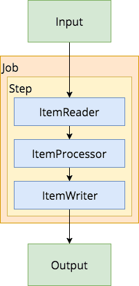

Batch processing of information is a common thing to do when developing applications. Spring has its own framework to handle batch processing, called [Spring batch](https://projects.spring.io/spring-batch/). In this tutorial, I'll use Spring batch to index markdown documents on my local disk onto Solr to make them easier to search for.


### Getting started

To create a Spring boot project with Spring batch, I'm going to use [Spring Initializr](http://start.spring.io/) like usual. In this case, I'm going to add the following dependencies:

- **Batch**: I don't think I need to explain that we're using batch as a dependency to create a batch processing application.
- **Web**: After indexing the documents, I would like to create a REST API, though this will probably be something for another tutorial.
- **Solr**: To index documents into Solr, we're going to use the Springs wrapper for SolrJ, which is a client library to use with Solr.
- **Lombok**: Lombok is a library that generates getters, setters, constructors and various other things for me. I'll use it to simplify the code in this tutorial.


### Batch appliczation structure

Spring batch contains a few key elements, such as:

- **Jobs**: The first part to configure in a Spring batch application is which jobs there are to run.
- **Steps**: Each job can contain one to as many steps you want and consists out of readers, processors, writers and/or tasklets.
- **Readers**: A reader can be used to determine the input of the batch process. This could be a CSV reader, a JDBC based reader, ... . Reading can happen in chunks, so that you don't have to open/close connections to the database the whole time.
- **Processors**: For every item found by the reader, it can be handled by a processor. It's usually used to transform the input to a certain type so that it can be used by the writer.
- **Writers**: The writer is the final part within a step, and can be used to write data back to a CSV, a database, ... .
- **Tasklets**: Sometimes, a step doesn't require a reader, processor and writer but only a tasklet. For example, when indexing data in Solr, you can use a separate step with tasklet to optimize at the end of the batch process.



### Custom configuration

But before we start configuring jobs, steps, and so on, let's start by defining the configuration properties of our application. [Last time](https://wordpress.g00glen00b.be/solr-tika-docker/), I set up Solr with Tika by providing a separate `/update/extract` endpoint. In this tutorial, I'll be using that endpoint, so I'll provide it as a configuration property. Other than that, I'm also going to define the location of my Markdown files to be indexed:

```java
@ConfigurationProperties(prefix = "reader")
@Data
public class MarkdownReaderConfigurationProperties {
    private String pathPattern;
    private String extractPath;
}
```

In this case, `pathPattern` will contain the pattern the markdown files have to match in order to be picked up by the batch process. For example `reader.path-pattern=/users/g00glen00b/documents/**/*.md` will allow me to scan the files in a specific folder.

### Configuring Spring batch

Now that we have our configuration properties, we can start configuring the batch job. This job will contain two steps:

1. **indexingStep**: This step will read all Markdown files, parse them to HTML and write them to Solr.
2. **optimizeStep**: The last step in this batch process will optimize the documents on Solr so that they can be searched more quickly.

The batch configuration for these steps looks like this:

```java
@Configuration
@EnableBatchProcessing
@EnableConfigurationProperties(MarkdownReaderConfigurationProperties.class)
public class MarkdownSolrBatchConfig {

    @Bean
    public Job indexMarkdownDocumentsJob(JobBuilderFactory jobBuilderFactory, Step indexingStep, Step optimizeStep) {
        return jobBuilderFactory.get("indexMarkdownDocuments")
            .incrementer(new RunIdIncrementer())
            .flow(indexingStep)
            .next(optimizeStep)
            .end()
            .build();
    }

    @Bean
    public Step indexingStep(StepBuilderFactory stepBuilderFactory, MarkdownFileReader reader, MarkdownFileHtmlProcessor processor, SolrHtmlWriter writer) {
        return stepBuilderFactory.get("indexingStep")
            .<Resource, HtmlRendering> chunk(10)
            .reader(reader)
            .processor(processor)
            .writer(writer)
            .build();
    }

    @Bean
    public Step optimizeStep(StepBuilderFactory stepBuilderFactory, SolrOptimizeTasklet tasklet) {
        return stepBuilderFactory.get("optimizeStep")
            .tasklet(tasklet)
            .build();
    }

}
```

What's important to notice here is the `@EnableBatchProcessing` annotation used to enable Spring batch. This is necessary to have references to the `JobBuilderFactory`, the `StepBuilderFactory`, ... . I also enabled the configuration property by adding the `@EnableConfigurationProperties` annotation.

Within the `indexingStep` you can see that the reader/processor/writer API requires you to provide a generic with the in- and output types. In this case I'm using `Resource` as the input type, and `HtmlRendering`, a custom class, as the output type.

```java
@AllArgsConstructor
@Data
public class HtmlRendering {
    private Resource resource;
    private String html;
}
```

This class will contain a refernece back to the original `Resource` and to the rendered HTML.

### Writing a multi-file reader

Spring batch has several built-in readers. Readers to read lines from a single file, from multiple files, ... . I'm going to use the `MultiResourceItemReader` with a small "hack" to be able to fully read files.

First of all, I created my own implementation of `MultiResourceItemReader`:

```java
@Component
@AllArgsConstructor
public class MarkdownFileReader extends MultiResourceItemReader<Resource> {
    private MarkdownReaderConfigurationProperties configurationProperties;

    @PostConstruct
    public void initialize() throws IOException {
        ResourcePatternResolver patternResolver = new PathMatchingResourcePatternResolver();
        Resource[] resources = patternResolver.getResources(configurationProperties.getPathPattern());
        setResources(resources);
        setDelegate(new ResourcePassthroughReader());
    }
}
```

This class will use the pattern that I defined before. This reader doesn't work on its own though, and requires a delegate item reader. This can be used to read lines from multiple CSV files for example. With a custom reader, you can also use it to pass files as a while rather than reading each line separate.

To do this, I defined the following delegate reader:

```java
public class ResourcePassthroughReader implements ResourceAwareItemReaderItemStream<Resource> {
    private Resource resource;
    private boolean read = false;

    @Override
    public void setResource(Resource resource) {
        this.resource = resource;
        this.read = false;
    }

    @Override
    public Resource read() {
        if (read) {
            return null;
        } else {
            read = true;
            return resource;
        }
    }

    @Override
    public void open(ExecutionContext executionContext) throws ItemStreamException {
    }

    @Override
    public void update(ExecutionContext executionContext) throws ItemStreamException {

    }

    @Override
    public void close() throws ItemStreamException {
    }
}
```

What's important here is that the `MultiResourceItemReader` will keep reading from the delegate reader until it returns `null`. That's why I'm storing a separate boolean field called `read` to know if I already returned a result, and if so, return `null` to prevent infinite loops.

The parent reader won't re-create the delegate for each resource though. In stead of that, it will call the `setResource()` function, so be aware to change the `read` property when that method is being called.

### Writing a processor

Solr and Tika support many formats, but as far as I know, they don't support markdown. That's why I wrote a processor to convert the markdown documents to HTML before indexing them with Solr.

To be able to parse Markdown to HTML, I'm using the [commonmark-java library](https://github.com/atlassian/commonmark-java) from Atlassian:

```xml
<dependency>
    <groupId>com.atlassian.commonmark</groupId>
    <artifactId>commonmark</artifactId>
    <version>0.11.0</version>
</dependency>
```

The implementation of the processor isn't that difficult, and will use the commonmark API:

```java
@Component
public class MarkdownFileHtmlProcessor implements ItemProcessor<Resource, HtmlRendering> {
    private Parser parser;
    private HtmlRenderer htmlRenderer;

    @PostConstruct
    public void initialize() {
        parser = Parser.builder().build();
        htmlRenderer = HtmlRenderer.builder().build();
    }

    @Override
    public HtmlRendering process(Resource markdownResource) throws IOException {
        try (InputStreamReader reader = new InputStreamReader(markdownResource.getInputStream())) {
            Node document = parser.parseReader(reader);
            return new HtmlRendering(markdownResource, htmlRenderer.render(document));
        }
    }
}
```

By passing the `Resource` to the processor, we can use the `getInputStream()` method to create a reader. By using Java 8's [try-with-resources](https://docs.oracle.com/javase/tutorial/essential/exceptions/tryResourceClose.html), it will also automatically close after reading, so we don't have to handle that.

### Writing the documents

The Solr writer is a bit more complex, and will use a `ContentStreamUpdateRequest` to upload a contentstream from a string using the `SolrClient`:

```java
@Component
@AllArgsConstructor
public class SolrHtmlWriter implements ItemWriter<HtmlRendering> {
    private static final String FILE_ID_LITERAL = "literal.file.id";
    private final Logger logger = LoggerFactory.getLogger(getClass());
    private SolrClient solrClient;
    private MarkdownReaderConfigurationProperties configurationProperties;

    @Override
    public void write(List< ? extends HtmlRendering> list) {
        list.stream().map(this::updateRequest).forEach(this::request);
    }

    private ContentStreamUpdateRequest updateRequest(HtmlRendering htmlFile) {
        try {
            ContentStreamUpdateRequest updateRequest = new ContentStreamUpdateRequest(configurationProperties.getExtractPath());
            updateRequest.addContentStream(new ContentStreamBase.StringStream(htmlFile.getHtml(), "text/html;charset=UTF-8"));
            updateRequest.setParam(FILE_ID_LITERAL, htmlFile.getResource().getFile().getAbsolutePath());
            updateRequest.setAction(AbstractUpdateRequest.ACTION.COMMIT, true, true);
            return updateRequest;
        } catch (IOException ex) {
            throw new SolrItemWriterException("Could not retrieve filename", ex);
        }
    }

    private void request(ContentStreamUpdateRequest updateRequest) {
        try {
            solrClient.request(updateRequest);
            logger.info("Updated document in Solr: {}", updateRequest.getParams().get(FILE_ID_LITERAL));
        } catch (SolrServerException | IOException ex) {
            throw new SolrItemWriterException("Could not index document", ex);
        }
    }
}
```

By creating a `StringStream`, we can pass the HTML generated by commonmark to Solr. But since we're not sending a complete file, we also have to pass the mediatype and the charset of the content. For HTML, you can use the `text/html;charset=UTF-8` content type to handle that.

To pass additional fields that should be index by Solr, you should use the `setParam()` function and prefix the fieldname with `literal.*`. I defined a property called `file.id` in Solr, so I'm using `literal.file.id` to pass the property.

### Optimizing Solr through tasklets

If you index documents, you should otpimize the Solr index afterwards to increase search speed. Since it doesn't make any sense to index the Solr document after each write action, you're better off optimizing the Solr index after all documents have been indexed.

A proper way to do this is by creating a new step and adding a tasklet to it:

```java
@Component
@AllArgsConstructor
public class SolrOptimizeTasklet implements Tasklet {
    private SolrClient solrClient;

    @Override
    public RepeatStatus execute(StepContribution stepContribution, ChunkContext chunkContext) throws Exception {
        solrClient.optimize();
        return RepeatStatus.FINISHED;
    }
}
```

### Testing it out

Now that we have our batch process completely defined, you can try it out by running the Spring boot application. By default, Spring boot will automatically run the batch job on startup, due to the default of `spring.batch.job.enabled` being set to `true`.

After everything has been indexed, you can check the [Solr dashboard](http://localhost:8983/solr/#/) and write a simple query to verify that the documents have been stored.


As you can see, the markdown files on my disk have been indexed, and can now be searched on Solr, all thanks to Spring batch. If you're interested in the code, you can find it on [GitHub](https://github.com/g00glen00b/spring-samples/tree/master/spring-boot-solr-batch).
