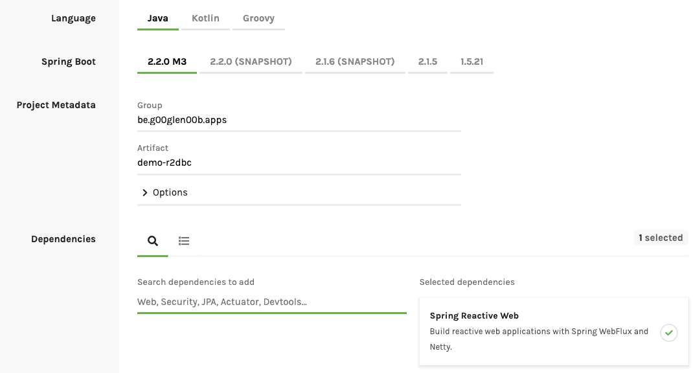

In the past, we've covered how to use [reactive programming with Project Reactor and Spring](https://blog.optis.be/reactive-programming-with-spring-boot-2-7a11b953c8a). Around that time, I mentioned that the support for databases was limited due to the amount of blocking JDBC drivers.

However, some relational databases do support reactive connectivity, and with [R2DBC](https://r2dbc.io/), we can easily use those within our projects.

### Setting up project

To get started, you can create a new Spring project using [Spring Initializr](https://start.spring.io/). The only dependency we have to add for now is **Spring Reactive Web** (aka WebFlux).

I'm also going to use Lombok in this example, but that's completely optional.

Before you create your project, make sure that you're using **Spring boot 2.2.x** or higher. The Spring Data project for R2DBC relies on **Spring framework 5.2.x**, which is available within Spring boot 2.2.x and higher.



Now, after generating the project, we do have to add a few dependencies on our own.

First of all, since these are experimental features, we have to make sure that we included the Spring milestone repository:

```xml
<repositories>
    <repository>
        <id>spring-milestone</id>
        <url>https://repo.spring.io/milestone</url>
    </repository>
</repositories>
```

Additionally, if you don't want any version conflict between the dependencies that are necessary to work with R2DBC, I suggest using their BOM (Bill of Materials):

```xml
<dependencyManagement>
	<dependencies>
		<dependency>
			<groupId>org.springframework.boot.experimental</groupId>
			<artifactId>spring-boot-bom-r2dbc</artifactId>
			<version>0.1.0.M2</version>
			<type>pom</type>
			<scope>import</scope>
		</dependency>
	</dependencies>
</dependencyManagement>
```

The next step is to add the **Spring boot starter** for Spring Data R2DBC:

```xml
<dependency>
    <groupId>org.springframework.boot.experimental</groupId>
    <artifactId>spring-boot-starter-data-r2dbc</artifactId>
</dependency>
```

Now that we have a starter, it's time to choose a proper **R2DBC driver**, just like you're used to choose a proper JDBC driver. For now, there are drivers for PostgreSQL, H2, Microsoft SQL Server and Google Cloud Spanner.

In this example, I'll use PostgreSQL:

```xml
<dependency>
    <groupId>io.r2dbc</groupId>
    <artifactId>r2dbc-postgresql</artifactId>
    <scope>runtime</scope>
</dependency>
```

### Creating a repository

Now that we've set up our project, we can create our entity class. Be aware that even though we can connect to relational databases reactively, there's no such thing as JPA for R2DBC, which means that you can't use features like `@OneToMany` and such within your entities:

```java
@Data
@NoArgsConstructor
@AllArgsConstructor
public class Person {
    @Id
    private Long id;
    private String firstname;
    private String lastname;
}
```

As you can see, I wrote a very simple `Person` class with a unique identifier and a few fields. To mark a field as a unique identifier, we can use the [`@Id` annotation](https://docs.spring.io/spring-data/commons/docs/current/api/org/springframework/data/annotation/Id.html).

Now that you have your entity, you can create a proper Spring Data repository like this:

```java
public interface PersonRepository extends ReactiveCrudRepository<Person, Long> {
}
```

### Configuring the `DatabaseClient`

What happens behind the screens is that a `ConnectionFactory` and a `DatabaseClient` bean are set up for you.

To set up these beans, you do have to provide a few properties though, containing the R2DBC connection URL (similar to a JDBC connection URL) and the username and password. For example:

```
spring.r2dbc.url=r2dbc:postgresql://localhost/data
spring.r2dbc.username=dbuser
spring.r2dbc.password=dbpass
```

### Using the `DatabaseClient` directly

One thing you can do, even without the repositories, is to use the `DatabaseClient` directly. For example, if we want to set up our schema, we could create a `schema.sql` file like this:

```sql
CREATE TABLE IF NOT EXISTS person (
    id SERIAL PRIMARY KEY,
    firstname VARCHAR(100),
    lastname VARCHAR(100)
);
```

After that, you can create a method that returns a `Mono<String>` to read the `schema.sql` file:

```java
private Mono<String> getSchema() throws URISyntaxException {
    Path path = Paths.get(ClassLoader.getSystemResource("schema.sql").toURI());
    return Flux
        .using(() -> Files.lines(path), Flux::fromStream, BaseStream::close)
        .reduce((line1, line2) -> line1 + "\n" + line2);
}
```

This method uses the same approach as mentioned by [Simon Baslé](https://simonbasle.github.io/2017/10/file-reading-in-reactor/) to read the lines of a file.

After that, we can create an `ApplicationRunner` to execute our script:

```java
@Bean
public ApplicationRunner seeder(DatabaseClient client) {
    return args -> getSchema()
        .flatMap(sql -> executeSql(client, sql))
        .subscribe(count -> log.info("Schema created"));
}
```

In this example, `executeSql()` uses the `DatabaseClient` API to execute the SQL string. You don't have to use a separate method, but I prefer having a method name that describes what I'm going to do:

```java
private Mono<Integer> executeSql(DatabaseClient client, String sql) {
    return client.execute(sql).fetch().rowsUpdated();
}
```

### Using your repository

Using your repository is identical to what we've done before with reactive repositories, we can use them either within a controller or a WebFlux route. For example:

```java
@RestController
@RequestMapping("/api/person")
@RequiredArgsConstructor
public class PersonController {
    private final PersonRepository repository;

    @GetMapping
    public Flux<Person> findAll() {
        return repository.findAll();
    }
}
```

If you insert some records within your database, and you run your application, you can access your data reactively if you visit `http://localhost:8080/api/person`.

### Conclusion

With Spring and R2DBC, we're now able to reactively connect to our relational databases. While this is a great improvement towards the reactive ecosystem, the features we've used now are still experimental, and up to change.

However, if you want to experiment with these features, you can use this example and the [reference guide](https://docs.spring.io/spring-data/r2dbc/docs/1.0.x/reference/html/#reference) to help you. As usual, you can find the code used in this example on [GitHub](https://github.com/g00glen00b/spring-samples/tree/master/spring-boot-r2dbc), so feel free to check that out as well.
