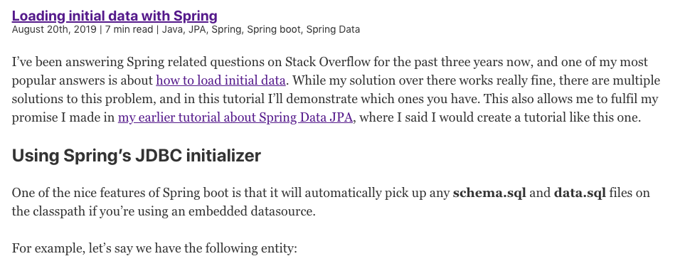

In [my latest tutorial](/using-gatsby-with-wordpress-as-a-headless-cms/), I've explored the possibilities with Gatsby and WordPress. While we built a proper index-page, our WordPress-powered Gatsby blog is far from done.

In this tutorial, I'll pick up where we left off and start with creating detail-pages.

### Using the Node API

Last time, I used the `<Link>` component to add a link for each blogpost to its detail page. However, clicking it right now points us to a 404 page, since we haven't told Gatsby yet that we want to serve a page there.

To add pages during build-time, we have to use the **gatsby-node.js** API. Within this file, we can export certain hooks, and one of them is the `createPages` function.

This function passes two arguments, a `graphql` parameter to execute GraphQL queries, and the other is an `actions` object, which contains a function to create new pages.

Since we need both these parameters, we can initialize our code like this:

```javascript
exports.createPages = ({graphql, actions}) => {
  const {createPage} = actions;
};
```

The next step is to find out which query we want to execute. In this case, I want to create a detail-page for every blog post, so I need to use a query like last time, to fetch `allWordpressPost`. This time, I won't have to add a limit though:

```javascript
const allPostsQuery = `{
  allWordpressPost {
    edges {
      node {
        id
        slug
      }
    }
  }
}`;
```

I also don't need all the details of a post, only:

- The **slug**, so I can tell Gatsby which page to generate.
- And the **id**, which we can use to retrieve the post when we load the page.

### Creating detail pages

Now that we have our query, we can execute it using the `graphql` parameter. When executing, this returns a promise, which we have to return within the `createPages` hook:

```javascript
exports.createPages = ({graphql, actions}) => {
  const {createPage} = actions;
  return graphql(allPostsQuery).then(({errors, data}) => {
    if (errors) return Promise.reject(errors);
  });
};
```

Using the data, we can call the `createPage` function for every post like this:

```javascript
return data.allWordpressPost.edges.map(({node}) => createPage({
  path: node.slug,
  component: path.resolve('./src/templates/post.js'),
  context: {id: node.id}
});
```

As you can see, the `createPage` function requires a parameter containing three fields:

- The **path** to serve the page.
- Additionally, we have to provide which **component** we should use to render the page.
- Optionally, we can also pass parameters as the **context** of the page.

The component should contain an absolute path to the component that we want to use. To do this, we use `path.resolve()` which we can only use if we properly import it:

```javascript
const path = require('path');
```

### Creating a page component

While we've set up Gatsby to create new pages for every WordPress post, we're not ready yet. The next step is to implement the **src/templates/post.js** page component.

For the structure of this component, we can look at **src/pages/index.js** and copy the same structure over:

```jsx
const PostPage = () => (
  <Layout>
    <SEO title="Home"/>
  </Layout>
);

export default PostPage;
```

Now, like before, we have to execute a GraphQL query to retrieve the data. However, we can't use the `useStaticQuery` hook, since our query will be parameterized.

An alternative method to execute a GraphQL query is to export it:

```javascript
export const query = graphql`
  query ($id: String!) {
    wordpressPost(id: {eq: $id}) {
      date(formatString: "MMMM Do, YYYY")
      title
      content
      slug
      tags {
        name
      }
    }
  }
`;
```

The nice part about Gatsby is that it automatically recognizes that your GraphQL query uses variables (`$id`), and will automatically pass context parameters as variables.

Additionally, we can retrieve the data in our component like this:

```jsx
const Post = ({data}) => {
  return (
    <Layout>
      <SEO title={data.wordpressPost.title}/>
      <PostTitle
        title={data.wordpressPost.title}
        slug={data.wordpressPost.slug}
        tags={data.wordpressPost.tags}
        date={data.wordpressPost.date}/>
      <div dangerouslySetInnerHTML={{__html: data.wordpressPost.content}}/>
    </Layout>
  );
};
```

In this example, we're using the `PostTitle` component from last time. Additionally, we're using `dangerouslySetInnerHTML` to add the content of the post. This is necessary because our WordPress content contains HTML tags we want to render.

To take effect, we have to re-run the Gatsby application. This will create the new pages, and now you should be able to view them in action.



With that, we've created our first example of custom pages with Gatsby. Next time we'll explore how we can achieve pagination. If you're interested in the code, you can check out [the source of my blog on GitHub](https://github.com/g00glen00b/gatsby-blog).
