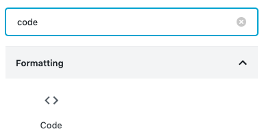

If you're looking for syntax highlighting with Gatsby, chances are you've encountered an example using Prism.js. Sadly, the plugins that are available to do syntax highlighting, only work for Markdown, and not for WordPress.

In this tutorial I'll explore the options we have to get syntax highlighting to work with WordPress.


### Installing dependencies

As you may know, loading WordPress content with Gatsby is nothing more than using `dangerouslySetInnerHtml={{__html=content}}`. That means that if we can add the syntax highlighting to the content itself, we're ready to go.

One solution to this problem is to use an HTML to React parser, such as [`html-react-parser`](https://www.npmjs.com/package/html-react-parser).

If we're going to parse the HTML to React components, we need a component to do the syntax highlighting. While there are a few libraries that do syntax highlighting, we'll use [`react-syntax-highlighter`](https://www.npmjs.com/package/react-syntax-highlighter). This plugin appears to offer the most complete solution.

```
npm install --save html-react-parser react-syntax-highlighter
```

### Creating a wrapper component

To use the syntax highlighter, I'll create a `<PostCode/>` component. This component will wrap the syntax highlighter and pass the language and children (the actual code).

Additionally, we can use it to import the syntax highlighting theme:

```jsx
import React from 'react';
import {Prism as SyntaxHighlighter} from 'react-syntax-highlighter';
import {ghcolors} from 'react-syntax-highlighter/dist/esm/styles/prism';

export const PostCode = ({language, children}) => (
  <SyntaxHighlighter
    style={ghcolors}
    language={language}>
    {children}
  </SyntaxHighlighter>
);
```

In this component, I'm using [Prism.js](https://prismjs.com/), since Prism appears to support more languages than highlight.js. If you're interested in using [highlight.js](https://highlightjs.org/) instead, you can use the following component:

```jsx
import React from 'react';
import {SyntaxHighlighter} from 'react-syntax-highlighter';
import {github} from 'react-syntax-highlighter/dist/esm/styles/hljs';

export const PostCode = ({language, children}) => (
  <SyntaxHighlighter
    style={github}
    language={language}>
    {children}
  </SyntaxHighlighter>
);
```

The nice part is that it works very similar. The only differences are that we pick a different `style` property, and that we have to import `SyntaxHighlighter` from a different location.

### Using the React parser

The next step we have to make is to replace all `<pre/>` elements within the content with the new `<PostCode/>` component. Originally, we used the following code to inject the content into our Gatsby page template:

```jsx
<div dangerouslySetInnerHtml={{__html: content}}/>
```

To use react-html-parser, we can replace it with:

```jsx
<div>{parse(content, {replace: replaceCode})}</div>
```

However, to make this work, you have to add the following imports:

```javascript
import parse, {domToReact} from 'html-react-parser';
```

The final step is to define the `replaceCode()` function. Within this function, we'll return the `<PostCode/>` component if the name of the node matches `<pre/>`:

```javascript
const replaceCode = node => {
  if (node.name === 'pre') {
    return node.children.length > 0 && <PostCode language={getLanguage(node)}>{domToReact(getCode(node))}</PostCode>;
  }
};
```

To pass the language, I have to retrieve it from the original markup somehow. On my WordPress site, I used to define the language as a class name, which the syntax highlighter would pick up.

That means that we can obtain the language from the attributes:

```javascript
const getLanguage = node => {
  if (node.attribs.class != null) {
    return node.attribs.class;
  }
  return null;
};
```

If you used hightlight.js with the `lang:` prefix, this is where you would filter out this prefix.

Additionally, we have to retrieve the actual code from the markup as well. On my blog, I wrapped all code within a `<code/>` element as well. That means we have to unwrap the code before we send it to the `<PostCode/>` component:

```javascript
const getCode = node => {
  if (node.children.length > 0 && node.children[0].name === 'code') {
    return node.children[0].children;
  } else {
    return node.children;
  }
};
```

### Using the Gutenberg editor

When writing new blogposts using the Gutenberg editor on WordPress, you can select which language you want to use by adding a proper class to a code block.

To do this, first add a code block to your post:



After adding the code you want to your blog post, you have to select the code block and open the **Advanced** section at the right-side panel of your blog.

Within this section, you can find the "Additional CSS Class" field, in which you can add the language you prefer. You can find a list of supported languages when using react-syntax-highlighter with Prism.js [here](https://github.com/conorhastings/react-syntax-highlighter/blob/HEAD/AVAILABLE_LANGUAGES_PRISM.MD).


Now we should be able to run the Gatsby application and look at the syntax highlighted code.


With that, we implemented syntax highlighting with WordPress and Gatsby. If you're interested in a full example, you can check out the source code of this blog on [GitHub](https://github.com/g00glen00b/gatsby-blog).
