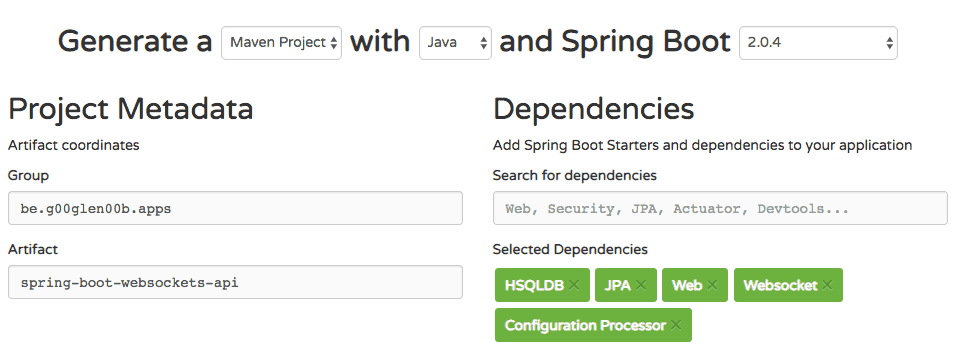

A few years ago, I wrote [an article about using WebSockets with Spring and AngularJS](/spring-websockets/). However, the technologies have evolved over the years. That's why I decided to write some up-to-date follow-up articles using the latest version of Spring boot and the latest version of the Angular framework. In this first follow-up article, I'm going to focus on the backend implementation.

### Why WebSockets

Traditionally, people used techniques such as polling and long-polling to have the "feeling" of having two-way communication between the back- and frontend. However, since the introduction of WebSockets, we can actually have full-duplex communication between both sides, and even between clients.

WebSockets are good in situations where communication happens in both ways. When people think about that, they usually think about chat applications or games or other real-time applications, but pretty much any application can benefit from it. Let's say you have a simple CRUD application and a user adds a new item, if you want to make this item appear on everyone their screen, you can use WebSockets to do so.

### Getting started

In this tutorial, I'll create a simplified Reddit clone application, where people can create new posts and comments. To set up the backend, I'll use [Spring Initializr](https://start.spring.io/), and add the following dependencies to the project:

- **JPA** and **HSQLDB** for persisting our data.
- **Web** and **Websocket** for our WebSocket based API.
- **Configuration processor** as I'll be using some configuration properties and I like the additional intellisense offered by it.
- **Lombok** because I'm even too lazy to generate getters and setters.



Once the project is downloaded and opened in your favourite IDE? we can start coding!

### Websocket configuration

Before you can get a WebSocket project started, you need to add an additional configuration class. Within this configuration class we need to provide the WebSocket endpoint and a few prefixes. I prefer putting these endpoints and prefixes in a separate configuration properties class. That's why I wrote something like this:

```java
@Data
@ConfigurationProperties("app.websocket")
public class WebSocketProperties {
    /**
     * Prefix used for WebSocket destination mappings
     */
    private String applicationPrefix = "/topic";
    /**
     * Prefix used by topics
     */
    private String topicPrefix = "/topic";
    /**
     * Endpoint that can be used to connect to
     */
    private String endpoint = "/live";
    /**
     * Allowed origins
     */
    private String[] allowedOrigins = new String[0];
}
```

This configuration properties class includes the broker prefix, the topic prefix, the endpoint that our WebSocket API will be available on, and the allowed origins. For most properties I configured a default, I prefer using the same prefix for both the broker and the topic prefix, but that's probably because I don't see a good reason to have a separate prefix. The only field that has no default is the `allowedOrigins` field. This property configures the CORS headers since web browsers connect to WebSockets by basically upgrading a HTTP request, and thus it falls under the same rules (and hence CORS also applies). Since this property depends on what host/port your frontend is running on, I decided to not set a default. For development purposes you could just use a wildcard though:

```
app.websocket.allowed-origins[0]=*
```

Now, for the actual configuration I'm going to create a new class called `WebSocketConfiguration` and make it implement the `WebSocketMessageBrokerConfigurer` interface:

```java
@Configuration
@ConfigurationProperties
@EnableWebSocketMessageBroker
@EnableConfigurationProperties(WebSocketProperties.class)
@AllArgsConstructor
public class WebSocketConfiguration implements WebSocketMessageBrokerConfigurer {
    private WebSocketProperties properties;

    @Override
    public void configureMessageBroker(MessageBrokerRegistry registry) {
        registry.enableSimpleBroker(properties.getTopicPrefix());
        registry.setApplicationDestinationPrefixes(properties.getApplicationPrefix());
    }

    @Override
    public void registerStompEndpoints(StompEndpointRegistry registry) {
        registry.addEndpoint(properties.getEndpoint()).setAllowedOrigins(properties.getAllowedOrigins()).withSockJS();
    }
}
```

As you can see, I'm using the properties I defined earlier to "feed" this configuration class. Important is that you enable the properties by using the `@EnableConfigurationProperties` annotation as seen in the code above.

### Defining a controller

As the title already suggests, handling WebSocket requests happens in a similar way to normal HTTP requests, using controllers and mappings. However, this time we won't be using `@RequestMapping`, but `@SubscribeMapping` and `@MessageMapping` depending on the use case.

One of the first annotations we'll explore is the `@SubscribeMapping` annotation. STOMP is a layer above SockJS that allows users to send messages to certain topics and subscribe to topics to retrieve messages posted to these topics.

When you use the `@SubscribeMapping` annotation, and a user subscribes to the given topic, Spring will automatically send a message containing the given return value. In my application, this could be useful when retrieving data. For example, in the case of the Reddit-clone, let's say we subscribe to `/topic/posts/get`, we could automatically send a list with all posts back. The user subscribing to that topic will then obtain these posts, and could then unsubscribe.

To do this with Spring, we need to define a new controller using the `@Controller` annotation, for example:

```java
@Controller
@AllArgsConstructor
public class PostController {
    private final Logger logger = LoggerFactory.getLogger(getClass());
    private PostService service;

    @SubscribeMapping("/posts/get")
    public List<PostListingDTO> findAll() {
        return service.findAll();
    }
}
```

Now, when a user connects to `ws://localhost:8080/live` and subscribes to `/topic/posts/get`, he will get a message containing all posts.

### Working with parameters

Next to retrieving a list of all posts, I also want to be able to obtain the details about a single post. For example, by subscribing to `/topic/posts/1/get` a user should get all details about a post with ID 1. Within Spring MVC we can already do this in several ways, either by using path variables, request parameters, headers, ... . With WebSockets on the other hand, we use the `@DestinationVariable` annotation:

```java
@SubscribeMapping("/posts/{id}/get")
public PostInfoDTO findOne(@DestinationVariable Long id) {
    return service.findOne(id);
}
```

### Working with messages

Sometimes, you don't want to react to people subscribing to a topic, but to people sending messages to certain topics. In that case, you no longer want to use `@SubscribeMapping`, but use `@MessageMapping` in stead. This could be useful when we're trying to create a new post, or a new comment:

```java
@MessageMapping("/posts/create")
public void save(PostInputDTO post) {
    service.save(post);
}
```

In this case, when a user sends a message to the `/topic/posts/create` topic, the object will be passed as a parameter to the method, and can then be used for further processing.

### Sending a message back

If you want to send back a message as well, you can use the `@SendTo` annotation, for example:

```java
@MessageMapping("/posts/create")
@SendTo("/topic/posts/created")
public PostListingDTO save(PostInputDTO post) {
    return service.save(post);
}
```

In this case, when a message is posted to `/topic/posts/create`, we save the object, and send the saved result to the `/topic/posts/created` topic. However, be aware that this will send the message to all people subscribing to given topic. If you only want to send a message back to the person who sent a message in first place, you can use the `@SendToUser` annotation. Be aware though, to be able to subscribe to such a topic, you need to prepend `/user` to the topic.

For example, if you would use `@SendToUser("/topic/foo")`, a user would have to subscribe to `/user/topic/foo` in order to be able to see the message.

### Exception handling

Just like regular Spring MVC, we can handle exceptions as well. However, rather than using the `@ExceptionHandler` annotation, we now have to use the `@MessageExceptionHandler` annotation. For example:

```java
@MessageExceptionHandler
@SendToUser("/topic/error")
public String handleException(PostNotFoundException ex) {
    logger.debug("Post not found", ex);
    return "The requested post was not found";
}
```

In this case, we're sending a message to the `/user/topic/error` topic when a user caused an exception (within any of the other mappings). Sadly, I wasn't able to make this work through a `@ControllerAdvice` even though it should work according to the documentation I read.

### Conclusion

Using WebSockets with Spring is very similar to using plain Spring Web MVC, you use controllers, mappings and exception handlers. The logic behind it (the services) are very similar as well, you can obtain/send objects. That's why I decided not to add the logic of the services to this tutorial, but as usual, you can find it on [GitHub](https://github.com/g00glen00b/spring-boot-angular-websockets/tree/master/spring-boot-websockets-api).
