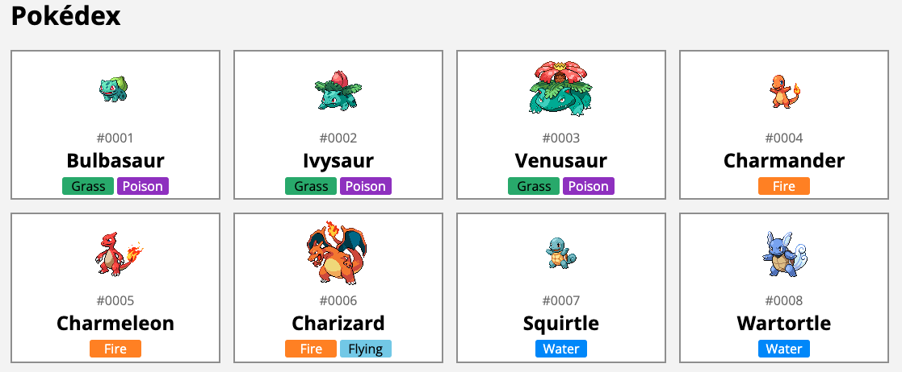

## What is Astro

Astro is a **Server-Side Rendering** (SSR) and **Static-Site Generator** (SSG) framework, trying to aim to offer the same development experience as client-side rendering libraries.

It has its own component-framework that takes inspiration from Markdown and JSX.
Even if you don't like its component-framework, you can integrate it with components from other frameworks such as Lit, React, Vue, ... .

One of the major differences between Astro and its competitors is that it comes with **no client-side JavaScript** by default.
This means that the output generated by Astro is very lightweight, consumes little bandwidth and has a good performance.

Other frameworks on the other hand usually rely on a process called **hydration**, which turns a rendered page back into a client-side application.
This allows you to build more interactive webpages, but comes at the cost of performance, since hydration is an expensive process.

Astro does support **partial hydration**, something they call "Astro Islands".
To enable this, you need to add an attribute to your component (`client:load`).

In this tutorial I will create a new Astro project and use the PokéAPI to create a working Pokédex.



## Creating a new project

To create a new project, we can use the following command:

```
npm create astro@latest
```

This will start a wizard, and ask you where you want to create the new project, whether you want to use TypeScript and so on.

Once done, you can run development mode of your project with:

```
npm run dev
```

This will launch your application at `http://localhost:3000`.

## Creating a dynamic page

With Astro, all Markdown, MDX and Astro components under the **src/pages** folder will be rendered as individual pages.
The naming of the file and the folder structure will remain the same.

For example, **src/pages/index.astro** will be available as the root index-page. 
**src/pages/about.md** on the other hand will be accessible through `/about/`.

For this tutorial, I will create a Pokédex with a paginated overview of all Pokémon.
For example, on page 1 you'll see the first 10 Pokémon, on page 2 the next 10 and so on.

To create these dynamic pages, we use square brackets in the name of the file.
For example, if we create a file called **src/pages/page/\[page\].astro**, then the pages will be available as `/page/1`, `/page/2`, ... .

To access the `[page]` parameter, we write the following code:

```typescript jsx
---
const {page} = Astro.params;
---
<h1>{page}</h1>
```

As you can see, Astro relies on a specific markup style where the JavaScript or TypeScript code is separated from the markup by using a Markdown divider (`---`).
The syntax of the markup is similar to JSX, but it has a few differences (I'll demonstrate a few of them later).

## Defining `getStaticPaths()`

If you open `http://localhost:3000/page/1`, you'll see an error message:


The reason why this approach won't work is because by default, Astro is running in **Static Site Generation** (SSG) mode.
This means that Astro must be able to figure out which pages there are.
To tell Astro which pages you want to generate, you export a `getStaticPaths()` function in your page component.

For example:

```typescript jsx
---
export function getStaticPaths() {
  return [
    {params: {page: 1}},
    {params: {page: 2}},
  ];
}
---
<h1>{page}</h1>
```

If you check the same page now, you'll see that it works.

## Calling an API within `getStaticPaths()`

Within the `getStaticPaths()` method you can call any logic you want.
You can call Node's `fs` API to retrieve the paths from a file, you can use the [Fetch API](https://developer.mozilla.org/en-US/docs/Web/API/Fetch_API), ... .

In this example, I'm going to use the [GraphQL API of PokéAPI](https://pokeapi.co/docs/graphql).
The reason why I'm going to use the GraphQL API over the REST API is because it requires us to make less calls to the API.
This is necessary if we don't want to overrun the API with requests once we build our application.

To determine the amount of pages we want to render, we need to retrieve the total amount of pokémon species.
This can be done by using the `pokemon_v2_pokemonspecies_aggregate` GraphQL endpoint:

```graphql
query {
  pokemon_v2_pokemonspecies_aggregate {
    aggregate {
      count
    }
  }
}
```

This will return a JSON containing the total amount of pokémon species.

Before we can call this API in `getStaticPaths()`, I'm going to write a few TypeScript interfaces that match the API responses.
To do so, create a file called **src/models/Pokemon.ts** and add the following interfaces:

```typescript
export interface DataWrapper<T> {
  data: T;
}

export interface PokemonSpecie {
  id?: number;
  pokemon_v2_pokemonspeciesnames?: [PokemonSpeciesNameLocale];
  pokemon_v2_pokemons?: [Pokemon];
}

export interface PokemonSpecie {
  id?: number;
  pokemon_v2_pokemonspeciesnames?: [PokemonSpeciesNameLocale];
  pokemon_v2_pokemons?: [Pokemon];
}

export interface PokemonSpeciesNameLocale {
  name?: string;
}

export interface Pokemon {
  id?: number;
  pokemon_v2_pokemontypes?: PokemonTypeWrapper[];
  pokemon_v2_pokemonforms?: PokemonForm[];
  pokemon_v2_pokemonstats?: PokemonStatValue[];
}

export interface PokemonTypeWrapper {
  pokemon_v2_type?: PokemonType;
}

export interface PokemonType {
  name?: string;
  pokemon_v2_typenames?: PokemonTypeLocale[];
}

export interface PokemonTypeLocale {
  name?: string;
}

export interface PokemonForm {
  name?: string;
  pokemon_v2_pokemonformnames?: PokemonFormLocale[];
}

export interface PokemonFormLocale {
  name?: string;
}

export interface PokemonStatValue {
  base_stat?: number;
  pokemon_v2_stat?: PokemonStat;
}

export interface PokemonStat {
  name?: string;
  pokemon_v2_statnames?: PokemonStatLocale[];
}

export interface PokemonStatLocale {
  name?: string;
}

export interface PokemonSpecieAggregate {
  aggregate: Aggregate;
}

export interface Aggregate {
  count?: number;
}

export interface PokemonSpecieQueryResult {
  pokemon_v2_pokemonspecies?: PokemonSpecie[];
  pokemon_v2_pokemonspecies_aggregate?: PokemonSpecieAggregate;
}
```

After that, we can execute the query from before in our `getStaticPaths()` method:

```typescript
export async function getStaticPaths() {
  const response = await fetch('https://beta.pokeapi.co/graphql/v1beta', {
    method: 'POST',
    headers: {'Content-Type': 'application/json'},
    body: JSON.stringify({
      query: `
        query {
          pokemon_v2_pokemonspecies_aggregate {
            aggregate {
              count
            }
          }
        }
      `
    })
  });
  const result: DataWrapper<PokemonSpecieQueryResult> = await response.json();
  // TODO: implement
}
```

**Be aware**, we're using [async/await](https://developer.mozilla.org/en-US/docs/Web/JavaScript/Reference/Statements/async_function) in our code so we have to add the `async` keyword to our `getStaticPaths()` function.

After that, we need to retrieve the `count` from `result`, divide it by the number of elements per page, and create the same array structure as we used before.
To implement this, we can use the `Array.from({length: ..})` function to create an array with a given length:

```typescript
// ...
const count = result.data.pokemon_v2_pokemonspecies_aggregate!.aggregate.count!;
const itemsPerPage = 24;
const totalPages = Math.ceil(count / itemsPerPage);
return Array
  .from({length: totalPages}, (_, index) => index + 1)
  .map(page => ({params: {page}, props: {totalPages, itemsPerPage}}));
```

One thing we added in comparison to last time is that next to the `params` we're also passing some `props` (`totalPages` and `itemsPerPage`).
This allows us to retrieve this information again in our component itself.

If you open `http://localhost:3000/page/1` now, the page should work.

## Retrieving the pokémon info in our component

The next step is to retrieve the right amount of data for each page we want to load.
To do this, we can use the GraphQL API to retrieve X-amount of pokémon species:

```graphql
query {
  pokemon_v2_pokemonspecies(order_by: {id: asc}, offset: 0, limit: 24) {
    id
    pokemon_v2_pokemonspeciesnames(where: {language_id: {_eq: 9}}) {
      name
    }
    pokemon_v2_pokemons {
      pokemon_v2_pokemontypes {
        pokemon_v2_type {
          name
          pokemon_v2_typenames(where: {language_id: {_eq: 9}}) {
            name
          }
        }
      }
    }
  }
}
```

This API call will retrieve the name and the types of the first 24 pokémon.
Important to know is that we're using a filter by `language_id` so that we only retrieve the English names.

Before we can execute this code in our component, we have to calculate the offset and the limit.
To do this, we can use the `totalPages` and `itemsPerPage` props we defined earlier:

```typescript
const {page} = Astro.params;
const {totalPages, itemsPerPage} = Astro.props;
const pageNumber = parseInt(page || '1');
const offset = (pageNumber - 1) * itemsPerPage;
```

Now we can implement the same kind of `fetch()` query as before:

```typescript
const response = await fetch('https://beta.pokeapi.co/graphql/v1beta', {
  method: 'POST',
  headers: {'Content-Type': 'application/json'},
  body: JSON.stringify({
    query: `
      query {
        pokemon_v2_pokemonspecies(order_by: {id: asc}, offset: ${offset}, limit: ${itemsPerPage}) {
          id
          pokemon_v2_pokemonspeciesnames(where: {language_id: {_eq: 9}}) {
            name
          }
          pokemon_v2_pokemons {
            pokemon_v2_pokemontypes {
              pokemon_v2_type {
                name
                pokemon_v2_typenames(where: {language_id: {_eq: 9}}) {
                  name
                }
              }
            }
          }
        }
      }
    `
  })
});
const result: DataWrapper<PokemonSpecieQueryResult> = await response.json();
const species = result.data.pokemon_v2_pokemonspecies!;
```

## Using a layout component

The final step is to render the pokémon themselves.
To do so, we can change the markup of the component to this:

```jsx
<h1>Pokédex</h1>
{species.map(specie => <p>{specie.pokemon_v2_pokemonspciesnames[0].name}</p>)}
```

If you open `http://localhost:3000/page/1` now, you'll see a list like this:


These weird symbols are caused by the page not being rendered in UTF-8.
To change this, we could add the following meta-tag:

```html
<meta charset="utf-8" />
```

Adding this to each page individually would be annoying, so in stead of that, we can encapsulate this in a separate component.
To do so, create a file called **src/layouts/BaseLayout.astro**.
Within this file, add the following content:

```jsx
---
---
<html lang="en">
<head>
  <meta charset="utf-8">
  <meta name="viewport" content="width=device-width, initial-scale=1">
  <link rel="preconnect" href="https://fonts.googleapis.com">
  <link rel="preconnect" href="https://fonts.gstatic.com" crossorigin>
  <link href="https://fonts.googleapis.com/css2?family=Open+Sans:wght@300;400;500;600;700&display=swap" rel="stylesheet">
</head>
<body>
  <slot />
  <style>
    body {
      background: #F5F5F5;
      font-family: 'Open Sans', sans-serif;
      padding: 2em;
    }
  </style>
</body>
</html>
```

By using the `<slot />` element, we tell Astro that we want to embed the content in here.

Now we can change **src/pages/page/\[page\].astro** to:

```typescript jsx
---
import BaseLayout from "../../layouts/BaseLayout.astro";
// ...
---
<BaseLayout>
  <h1>Pokédex</h1>
  {species.map(specie => <p>{specie.pokemon_v2_pokemonspciesnames[0].name}</p>)}
</BaseLayout>
```

other than applying the right character encoding, we now also have some shared styling.

## Creating custom components

One of the first things I want to change is to create a custom pagination component.
To do so, create a file called **src/components/Pagination.astro**.
This component will get two props: `currentPage` and `totalPages`:

```typescript jsx
---
const {currentPage, totalPages} = Astro.props;
---
```

In our pagination component, we only want to show the correct buttons. 
So on page 1, it doesn't make sense to show a button to go to the previous page and so on.

To make this easier to implement, I created two variables called `isFirst` and `isLast`:

```typescript
const {pageNumber, totalPages} = Astro.props;
const isFirst = pageNumber == 1;
const isLast = pageNumber == totalPages;
```

With that, we can now create our markup:

```typescript jsx
<section class="pagination">
  {isFirst ? <span></span> : <a href="/page/1">&larr; First</a>}
  {isFirst ? <span></span> : <a href={`/page/${pageNumber - 1}`}>&larr; Previous</a>}
  <span>Page {pageNumber} of {totalPages}</span>
  {isLast ? <span></span> : <a href={`/page/${pageNumber + 1}`}>Next &rarr;</a>}
  {isLast ? <span></span> : <a href={`/page/${totalPages}`}>Last &rarr;</a>}
</section>
```

## Scoped styles

To conditionally show the navigation buttons I'm using the ternary operator.
The reason why I'm showing an empty `<span>` element is because I want to style this using [flexbox with `space-between`](https://developer.mozilla.org/en-US/docs/Learn/CSS/CSS_layout/Flexbox#horizontal_and_vertical_alignment) to evenly spread the buttons on our page.

The CSS code I'm using for that is:

```typescript jsx
<section class="pagination">
  {isFirst ? <span></span> : <a href="/page/1">&larr; First</a>}
  {isFirst ? <span></span> : <a href={`/page/${pageNumber - 1}`}>&larr; Previous</a>}
  <span>Page {pageNumber} of {totalPages}</span>
  {isLast ? <span></span> : <a href={`/page/${pageNumber + 1}`}>Next &rarr;</a>}
  {isLast ? <span></span> : <a href={`/page/${totalPages}`}>Last &rarr;</a>}
</section>
<style>
  .pagination {
    display: flex;
    align-items: center;
    justify-content: space-between;
    margin: 1em 0;
  }

  .pagination a {
    background: white;
    border: solid 2px #999;
    padding: 0.5em 0;
    width: 7em;
    text-decoration: none;
    color: black;
    font-weight: 600;
    transition: .15s;
    text-align: center;
  }

  .pagination span {
    width: 7em;
  }

  .pagination a:hover {
    background-color: rgb(244, 202, 124);
  }
</style>
```

After that, we can add the `<Pagination />` component to **src/pages/page/\[page\].astro**:

```typescript jsx
---
import Pagination from "../../components/Pagination.astro";
// ...
---
<BaseLayout>
  <h1>Pokédex</h1>
  {species.map(specie => <p>{specie.pokemon_v2_pokemonspciesnames[0].name}</p>)}
  <Pagination pageNumber={pageNumber} totalPages={totalPages} />
</BaseLayout>
```

If we check our application now, we see the following:


The nice part is that if you inspect the generated HTML and CSS, you'll see that custom classes are appended:

```html
<section class="pagination astro-D776PWUY">
  <span class="astro-D776PWUY"></span>
  <span class="astro-D776PWUY"></span>
  <span class="astro-D776PWUY">Page 1 of 42</span>
  <a href="/page/2" class="astro-D776PWUY">Next →</a>
  <a href="/page/42" class="astro-D776PWUY">Last →</a>
</section>
```

This makes it so that styles that are added to a component are scoped to only that component.

## Difference with JSX

Now that we have our first component set up, we can create some extra components.
First of all, I want to give each pokémon type a unique label that looks similar to the types in game.

To implement this, I'm going to create a component called **src/components/PokemonTypeLabel.astro** and retrieve both the unique name of the type as the localized name:

```typescript jsx
---
import type { PokemonTypeWrapper } from "../models/PokemonSpecie";
const {type} = Astro.props as {type: PokemonTypeWrapper};
const key = type.pokemon_v2_type!.name!;
const name = type.pokemon_v2_type!.pokemon_v2_typenames![0].name!;
---
```

The next step is that I'm going to create a `<span>` element with the `key` as a class and `name` as the inner content:

```jsx
<span class={key}>{name}</span>
```

This also shows one of the differences between JSX and Astro.
Since JSX attempts to be syntactical sugar on top of JavaScript, and since `class` is a reserved keyword, they decided to go with `className` in stead.
Astro on the other hand does not aim to be the same as JSX, which is why `class` works here.

All we have to do to finish this component is to apply some styles:

```html
<style>
  span {
    width: 4em;
    display: inline-block;
    border-radius: 3px;
    text-align: center;
    margin: 0.3em 0.1em;
  }

  .poison {
    color: white;
    background-color: darkorchid;
  }

  .grass {
    color: black;
    background-color: mediumseagreen;
  }

  .fire {
    color: white;
    background-color: darkorange;
  }

  .flying {
    color: black;
    background-color: skyblue;
  }

  .water {
    color: white;
    background-color: dodgerblue;
  }

  .bug {
    color: black;
    background-color: lightgreen;
  }

  .normal {
    color: black;
    background-color: lightgrey;
  }

  .electric {
    color: black;
    background-color: gold;
  }

  .ground {
    color: black;
    background-color: burlywood;
  }

  .fairy {
    color: black;
    background-color: lightpink;
  }

  .fighting {
    color: white;
    background-color: firebrick;
  }

  .psychic {
    color: white;
    background-color: hotpink;
  }

  .rock {
    color: white;
    background-color: saddlebrown;
  }

  .steel {
    color: white;
    background-color: lightslategray;
  }

  .ice {
    color: black;
    background-color: powderblue;
  }

  .ghost {
    color: white;
    background-color: darkslateblue;
  }

  .dragon {
    color: white;
    background-color: darkslategray;
  }

  .dark {
    color: white;
    background-color: dimgray;
  }
</style>
```

## Wrapping up

The final component I'm going to write is the `PokemonSpecieCard` by creating a new file called **src/components/PokemonSpecieCard.astro**.
In here, I'm going to pass the specie as a prop, and retrieve the ID, name and the types of the first Pokémon of the specie.

For example:

```typescript jsx
---
import type { PokemonSpecie } from "../models/PokemonSpecie";
import PokemonTypeLabel from "./PokemonTypeLabel.astro";

const {specie} = Astro.props as {specie: PokemonSpecie};
const id = specie.id!;
const name = specie.pokemon_v2_pokemonspeciesnames![0].name!;
const types = specie.pokemon_v2_pokemons![0].pokemon_v2_pokemontypes!;
---
```

After that, I'm going to add the following markup:

```typescript jsx
<a class="card" href={`/pokemon/${id}`}>
  
  <span class="number">#{id.toString().padStart(4, '0')}</span>
  <h2>{name}</h2>
  <div>
    {types.map(type => <PokemonTypeLabel type={type} />)}
  </div>
</a>
```

This piece of markup allows me to add an image of the Pokémon, followed by the ID, the name and the types of the Pokémon.
To make the ID look a bit nice I decided to add some zeroes to the left of the number to pad it to 4 digits (so 0001, 0002, ... 0999, 1000).

After that, I added some styling to add a border to the card and to align the elements vertically by using flexbox:

```html
<style>
  .card {
    background: white;
    display: flex;
    flex-direction: column;
    align-items: center;
    border: solid 2px #999;
    text-decoration: none;
    transition: .3s;
    color: black;
  }

  .card:hover {
    background-color: rgb(244, 202, 124);
  }

  .card h2 {
    margin: 0;
  }

  .card .number {
    color: rgba(0, 0, 0, .6);
  }
</style>
```

And finally, in **src/pages/page/\[page\].astro** I changed the markup to:

```typescript jsx
<BaseLayout>
  <h1>Pokédex</h1>
  <section class="cards">
    {species.map(specie => (
      <PokemonSpecieCard specie={specie}/>
    ))}
  </section>
  <Pagination pageNumber={pageNumber} totalPages={totalPages} />
  <style>
    .cards {
      display: grid;
      grid-template-columns: repeat(6, 1fr);
      grid-gap: 1em;
    }

    @media screen and (max-width: 1200px) {
      .cards {
        grid-template-columns: repeat(4, 1fr);
      }
    }

    @media screen and (max-width: 800px) {
      .cards {
        grid-template-columns: repeat(3, 1fr);
      }
    }

    @media screen and (max-width: 600px) {
      .cards {
        grid-template-columns: repeat(2, 1fr);
      }
    }
  </style>
</BaseLayout>
```

If you open the application now, it will look something like this:


## Building the pages

With the overview page complete, it's time to test out the build process.
To start the build process, enter the following command:

```
npm run build
```

For every individual page template, it will show which actual pages are being generated and how long it took to build them.


After the process is done, you can open **dist/page/1/index.html** and you'll see that it contains no client-side JavaScript at all.
In addition, the inline styles we added are removed from the markup and passed as individual CSS files.

All you have to do now is deploy the statically generated files and you're done.

## Conclusion

Personally I really like the simplicity of Astro.
I also think the Astro-team did a good job at making the development experience as good as possible.
For example:

- Upgrading an Astro v1 to Astro v2 project went easily unlike some other frameworks where major version updated break everything.
- The wizards when setting up a project or adding an integration are very clear.
  For example, the integration wizard shows step by step which changes will be made to the code and configuration.
- The error messages (such as the missing `getStaticPaths()` function) are very clear.

If you're interested in the complete code example, including the detail page which I didn't cover (essentially it's the same thing), you can find it on [GitHub](https://github.com/g00glen00b/astro-pokedex).

