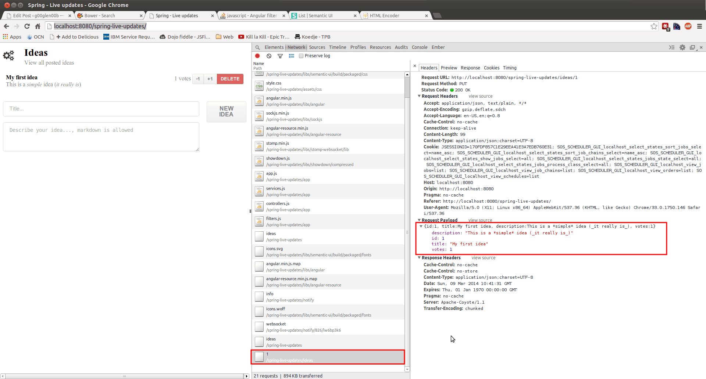

In the previous two tutorials I made the entire back-end for the real time application. You probably have noticed that the configuration part actually took longer than actually writing the application itself, this is because there's a lot of magic behind the screens (think about the data access layer we didn't have to write). This tutorial will actually handle the entire HTML + JavaScript part. The last few years JavaScript was really growing into a more mature environment. We now have frameworks like **AngularJS**, **Ember.js** and many more that allow us to provide an abstraction layer for our DOM so we really don't need to interact with it anymore. In this tutorial I will be using [AngularJS](http://angularjs.org).

### View

The first part is to provide the view itself. In the `<head>` section we have to make sure we import the **Semantic UI** CSS file. In stead of the extremely popular Twitter Bootstrap, I'm going to use [Semantic UI](http://semantic-ui.com/), a less popular, but a pretty fancy UI toolkit. If you used Bower to install Semantic UI, it should be available under the `src/main/webapp/libs` folder, so we need to add the following stylesheets:

```html
<link rel="stylesheet" href="libs/semantic-ui/build/packaged/css/semantic.min.css" />
<link rel="stylesheet" href="assets/css/style.css" />
```

Then we need to bootstrap AngularJS and tell which controller we're going to use, in this case I'm going to do that by using:

```html
<body ng-app="myApp">
    <div ng-controller="ideaCtrl">
        <h2 class="ui header">
            <i class="settings icon"></i>
            <div class="content">
                Ideas
                <div class="sub header">View all posted ideas</div>
            </div>
        </h2>

        <!-- Listing the ideas -->
    </div>
</body>
```

Only the `ng-app` and `ng-controller` attributes are important here, the rest of the code is just some markup to style the application.

The next step is to provide a message if there are no ideas yet. I'm going to store the ideas as an array in our container in the `model.ideas` object. To show a message when the array is empty, I'm going to use the `ng-hide` attribute which will hide the element when `model.ideas.length` is defined (and bigger than zero) by doing:

```html
<div class="ui info icon message" ng-hide="model.ideas.length">
    <i class="thumbs up icon"></i>
    <h2 class="header">First!</h2>
    It seems you're the first one using this web application, start by posting some new ideas.
</div>
```

Then I'm going to iterate through the ideas and display the information I want for each idea, you can do that using the `ng-repeat` attribute. The code I'm going to use is:

```html
<div class="ui divided list">
    <div class="item" ng-repeat="idea in model.ideas | orderBy: 'votes' : true">
        <div class="right floated description" ng-class="{red: idea.votes < 0}">
            {{idea.votes}} votes
            <div class="mini ui buttons">
                <button class="ui button" ng-click="addVotes(idea, -1)">-1</button>
                <button class="ui button" ng-click="addVotes(idea, 1)">+1</button>
                <button class="ui red button" ng-click="remove(idea, $index)">Delete</button>
            </div>
        </div>
        <div class="content">
            <div class="header">{{idea.title}}</div>
            <div class="description" ng-bind-html="idea.description | markdown"></div>
        </div>
    </div>
</div>
```

The first thing to notice is the `ng-repeat` attribute, which does as I explained before, it will iterate over `model.ideas` and for each iteration it will return the current item in `idea`. After the pipelines I'm sorting my collection by the votes that an idea has. By default it will sort the collection ascending and to make sure we show the highest voted idea first, we need to reverse sorting by adding a second property which we put on `true`.

Then the next important thing to notice is the `ng-class` attribute on the line below. This allows us to provide a map of CSS class names and a boolean to indicate whether the class should be used or not. In this case the class `"red"` will be used when `idea.votes < 0` (so when there's a negative value). Then we show the number of votes to the user by using the `{{idea.votes}}` placeholder.

We also specified some additional action handlers by using the `ng-click` attribute. This attribute allows us to execute a specific method in our controller, in this case `addVotes()` and `remove()`. We also provide the index of the current idea in the list by using `$index`.

Finally we also used the `ng-bind-html` attribute, by default AngularJS will strip off all HTML, however, in this case we will use a markdown filter to markup our description. This markdown filter will convert the plain text to HTML, but in order to use that HTML we have to use the `ng-bind-html` attribute.

Then you only need the part of the view to add new ideas to the list. I'm going to use a simple form for this, for example:

```html
<form ng-submit="add()" class="ui form">
    <div class="ui grid">
        <div class="thirteen wide column">
            <div class="ui field">
                <input type="text" placeholder="Title..." ng-model="model.newIdea.title" />
            </div>
            <div class="ui field">
                <textarea placeholder="Describe your idea..., markdown is allowed" ng-model="model.newIdea.description" rows="3"></textarea>
            </div>
        </div>
        <div class="three wide column">
            <button type="submit" class="ui fluid button">New idea</button>
        </div>
    </div>
</form>
```

Like the `ng-click` attribute from the previous code-part, I'm using `ng-submit` here which will make sure the `add()` function is called when the form is submitted.

I also have a few simple text fields and here you can see that we bind the value to `model.newIdea.title` and `model.newIdea.description` by using the `ng-model` attribute. What happens here is that for each change we make to the field, the model will be updated as well so when the form is submit we don't need to retrieve the value from the form, because we already have it in the model.

The last step is that we're going to add the necassary JavaScript files, the libraries (AngularJS, SockJS and Stomp) and the application itself. The code for this:

```html
<script type="text/javascript" src="libs/angular/angular.min.js"></script>
<script type="text/javascript" src="libs/angular-resource/angular-resource.min.js"></script>
<script type="text/javascript" src="libs/sockjs/sockjs.min.js"></script>
<script type="text/javascript" src="libs/stomp-websocket/lib/stomp.min.js"></script>
<script type="text/javascript" src="libs/showdown/compressed/showdown.js"></script>
<script type="text/javascript" src="app/app.js"></script>
<script type="text/javascript" src="app/services.js"></script>
<script type="text/javascript" src="app/filters.js"></script>
<script type="text/javascript" src="app/controllers.js"></script>
```

Next to AngularJS we also need **angular-resource** which makes it easier to integrate RESTful webservices in the client. SockJS and STOMP are both used for the WebSocket communication, SockJS being the lower level component providing a WebSocket client (+ fallbacks if not supported) and STOMP providing a protocol above WebSockets. Showdown is a library to convert markdown markup syntax to plain HTML so we can render it.

### Application configuration

Our first JavaScript file (**app.js**) contains the declaration of the `myApp` app (which we defined earlier when using the `ng-app` attribute earlier), in this case it's just importing the `myApp.controllers`, `myApp.services` and `myApp.filters` "packages":

```javascript
angular.module("myApp", [ "myApp.controllers", "myApp.services", "myApp.filters" ]);
```

### Service

The service actually contains a small REST client using **angular-resource**, the code for it (**services.js**) is:

```javascript
angular.module("myApp.services", [ "ngResource" ]).factory("Idea", function($resource) {
    return $resource("./ideas/:id", {
        id: '@id'
    }, {
        update: {
            method: "PUT"
        },
        remove: {
            method: "DELETE"
        }
    });
});
```

On the first line we're declaring the `myApp.services` package and importing `ngResource` (Angular resource), then we provide a factory which uses AngularJS to use the `./ideas/:id` RESTful webservice endpoint. We also define additional methods for updating and removing a specific idea.

### Filter

A filter (**filters.js**) is something that can be applied to input. For example, we used the `orderBy` filter to sort the idea collection and we also used a filter called **markdown** to format our description. However, this is a custom filter so we have to implement it first.

```javascript
angular.module("myApp.filters", []).filter("markdown", function($sce) {
    var converter = new Showdown.converter();
    return function(value) {
        var html = converter.makeHtml(value || '');
        return $sce.trustAsHtml(html);
    };
});
```

What this does is quite easy, it uses the Showdown library to convert the markup to HTML and then it uses `$sce` to sanitize it as HTML. The entire encode HTML and sanitizing output principle prevents it from executing malicious content (XSS injections).

### Controller

The controller (**controllers.js**) contains a bit more code, but the setup is quite similar, first we need to define the `myApp.controllers` package:

```javascript
angular.module("myApp.controllers", []).controller("ideaCtrl", function($scope, Idea) {
    // Controller code
});
```

`$scope` will actually contain the contet to work on, all objects (model) and methods in our controller should be add to `$scope`. The `Idea` object refers to the factory we made earlier on.

The model for our application looks like:

```javascript
$scope.model = {
    ideas: Idea.query(),
    newIdea: {
        title: null,
        description: null
    }
};

$scope.initiator = false;

$scope.socket = {
    client: null,
    stomp: null
};
```

`$scope.model` in our view, the only new thing here is that we use `Idea.query()` to retrieve all ideas, this will actually call the `./ideas/` endpoint, which is mapped on our Spring controller to give a list of all ideas (converted to JSON).

The `$scope.initiator` will be used to set a flag when the user changed an idea. If the user changed an idea, the local model is updated automatically, however, because the websockets are notifying each client of the changes, the client would reload the model, which is not necessary in this case. The `$scope.initiator` flag will prevent reloading the model in this case.

The next function I'm going to define is the `add()` function that is called when the form is submitted. This will actually create a new idea and that is automatically persisted because Angular resource will call the RESTful webservice which will in turn persist the changes to the datasource.

```javascript
$scope.add = function() {
    $scope.initiator = true;
    var idea = new Idea();
    idea.title = $scope.model.newIdea.title;
    idea.description = $scope.model.newIdea.description;
    idea.votes = 0;
    idea.$save(function(response) {
        $scope.model.ideas.push(response);
    });
    $scope.model.newIdea.description = '';
    $scope.model.newIdea.title = '';
};
```

As you can see we also set the `$scope.initiator` flag to `true` and we use the title + description that we put in `$scope.model.newIdea.title` and `$scope.model.newIdea.description` to complete the idea object. These values are actually bound to the value of the textfield (thanks to the `ng-model` attribute). As a last step we also reset the text fields by changing the model. This is a nice example of two way binding (changing the textfield also changes the model and changing the model also changes the textfield). By using `$save()` the RESTful webservice is invoked, which we then use the locally change the model by adding the new idea using `push()`.

The next function is the `remove()` function, the code for this is even easier since we only have to call the `$remove()` function on the idea to persist the changes and use `splice()` to locally change the model.

```javascript
$scope.remove = function(/** Idea */ idea, /** Integer */ index) {
    $scope.initiator = true;
    $scope.model.ideas.splice(index, 1);
    idea.$remove();
};
```

Then there's only one function left that is used to interact and that's the `addVotes()` function. The code for this is:

```javascript
$scope.addVotes = function(/** Idea */ idea, /** Integer */ votes) {
    $scope.initiator = true;
    idea.votes += votes;
    idea.$update();
};
```

Quite similar to removing the idea we call the `$update()` function and locally change the model by changing the `idea.votes` property. Due to this, both client and server are in sync.

We only have to configure the WebSockets now, I'm going to use the following code for it:

```javascript
$scope.notify = function(/** Message */ message) {
    if (!$scope.initiator) {
        Idea.query(function(ideas) {
            $scope.model.ideas = ideas;
        });
    }
    $scope.initiator = false;
};

$scope.reconnect = function() {
    setTimeout($scope.initSockets, 10000);
};

$scope.initSockets = function() {
    $scope.socket.client = new SockJS('/spring-live-updates/notify');
    $scope.socket.stomp = Stomp.over($scope.socket.client);
    $scope.socket.stomp.connect({}, function() {
        $scope.socket.stomp.subscribe("/topic/notify", $scope.notify);
    });
    $scope.socket.client.onclose = $scope.reconnect;
};

$scope.initSockets();
```

I'm going to start explainin the code from the bottom to the top. The first thing done when initializing the controller is that the `initSockets()` function is called. This function will open a connection to **/spring-live-updates/notify** and use the Stomp library to listen to the **/topic/notify** topic. This is the same topic we used in the aspects in the back-end code, so all notifications will be sent to the `$scope.notify()` function.

This function first verifies if the current user is the initiator (by using the `$scope.initiator` flag) and then updates the model by query'ing the RESTful webservice. When it's done the initiator flag is put to `false` again.

Then the only thing that has to be done is to reconnect to the server each time the WebSocket connection is broken, that's what I do by calling the `$scope.reconnect()` function.

### Stylesheet

One last thing to do is to add your own stylesheet (**assets/css/style.css**) which should contain:

```css
.ui.list .item .red.description {
    color: #A95252;
}

.ui.form textarea {
    min-height: 0;
    height: auto;
}

.ui.list .item .content .description p {
    margin: 0;
}
```

These CSS rules just improve Semantic UI. The first one is used when the votes drop below zero. We said that when it gets below zero, the class **red** should be applied (thanks to the `ng-class` attribute). Semantic UI doesn't support red colors in the description, so we added that.

The next element disables the height settings of the text area, because I want to use the `rows` attribute of the `<textarea>` to define the height of the element.

And the last one just prevents the margin of the description. By default it will wrap it all inside a `<p>` tag with default margins, so I just remove them.

### Demo

Nowe we actually wrote our entire application so it's time to see what we actually made. If you run the application on a server and start your web browser, you should be able to see the following screen:


This is what we actually expect to see. Our database is empty, so that means the default message pops up. If you open your console you should also be able to see that the WebSocket connection is established:


We can also see that it already called our RESTful webservice to retrieve the ideas. If we add a new idea by entering the fields below, when we submit the form we will see it added immediately:


As you can see the idea is added, the form fields are cleared (because we cleared the model) and the initial message has disappeared. If you look at the console you will also notice a few things:


You can see that it posted the new idea on the server and a bit later that the WebSocket receives a message from the server indicating that the ideas have been changed. However, because the initiator flag was set to `true`, nothing really happens. When you open up a second browser window and start adding votes to the idea, you will notice the changes in the second browser window as well. If you go look at the console, you will be able to see that in the first window it will do a PUT-request for every change, while in the other browser it will do a GET-request after retrieving a WebSocket message (because he isn't the initiator).



When a new idea is posted (or an idea is updated), you can also see that every PUT or POST request contains a **payload** which contains the idea that is altered in JSON format. If you add multiple ideas, you will see that the idea with the most votes is always on top (because we used the `orderBy` filter) and that when the votes go below zero, the vote count is red.


#### Achievement: Tutorial finished

This ends our small series about writing real time applications usin Spring, WebSockets and AngularJS. If you're interested in the full code example, you can find it on [GitHub](https://github.com/g00glen00b/spring-websockets). If you want to try out the code yourself, you can download an archive from [Github](https://github.com/g00glen00b/spring-websockets/archive/master.zip).

### Writing real time applications using Spring, AngularJS and WebSockets

1. [Project setup and configuration](/spring-websockets-config)
2. [RESTful webservice and WebSockets (Spring)](/spring-websockets-spring)
3. [AngularJS front-end](/spring-websockets-angular)

You can also find the complete code example on [Github](https://github.com/g00glen00b/spring-websockets).
