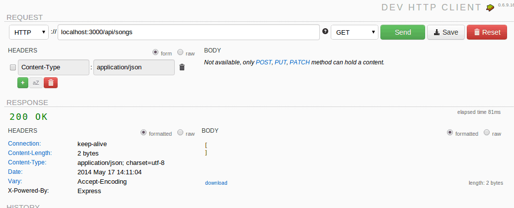
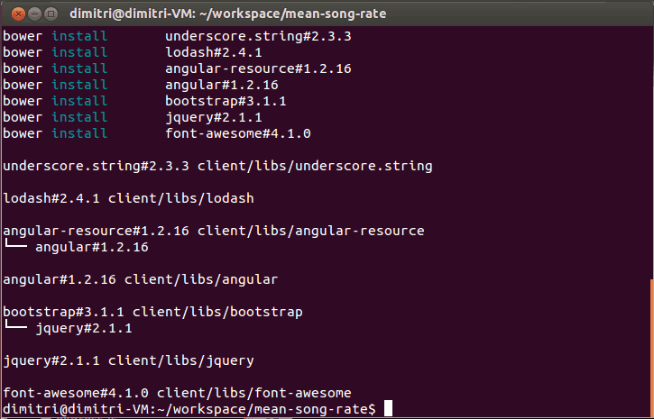

In the previous tutorial I finished the configuration of the application so that in this tutorial we can concentrate ourself on the Model-View-Controller part of the application. The application consists of two parts, the server- and the client-side part of the application. Both of them use the Model-View-Controller pattern though. First of all, let's start by developing the server-side part of our application.

### Mongoose Model

Before working on our REST controller, we first have to define our model. So, let's open **Song.js** and start modifying it. In our song-rate application the model (a song) consists out of three things:

- The artist or band
- The title of the song
- The score of the song

So, our model (obviously) has to represent that as well:

```javascript
var mongoose = require('mongoose');
var Schema = mongoose.Schema;

var Song = new Schema({
    title: String,
    artist: String,
    score: Number
}, {
  versionKey: false,
  toJSON: {
    virtuals: true,
    transform: function(doc, ret, options) {
      ret.id = ret._id.toHexString();
      delete ret._id;
    }
  },
  
  toObject: {
    virtuals: true
  }
});

mongoose.model('Song', Song);
```

So, first of all we're creating a new `mongoose.Schema` that contains the definition of our model. Our model has three properties, two of type `String` and one of type `Number`.

The second part is a bit more complex. But what happens when persisting our data into MongoDB is that every object gets a unique identifier (`_id`) and a version identifier (`_v`). I don't really need the version identifier, so I used the configuration property `versionKey` to disable it. I also didn't like the `_id` property, so I created a new property called `id` and removed the original identifier `_id` from the result when the object is converted to JSON. This means the `_id` property is still there, we just don't output it anymore (in stead of that we use the `id` property). The second part (`toObject`) is not that important for this tutorial, but it means that when we're converting our data to objects, the virtual properties will be available as well. A virtual property is a calculated property, which means that if we for example store the birthday of a person, the age of a person would be a virtual property (it's calculated based on the birthday). In this example we don't have a virtual property so it's not that important.

### REST controller

The other part of our MVC application is the controller. In the previous tutorial we already routed each request to a specific method in our controller (routes.js), so in this tutorial we have to implement these. Open **rest.js** and let's start writing code! The first thing we have to do is to import the modules we need. In our controller we need Mongoose (to retrieve data from MongoDB) and our model, so let's import these first:

```javascript
var mongoose = require('mongoose'), Song = mongoose.model('Song');
```

Then the next part is that we have to define each method. First we start of by the method to retrieve all songs from the database. If you look at routes.js you will notice that we mapped it on a function called `rest.findAll`. So, let's implement that one now:

```javascript
exports.findAll = function(req, res) {
  Song.find({}, function(err, songs) {
    if (err) {
      throw new Error(err);
    }
    res.send(songs);
  });
};
```

So, as you can see here, we're using the model (`Song`) to communicate with the database. In this case we're looking for all objects since we didn't filter anything (the first parameter is an empty object, which means "find all"). If an error occurs we throw it and otherwise we send it as our response, that's all we have to do.

So, let's write the `findOne()` function now:

```javascript
exports.findOne = function(req, res) {
  Song.findById(req.params.id, function(err, song) {
    if (err) {
      throw new Error(err);
    }
    res.send(song);
  });
};
```

Very similar to what we did before, but now we're using the `Song.findById()` function and we're providing an ID (`req.params.id`). If you remember our previous tutorial, we wrote something like `'/songs/:id'`, because we defined a placeholder `:id`, the ID is now available as `req.params.id`. So for example, if we go to **/songs/512**, then the ID would be **512**.

The `add` function is not much more:

```javascript
exports.add = function(req, res) {
  var document = new Song(req.body);
  document.save(function(err, song) {
    if (err) {
      throw new Error(err);
    }
    res.send(song);
  });
};
```

Obviously we don't have to find anything now, we have to create a new song in stead. To do that we use the constructor of our model (`new Song()`) and pass our request or post body to it. Then we save the document and return the persisted version of the document if it's stored.

The most "complex" operation is updating a song, first we have to look for it and then we have to update the same object. To do that we use the `Song.findByIdAndUpdate()` function:

```javascript
exports.update = function(req, res) {
  Song.findByIdAndUpdate(req.params.id, {
    $set: req.body
  }, function(err, song) {
    if (err) {
      throw new Error(err);
    }
    res.send(song);
  });
};
```

The first parameter is the same as when we implemented the `findOne()` function. THe second parameter on the other hand is the action we're going to use. In this case we're setting the entire object to what we provided in our request body, by using the `$set` property.

Then finally we have the `remove()` function that's left:

```javascript
exports.remove = function(req, res) {
  Song.findByIdAndRemove(req.params.id, function(err, song) {
    if (err) {
      throw new Error(err);
    }
    res.send(song);
  });
};
```

Everything should be clear by now, for deleting a song we simply use `Song.findByIdAndRemove()` and the rest of it is similar to what we have done already. With this function we also implemented the entire Node.js application. If you're interested in testing it out, then use the command:

```
npm install
```

This command will load our dependencies from package.json (Express and Mongoose). Now we can fire up our app by using:

node app.js


Now open your favourite REST client (I like the [Dev HTTP Client](https://chrome.google.com/webstore/detail/dev-http-client/aejoelaoggembcahagimdiliamlcdmfm) plugin for Google Chrome) and start playing with it. If we open the URL [http://localhost:3000/api/songs](http://localhost:3000/api/songs), we should get an empty array as response.



If we then add a new song, by changing the request method to POST and adding a post body to it, we get:


Don't forget to set the **Content-Type** header, otherwise your object won't be recognized as an object. If we now use the previous request again (to find all songs), we can now see that our song has been added to the list.


If we want to update the song, we can change the request method to PUT, add the ID to the URL and start adding the updated object as request body:


We now updated the score from 3 to 4. If we now use the same URL but change the request method to GET (retrieve a single object from MongoDB), we obviously get our updated object:


Deleting is simple as well, just change the method to DELETE and our object is gone.


If we take a look back to our console, we see that everything has been logged properly as well.


### AngularJS factory

Our REST API is finished, all that's left now is to connect our front-end application to that REST API. AngularJS made it really easy to do that by using angular-resource. The first thing we do is open up **client/app/app.js** and add `ngResource` as a dependency, for example:

```javascript
angular.module("myApp", [
  'ngResource',
  'myApp.filters',
  'myApp.services',
  'myApp.directives',
  'myApp.controllers'
]);
```

Now we open **services.js** and replace the local storage service by:

```javascript
angular.module("myApp.services", []).factory("Song", function($resource) {
  return $resource('/api/songs/:id', {
    id: '@id'
  }, {
    update: {
      method: "PUT"
    },
    remove: {
      method: "DELETE"
    }
  });
});
```

The Song factory uses `$resource` to map on our RESTful webservice. We only have to say where the RESTful webservice is located and add how the update/remove action will happen. Because we added the ngResource library, we also have to load an extra JavaScript file on our **index.html** page:

```html
<script type="text/javascript" src="libs/angular-resource/angular-resource.min.js"></script>
```

That's it four our AngularJS service, as you can see now, it's easy to connect your AngularJS app to a RESTful back-end like we did.

### Updating the controller

In our controller (**controllers.js**) we added some code that would watch changes in our model, we obviously don't need that anymore, so remove the following piece of code from the controller:

```javascript
$scope.$watch('songs', function (/** Songs */ newValue, /** Songs */ oldValue) {
    if (newValue !== oldValue) {
      songService.put($scope.songs);
    }
  }, true);
```

Now we have to modify our other methods in our controller a bit as well to make use of the new factory. First of all we have to import our new factory by changing the first line in our controller into:

```javascript
angular.module("myApp.controllers", []).controller("songCtrl", function($scope, Song) {
  ```
}

Now we change the `addSong()` function to make use of our factory to create new songs:

```javascript
$scope.addSong = function(/** String */ artist, /** String */ title) {
  var song = new Song();
  song.artist = artist;
  song.title = title;
  song.score = 0;
  song.$save(function(response) {
    $scope.songs.push(response);
  });

  $scope.newSong.title = "";
  $scope.newSong.artist = "";
};
```

We're now using the constructor of the factory (`new Song()`) to create a new song. Afterwards we save it (and call our REST API) by using the `$save()` function. The response will be used to add a new song to the list of songs.

The same thing has to be done in `deleteSong()`:

```javascript
$scope.deleteSong = function(/** Song */ song) {
  var idx = $scope.songs.indexOf(song);
  if (idx >= 0) {
    $scope.songs.splice(idx, 1);
  }
  song.$remove();
};
```

Now we use the `$remove()` function to remove our song.

### Updating the directive

In the introduction tutorial about AngularJS we automatically persisted the songs into the local storage on each change. We can't do that anymore and we have to "react" on each change in the song now. The only part of the code that changes or updates a song is the rating directive (that updates the score). What we have to do now is add an event handler to it that allows us to react on changes in the rating.

To do that, open **directives.js** and start by adding our handler to the scope:

```javascript
directive.scope = {
  score: '=score',
  max: '=max',
  update: '&update'
};
```

Our event handler can be attached now by using the `update` attribute (we're going to do that later), the only thing we have to do is to call the update handler the moment our rating changes. Luckily for us we're already watching for changes in the score, all we have to do is to add a call to the `update()` function to it:

```javascript
scope.$watch('score', function(newValue, oldValue) {
  if (newValue !== null && newValue !== undefined) {
    scope.updateStars();
    scope.update();
  }
});
```

Now we only have to change our template to add our update handler to it. So open **index.html** and look for the following line of code:

Now we're going to add the update handler to it by adding `update="updateSong(song)"`:

```html
<div rating score="song.score" max="5" class="pull-left" update="updateSong(song)"></div>
```

So, what happens now is that each time the score changes, the `scope.update()` function is called. This function is mapped onto the `updateSong(song)` function in our controller which we will use to update the song in our REST API as well.

### Writing the update handler

So all that's left to do is to write the update handler in our controller (**controllers.js**):

```javascript
$scope.updateSong = function(song) {
  song.$update();
};
```

This is probably the easiest function. Our local model is already updated, so all that's left to do is to update the RESTful webservice as well by using the `$update()` function.

If we summarize everything we changed by now we have changed almost all aspects in our CRUD application:

- We changed the `addSong()` handler to add new songs (create)
- We changed the `deleteSong()` handler to delete a song
- We created a new function called `updateSong()` to update a song

What we didn't do yet is the read action. This is quite simple though. In stead of initiating our model by using:

```javascript
$scope.songs = songService.get();
```

We implement it using the `query()` function:

```javascript
$scope.songs = Song.query();
```

### Testing it out

Our RESTful webservice is complete, all our actions in the AngularJS application are now using this webservice, this can only mean one thing... we're FINISHED! To end this tutorial we're going to test everything out. First of all we will have to load our front-end dependencies which we can load using Bower:

```
bower install
```

If you don't have Bower installed yet, you can install it using:

```
npm install -g bower
```

This will install Bower and the `-g` parameter makes it globally available, so now you can execute the install-command.



If that's done, we can start our application again by using:

```
node app.js
```

If you open your browser and go to [http://localhost:3000](http://localhost:3000) you should see our application in its full glory. Start adding, rating and deleting songs and if you open your console you should clearly see all the requests to our REST API as well:


If you look at your console more into detail you can see that it's using our RESTful webservice pretty well:


And obviously, if you refresh the page, the songs are still there!

So we finished our application using the MEAN stack, but in fact, you can add any front-end framework to your back-end (you could use Ember.js as well, which I might talk about in another tutorial), but you can also use any back-end platform you like. If you want to implement the RESTful webservice using Spring MVC or JAX-RS, you can do that as well, just make sure that you follow the same URL routes and it will work like a charm.

#### Achievement: Worked with the MEAN stack

Seeing this means you finished the Working with the MEAN stack tutorial series. If you're interested in the full code example, you can find it on [GitHub](https://github.com/song-rate-mvc/mean-song-rate). If you want to try out the code yourself, you can download an archive from [Github](https://github.com/song-rate-mvc/mean-song-rate/archive/master.zip).

### Working with the MEAN stack

1. [Node.js application setup](/mean-application-setup/)
2. [MVC using Express and AngularJS](/mean-mvc/)
