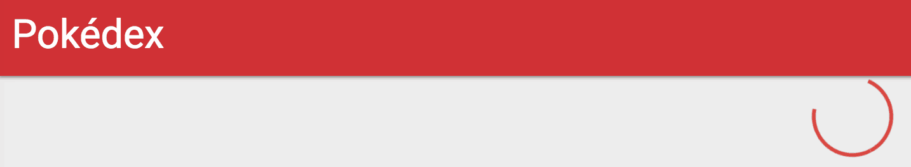

We've already done quite a lot to get a working pokédex with [Angular 2](https://angular.io/). However, there are still two things that bother me:

1. If the API request takes a while, the user wont notice it. The page will just be blank
2. When we open the application, we get a simple "Loading..." message

### Generating a new component

To solve the first problem, I'm going to use Materialize's [circular preloader](http://materializecss.com/preloader.html) and use it within our overview and detail components.  
Since components should be small in scope, I don't think it would be a good idea to add this to an already existing component. So that's why I'm going to generate a new component with Angular CLI like this:

```
ng g component shared/loader
```

This will generate four files. For this tutorial I'm not going to use either the test file (`*.spec.ts`), nor the CSS file.

### Setting up the template

To start, I'm going to copy paste the code from the Materialize page and tweak it a bit:

```html
<div class="preloader-wrapper big active">
  <div class="spinner-layer spinner-red-only">
    <div class="circle-clipper left">
      <div class="circle"></div>
    </div>
    <div class="gap-patch">
      <div class="circle"></div>
    </div>
    <div class="circle-clipper right">
      <div class="circle"></div>
    </div>
  </div>
</div>
```

This is basically the markup you need if you want to use the prelaoder of Materialize, nothing special here.

### Creating an `@Input` property

Our component should only show the loader if there is some process going on. To indicate this, I'm going to add an input property to our component called `loading`:

```typescript
@Input() loading: boolean = false;
```

The next step is to use this property in our template:

```html
<div class="preloader-wrapper big active" *ngIf="loading">
  <!-- ... -->
</div>
```

### Using the component on our overview

Almost there! Our loader component is basically finished, so it's time to use it within our pages. First of all I'm going to add the component to our overview page.

To do that, I'm going to open **app/pokemon-list/pokemon-list.component.html** and add the component to our template:

```html
<div class="center">
  <app-loader [loading]="loading"></app-loader>
</div>
```

Now we have to define `loading` in our component (**app/pokemon-list/pokemon-list.component.ts**):

```typescript
loading: boolean = false;
```

And finally, I'm going to change the `findAll()` function a bit, so that the `loading` property is set to `true` when the function is called, and back to `false` when a value is received from the observable.

```typescript
findAll(offset: number, limit: number) {
  this.pokemons = [];
  this.loading = true;
  this._service.findAll(offset, limit).subscribe(result => {
    this.pokemons = result.pokemons;
    this.count = result.count;
    this.loading = false;
  }, () => this.loading = false);
}
```

We have to remember that we have to set `loading` to `false` both when the request was successful and when the request failed. To do this, I added a new function as the error callback (`() => this.loading = false`).

If we take a look at the application now, we can see that our loader is there already, great!



### Implementing the loader on our detail page

Similar to the overview, I also implemented the `loading` property and used it like this:

```typescript
ngOnInit() {
  let observable = this._route.params
    .map(params => params['id'])
    .flatMap(id => this._service.findOne(id))
    .share();
  this.loading = true;
  observable.subscribe(pokemon => {
    this.pokemon = pokemon;
    this.loading = false;
  }, () => this.loading = false);
  observable.subscribe(pokemon => this._titleService.setTitle(`#${pokemon.baseInfo.id} - ${pokemon.baseInfo.name}`));
}
```

To our template I added the same markup:

```html
<div class="center">
  <app-loader [loading]="loading"></app-loader>
</div>
```

However, I also wrapped the already exisitng markup into a new `<div>` element with the following `*ngIf`:

```html
<div *ngIf="!loading">
  <!-- ... -->
</div>
```

This allows me to hide all the components containing the Pokémon's info if the data is not yet retrieved. This looks way cleaner now.

### Changing the Loading... message

The next problem I want to solve is the "Loading..." message, because we can actually customize that message as well!

To do that, let's open **index.html**. Normally, this page should contain our root component being `<app-root>`. Inside, you can see that it contains the "Loading..." text. But basically, you can put anything inside. I'm going to choose some markup:

```html
<app-root>
  <div class="pokeball">
    <div class="upper">
      <div class="inner"></div>
    </div>
    <div class="middle"></div>
    <div class="lower">
      <div class="inner"></div>
    </div>
  </div>
</app-root>
```

After that, I'm also going to add some CSS to **styles.css**:

```css
.pokeball {
  width: 150px;
  height: 150px;
  position: absolute;
  display: inline-block;
  animation: rotate 1.5s linear infinite;
  left: calc(50% - 75px);
  top: calc(50% - 75px);
}
.pokeball .inner {
  width: 150px;
  height: 75px;
  border: 48px solid #e53935;
  box-sizing: border-box;
}
.pokeball .upper, .pokeball .lower {
  width: 100%;
  position: absolute;
  height: calc(50% - 5px);
  overflow: hidden;
}
.pokeball .upper {
  top: 0;
}
.pokeball .upper .inner {
  border-radius: 123px 123px 0 0;
  border-bottom: 0;
  margin-bottom: -5px;
}
.pokeball .lower {
  bottom: 0;
}
.pokeball .lower .inner {
  margin-top: -5px;
  border-radius: 0 0 123px 123px;
  border-top: 0;
}
.pokeball .middle {
  border-radius: 50%;
  width: 40px;
  height: 40px;
  background-color: #e53935;
  position: absolute;
  left: calc(50% - 20px);
  top: calc(50% - 20px);
}

@keyframes rotate {
  100% {
    transform: rotate(360deg);
  }
}
```

This markup + CSS will allow me to show a rotating pokéball when the application is still loading. If you wonder where this all comes from and how it all relates, well, then I encourage you to look at my [Codepen](https://codepen.io/g00glen00b/pen/pNdvwN) which contains the uncompile Sass code (SCSS).

If you look at your application, you should be able to see it into its full glory right now. 

If that's the case, then well done, you made your application a lot more responsive towards the enduser. This is also the conclusion of my (initial) series of Angular 2 articles. If you want to check out the full result, feel free to check the [Github pages](https://g00glen00b.github.io/ng2-pokedex/) branch of the project on Github.

#### Achievement: Wrote a complete Pokédex with Angular 2

If you’re seeing this, then it means you successfully managed to make it through this tutorial. If you're interested in the code, you can check it out at [Github](https://github.com/g00glen00b/ng2-pokedex).
