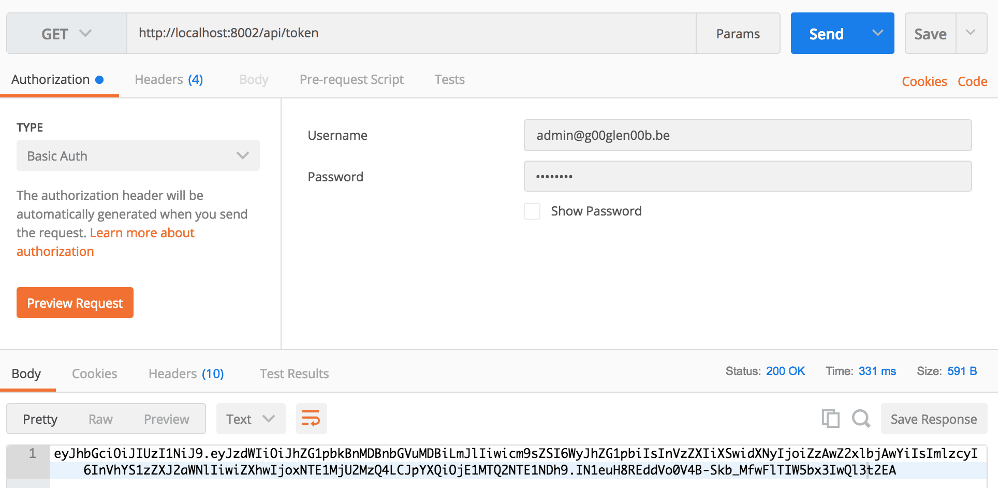

As soon as you write your first web application with Spring, you probably want to secure it. Spring has a project called [Spring Security](https://projects.spring.io/spring-security/) that does most of the generic stuff for you. Just plug in a service that provides the user details (from a database, LDAP, ...) and configure the endpoints and you're ready to go.

### Choosing an authentication mechanism

Spring Security doesn't limit you to just basic authentication, form logins with cookies or anything else. You can use basically anything, such as [OAuth 2](https://oauth.net/2/), [JSON Web tokens](https://tools.ietf.org/html/rfc7519) (JWT), ... . In my case, I want to secure several microservices/REST APIs without having to send over my username and password to every separate service and without each microservice having to check the database or LDAP by itself. So, in my case, I chose for a token mechanism such as JWT and a separate microservice to generate and validate them.


### What is JWT

JWT is a type of token that contain certain claims (username, expiry, issuer) but also custom claims in a JSON format, afterwards encoded as a base 64 string. This doesn't mean it can be altered though, because additionally to the data, the token also contains a signature, which is a hash using certain algorithm (eg. HS256, RS256, ...). This means that if you edit the payload, you need to change the signature as well, which is only possible if you know the secret used to generate the token in first place. You can easily see how the token is generated at [jwt.io](https://jwt.io/).


### Creating a separate microservice

To set up the new microservice, I'm going to create a project with [Spring Initializr](http://start.spring.io/), with the **web** dependency (because it will offer REST endpoints), the **security** dependency (because it will use basic authentication to retrieve a token), the **JPA** dependency (to persist user credentials) and the **HSQLDB** dependency (an in-memory database to store the credentials).


### Creating the persistence layer

The microservice will use an in-memory database to store the usernames and passwords, which will be used to initially request a token. To generate a schema, I'm going to create a **schema.sql** and a **data.sql** file in the **src/main/resources** folder.

```sql
CREATE TABLE user (
  id          INTEGER IDENTITY PRIMARY KEY,
  email       VARCHAR(128) UNIQUE NOT NULL,
  username    VARCHAR(32)  UNIQUE NOT NULL,
  password    VARCHAR(128) NOT NULL,
  enabled     BIT NOT NULL);

CREATE TABLE role (
  id          INTEGER IDENTITY PRIMARY KEY,
  email       VARCHAR(128) NOT NULL,
  role        VARCHAR(64) NOT NULL);

ALTER TABLE role
  ADD FOREIGN KEY (email)
  REFERENCES user(email);
```


I'm also going to create a dummy record using `data.sql`:

```sql
INSERT INTO user (email, username, password, enabled) VALUES
  ('admin@dimitr.im', 'g00glen00b', '$2a$10$Fg.pwGKNEk8TtRq3C86DEeIo6CnUI05umcVQuvRh2DdwEKJUPtsJK', 1);

INSERT INTO role (email, role) VALUES
  ('admin@dimitr.im', 'admin'),
  ('admin@dimitr.im', 'user');
```

In this case, I'm going to create a user with password "password", that will be able to log in and retrieve a JWT token.

Now that we have the data ready, it's time to create the entities for these tables:

```java
@Entity
public class User implements Serializable {
    @Id
    @GeneratedValue(strategy = GenerationType.IDENTITY)
    private Long id;
    private String email;
    private String username;
    private String password;
    private boolean enabled;
    @OneToMany(fetch = FetchType.LAZY, orphanRemoval = true, cascade = CascadeType.ALL)
    @JoinColumn(name = "email", referencedColumnName = "email")
    private List roles;

    public User(Long id, String email, String username, String password, boolean enabled, List roles) {
        this.id = id;
        this.email = email;
        this.username = username;
        this.password = password;
        this.enabled = enabled;
        this.roles = roles;
    }

    public User(String email, String username, String password, boolean enabled, List roles) {
        this(null, email, username, password, enabled, roles);
    }

    public User() {
    }

    public Long getId() {
        return id;
    }

    public String getEmail() {
        return email;
    }

    public String getUsername() {
        return username;
    }

    public String getPassword() {
        return password;
    }
    public void setPassword(String password) {
        this.password = password;
    }

    public boolean isEnabled() {
        return enabled;
    }
    public void setEnabled(boolean enabled) {
        this.enabled = enabled;
    }

    public List getRoles() {
        return roles;
    }
    public void setRoles(List roles) {
        this.roles = roles;
    }
} 
```

And the `Role` entity:

```java
@Entity
public class Role implements Serializable {
    @Id
    @GeneratedValue(strategy = GenerationType.IDENTITY)
    private Long id;
    private String email;
    private String role;

    public Role() {
    }

    public Role(String email, String role) {
        this(null, email, role);
    }

    public Role(Long id, String email, String role) {
        this.id = id;
        this.email = email;
        this.role = role;
    }

    public Long getId() {
        return id;
    }

    public String getEmail() {
        return email;
    }

    public String getRole() {
        return role;
    }
    public void setRole(String role) {
        this.role = role;
    }
}
```

With these entities, we can create a proper repository:

```java
public interface UserRepository extends JpaRepository<User, Long> {
    @Query("SELECT u FROM User u LEFT JOIN FETCH u.roles WHERE u.email=?1")
    Optional<User> findByEmail(String email);
}
```

### Parent security configuration

As explained before, the microservice will have two endpoints:

- `/api/token`: The endpoint to generate tokens
- `/api/user`: The endpoint to validate tokens

This means that both of these endpoints will require a different security configuration setup. To do that, I'm going to write a parent class and two inner configuration classes. The parent configuration class will look like this:

```java
@Configuration
@EnableWebSecurity
@EnableGlobalMethodSecurity(prePostEnabled = true)
public class SecurityConfig {
    private UsernamePasswordDetailsService service;
    private PasswordEncoder passwordEncoder;

    @Autowired
    public SecurityConfig(UsernamePasswordDetailsService service, PasswordEncoder passwordEncoder) {
        this.service = service;
        this.passwordEncoder = passwordEncoder;
    }
}
```

We're injecting two beans here. First of all is the user detail service that will help us in retrieving the user details based on a given set of credentials (containing a username and password). The second one bean will do the conversion of a given password into a hash. I'll talk about the implementation of these beans in a bit.

### Token security configuration

Now, the next part is the configuration for the token endpoint:

```java
@Configuration
@Order(1)
public class BasicAuthConfig extends WebSecurityConfigurerAdapter {

    @Override
    protected void configure(HttpSecurity http) throws Exception {
        http
            .antMatcher("/api/token")
            .authorizeRequests()
            .anyRequest()
            .authenticated()
            .and()
            .httpBasic()
            .and()
            .sessionManagement()
            .sessionCreationPolicy(SessionCreationPolicy.STATELESS);
    }

    @Override
    protected void configure(AuthenticationManagerBuilder auth) throws Exception {
        auth.userDetailsService(service).passwordEncoder(passwordEncoder);
    }
}
```

By extending from the `WebSecurityConfigurerAdapter` we get several methods we can override `configure()`. However, once you extend from this class multiple times, you need to define the order in which these configuration classes should be applied. For this reason, we added the `@Order` annotation on the class.

The `configure(HttpSecurity)` method allows us to configure how the authentication should be applied. In this case, we'll match the `/api/token` path and use basic authentication. The other `configure()` method allows us to configure what should happen with the credentials, in our case we'll use the beans we injected into the parent security configuration.

### Creating the beans

Even though we injected the beans before, we still have to define them. First of all we need to tell Spring Security which password hashing algorithm should be used by defining a `PasswordEncoder`. In our service, we'll be using BCrypt, so we can define our password encoder like this:

```java
@Bean
public PasswordEncoder passwordEncoder() {
    return new BCryptPasswordEncoder(10);
}
```

The "10" in this case is the strength of the BCrypt hash. You can refactor this to a configurable property if you prefer.

The next thing we'll have to implement to make this security configuration work is the `UsernamePasswordDetailsService`. This class has to implement `UserDetailsService`, which can be used to retrieve the full user object based on a given username. This will be used by Spring to validate the user their roles and password. The implementation of this class is will use the repository we wrote earlier on to retrieve the details:

```java
@Service
public class UsernamePasswordDetailsService implements UserDetailsService {
    private final Logger logger = LoggerFactory.getLogger(getClass());
    private UserService userService;
    private TokenService tokenService;

    @Autowired
    public UsernamePasswordDetailsService(UserService userService, TokenService tokenService) {
        this.userService = userService;
        this.tokenService = tokenService;
    }

    @Override
    public UserDetails loadUserByUsername(String email) throws UsernameNotFoundException {
        logger.debug("Trying to authenticate ", email);
        try {
            return getUserDetails(userService.findByEmail(email));
        } catch (UserNotFoundException ex) {
            throw new UsernameNotFoundException("Account for '" + email + "' not found", ex);
        }
    }

    private TokenUserDetails getUserDetails(User user) {
        return new TokenUserDetails(
            user.getEmail(),
            user.getUsername(),
            user.getPassword(),
            tokenService.encode(user),
            user.isEnabled(),
            getAuthorities(user.getRoles()));
    }

    private List<SimpleGrantedAuthority> getAuthorities(List<Role> roles) {
        return roles
            .stream()
            .map(role -> new SimpleGrantedAuthority(role.getRole()))
            .collect(Collectors.toList());
    }
}
```

As you can see, we only return data, we don't have to validate the password ourselves since the Spring framework will handle this using this service and the password encoder bean. There are a few missing pieces though, first of all, we need to create our own `UserDetails` implementation class, since the default implementation (`User`) does not allow us to add the generated token to the user properties. For this reason we need to create class called `TokenUserDetails`:

```java
public class TokenUserDetails extends User {
    private String token;
    private String profileName;

    public TokenUserDetails(String username, String profileName, String password, String token, boolean enabled, Collection< ? extends GrantedAuthority> authorities) {
        super(username, password, enabled, true, true, true, authorities);
        this.profileName = profileName;
        this.token = token;
    }

    public String getToken() {
        return token;
    }

    public String getProfileName() {
        return profileName;
    }
}
```

The profile name here allows us to store both the username (which is in our case the e-mail address) and the profilename, which is our "nickname".

The last missing piece is the `TokenService`, which will generate the token. So let's create this class and annotate it with the `@Service` annotation:

```java
@Service
public class TokenService {
    // ...
}
```

Before we continue, we also have to add a JWT library to the classpath. I'm going to use the [Java library from Auth0](https://github.com/auth0/java-jwt):

```xml
<dependency>
    <groupId>com.auth0</groupId>
    <artifactId>java-jwt</artifactId>
    <version>3.1.0</version>
</dependency>
```

Now we can implement the `encode()` method:

```java
@Service
public class TokenService {
    private final Logger logger = LoggerFactory.getLogger(getClass());
    private TokenProperties properties;
    private String issuer;
    private Algorithm algorithm;
    private JWTVerifier verifier;

    @Autowired
    public TokenService(TokenProperties properties, @Value("${spring.application.name}") String issuer) throws UnsupportedEncodingException {
        this.properties = properties;
        this.issuer = issuer;
        this.algorithm = Algorithm.HMAC256(properties.getSecret());
        this.verifier = JWT.require(algorithm).acceptExpiresAt(0).build();
    }

    public String encode(User user) {
        LocalDateTime now = LocalDateTime.now();
        try {
            return JWT.create()
                .withIssuer(issuer)
                .withSubject(user.getEmail())
                .withIssuedAt(Date
                    .from(now.atZone(ZoneId.systemDefault())
                        .toInstant()))
                .withExpiresAt(Date
                    .from(now.plusSeconds(properties.getMaxAgeSeconds())
                        .atZone(ZoneId.systemDefault())
                        .toInstant()))
                .withArrayClaim("role", user
                    .getRoles()
                    .stream()
                    .map(Role::getRole)
                    .toArray(String[]::new))
                .withClaim("usr", user.getUsername())
                .sign(algorithm);
        } catch (JWTCreationException ex) {
            logger.error("Cannot properly create token", ex);
            throw new TokenCreationException("Cannot properly create token", ex);
        }
    }
}
```

The token we'll generate will contain some registered claims (issuer, subject, issued at and expires at), while we'll also define a few custom claims (role and usr).

### Using configuration properties

This service uses a configuration properties object though (of type `TokenProperties`), which will contain the secret used to generate the JWT token, but also the amount of time before the token expires:

```java
public class TokenProperties {
    private long maxAgeSeconds;
    private String secret;

    public TokenProperties(long maxAgeSeconds, String secret) {
        this.maxAgeSeconds = maxAgeSeconds;
        this.secret = secret;
    }

    public TokenProperties() {
    }

    public long getMaxAgeSeconds() {
        return maxAgeSeconds;
    }
    public void setMaxAgeSeconds(long maxAgeSeconds) {
        this.maxAgeSeconds = maxAgeSeconds;
    }

    public String getSecret() {
        return secret;
    }
    public void setSecret(String secret) {
        this.secret = secret;
    }
}
```

Now we also have to create a bean for this class by adding the following method to the main class:

```java
@Bean
@ConfigurationProperties(prefix = "security.token")
public TokenProperties tokenProperties() {
    return new TokenProperties();
}
```

By using the `@ConfigurationProperties`, all properties matching `security.token.*` will be mapped to fields in this class, so now we can change the `application.properties` file:

```
security.token.secret=TheSecretYouShouldChange
security.token.maxAgeSeconds=86400 # 1 day
```

### Creating the token endpoint

After setting up the configuration it's time to create the REST API that will return the JWT token of the current user. Since we're using Spring security to handle everything, it means that as soon as we enter a method in the controller, it will already have a token generated in its principal (`TokenUserDetails`). So all we have to do is retrieve that token and return it:

```java
@RestController
@RequestMapping("/api")
public class AuthorizationRESTController {
    @GetMapping("/token")
    public String getToken(@AuthenticationPrincipal TokenUserDetails principal) {
        return principal.getToken();
    }
}
```

To test it out, you can run the application and call the `/api/token` endpoint and view the result by yourself:



The result of the endpoint is the token itself. This allows you to basically "trade" a username and password for a token so it can be used for further communication. In my case, all other microservices would only accept tokens, which have to be generated by this service initially. The payload itself can be checked as well. If you paste the content of the token to the [JWT Debugger](https://jwt.io/#debugger-io), you can see that it basically contains some JSON:

```json
{
  "sub": "admin@dimitr.im",
  "role": [
    "admin",
    "user"
  ],
  "usr": "g00glen00b",
  "iss": "uaa-service",
  "exp": 1515256348,
  "iat": 1514651548
}
```

The payload of the token matches what we defined in the `encode()` method in the `TokenService`. The **iss** claim matches the issuer, the **sub** claim matches the subject, the **exp** claim matches the expiry date and the **iat** claim matches the issued at date.

### Security configuration for the user endpoint

The next part of the security configuration is the security configuration for the `/api/user` endpoint. This configuration will basically use the token, check if it's valid and create the proper `TokenUserDetails`. This means that we don't need any username or password, just the token.

To configure this, we need to create another subclass in the `SecurityConfig` class and extend from `WebSecurityConfigurerAdapter` again:

```java
@Configuration
@Order(2)
public class TokenAuthConfig extends WebSecurityConfigurerAdapter {
    private TokenAuthenticationUserDetailsService service;

    @Autowired
    public TokenAuthConfig(TokenAuthenticationUserDetailsService service) {
        this.service = service;
    }

    @Override
    protected void configure(HttpSecurity http) throws Exception {
        http
            .antMatcher("/api/user")
            .authorizeRequests()
            .mvcMatchers(HttpMethod.POST, "/api/user").anonymous()
            .anyRequest().authenticated()
            .and()
            .addFilterBefore(authFilter(), RequestHeaderAuthenticationFilter.class)
            .authenticationProvider(preAuthProvider())
            .sessionManagement()
            .sessionCreationPolicy(SessionCreationPolicy.STATELESS)
            .and()
            .csrf().disable();
    }

    @Bean
    public TokenAuthenticationFilter authFilter() {
        return new TokenAuthenticationFilter();
    }

    @Bean
    public AuthenticationProvider preAuthProvider() {
        PreAuthenticatedAuthenticationProvider provider = new PreAuthenticatedAuthenticationProvider();
        provider.setPreAuthenticatedUserDetailsService(service);
        return provider;
    }
}
```

The setup is quite similar as before, but this time we don't use basic authentication, but we use a header based pre-authentication filter. Also note that we use a different order (`@Order` annotation) and that the ant path matcher is also different.

There are a few missing pieces though, first we need to crete a custom filter (`TokenAuthenticationFilter`) to retrieve the relevant token. For the filter we'll have to create a separate class implementing `AbstractPreAuthenticatedProcessingFilter`. The implementation we'll use, will retrieve the JWT token from a header called `X-Token`:

```java
public class TokenAuthenticationFilter extends AbstractPreAuthenticatedProcessingFilter {
    private final Logger logger = LoggerFactory.getLogger(getClass());

    @Override
    protected Object getPreAuthenticatedPrincipal(HttpServletRequest request) {
        logger.debug("Retrieving principal from token");
        return request.getHeader("X-Token");
    }

    @Override
    protected Object getPreAuthenticatedCredentials(HttpServletRequest request) {
        return request.getHeader("X-Token");
    }

    @Override
    @Autowired
    public void setAuthenticationManager(AuthenticationManager authenticationManager) {
        super.setAuthenticationManager(authenticationManager);
    }
}
```

You don't have to pass the token to both the `getPreAuthenticatedPrincipal()` and `getPreAuthenticatedCredentials()` method, if you pass it in one of the methods, and leave the other one `null`, it will work as well.

Before we continue with the Spring security related beans, we have to add a new method to our `TokenService` , that will validate the token for us. This is quite simple though if you use a JWT library:

```java
public DecodedJWT decode(String token) {
    return this.verifier.verify(token);
}
```

Now, the next step is to create a bean implementing `TokenAuthenticationUserDetailsService`. Be aware, this is not the same user detail service that we created before. This user detail service will work using the **token**, and not the username/password like last time.

```java
@Service
public class TokenAuthenticationUserDetailsService implements AuthenticationUserDetailsService<PreAuthenticatedAuthenticationToken> {
    private TokenService tokenService;

    @Autowired
    public TokenAuthenticationUserDetailsService(TokenService tokenService) {
        this.tokenService = tokenService;
    }

    @Override
    public UserDetails loadUserDetails(PreAuthenticatedAuthenticationToken authentication) throws UsernameNotFoundException {
        if (authentication.getPrincipal() != null && authentication.getPrincipal() instanceof String && authentication.getCredentials() instanceof String) {
            DecodedJWT token;
            try {
                token = tokenService.decode((String) authentication.getPrincipal());
            } catch (InvalidClaimException ex) {
                throw new UsernameNotFoundException("Token has been expired", ex);
            }
            return new TokenUserDetails(token.getSubject(), token.getClaim("usr").asString(), (String) authentication.getCredentials(), token.getToken(), true, token
                .getClaim("role")
                .asList(String.class)
                .stream()
                .map(SimpleGrantedAuthority::new)
                .collect(Collectors.toList()));
        } else {
            throw new UsernameNotFoundException("Could not retrieve user details for '" + authentication.getPrincipal() + "'");
        }
    }
}
```

As you can see, we use the the `DecodedJWT` to populate the `TokenUserDetails` object. Also note that this time we're not implementing `UserDetailsService`, but we're implementing `AuthenticationUserDetailsService` using a pre-authentication mechanism.

### Creating the user endpoint

Now, if you would be using a separate microservice to generate and verify tokens, what would you return on validation? You could return a simple `true` or `false`, but I think it's more useful to return a JSON representation of the `UserDetails`. This can make stuff easier as well when you're writing other microservices with Spring, since they'll be able to construct their `UserDetails` object based on the response of this endpoint.

So, to do this we'll have to create a new controller:

```java
@RequestMapping("/api/user")
@RestController
public class UserRESTController {

    @GetMapping()
    public TokenUserDetails getUser(@AuthenticationPrincipal TokenUserDetails principal) {
        return principal;
    }
}
```

Now, if you run the application again, and use the token we generated earlier, we can call the `/api/user` endpoint using the `X-Token` header to provide the token:


### Using JWTs without a separate microservice

If you don't want to use a distributed system using microservices, but you still want to use the same setup as here, that's possible. You'll just have to change the ant matcher from the `TokenAuthConfig` class to `/**` rather than using `/api/user`. By doing this, all endpoints except the `/api/token` endpoint will require a JWT token to be sent with it. Make sure to keep the same order though, so that the `/api/token` ant matcher has priority over the `/**` ant matcher.

You can also delete the `UserRESTController`, since this endpoint would only be used by other microservices to check if the token is valid or not.

#### Achievement: Secured your Spring application with JWT

If you’re seeing this, then it means you successfully managed to make it through this tutorial. If you’re interested in the full code example, you can find it on [GitHub](https://github.com/g00glen00b/microservice-demo/tree/master/uaa-service).
