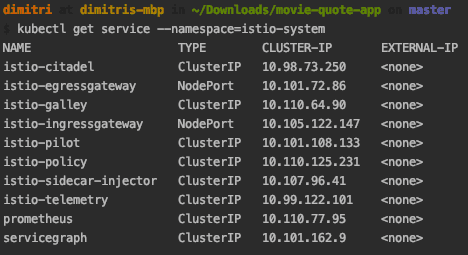

Recently, I've been writing some tutorials about creating cloud native applications with Spring boot. So far, we've already covered how to create a Docker image of your Spring boot application. In the next tutorial, we'll also see how we can run our application on Kubernetes. However, before we can do this, we have to set up our local Kubernetes cluster first. Luckily, Kubernetes makes this easy for us by providing Minikube.

### Installing Homebrew


The easiest way to install a [Kubernetes](https://kubernetes.io/) cluster locally is by installing [Minikube](https://kubernetes.io/docs/setup/minikube/). To do this, we're going to use [Homebrew](https://brew.sh/), so you might want to install this first, in case you didn't already:

```
/usr/bin/ruby -e "$(curl -fsSL https://raw.githubusercontent.com/Homebrew/install/master/install)"
```

This command is also being mentioned on their homepage, and basically runs a Ruby script to set up Homebrew.

### Installing Minikube

The next step, as mentioned before, is to install Minikube. To install Minikube, we're going to install the Kubernetes CLI (also known as [kubectl](https://kubernetes.io/docs/tasks/tools/install-kubectl)):

```
brew install kubernetes-cli
```

Minikube requires a virtual environment to run on, this could be [Virtualbox](https://www.virtualbox.org/wiki/Downloads), VMWare Fusion, Hyper-V, KVM and so on. In this tutorial, I'll use Virtualbox as the environment, so I'll install it as well:

```
brew cask install virtualbox
```

Now that we have both kubectl and Virtualbox, we can install Minikube using Homebrew:

```
brew cask install minikube
```

### Setting up Minikube

After installing all the requirements, we can configure the resources Minikube will have access to by configuring both the amount of memory and the amount of CPUs it will have access to:

```
minikube config set memory 8192
minikube config set cpus 2
minikube config set vm-driver virtualbox
```

I'm running on a 16GB machine, so I chose to use 8Gb of memory and 2 CPUs. Running applications on a local Kubernetes cluster does require some memory, I've seen people recommending to provide at least 4Gb of memory.

Optionally, you can also configure the Docker CLI to use Minikube's Docker daemon, in stead of using the Docker daemon on your host machine. This ensures that both the Docker CLI and Minikube use the same registry. Otherwise, you would have to pull the entire image when deploying to Kubernetes.

To do this, use the following command:

```
eval $(minikube docker-env)
```

### Installing Istio

Now, if you're only interested in setting up Minikube, then you're done! However, I'm going to go a bit further, and also install a service mesh, [Istio](https://istio.io/).

Personally, I think the easiest way to install Istio is by using [Helm](https://helm.sh/) templates. But before we can use these templates, we have to install Helm first:

```
brew install kubernetes-helm
```

Now, the Helm template for installing Istio is available within [their releases](https://github.com/istio/istio/releases), so download one first.

After that, you can use Helm to generate the kubefiles for Istio. This can be done by executing the following commands:

```
helm template istio/install/kubernetes/helm/istio-init \
    --name istio-init \
    --namespace istio-system > istio-init.yml
helm template istio/install/kubernetes/helm/istio/ \
    --name istio \
    --namespace istio-system \
    --set gateways.istio-ingressgateway.type=NodePort \
    --set gateways.istio-egressgateway.type=NodePort > istio.yml
```

This will generate two files called **istio-init.yml** and **istio.yml**. I configured both Helm templates to be generated for a separate namespace called **istio-system**. Additionally, I configured Istio to use **NodePort** for the gateways, as the default is "LoadBalancer" which is unavailable when running locally.

### Deploying Istio

The final step is to deploy Istio on your local Kubernetes cluster. First of all, let's start our cluster by using the following command:

```
minikube start
```

This command will start a headless virtual machine on Virtual box with the Kubernetes cluster on it. Fun fact: Minikube uses a [custom Linux distro](https://github.com/kubernetes/minikube/blob/master/docs/contributors/minikube_iso.md) with a minimal amount of packages installed on it.

When Minikube is up and running, we have to create the **istio-system** namespace first:

```
kubectl create namespace istio-system
```

With our namespace ready, we can use the kubefiles we generated before to deploy Istio:

```
kubectl apply -f istio-init.yml
kubectl apply -f istio.yml
```

And there you have it, Istio should now be running on Minikube.

To verify that Kubernetes and Istio are actually running, we can use the following command:

```
kubectl get service --namespace=istio-system
```

This command should list some services, including **istio-citadel**, **istio-galley** and so on.



If you're a GUI-man, you can also run the Minikube dashboard to see the same results. To run the dashboard, you can use the following command:

```
minikube dashboard
```

Once the dashboard is running, you can select the istio-system namespace and get an overview of the things that are running.


And there you have it, you're now ready to deploy cloud native applications with Kubernetes.
