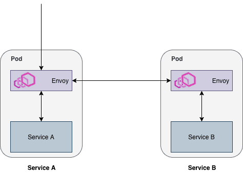

Last time, we've set up [Minikube with Istio](/setting-up-minikube-istio-macos/), and we've [deployed our application using Kubernetes](/spring-boot-kubernetes/). Today, we'll see how we can use [Kiali](https://www.kiali.io/) with Istio to visualise our service dependencies.


### Enabling Grafana and Kiali

Before we can visualise our service mesh, we have to make sure the following services are up and running:

- **Prometheus**: This time series database contains metrics about our service mesh.
- **Grafana**: To visualise the service graph, Grafana is necessary.

To enable these features, we need to recreate the Kubefile for Istio by using the following command:

```
helm template $ISTIO_RELEASE/install/kubernetes/helm/istio/ \
    --name istio \
    --namespace istio-system \
    --set grafana.enabled=true \
    --set kiali.enabled=true > kubefiles/istio.yml
```

[By default](https://istio.io/docs/reference/config/installation-options/), Prometheus is already enabled, so we don't have to do that. Grafana and Kiali on the other hand are optional, and have to be enabled using the `grafana.enabled` and the `kiali.enabled` property.

When that's complete, we also have to configure some credentials for Kiali, by creating a secret. Just like before, we can create a secret by using base64 to encode our credentials. For example:

```
echo -n "admin" | base64
echo -n "password" | base64
```

When that's complete, you can create a new secret with the name **kiali** like this:

```yaml
apiVersion: v1
kind: Secret
metadata:
  name: kiali
  namespace: istio-system
  labels:
    app: kiali
type: Opaque
data:
  username: YWRtaW4=
  passphrase: cGFzc3dvcmQ=
```

After that's complete, you can run the following **kubectl** commands to apply them:

```
kubectl apply -f kubefiles/kiali-secret.yml
kubectl apply -f kubefiles/istio.yml
```

### Installing the Istio sidecar

The next step is to redeploy our existing pods, this time containing the [Istio sidecar](https://istio.io/docs/setup/kubernetes/additional-setup/sidecar-injection/) as well.

These sidecars contain an [Envoy proxy](https://istio.io/docs/concepts/what-is-istio/#envoy), which proxies traffic so that proper metrics can be generated.



An example of two services communicating through Envoy proxies

The Istio sidecar can be installed quite easily without having to change your Kubefiles. By using **istioctl**, we can inject these for our existing configuration files and apply them.

It's recommended to keep the source configuration files, as the injected sidecar configuration is not idempotent and might change when you upgrade.

```
istioctl kube-inject -f kubefiles/movie-quote-service.yml | kubectl apply -f -
istioctl kube-inject -f kubefiles/movie-quote-consumer.yml | kubectl apply -f -
```

Once that's done, the sidecar is properly injected in each pod.

### Visualising your service mesh

The final step is to open Kiali, and to view your service mesh in action. To do this, I'm going to port-forward Kiali, which runs on port **20001** by default:

```
kubectl -n istio-system port-forward svc/kiali 20001:20001
```

After that, you should be able to open the Kiali console by going to [http://localhost:20001/kiali/console/](http://localhost:20001/kiali/console/). You can now enter the credentials you generated at the start of the article, and you're ready!

If you select **Graph** from the leftside menu, you can now visualise a graph. For example, this is a visualisation using the Graph type "Workload" of my application:


On the right side of the graph, you can also view some other interesting information, such as:

- The amount of requests per seconds.
- The amount of requests for each HTTP status (2xx, 3xx, 4xx, 5xx).
- The response times.


### Obtaining more information

Additionally to this overview of your service mesh, you can also get some detailed graphs for each pod. For example, if you go to **workloads**, select an existing workload and go to inbound or outbound metrics, you can see some detailed graphs:


And there you have it, a proper visualisation for your service mesh with Kubernetes, Istio and Kiali.
