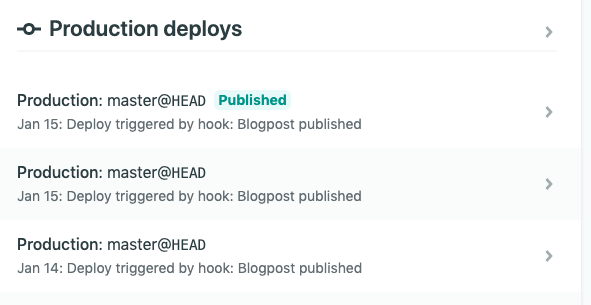

During the last few weeks, I've covered most steps I took when moving from WordPress to a headless WordPress setup with Gatsby. One of the questions I often see is, "how do I update my Gatsby site when a post is published or updated?". In this tutorial, I'll cover what you need to know.

As I've mentioned before, [Gatsby](https://www.gatsbyjs.org/) is a static site generator, and thus, requires compilation to get your site live. When you're hosting your content in the same repository as your Gatsby code (for example with Markdown), there's no problem. In that case, you configure your CI server ([GitHub Actions](https://github.com/features/actions), [Travis CI](https://travis-ci.org/), [AWS CodePipeline](https://aws.amazon.com/codepipeline/), [Netlify Deploy](https://www.netlify.com/), ...) to build whenever a new commit is made, and that's it.

For a headless CMS on the other hand, it's a bit more difficult. For example, let's say I made a typo in a WordPress post, and I update it. There's no code change, and thus, no build is automatically triggered. You could manually trigger a build, but that would be really tedious.

### Setting up a webhook

The first thing we have to do is to make sure we can call our CI server from outside. For Netlify, this can be done by going to the **Settings** of your project, and selecting **Build & deploy**. In here, you can find a section called **Build hooks** that allows you to create a new webhook.


If you're using **AWS CodePipeline**, you can refer to [the documentation about creating a webhook](https://docs.aws.amazon.com/AWSCloudFormation/latest/UserGuide/aws-resource-codepipeline-webhook.html). As authentication, I would suggest to either use an unauthenticated setup, or an IP, and by whitelisting the IP of the server where WordPress is hosted on.

For **Travis CI**, you'll have to use their API to trigger a new build. To do this, you can refer to [their documentation](https://docs.travis-ci.com/user/triggering-builds/).

A similar thing can be done with **Jenkins**. Within [their documentation](https://wiki.jenkins.io/display/JENKINS/Remote+access+API), you can find out how to remotely trigger a new build using their API.

### Using WordPress hooks

Once you've found out how to trigger a build remotely, you can start puzzling together a WordPress plugin that calls the webhook or uses the given API.

To be able to do something when a WordPress post or page is updated, we'll have to use their [Action hook API](https://codex.wordpress.org/Plugin_API/Action_Reference). First of all, we can listen to the `publish_post` and `publish_page` hooks. These hooks are fired when a post or page are manually published. They're not fired when a post is published automatically after being scheduled.

You can also use the `publish_{custom type}` hook if you're using custom WordPress entities other than posts and pages.

The arguments that are passed to the hook are the post ID, and the actual post itself. To register a hook, you could write the following code:

```php
<?php
add_action('publish_post', 'nb_webhook_post', 10, 2);
add_action('publish_page', 'nb_webhook_post', 10, 2);


function nb_webhook_post($post_id, $post) {
  // TODO: Implement
}
?>
```

### Listening for updates

While the previously used hooks work perfectly for when a post is published, it's also useful to listen for posts being updated. To do this, you can use the `post_updated` hook.

The arguments passed to this hook are the post ID, the updated post, and the original post. Important to know is that this hook is fired when a post is updated, regardless of whether it was published or not. This means you have to filter out updates for posts that haven't been published yet:

```php
<?php
add_action('publish_post', 'nb_webhook_post', 10, 2);
add_action('publish_page', 'nb_webhook_post', 10, 2);
add_action('post_updated', 'nb_webhook_update', 10, 3);

function nb_webhook_update($post_id, $post_after, $post_before) {
  nb_webhook_post($post_id, $post_after);
}

function nb_webhook_post($post_id, $post) {
  if ($post->post_status === 'publish') {
    // TODO: Implement
  }
}
?>
```

In this code, we're using a separate `nb_webhook_update()` function that calls the `nb_webhook_post()` method we defined before. Additionally, I've implemented an `if()` statement to check the `post_status`.

### Working with schedules

As I've mentioned before, the previously used hooks aren't fired when a post is published after being scheduled. To listen for posts being published this way, we have to use the `publish_future_post` hook.

This hook only passes the post ID, so if we're interested in retrieving the post itself, we can use the `get_post()` function:

```php
<?php
add_action('publish_future_post', 'nb_webhook_future_post', 10);
add_action('publish_post', 'nb_webhook_post', 10, 2);
add_action('publish_page', 'nb_webhook_post', 10, 2);
add_action('post_updated', 'nb_webhook_update', 10, 3);

function nb_webhook_future_post( $post_id ) {
  nb_webhook_post($post_id, get_post($post_id));
}

function nb_webhook_update($post_id, $post_after, $post_before) {
  nb_webhook_post($post_id, $post_after);
}

function nb_webhook_post($post_id, $post) {
  if ($post->post_status === 'publish') {
    // TODO: Implement
  }
}
?>
```

When using this code, the `nb_webhook_post()` method will be called if a post is published manually, updated or published automatically after a schedule.

### Calling our webhook

The final step within the WordPress plugin is to call the webhook or the API to trigger a new build. If you're using Netlify or an unauthenticated AWS CodePipeline webhook, you can use the [PHP cURL library](https://www.php.net/manual/en/book.curl.php):

```php
function nb_webhook_post($post_id, $post) {
  if ($post->post_status === 'publish') {
    $url = curl_init('https://api.netlify.com/build_hooks/id-of-my-webhook');
    curl_setopt($url, CURLOPT_CUSTOMREQUEST, 'POST');
    curl_setopt($url, CURLOPT_RETURNTRANSFER, true);
    curl_exec($url);
  }
}
```

### Installing the WordPress plugin

To be able to use your WordPress plugin, you have to create a new folder in **wp-content/plugins** containing the name of the plugin. For example, in my case I want to call the plugin **netlify-build-hook** and thus I created a folder called **wp-content/plugins/netlify-build-hook/**.

Additionally, you have to add some metadata to the top of your PHP code so that WordPress can pick it up. To do this, you have to add the following comment:

```php
<?php
/**
 * Plugin Name: Netlify build hook
 * Plugin URI: https://dimitr.im
 * Description: Call webhook when WordPress post is published
 * Version: 1.0
 * Author: g00glen00b
 * Author URI: https://dimitr.im
 */  

// Implementation
?>
```

Finally, you have to call the PHP file the same as your plugin folder name, such as **wp-content/plugins/netlify-build-hook/netlify-build-hook.php**. After that, you have to activate the plugin in WordPress itself by logging in and going to the **Plugins** section.


If you're using Netlify, and you published a post, you should see the builds appear with the name you used for the webhook:



And there you have it, you're now able to automatically update your Gatsby site when you change your content on WordPress. If you're interested in the full plugin code, you can check out [this gist](https://gist.github.com/g00glen00b/94423e94d115e2b797c1343375bc01a4).
