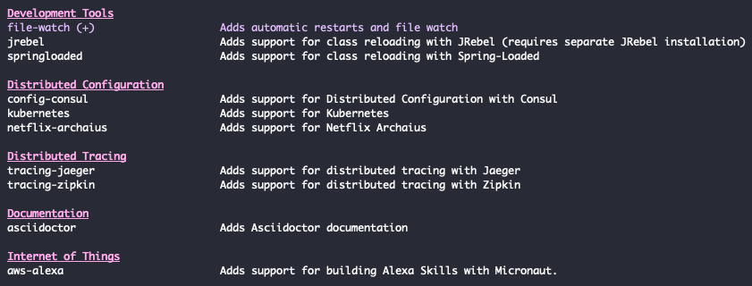

Micronaut is a new open source Java framework. It differentiates from other frameworks by reducing the amount of reflection it uses. This has several benefits, such as a lower memory footprint, and a lower startup time. Additionally, it allows for a better integration with ahead of time compilers like [GraalVM](https://www.graalvm.org/).

While these advantages are not always important, there are a few use cases where they become very relevant, such as microservices and serverless functions. No worries though if you're developing a different type of application, [Micronaut](https://micronaut.io/) has you covered as well!

In this example, I'll write a small microservice from scratch, and explore what Micronaut has to offer.

Since this will be a very lengthy tutorial, here are some links to navigate:

1. [Getting started](#getting-started)
2. [Setting up the database](#setting-up-the-database)
3. [Dependency management](#dependency-management)
4. [Setting up test data](#setting-up-test-data)
5. [Accessing the database](#accessing-the-database)
6. [Defining the API](#defining-the-api)
7. [Working with exception handlers](#working-with-exception-handlers)
8. [Using OpenAPI and Swagger](#using-openapi-and-swagger)
9. [Using Swagger UI](#using-swagger-ui)
10. [Using GraalVM](#using-graalvm)
11. [Starting your native image with Docker](#starting-your-native-image-with-docker)
12. [Summary](#summary)

### Getting started

The easiest way to create a Micronaut project, is through the Micronaut CLI. There are several ways you can install the Micronaut CLI, so take a look at the [installation guide](https://micronaut-projects.github.io/micronaut-starter/latest/guide/#installation) and come back once you're set.

To see what's possible with the Micronaut CLI, you can use the following command:

```
mn --help
```

This shows that Micronaut is not only capable of being a framework for microservices, but also for anything else (regular applications, CLI applications, messaging, ...).

In this tutorial, we'll write a regular application/microservice. Another thing that's nice to explore with the CLI is the features that are available. This can be seen using the following command:

```
mn create-app --list-features
```



For this example, I'll use the following features:

- **flyway**: This allows us to use database migrations to set up the database.
- **mariadb**: Since we'll be using a database, I'm going to select MariaDB, which is a fork of MySQL.
- **data-jdbc**: With the Micronaut data JDBC project, we have a lightweight ORM framework at our disposal. Allowing us to map SQL records to Java objects, and perform CRUD operations.
- **graalvm**: As mentioned before, GraalVM is an Ahead of Time compiler, and compiles our Java application into a native image, which allows us to start our application even faster than before.
- **openapi**: As we'll be exposing an API within our microservice, some documentation would be great. With the OpenAPI specification, we can do that.


To generate the application with these features, we can use the following command:

```
mn create-app \
  --features=flyway,mariadb,data-jdbc,graalvm,openapi \
  --java-version=11 \
  be.g00glen00b.apps.employee-service
```

When we execute this command, a new project will be generated within a folder called **employee-service**. We can open this within our favourite IDE and start developing. We also configure the Java version to be Java 11, since that's the latest LTS version. 

Once you opened the project in your IDE, you can find relevant links to the documentation within the generated **README.md** file.

### Setting up the database

To set up a database, I'll use a Docker container. The easiest way to do this, is to use Docker compose. With Docker compose, you can describe what your container should look like using YAML. So, let's start by creating a **docker-compose.yml** file, and to add the following content:

```yaml
version: '3.8'

employee-db:
  image: mariadb:10
  ports:
    - 3306:3306
  environment:
    - MYSQL_ROOT_PASSWORD=t0p$ecret
    - MYSQL_DATABASE=employees
    - MYSQL_USER=dbuser
    - MYSQL_PASSWORD=dbpass
  networks:
    employee-network:
      aliases:
        - database
  volumes:
    - ./data/:/var/lib/mysql
networks:
  employee-network:
```

When we want to use a Docker container, we have to tell which image we want to use. In this case, we'll use version 10 of the official [MariaDB Docker image](https://hub.docker.com/_/mariadb).  By default, you can't access any port of a Docker container. To be able to run our application locally, and still use our Docker container, we can use port forwarding. To make things easy, we'll forward port 3306 of the container, to port 3306 on our host machine. This will allow us to access the database by calling `localhost:3306`.

In addition, we have to configure a few environment variables to configure the user and the name of the database.

Another important thing is that we'll create a network with the name "employee-network" and add our database container to it with the alias "database". For now, this isn't really important, but if we want to run our microservice as a Docker container as well, these networks allow us to communicate between containers.

The final bit of configuration is the volume. Each time we recreate the container, all our data would be lost. To prevent this from happening, we can map specific folders within the Docker container to a folder on our host machine. Since MariaDB stores every important data within **/var/lib/mysql**, we'll map that folder to a relative folder called **./data/**.

Now that we configured the database, we can start it by using the following command:

```
docker-compose up
```

### Dependency management

By default, Micronaut uses Gradle to manage its dependencies. To see exactly which dependencies we use, we can check the **build.gradle** file. What's important to remember from this is that Micronaut relies heavily on annotation processors. These annotation processors generate code or metadata about the annotations that are being used at build time. This is different from other libraries, which often use reflection to look up information about these annotations at runtime. The downside of that is that reflection takes time, and to optimize this, many libraries use caches, which means that it also costs extra memory.

One library I want to add to this file is [Lombok](https://projectlombok.org/). Lombok generates code for us, such as getters, setters and so on. Like Micronaut, it uses an annotation processor to do this. Since Micronaut should be aware of it, it's important to add the Lombok annotation processor **before** the Micronaut annotation processors.

These are the dependencies I added:

```groovy
compileOnly('org.projectlombok:lombok:1.18.12')
annotationProcessor('org.projectlombok:lombok:1.18.12')
```

### Setting up test data

The first thing I want to do is to set up the database with some tables and test data. As mentioned earlier, I'll use Flyway to do that. Flyway works by executing versioned SQL files from certain location. First, we'll have to configure how to connect to the database. To do this, we open the **application.yml** file within **src/main/resources**, and change the existing datasource configuration to this:

```yaml
datasources:
  default:
    url: jdbc:mariadb://localhost:3306/employees
    driverClassName: org.mariadb.jdbc.Driver
    username: dbuser
    password: dbpass
    schema-generate: NONE
    dialect: MYSQL
```

Make sure to use the same credentials as within your **docker-compose.yml** file. In addition, since we'll use Flyway to generate our tables, I've disabled schema generation with Micronaut. Additionally, I'll configure Flyway, by adding the following configuration:

```yaml
flyway:
  datasources:
    default:
      enabled: true
      locations:
        - classpath:db/migration
```

By doing this, we tell Flyway to use the default datasource, and to read SQL files from the **db/migration** classpath folder. Now, since **src/main/resources** is a classpath folder, we can create this folder here, and then create a file called **V1\_\_create\_employees\_table.sql**. Be aware, Flyway relies on a specific naming convention, where you start with the version, and then a description. Flyway will then properly execute these SQL files in the right order.

Within this SQL file, we can create our table:

```sql
create table employee (
    id int not null primary key auto_increment,
    name varchar(64) not null,
    title varchar(64) not null,
    startdate date not null
);
```

Now, if we also want to add test data, we could add it to the same file, create a new version, ... . I usually prefer creating a separate file called **afterMigrate.sql**. Within this file, I generated some random employees:

```sql
delete from employee;

insert into employee (name, startdate, title) values
    ('Dimitri Mestdagh', '2012-07-01', 'Full-stack developer'),
    ('Rosemarie Clucas', '2002-07-21', 'Sales Representative'),
    ('Emmalynne Lutton', '2010-06-14', 'Programmer I'),
    ('Donny Lambertson', '2003-06-10', 'Junior Executive'),
    ('Lilli Seckington', '2018-01-18', 'Software Test Engineer II'),
    ('Pace Heathcoat', '2015-11-22', 'Geological Engineer'),
    ('Leonard Ceney', '2008-02-02', 'Financial Analyst'),
    ('Talbot Coo', '2003-06-22', 'Cost Accountant'),
    ('Nicki Eilhart', '2005-04-09', 'Senior Developer'),
    ('Oralee Tregido', '2001-07-25', 'Help Desk Operator'),
    ('Floria Cristofvao', '2000-05-25', 'Nuclear Power Engineer'),
    ('Maxie Cosgrove', '2019-04-04', 'Research Nurse'),
    ('Hillary Standish-Brooks', '2009-03-02', 'Electrical Engineer'),
    ('Candra Calloway', '2018-08-14', 'Marketing Assistant'),
    ('Nellie Binden', '2016-07-19', 'Computer Systems Analyst IV'),
    ('Amberly Jerzycowski', '2012-01-13', 'Human Resources Manager'),
    ('Kellia MacAlpyne', '2010-02-14', 'Marketing Manager'),
    ('Tommy Dawtry', '2004-12-31', 'Environmental Specialist'),
    ('Cyndie Abethell', '2012-05-01', 'Account Coordinator'),
    ('Eimile Rivett', '2001-12-14', 'Electrical Engineer'),
    ('Herculie Matzel', '2004-08-12', 'Health Coach IV');
```

### Accessing the database

Now that we have our test data, it's time to write some code to access the database. First, we have to create a Java class to represent the table we just created. To do this, I created the following class:

```java
@MappedEntity
@Getter
@Setter
@NoArgsConstructor
@AllArgsConstructor
public class Employee {
    @Id
    @GeneratedValue
    private long id;
    private String name;
    private String title;
    private LocalDate startdate;
}
```

Within this class, we use Micronaut specific annotations, such as `@MappedEntity`to clarify that this is a Micronaut JDBC entity for the "employee" table. Other Micronaut Data annotations we use are `@Id` and `@GeneratedValue` to clarify that this field is the unique identifier, and will be generated by the database. 

If you're familiar with JPA or Hibernate, you'll recognize most of these annotations. However, JPA/Hibernate is a different framework than the one we're using right now. However, as mentioned before, the cool stuff of Micronaut happens within their annotation processors. Because of this, they even made it possible for you to use JPA annotations with the Micronaut Data JDBC project, so without actually using a JPA vendor like Hibernate!

In addition, we're also using Lombok annotations to generate getters, setters, and some constructors.

Next to this class, we also need something to actually retrieve or insert these objects. Within Micronaut, we can do that by defining a repository. A repository is nothing more than an interface that uses a naming convention to generate operations. For example:

```java
@JdbcRepository(dialect = Dialect.MYSQL)
public interface EmployeeRepository {
    Page<Employee> findAll(Pageable pageable);
    Optional<Employee> findById(long id);
}
```

By annotating this interface with `@JdbcRepository`, Micronaut knows that it should generate code for this interface.  Within this interface, we defined two methods. Since we named the first method `findAll()`, and it uses a `Pageable` parameter, Micronaut knows that this method will be used to select all records paginated.

From the second method, it's clear to Micronaut that it should generate a query that uses a where-clause to select a record by its id field.

However, since these are two very common methods, Micronaut provided some interfaces you could extend from, which already contain these methods. That means you can replace the code above with the following:

```java
@JdbcRepository(dialect = Dialect.MYSQL)
public interface EmployeeRepository extends PageableRepository<Employee, Long> {
}
```

### Defining the API

Now that we can retrieve our data from a database, it's time to define the API we'll provide. Like many frameworks, we do this by creating a controller.

Within this controller, we define a constructor that accepts an `EmployeeRepository` parameter, which will be injected by Micronaut. 

```java
@Controller("/api/employee")
@RequiredArgsConstructor
public class EmployeeController {
    private final EmployeeRepository repository;
}
```

In addition to that, we use the `@Controller` annotation to tell Micronaut that this will expose some endpoints. The value that we pass is the base path, in our case **/api/employee**.

Within this controller, we can define all operations as methods. For example, if we want to retrieve all employees, we can create a method like this:

```java
@Get
public Page<Employee> findAll(Pageable pageable) {
  	return repository.findAll(pageable);
}
```

By using the `@Get` annotation, we will be able to send a GET request to /api/employee to retrieve the employees. We're returning the whole page object because it contains some metadata that could be useful, such as the total amount of elements and so on.

By declaring the `Pageable` object as a parameter, we can use parameters like `sort`, `page` and `size` to retrieve certain employees. For example, let's say that we're building an application that requires us to fetch the first five employees, sorted by their name, then we could call **/api/employee?page=0&size=5&sort=name**.

One thing you'll notice if you run this is that the API returns the startdate of an employee as an array of numbers, for example `[2020, 9, 6]`. I prefer using ISO dates (`2020-09-06`), so I usually disable this feature. This can be done by adding the following property to **application.yml**:

```yaml
jackson.serialization.writeDatesAsTimestamps: false
```


Another problem I ran into is that due to the `Page` class implementing the `Iterable` interface, sometimes, the API returns the response as an array rather than an object containing content (like the screenshot above). To fix that, we could create a proper DTO ourselves:

```java
@Value
@Introspected
public class EmployeePage {
    List<Employee> content;
    int totalPages;
    long totalSize;
    int numberOfElements;
    long offset;
    int pagenumber;
    int size;
    boolean empty;

    public EmployeePage(Page<Employee> page) {
        this.totalPages = page.getTotalPages();
        this.totalSize = page.getTotalSize();
        this.numberOfElements = page.getNumberOfElements();
        this.offset = page.getOffset();
        this.pagenumber = page.getPageNumber();
        this.size = page.getSize();
        this.empty = page.isEmpty();
        this.content = page.getContent();
    }
}
```

We're using the `@Value` annotation here to create an immutable value object with Lombok, which only provides getters, and a required argument constructor. In addition, we use the `@Introspected` annotation to generate bean introspection metadata for Jackson to use. This is necessary if you want to use it later within a native image.

Now we can refactor the controller to use `EmployeePage` in stead:

```java
@Get
public EmployeePage findAll(Pageable pageable) {
    return new EmployeePage(repository.findAll(pageable));
}
```

### Working with exception handlers

Often, when you write business logic, you want to throw some exceptions. The question is, how do we handle these exceptions within our API? The HTTP specification has us covered here. Usually, we will return a status within the 200 range, which means that the response is OK.

If we send a status within the 400 range, it means there is a client error, such as missing input info, ... . Finally, there is also a 500 range, which we use when there is a server error, such as a failure to connect to the database and so on.

In our case, we have a `findById()` operation that could return an employee by its ID, but if we enter an invalid ID, we can return a 404 Not found.

To do this, we first create the exception itself:

```java
@RequiredArgsConstructor
public class EmployeeNotFoundException extends RuntimeException {
    private final long employeeId;

    @Override
    public String getMessage() {
        return "Employee with ID '" + employeeId + "' was not found";
    }
}
```

Then, we can define our API within the controller like before, but this time, we'll throw an exception if no employee could be found with the given ID:

```java
@Get("/{id}")
public Employee findById(@PathVariable long id) {
    return repository
        .findById(id)
        .orElseThrow(() -> new EmployeeNotFoundException(id));
}
```

The way we can call this API is by using **/api/employee/1234**. Micronaut knows that it has to pass the "1234" value to the `id` parameter because it's annotated with `@PathVariable` and the name matches the `{id}` placeholder.
Within the method, we use the Java 8 `Optional` API to throw an exception if the result is empty.

Before we create the exception handler, we also want to create a class to contain the error response. We could return the error as plain text, but sometimes you want to add additional info. So this is why I created the `ErrorMessage` class:

```java
@Value
@Introspected
public class ErrorMessage {
    String message;
    String errorCode;
}
```

The next step is to create a new class to handle the `EmployeeNotFoundException` by implementing the `io.micronaut.http.server.exceptions.ExceptionHandler` interface:

```java
@Singleton
@Requires(classes = EmployeeNotFoundException.class)
public class EmployeeNotFoundExceptionHandler implements ExceptionHandler<EmployeeNotFoundException, HttpResponse<ErrorMessage>> {

    @Override
    public HttpResponse<ErrorMessage> handle(HttpRequest request, EmployeeNotFoundException exception) {
        return null; // TODO
    }
}
```

This interface requires us to pass the exception, and the response type as generics. In addition, it defines a single method called `handle`, which will pass the request itself and the exception, and expects an `HttpResponse` in return.

To tell Micronaut to pick up this class, we'll use the `@Singleton` annotation. We can also tell Micronaut to pick up this bean if  `EmployeeNotFoundException` is available, but this is not required.

As a final step, we can implement the `handle()` method like this:

```java
@Override
public HttpResponse<ErrorMessage> handle(HttpRequest request, EmployeeNotFoundException exception) {
    return HttpResponse.notFound(new ErrorMessage(exception.getMessage(), "NOT_FOUND"));
}
```

In this case, we're returning the status **404 Not found** in addition to the response body containing both the error message as an error code.

### Using OpenAPI and Swagger

Swagger is an ecosystem consisting of various tools centered around the OpenAPI specification that documents an API. It is very interesting for other people to know how they can call your API.


With Micronaut, we can generate this YAML specification based on our controllers. The YAML specification also has a section for general information about your API. This section can be configured by changing the `@OpenAPIDefinition` annotation on your `Application` class. 

For example:

```java
@OpenAPIDefinition(
    info = @Info(
        title = "employee-service",
        version = "1.0",
        description = "Employee API",
        contact = @Contact(url = "https://dimitr.im", name = "Dimitri")))
public class Application {

    public static void main(String[] args) {
        Micronaut.run(Application.class);
    }
}
```

If you build your project now (using (`./gradlew build`), Gradle generates the OpenAPI YAML specification within the **build/classes/java/main/META-INF/swagger** folder.  Here you'll see that the info we just added, is available as well:

```yaml
openapi: 3.0.1
info:
  title: employee-service
  description: Employee API
  contact:
    name: Dimitri
    url: "https://dimitr.im"
  version: "1.0"
```

One problem is that the generation tool isn't aware that Micronaut translates the page, size and sort parameters to a `Pageable`. We can fix that by overriding the parameters by declaring additional annotations to our controllers. For example:

```java
@Get
@Operation(parameters = {
    @Parameter(
        name = "page",
        schema = @Schema(type = "integer", minimum = "0"),
        in = ParameterIn.QUERY,
        description = "Zero based page number of the employees you want to retrieve"),
    @Parameter(
        name = "size",
        schema = @Schema(type = "integer", minimum = "1"),
        in = ParameterIn.QUERY,
        description = "The amount of employees you want to retrieve"),
    @Parameter(
        name = "sort",
        schema = @Schema(type = "string", allowableValues = {"id", "name", "title", "startdate"}),
        in = ParameterIn.QUERY,
        description = "The field by which can be sorted"),
    })
})
public EmployeePage findAll(Pageable pageable) {
    return new EmployeePage(repository.findAll(pageable));
}
```

Within the `findById()` method, we can also use the `@Operation` annotation. This time we won't use it to override the parameters, but to document that this API may return a **404 Not found** if the employee with the given ID does not exist:

```java
@Get("/{id}")
@Operation(responses = {
    @ApiResponse(
        responseCode = "200",
        content = @Content(schema = @Schema(implementation = Employee.class)),
        description = "Successful request"),
    @ApiResponse(
        responseCode = "404",
        content = @Content(schema = @Schema(implementation = ErrorMessage.class)),
        description = "Employee with the given ID does not exist")
})
public Employee findById(@PathVariable long id) {
    return repository
        .findById(id)
        .orElseThrow(() -> new EmployeeNotFoundException(id));
}
```

Now the generated YAML file will contain a lot more useful information about our API.

### Using Swagger UI

Right now, the OpenAPI integration will only generate a YAML file. However, as I mentioned before, there's an entire ecosystem of tools that work upon this YAML specification.

For example, there is a user interface that we can generate, and that can be used to test our API. To enable this feature, create a file called **openapi.properties** in the root of your project and adding the following content:

```properties
swagger-ui.enabled=true
```

If you build your project now, you'll see that Gradle not only generated the YAML file, but also a folder called **views/**. By default, it will only generate the necessary HTML file. If you want to serve it together with your application, you can use the router configuration of Micronaut.

To do this, add the following to **application.yml**:

```yaml
micronaut:
  router:
    static-resources:
      swagger:
        paths: classpath:META-INF/swagger
        mapping: /swagger/**
```

Beware, if you generated your application with the Micronaut CLI, you already have a property `micronaut.application.name`. If that's the case, you need to structure your properties like this:

```yaml
micronaut:
  application:
    name: employeeService
  router:
    static-resources:
      swagger:
        paths: classpath:META-INF/swagger
        mapping: /swagger/**
```

If you run the application now, and visit http://localhost:8080/swagger/views/swagger-ui/, you'll see the user interface in action. Now you can start playing with it!


### Using GraalVM

As I mentioned before, in combination with GraalVM, we can create blazing fast microservices that start up in a few milliseconds. Luckily for us, Micronaut already did the heavy lifting, and generated a **Dockerfile** that contains the steps to build a native image from our microservice.

If we take a look at this file, we'll see that this is a multi-image Dockerfile. First, there are the steps necessary to build a native image from our application:

```dockerfile
FROM oracle/graalvm-ce:20.1.0-java11 as graalvm
RUN gu install native-image

COPY ../../../.. /home/app/employee-service
WORKDIR /home/app/employee-service

RUN native-image --no-server -cp build/libs/employee-service-*-all.jar
```

What happens here is that we start with the GraalVM image and install the `native-image` command. After that, we copy over the JAR file from our local system, and run the `native-image` command to build it.

```dockerfile
FROM frolvlad/alpine-glibc
RUN apk update && apk add libstdc++
EXPOSE 8080
COPY --from=graalvm /home/app/employee-service/employee-service /app/employee-service
ENTRYPOINT ["/app/employee-service"]
```

The second image copies over the generated executable from the first image, and runs it. The nice part is that since this is a simple executable, we can run it within a very lightweight Linux container.

Now, there is one problem with the current implementation of this Dockerfile. Since I'll be using Docker compose to run the containers, it will start up simultaneous with the database. However, since it's so fast, it will throw an error because it can't connect to the database yet.

A solution to that problem is to wait for the database before starting the application. Since this is a common issue, there are tools for it like [**wait-for**](https://github.com/Eficode/wait-for). Copy the [Shell script](https://github.com/eficode/wait-for/blob/master/wait-for) from the GitHub repository to your project, and replace the last line of the **Dockerfile** with these two lines:

```dockerfile
COPY wait-for /app/wait-for
CMD /app/wait-for $DATABASE_HOST:$DATABASE_PORT -t 15 -- /app/employee-service
```

This will check if the database is running before starting the application. Later on, we'll define the `DATABASE_HOST` and `DATABASE_PORT` environment variables to make this work.

 Before we start building, we also have to make sure that the wait-for script we downloaded, is executable. To do this, open a terminal and enter the following:

```shell
chmod +x ./wait-for
```

Docker not only copies over the file, but also copies the metadata. That means that if we make the shellscript executable on our system, it will also be executable within the Docker container.

Before we start building the Docker image, there are a few things to be aware of. First, this build process can take a while, on my local system it takes up to 8 minutes to completely build the native image. In addition, it also requires a lot of memory. If you're noticing out of memory errors, open up Docker, and increase the amount of memory.


When that's done, you can build the Docker image by executing the following commands:

```shell
./gradlew assemble
./docker-build.sh
```

Be aware, the Swagger UI views will only work if you're using Micronaut **2.0.1** or higher. If you're using a lower version, you'll have to manually add the Swagger UI resources to the GraalVM build process. To see what version of Micronaut you're using, you can open **gradle.properties**.

### Starting your native image with Docker

Now that we have our Docker image generated, we can open **docker-compose.yml** to add our application container.

```yaml
version: '3.8'

services:
  employee-db:
    # ...
  employee-service:
    image: employee-service:latest
    ports:
      - 8080:8080
    environment:
      - DATABASE_HOST=employee-db
      - DATABASE_PORT=3306
      - DATASOURCES_DEFAULT_URL=jdbc:mariadb://employee-db:3306/employees
    networks:
      employee-network:
        aliases:
          - employee-service
networks:
  employee-network:
```

A few things to be aware of here. As I mentioned earlier, we defined the **employee-network** network because we want to be able to talk to our database from within the application container. This allows us to talk to the database by using its alias (employee-db) as the hostname.

That allows us to configure the `DATABASE_HOST` and `DATABASE_PORT` environment variables that we used before. In addition, since our **application.yml** contains a property `datasources.default.url`, we have to override that as well. Luckily, Micronaut allows us to override application properties by using environment variables with the same name. To do this, use uppercase letters and replace the dots with underscores.

Once that's done, you can run both images by using the following command. Make sure to stop your locally running application beforehand, so that port 8080 is available.

```shell
docker-compose up
```

Once you start the application, you'll see that it starts really fast. According to the internet, a blink of an eye takes about 100 milliseconds. That means we can safely say that we can start microservices faster than the blink of an eye with Micronaut and GraalVM.


### Summary

Summarized, Micronaut is a very interesting framework that uses quite a different approach than others on the market. By doing so, it allows you to write very fast running microservices that require less resources. Be aware though, since these annotation processors run at build time, your builds may take longer.

Personally, I really loved trying out Micronaut. If there's one downside I'd have to mention is that after using Spring through all these years, I started to get used to the quality of the documentation they have. While Micronauts documentation is also very great, sometimes it took me a while to find certain things in the documentation (but that might be my personal experience).

Thanks for making it to the end of this lengthy tutorial. As usual, you can find the code that I used for this example on [GitHub](https://github.com/g00glen00b/micronaut-examples/tree/master/employee-service-openapi).
