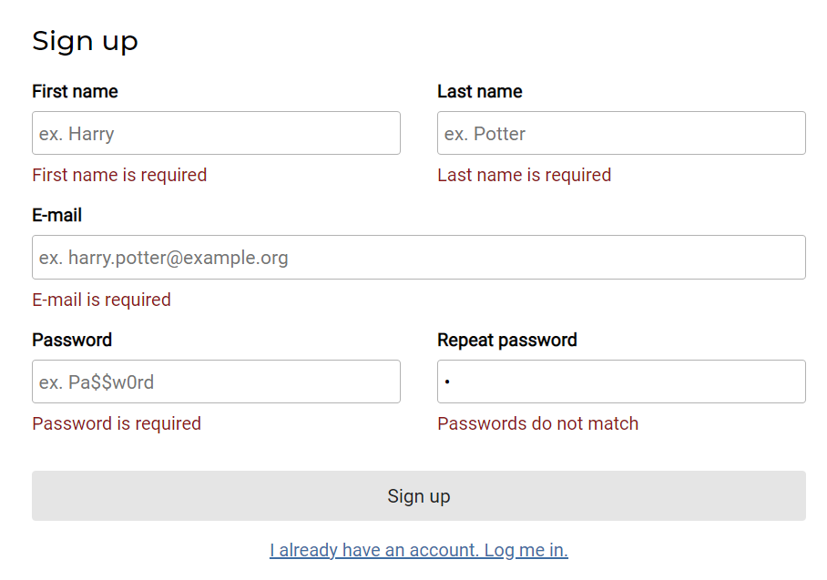

### Contents

1. [Introduction](#introduction)
2. [Identifying the generic parts](#identifying-the-generic-parts)
3. [Creating a hook](#creating-a-hook)
4. [Setting up the initial state](#setting-up-the-initial-state)
5. [Updating the state](#updating-the-state)
6. [Validating the form](#validating-the-form)
7. [Keeping track of the fields that have changed](#keeping-track-of-the-fields-that-have-changed)
8. [Preventing the page from reloading](#preventing-the-page-from-reloading)
9. [Putting everything together](#putting-everything-together)

### Introduction

A common task when writing frontend applications is to work with forms.
While these forms can contain several kind of fields, the way we program them, is generally the same.

With React hooks, we would probably do something like this:

```jsx
export const SignupForm = (onSignup) => {
  const [email, setEmail] = useState('');
  const isValid = email != null && email.trim().length > 0;
  const handleSubmit = event => {
    event.preventDefault();
    onSignup({email});
  };
  
  return (
    <form onSubmit={handleSubmit}>
      <label>Email</label>
      <input
        type="email"
        required
        value={email}
        onChange={event => setEmail(event.target.value)} />
      <button
        disabled={!isValid}>
        Sign up
      </button>
    </form>
  );
};
```

If you're new to React, this is what this code does. 
First of all, we use the `useState()` hook to manage the email state of the `SignupForm` component.
Initially, we start with an empty e-mail address, which is why we pass an empty string to the `useState` hook.

To update the value of the `email` state, we define an `onChange` event handler. 
Within this event handler we retrieve the value from the input element, and pass it to the `setEmail` function. 

After that, we also want to apply some form validation. We can do that by writing several conditions and disabling the submit button when these validations are not met.
For example, in this example we made an `isValid` variable that is only truthy if the `email` is not empty.

And finally, if all validations are met and someone presses the button, an `onSubmit` event will be called on the form.
To prevent the page from refreshing, we commonly use `event.preventDefault()`, which is what I did within the `handleSubmit` function.
In addition, we pass the email to the `onSignup` function, which can be used by the parent component to call certain APIs.

### Identifying the generic parts

You may wonder, what's wrong with this code? 
Well, if you look at this code, you'll notice that some parts of this code is reusable across other form components.

Examples of this are:

- The way we update the state depending on the value of a form element.
- Applying form validations and disabling controls based upon it.
- Preventing the page from refreshing after a form is submit.

In this tutorial we'll explore how we can write a generic `useForm()` React hook.

### Creating a hook

Creating a React hook is quite simple. React hooks are simply said nothing more than a function that starts with the term "use", such as `useState()`, `useEffect()` and so on.
Writing a React hook means that you write a function by yourself, such as:

```jsx
function useForm() {
  
}
```

What's interesting is that calling React hooks is only allowed within either a component or another React hook.
That means that we can develop this `useForm()` hook by chaining some other React hooks together.

### Setting up the initial state

The first thing we can do is to provide our initial state in a generic way. 
The first thing we'll do is move the `useState()` declaration from our component to the new hook:

```jsx
function useForm() {
  const [email, setEmail] = useState('');
  return {email};
}
```

A problem with this approach is that this isn't really generic. To fix this, we could make one state object for the entire form.
For example:

```jsx
function useForm() {
  const [values, setValues] = useState({});
  return {values};
}
```

The problem now is that we can't properly define the initial state of all our form elements. 
In order to fix this, we'll have to pass the initial state as an argument:

```jsx
function useForm(initialState = {}) {
  const [values, setValues] = useState(initialState);
  return {values};
}
```

This means that we can now change the code within our `SignupForm` to:

```jsx
export const SignupForm = (onSignup) => {
  const {values} = useForm({email: ''});
  
  return (
    <form>
      <label>Email</label>
      <input
        type="email"
        required 
        value={values.email} />
      <button>
        Sign up
      </button>
    </form>
  );
};
```

As you can see, by returning `values` from within our `useForm()` hook, we can properly link the `value` attribute of the form element to the respective state.

This can be useful for when we want to provide a default value, for example:

```jsx
export const SignupForm = (onSignup) => {
  const {values} = useForm({email: 'me@example.org'});
  
  return (
    <form>
      <label>Email</label>
      <input
        type="email"
        required 
        value={values.email} />
      <button>
        Sign up
      </button>
    </form>
  );
};
```

In the example above, the e-mail address **me@example.org** would be shown within the form.

### Updating the state

The next part is to update the state. To do this, we can write a generic on change event handler:

```jsx
function useForm(initialState = {}) {
  const [values, setValues] = useState(initialState);
  const changeHandler = event => {
    const newValues = {...values, [event.target.name]: event.target.value};
    setValues(newValues);
  }; 
  return {values, changeHandler};
}
```

The way we implement this is by creating an entirely new `values` state object with the previous values, and update only the value of the element that was changed.
To know which form element belongs to which state element, we could use the `name` attribute of the form element.

In addition to returning the `values`, we now also return the `changeHandler` function. 
This allows us to update the `SignupForm` like this:

```jsx
export const SignupForm = (onSignup) => {
  const {values, changeHandler} = useForm({email: ''});
  
  return (
    <form>
      <label>Email</label>
      <input
        type="email"
        name="email"
        required 
        value={values.email}
        onChange={changeHandler}/>
      <button>
        Sign up
      </button>
    </form>
  );
};
```

Don't forget that in addition to implementing the `onChange` event, we also have to add the `name` attribute.
This attribute should match to the name of the property within the state. In this example, that would be `email`.

### Validating the form

With the `changeHandler` implemented, we now have a generic way of setting up the state of each form.
The next step is to move the validation logic to the `useForm` hook as well.

The complexity of this part is that we want to do more than just provide a single boolean result.
A proper form should have error messages next to each field, indicating whether something is valid or not.

To implement this, I'm going to create two new state properties within the `useForm()` hook:

```jsx
function useForm(initialState = {}) {
  const [values, setValues] = useState(initialState);
  const [errors, setErrors] = useState({});
  const [isValid, setValid] = useState(true);
  const changeHandler = event => {
    const newValues = {...values, [event.target.name]: event.target.value};
    setValues(newValues);
  }; 
  return {values, changeHandler};
}
```

The goal is to make the `errors` state contain an object with an error message for each form field that is invalid.
For example:

```json
{
  "email": "E-mail is required"
}
```

To do this, I'm going to pass a list of validations as an argument to the `useForm` hook:

```jsx
function useForm(initialState = {}, validations = []) {
  const [values, setValues] = useState(initialState);
  const [errors, setErrors] = useState({});
  const [isValid, setValid] = useState(true);
  const changeHandler = event => {
    const newValues = {...values, [event.target.name]: event.target.value};
    setValues(newValues);
  }; 
  return {values, changeHandler};
}
```

The `validations` array will contain a list of functions, where each function either returns an object containing an error message, or something else if there is no error.

Each validation function will receive the entire form state as an argument. 
This is necessary because some form validations depend on two or more form field values.
For example, if we have a "password" and "repeat password" field, we want to be able to validate that both values are the same.

So, this would be the way we would call the hook:

```jsx
export const SignupForm = (onSignup) => {
  const initialState = {email: '', password: '', repeatPassword: ''};
  const validations = [
    ({email}) => isRequired(email) || {email: 'E-mail is required'},
    ({password}) => isRequired(password) || {password: 'Password is required'},
    ({password, repeatPassword}) => isSame(password, repeatPassword) || {repeatPassword: 'Passwords do not match'}
  ];
  const {values, changeHandler} = useForm(initialState, validations);
  
  // ...
};

function isRequired(value) {
  return value != null && value.trim().length > 0;
}

function isSame(value1, value2) {
  return value1 === value2;
}
```

As you can see, we did two things. First of all, we declared separate functions for our validations. 
These functions are called `isRequired()` and `isSame()`.
Ideally, you move these functions together with `useForm()` to a separate file.

The next step is that we defined a `validations` array that contains functions that contain the validation logic.
This function either returns `true` if the validation was met, or an object with an error message if the form was invalid.

Now, the next step is that we have to properly set the `errors` and `isValid` state within our `useForm()` hook.
To do this, I'm going to write a separate `validate()` function that accepts both the state and the validations, and returns the `errors` and `isValid` flag:

```jsx
function validate(validations, values) {
  const errors = validations
    .map(validation => validation(values))
    .filter(validation => typeof validation === 'object');
  return {isValid: errors.length === 0, errors: errors.reduce((errors, error) => ({...errors, ...error}), {})};
}
```

What happens here are two things. First, we call each validation function, which happens within the `map()` call.
From these results, we filter out any result that isn't an object. So, after that, we only have an array of error messages left.

The last step is to combine these errors together to a single object, which we can do with the reduce-operator.
In addition, we calculate the `isValid` flag by checking if the errors array is empty or not.

Now we can update the `useForm()` hook so that this function is called within the `changeHandler`:

```jsx
function useForm(initialState = {}, validations = []) {
  const [values, setValues] = useState(initialState);
  const [errors, setErrors] = useState({});
  const [isValid, setValid] = useState(true);
  const changeHandler = event => {
    const newValues = {...values, [event.target.name]: event.target.value};
    const {isValid, errors} = validate(validations, newValues);
    setValues(newValues);
    setValid(isValid);
    setErrors(errors);
  }; 
  return {values, changeHandler, isValid, errors};
}
```

In addition, to calling the `validate()` function, we also return the `isValid` and `errors` state so that we can use them later on within our `SignupForm` component.

Before we do that, I want to make one small change. Initially, our `isValid` and `errors` state would be incorrect, since we initialized them with `true` and an empty object respectively.
To fix this, we can call the `validate()` function for our initial state:

```jsx
function useForm(initialState = {}, validations = []) {
  const {isValid: initialIsValid, errors: initialErrors} = validate(validations, initialState);
  const [values, setValues] = useState(initialState);
  const [errors, setErrors] = useState(initialErrors);
  const [isValid, setValid] = useState(initialIsValid);
  const changeHandler = event => {
    const newValues = {...values, [event.target.name]: event.target.value};
    const {isValid, errors} = validate(validations, newValues);
    setValues(newValues);
    setValid(isValid);
    setErrors(errors);
  }; 
  return {values, changeHandler, isValid, errors};
}
```

### Keeping track of the fields that have changed

A problem we have now is that our form is initially going to be invalid.
If we show the error messages directly, the user would be overwhelmed.

To fix this, we want to show error messages only when a form element has changed.
To implement this, we can add another state to track which form elements have changed:

```jsx
function useForm(initialState = {}, validations = []) {
  const {isValid: initialIsValid, errors: initialErrors} = validate(validations, initialState);
  const [values, setValues] = useState(initialState);
  const [errors, setErrors] = useState(initialErrors);
  const [isValid, setValid] = useState(initialIsValid);
  const [touched, setTouched] = useState({}); // Add this
  const changeHandler = event => {
    const newValues = {...values, [event.target.name]: event.target.value};
    const {isValid, errors} = validate(validations, newValues);
    setValues(newValues);
    setValid(isValid);
    setErrors(errors);
  }; 
  return {values, changeHandler, isValid, errors, touched}; // Return 'touched'
}
```

Now all we have to do is to properly update the `touched` state within the `changeHandler`:

```jsx
function useForm(initialState = {}, validations = []) {
  const {isValid: initialIsValid, errors: initialErrors} = validate(validations, initialState);
  const [values, setValues] = useState(initialState);
  const [errors, setErrors] = useState(initialErrors);
  const [isValid, setValid] = useState(initialIsValid);
  const [touched, setTouched] = useState({});
  const changeHandler = event => {
    const newValues = {...values, [event.target.name]: event.target.value};
    const {isValid, errors} = validate(validations, newValues);
    setValues(newValues);
    setValid(isValid);
    setErrors(errors);
    setTouched({...touched, [event.target.name]: true}); // Add this
  }; 
  return {values, changeHandler, isValid, errors, touched};
}
```

This will allow us to conditionally show the error messages like this:

```jsx
{touched.email && errors.email && <p className="error">{errors.email}</p>} 
```

### Preventing the page from reloading

The final part to our `useForm` hook is to provide a function that prevents the form submit from reloading the page, and to trigger an arbitrary function afterwards.

To implement this, I'm going to pass a function as a parameter, and return a new function called `submitHandler`:

```jsx
function useForm(initialState = {}, validations = [], onSubmit = () => {}) { // Add the 'onSubmit' argument
  const {isValid: initialIsValid, errors: initialErrors} = validate(validations, initialState);
  const [values, setValues] = useState(initialState);
  const [errors, setErrors] = useState(initialErrors);
  const [isValid, setValid] = useState(initialIsValid);
  const [touched, setTouched] = useState({});
  const changeHandler = event => {
    const newValues = {...values, [event.target.name]: event.target.value};
    const {isValid, errors} = validate(validations, newValues);
    setValues(newValues);
    setValid(isValid);
    setErrors(errors);
    setTouched({...touched, [event.target.name]: true});
  }; 
  // Add this
  const submitHandler = event => {
    event.preventDefault();
    onSubmit(values);
  }
  return {values, changeHandler, isValid, errors, touched, submitHandler}; // Add 'submitHandler'
}
```

### Putting everything together

Now that our `useForm()` hook is complete, we can completely refactor the `SignupForm` component to use the new hook:

```jsx
export const SignupForm = (onSignup) => {
  const initialState = {email: '', password: '', repeatPassword: ''};
  const validations = [
    ({email}) => isRequired(email) || {email: 'E-mail is required'},
    ({password}) => isRequired(password) || {password: 'Password is required'},
    ({password, repeatPassword}) => isSame(password, repeatPassword) || {repeatPassword: 'Passwords do not match'}
  ];
  const {values, isValid, errors, changeHandler, submitHandler} = useForm(initialState, validations, onSignup);

  return (
    <form onSubmit={submitHandler}> <!-- Add the submitHandler -->
      <label>Email</label>
      <input
        type="email"
        name="email"
        required
        value={values.email}
        onChange={changeHandler}/>
      <!-- Add the error message -->
      {touched.email && errors.email && <p className="error">{errors.email}</p>}
      
      <!-- Add other fields -->
      
      <!-- Add the 'disabled' attribute -->
      <button
        disabled={isValid}>
        Sign up
      </button>
    </form>
  );
};
```

Now, the nice thing is that the `useForm()` hook just provides a toolkit for you to apply form validation the way you want.
In no way you're being forced to apply form validation exactly in the same way as I did. 
Even if you prefer to consolidate all error messages together or if you want to show the error messages immediately (or just after submitting), you can do so with this hook.



The nice part of React hooks is that they hide a lot of the asynchronous stuff.
Thanks to that, this `useForm()` hook even works for asynchronous validations.
For example, if you want to validate whether the e-mail has already been used, you could write something like this:

```jsx
const [isEmailUnique, setEmailUnique] = useState(true);
const initialState = {email: '', password: '', repeatPassword: ''};
const validations = [
  ({email}) => isRequired(email) || {email: 'E-mail is required'},
  () => isEmailUnique || {email: 'E-mail is already used'},
  ({password}) => isRequired(password) || {password: 'Password is required'},
  ({password, repeatPassword}) => isSame(password, repeatPassword) || {repeatPassword: 'Passwords do not match'}
];
const {values, isValid, errors, changeHandler, submitHandler} = useForm(initialState, validations, onSignup);
useEffect(() => fetchIsEmailUnique(values.email).then(setEmailUnique), [values.email]);
// ...
```

The first step is to implement a new state, such as `isEmailUnique`. 
This state is updated within an `useEffect()` hook, that calls a REST API and returns a promise.
When that promise resolves, we update the state by calling `setEmailUnique()`.
To prevent this API from being called continuously, we provide an array of parameters that have to change, such as `values.email`.

With that, we've completed our generic `useForm` hook. A full example of this hook can be found [here](https://github.com/g00glen00b/medication-assistant/blob/63da6d5166d95e34c3f18ecaec1af8a552596dde/medication-assistant-frontend/src/shared/hooks/useForm.js).
