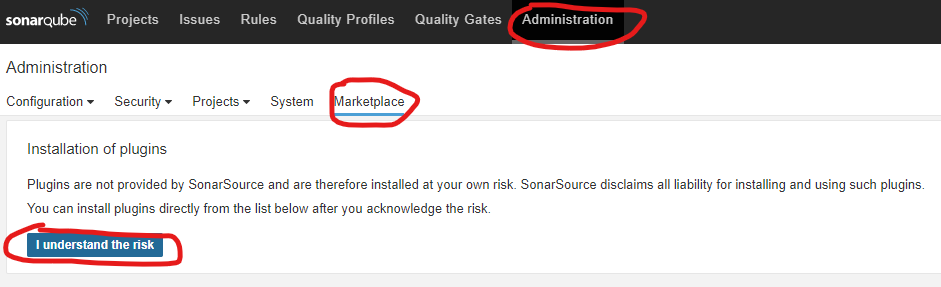
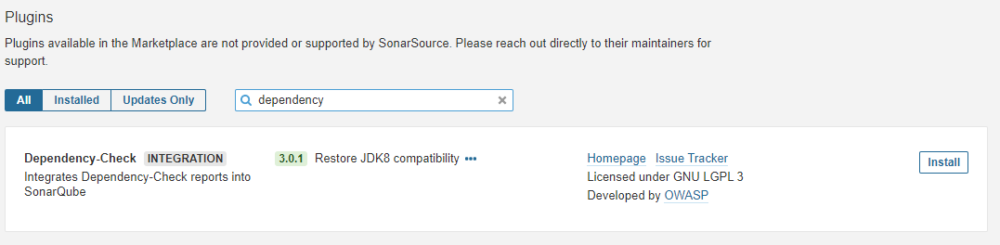
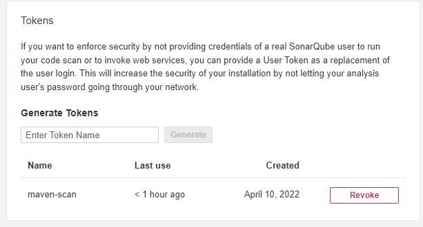
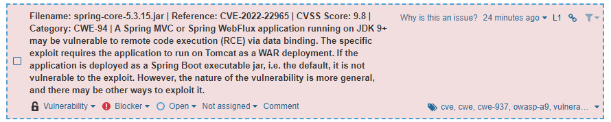

Due to recent vulnerabilities like [Log4Shell](https://en.wikipedia.org/wiki/Log4Shell) and [SpringShell](https://spring.io/blog/2022/03/31/spring-framework-rce-early-announcement), we're reminded of the importance of keeping our dependencies up-to-date.
In this tutorial, I'm going to show you how [SonarQube](https://www.sonarqube.org/) can help you with making it easier to spot these vulnerabilities.

### What is SonarQube

Before we dive into it, we first have to find out what SonarQube exactly is.
SonarQube can be seen as a reporting tool for your code.
When used, it provides information about your code coverage, code smells, security related issues and so on.

With the help of some plugins, we can also use it to report dependency vulnerabilities.

### Installing SonarQube

To be able to start, we need to have SonarQube up and running. 
One way to do so is to install the Community Edition from the [downloads](https://www.sonarqube.org/downloads/) page.

After that, you can run the script for your operating system within the bin-folder to start up SonarQube.

> **Be aware**: By default, SonarQube will run a file-database and have only a single admin-user.
> This is great for testing things out, but if you want to move to a production environment, you should properly configure SonarQube.

Once started, you can visit http://localhost:9000 and log in with the default admin-credentials (`admin:admin`).

After being prompted to fill in a new password, you'll be greeted with a blank dashboard.


### Installing the SonarQube Dependency-Check plugin

The first thing you want to do is to go to **Administration** and click on **Marketplace**.
Over there, you can install new plugins for SonarQube.
To do so, you first have to acknowledge the risk of installing plugins by clicking the **I understand the risk** button.



After that, install the [**Dependency-Check plugin**](https://github.com/dependency-check/dependency-check-sonar-plugin).



Once installed, you have to **restart SonarQube**.

### Running the Dependency Check Maven plugin

While SonarQube does a lot of things out of the box, for some other tools it requires a pre-generated report.
For example, for testing coverage, you need to generate a JaCoCo report.
The same applies to the dependency check.
To be able to use the SonarQube Dependency Check plugin, we need to generate a report first.
To do so, we use the [OWASP dependency-check Maven plugin](https://jeremylong.github.io/DependencyCheck/index.html).

You can run this plugin by opening a Maven project and executing the following command:

```shell
mvn org.owasp:dependency-check-maven:7.0.4:check
```

If you run this command, it will download a list of known vulnerabilities from several dependencies, and crosscheck them against your dependencies.
After that, it will consolidate everything into a report (**target/dependency-check-report.html**).

> **Be aware**: The download of the list of known vulnerabilities may take a few minutes.

If you're using a multi-module Maven project, you can consolidate these reports into a single file by using the **aggregate** goal:

```shell
mvn org.owasp:dependency-check-maven:7.0.4:aggregate
```

To make the SonarQube plugin work, we need to generate a **JSON** report rather than a HTML report.
To generate both an HTML and a JSON report, you can use the following command:

```shell
mvn org.owasp:dependency-check-maven:7.0.4:aggregate -Dformats=html -Dformats=json
```

Alternatively, you can define the plugin in your **pom.xml**:

```xml
<plugin>
    <groupId>org.owasp</groupId>
    <artifactId>dependency-check-maven</artifactId>
    <version>7.0.4</version>
    <executions>
        <execution>
            <goals>
                <goal>aggregate</goal>
            </goals>
         </execution>
    </executions>
    <configuration>
        <formats>
            <format>json</format>
            <format>html</format>
        </formats>
    </configuration>
</plugin>
```

By default, it will execute the plugin during the **verify phase**.
This means you can execute the plugin by using the following command:

```shell
mvn verify
```

### Generating a SonarQube API token

To scan a project with SonarQube, we can either use a continuous integration pipeline (eg. on Jenkins) or run the [**SonarScanner for Maven plugin**](https://docs.sonarqube.org/latest/analysis/scan/sonarscanner-for-maven/).
Before we can do this, we need to generate an API token in SonarQube.

You can generate an API token by clicking on your avatar on the top right corner and selecting **My Account** from the dropdown.


After that, click the **Security** tab and choose a name for your API token.
After doing so, you can copy the API token.



### Running a SonarQube scan

The next step is to tell SonarQube where to find our dependency check reports.
This is necessary because by default it will only look in the root folder of the project.
However, since we're using a Maven plugin, it will generate the reports within the **target** folder.

To change this, we have to add the `sonar.dependencyCheck.jsonReportPath` and `sonar.dependencyCheck.htmlReportPath` properties to our **pom.xml**:

```xml
<properties>
    <sonar.dependencyCheck.jsonReportPath>target/dependency-check-report.json</sonar.dependencyCheck.jsonReportPath>
    <sonar.dependencyCheck.htmlReportPath>target/dependency-check-report.html</sonar.dependencyCheck.htmlReportPath>
</properties>
```

Now you can execute the following command:

```shell
mvn clean verify sonar:sonar -Dsonar.login=<token>
```

If you refresh the SonarQube dashboard on http://localhost:9000 now, you'll see that your project may contain some vulnerabilities.


As you can see, my project has a vulnerability metric **E**, this means that it has at least **1 blocker vulnerability**.

> **Be aware**: If the SonarQube scan failed, this is likely because the HTML report is too big to store in the embedded database.
> Either configure a proper database or remove the `sonar.dependencyCheck.htmlReportPath` property from **pom.xml**.

This rating depends on the type of the vulnerabilities:

- Rating A: 0 vulnerabilities
- Rating B: At least 1 minor vulnerability
- Rating C: At least 1 major vulnerability
- Rating D: At least 1 critical vulnerability
- Rating E: At least 1 blocker vulnerability

To obtain more details, you can click the project and select **Issues**.
Over there, you can filter by the **Vulnerability** type and even select the **severity**.

One of the issues is that my project uses Spring 5.3.15, which is an old version that contains the SpringShell vulnerability (CVE-2022-22965).



The nice part is that the Maven Dependency Check plugin also scanned vulnerabilities in my **package.json**.
So this can be used for finding vulnerabilities in both your backend and frontend code.

### Conclusion

Combining the Maven Dependency Check plugin with the SonarQube plugin provides a great solution for raising awareness of outdated dependencies.
The Maven-plugin scans both dependencies within **pom.xml** and within **package.json**.
By doing so, it can be used for finding vulnerabilities in both your backend and frontend modules.

SonarQube also allows you to act on the issues.
If a vulnerability is not applicable, you can choose to close the issue as **Won't fix**.
You can also assign these issues to your team members, so that anyone can act on these vulnerabilities.
