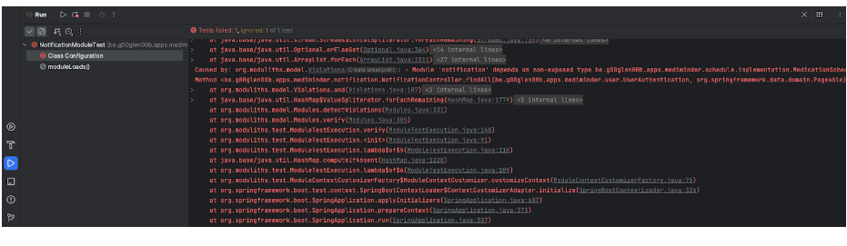

A while ago, I checked out the [Moduliths library](https://github.com/moduliths/moduliths) and I liked it.
Recently, it was announced that the Moduliths library would become a Spring Experimental project under the name [Spring Modulith](https://spring.io/projects/spring-modulith).

In this blog post I'll cover the basics of the Spring Modulith library.

## Once upon a time

Before we get started with moduliths, we first have to talk about what a modulith exactly is.
To illustrate what it is, I'm going to talk about the fairy tale of a growing application.

Once upon a time, there was a small application. The application consisted of three domains: users, inventory and medication.
As often happens within applications, these modules had dependencies on each other.


After a while, the application grew, and grew and grew... .


Each time a new domain was introduced, the amount of dependencies between these domains increased exponentially. 
Everything worked fine, until some of the domains started to use the internal logic of other domains (repositories, entities, ...).

Because of this, one of the enemies of the developers arrived: "High Coupling".
This "High Coupling" enemy caused the developers to become unhappy, and slowed down the development of the application.

Until one day, the Architect Wizard™ arrived, and transformed the application into microservices.


With these microservices, the "High Coupling" enemy disappeared.
Happiness returned across the developers, and they lived happily ever after with the application.

The end.

## High coupling is evil

From this fairy tale, we learned one important lesson: **High coupling between domains is evil**!
To reduce this high coupling, there are two solutions:

1. Use an event-driven architecture to reduce the amount of direct dependencies.
2. Have a well-isolated domain with a proper API that is exposed to your other domains.

One way to apply these solutions is by working with microservices.
Microservice are isolated by nature and usually work well within an event-driven architecture.
The downside of microservices is that they require additional resources such as a gateway, an event bus, extra memory, extra CPU, circuit breakers, ... .
Summarized, there is **less focus on business code**.

The question is, can we go back to a modulithic application, but apply these two solutions?
The answer is yes, with Spring Boot we can work with **Spring Data Events** to introduce events within our monolith.
In addition, we can enforce well-isolated domains by using the **Spring Modulith** library.

## Getting started

To get started, we first have to upgrade our project to **Spring Boot 3**.

After that, we also have to add the **Spring Milestones Repository** as Spring Modulith only has a milestone-release so far:

```xml
<repositories>
    <repository>
        <id>spring-milestones</id>
        <name>Spring Milestones</name>
        <url>https://repo.spring.io/milestone</url>
        <snapshots>
            <enabled>false</enabled>
        </snapshots>
    </repository>
</repositories>
<pluginRepositories>
    <pluginRepository>
        <id>spring-milestones</id>
        <name>Spring Milestones</name>
        <url>https://repo.spring.io/milestone</url>
        <snapshots>
            <enabled>false</enabled>
        </snapshots>
    </pluginRepository>
</pluginRepositories>
```

Once done, we can import the Spring Modulith **Bill of Materials (BOM)**:

```xml
<dependency>
    <groupId>org.springframework.experimental</groupId>
    <artifactId>spring-modulith-bom</artifactId>
    <version>0.1.0-M1</version>
    <scope>import</scope>
    <type>pom</type>
</dependency>
```

After that, we can add one of the [various starters as a dependency](https://docs.spring.io/spring-modulith/docs/0.1.0-M1/reference/html/#appendix.artifacts).
To get only the basics, we can add the following dependencies:

```xml
<dependency>
    <groupId>org.springframework.experimental</groupId>
    <artifactId>spring-modulith-api</artifactId>
</dependency>
<dependency>
    <groupId>org.springframework.experimental</groupId>
    <artifactId>spring-modulith-core</artifactId>
</dependency>
<dependency>
    <groupId>org.springframework.experimental</groupId>
    <artifactId>spring-modulith-starter-test</artifactId>
    <scope>test</scope>
</dependency>
```

## Changing your project structure

Once all dependencies are installed, the next step is to properly structure your code.
Structuring your code consists out of three steps.

First, you have to create a **new package** for each module. 
For example, this can be the name of your domain (inventory, medication, user, ...). 

The second step is to put all your exposed logic for each module within that package. 
Examples of exposed logic are DTOs, exceptions, the interfaces of your services and so on.

And finally, all implementation details of each module have to go to one or more subpackages. 
This package can be named whatever you like, for example "implementation" or "repository", ... . 
Examples of classes that go here are entities, repositories, service implementation classes and so on.


## Write a test

The final step is to write a test to verify that each module is isolated.
For example, you can change the default generated test by Spring Boot to something like:

```java
class MediminderApplicationTest {
    @Test
    void verifyModularity() {
        ApplicationModules.of(MediminderApplication.class).verify();
    }
}
```

If none of your modules use implementation details of another module, this test should succeed.
Otherwise, you get an error like this:



This error message tells you directly which line within which class uses an internal implementation detail of another module.

## Writing better tests

Spring Modulith also has a few additional benefits, one of them is writing better tests.
In the past, you may have used the `@SpringBootTest` annotation. 
If not, this annotation can be used to run your Spring Boot application before a test starts, so you can write integration and end-to-end tests.
While this annotation is very powerful, starting an entire application might be overkill.
This is why there are test slice annotations such as `@WebMvcTest`, `@DataJpaTest` and so on.

With Spring Modulith, there's also an `@ApplicationModuleTest` annotation which still starts up your Spring Boot application, but only loads the beans of the current module.
This means you can write isolated tests for each module, and your application will start up faster.

For example, in one of my projects I'm using the validation API (`@NotNull`, `@Email`, ...).
Since I'm using these annotations within my service, I have to start up a Spring Boot application with my service.
In the past I used the `@SpringBootTest` annotation, but now I use `@ApplicationModuleTest`:

```java
@ApplicationModuleTest
@Import(UserServiceValidationTest.DummyConfiguration.class)
class UserServiceValidationTest {
    @Autowired
    private UserService service;
    @MockBean
    private UserEntityRepository repository;

    @Test
    void create_validatesEmailNotNull() {
        CreateUserRequestDTO request = new CreateUserRequestDTO(null, "Alicia Williams", "password", ZoneId.of("Europe/Brussels"));
        assertThatExceptionOfType(ConstraintViolationException.class)
            .isThrownBy(() -> service.create(request))
            .withMessageEndingWith("The e-mail is required");
    }
}
```

## Documenting your module dependencies

Another benefit of Spring Modulith is that you can generate a UML diagram of your module dependencies.

To do this, change your test to:

```java
@Test
void verifyModularity() {
    ApplicationModules modules = ApplicationModules.of(MediminderApplication.class);
    modules.verify();
    new Documenter(modules)
        .writeModulesAsPlantUml()
        .writeIndividualModulesAsPlantUml();
}
```

If you run this test now, and you use Maven, a new folder called **spring-modulith-docs** will be created in the **target** folder.
This folder will contain the UML diagram for each individual module, and a global overview of all modules.

To open this, you need a PlantUML viewer. For example, for IntelliJ you can use [PlantUML integration](https://plugins.jetbrains.com/plugin/7017-plantuml-integration).
The PlantUML integration plugin relies on [GraphViz](https://graphviz.org/download/), so make sure to install that as well.

Note for macOS users, if you install GraphViz through Homebrew, you have to change the Graphviz executable in the IntelliJ settings to `/opt/homebrew/bin/dot`.

Once installed, you can see a UML diagram like this:


## Conclusion

While Spring Modulith is still in early stages (only a milestone-release available when this article was written), it's already very promising.
Using Spring Modulith leads to better separation of modules, better tests and better documentation.

If you're interested in seeing this code in action, you can check [this repository](https://github.com/g00glen00b/medication-assistant). 
