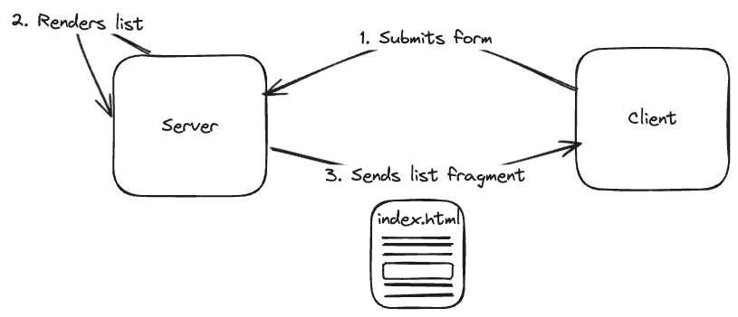
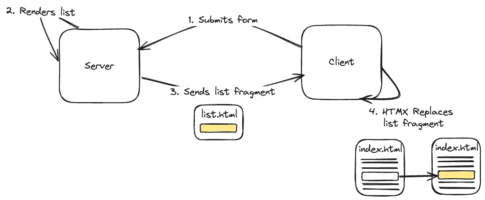
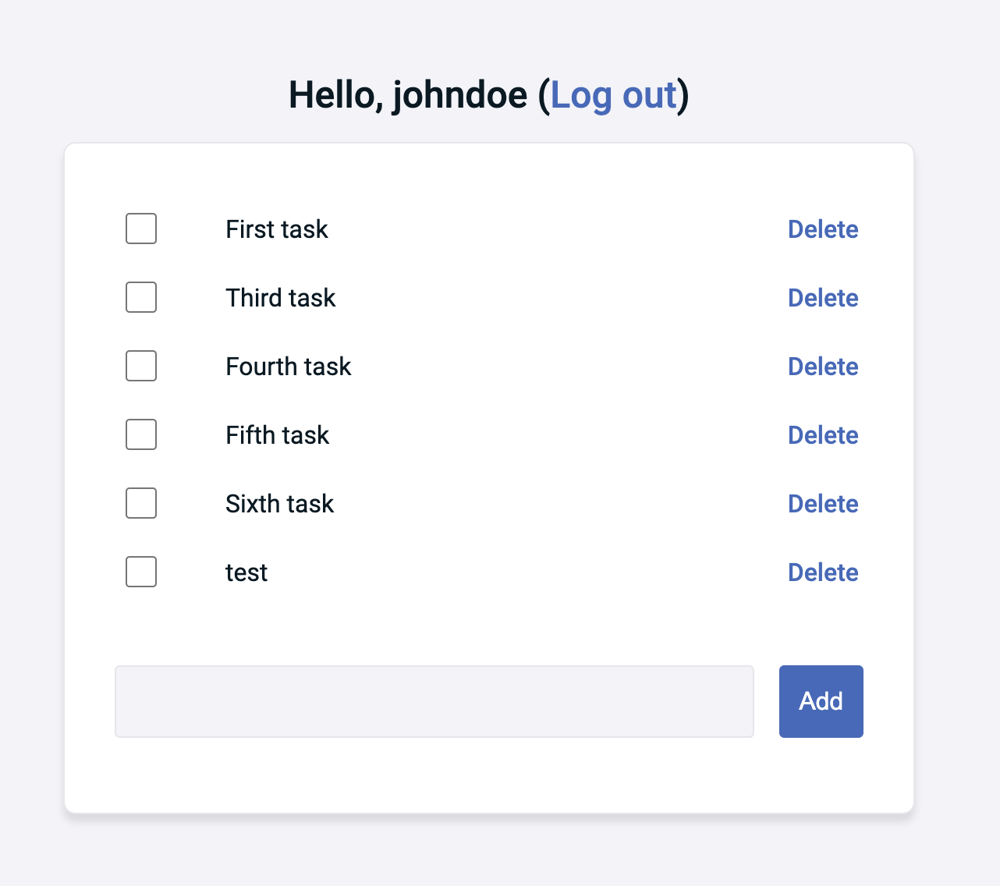
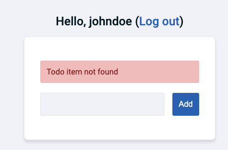
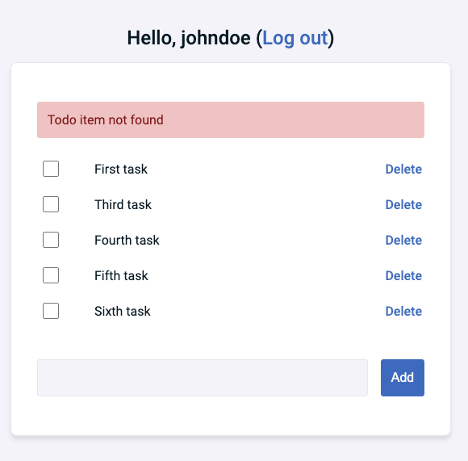

During my recent holiday vacation, I experimented with [htmx](https://htmx.org/).
For those unfamiliar, htmx is a JavaScript library that allows you to access AJAX requests, WebSockets and more through HTML.

### Rendering fragments

A typical scenario to use htmx is to make Server-Side Rendered webpages (SSR) more dynamic.
In traditional SSR, the entire page is sent back to the client upon each action:



However, with htmx, the server can re-render specific fragments, sending back only the updated HTML.



This makes the webpage more responsive and efficient.
Since htmx relies on HTML attributes and HTTP headers, it can be used with any rendering framework or language.

### Project setup

In this example, I'll use htmx with Spring Boot and Thymeleaf.
To do this, add the following dependencies:

```xml
<dependency>
    <groupId>org.springframework.boot</groupId>
    <artifactId>spring-boot-starter-security</artifactId>
</dependency>
<dependency>
    <groupId>org.springframework.boot</groupId>
    <artifactId>spring-boot-starter-web</artifactId>
</dependency>
<dependency>
    <groupId>org.springframework.boot</groupId>
    <artifactId>spring-boot-starter-thymeleaf</artifactId>
</dependency>
<dependency>
    <groupId>org.thymeleaf.extras</groupId>
    <artifactId>thymeleaf-extras-springsecurity6</artifactId>
</dependency>
```

Then create a Thymeleaf index page in `src/main/resources/templates/index.html`:

```html
<!DOCTYPE html>
<html lang="en" xmlns:th="http://www.thymeleaf.org">
<head>
  <script src="https://unpkg.com/htmx.org@1.9.10" integrity="sha384-D1Kt99CQMDuVetoL1lrYwg5t+9QdHe7NLX/SoJYkXDFfX37iInKRy5xLSi8nO7UC" crossorigin="anonymous"></script>
</head>
<body>
<h1>My tasks</h1>
</body>
</html>
```

Finally, create a controller:

```java
@Controller
@RequestMapping("/")
@RequiredArgsConstructor
public class IndexController {
    @GetMapping
    public String index() {
        return "index";
    }
}
```

The moment we launch our application, visit http://localhost:8080 and login, we should see a page containing a title "My tasks".

> **Note**: In this tutorial I'm not going to cover the security configuration other than htmx specific things.
> I'll assume that you configured Spring Security as you prefer.

### Creating a Thymeleaf fragment

So now let's build a todo application with three components:

1. A header that shows the currently authenticated user and a logout button,
2. A list of tasks, each with a checkbox to mark the task as complete and a delete button,
3. And a form to add a new task to the list.



The first fragment I'm going to create is the list of tasks.
To do this, create a file called `src/main/resources/templates/fragments/items.html`:

```html
<!DOCTYPE html>
<html
  lang="en"
  xmlns:th="http://www.thymeleaf.org">
<body>
<table
  id="items"
  th:fragment="items (items)">
  <tbody>
  <tr th:each="item : ${items}">
    <td class="checkbox-column">
      <input
        th:id="'complete-' + ${item.id}"
        type="checkbox"
        th:checked="${item.completed}" />
      <label th:for="'complete-' + ${item.id}"></label>
    </td>
    <td th:text="${item.task}"></td>
    <td>
      <a>
        Delete
      </a>
    </td>
  </tr>
  </tbody>
</table>
</body>
</html>
```

This Thymeleaf fragment contains a list of items, and for each item it shows a checkbox which will be marked if `item.completed` is true, it will show the task itself (`item.task`) and a delete link.
The Java representation of this class will be something like this:

```java
public record TodoItemDTO(UUID id, String task, boolean completed) {
}
```

Another important thing to note is that I gave the table an ID (`id="items"`).
This allows us to rerender just this part of the application with htmx.

When the application is initially opened, the entire page will be rendered by the server.
To implement this, I'm going to include this fragment within **index.html**:

```html
<!DOCTYPE html>
<html lang="en" xmlns:th="http://www.thymeleaf.org">
<head>
  <script src="https://unpkg.com/htmx.org@1.9.10" integrity="sha384-D1Kt99CQMDuVetoL1lrYwg5t+9QdHe7NLX/SoJYkXDFfX37iInKRy5xLSi8nO7UC" crossorigin="anonymous"></script>
</head>
<body>
<div class="card">
  <h1>My tasks</h1>
  <!-- Add this -->
  <table th:replace="~{fragments/items :: items (items=${items})}"></table>
</div>
</body>
</html>
```

In addition, I'm going to pass the `items` to the `IndexController`:

```java
@Controller
@RequestMapping("/")
@RequiredArgsConstructor
public class IndexController {
    private final TodoItemManagement todoItems;

    @GetMapping
    public String index(Model model, @AuthenticationPrincipal AccountUserDTO user) {
        UUID accountId = user.id();
        // Retrieve items from service
        model.addAttribute("items", todoItems.findAllByOwnerId(accountId));
        return "index";
    }
}
```

> **Note**: I'm using `@AuthenticationPrincipal` to retrieve the current user.
> The `AccountUserDTO` class implements the `UserDetails` interface.
> As this is not related to htmx, I won't be covering its implementation in this tutorial.

If you run the application now, you should see the items.

### Adding interactvity with htmx

The first interactivity I'm going to add is that when the delete link is clicked, that the list of items is refreshed.
To do this, I first need to create a separate controller method that deletes the item and renders just the fragment:

```java
@DeleteMapping("/{id}")
public String deleteItem(Model model, @PathVariable UUID id, @AuthenticationPrincipal AccountUserDTO user) {
    UUID ownerId = user.id();
    items.delete(new TodoItemIdentity(ownerId, id));
    model.addAttribute("items", items.findAllByOwnerId(ownerId));
    return "fragments/items";
}
```

So as you can see, I call `delete()` method of my service, and then I call the `findAllByOwnerId()` method again to retrieve the current tasks of the user.
And finally, I tell Spring to render just the **fragments/items.html** fragment.

The other part we have to do is to tell htmx that whenever the delete-link is clicked, that this controller should be invoked. 
This can be done by using the `hx-delete` attribute:

```html
<a
    th:hx-delete="'/todoitem/' + ${item.id}">
    Delete
</a>
```

What will happen now is that when the link is clicked, htmx will execute the HTTP request, and will replace the inner HTML of this delete link with the response of the HTTP request.
This is not what we want, because we don't want to render the table within the delete-link.

To solve this, we need to tell htmx to target a specific element, which we can do with the `hx-target` attribute.
For example:

```html
<a
    th:hx-delete="'/todoitem/' + ${item.id}"
    hx-target="#items">
    Delete
</a>
```

Another problem we have now is that htmx will replace the inner HTML of the given target.
However, since the target is the main `<table>` and we're also returning the `<table>` again, it would result in something like:

```html
<table id="items">
  <table id="items">
    <!-- ... -->
  </table>
</table>
```

To solve this issue, we can either put the ID on a wrapper element, or we can tell htmx to replace the outer content.
To replace the outer content, we set the `hx-swap` attribute to `outerHTML`:

```html
<a
    th:hx-delete="'/todoitem/' + ${item.id}"
    hx-target="#items"
    hx-swap="outerHTML">
    Delete
</a>
```

The nice thing about htmx is that these attributes can be used on every element.
So to implement the checkbox toggle behaviour, we do something similar:

```html
<input
    th:id="'complete-' + ${item.id}"
    type="checkbox"
    th:checked="${item.completed}"
    th:hx-put="'/todoitem/' + ${item.id} + '/toggle'"
    hx-target="#items"
    hx-swap="outerHTML" />
```

All we need to do now is to implement another controller method that toggles the items `completed` field and renders the fragment again:

```java
@PutMapping("/{id}/toggle")
public String toggleItem(Model model, @PathVariable UUID id, @AuthenticationPrincipal AccountUserDTO user) {
    UUID ownerId = user.id();
    items.toggleComplete(new TodoItemIdentity(ownerId, id));
    model.addAttribute("items", items.findAllByOwnerId(ownerId));
    return "fragments/items";
}
```

### Resetting a form

The next thing we want to do is to add new items through a form.
This form can be added to **index.html** like this:

```html
<form>
  <label for="new-task">New task</label>
  <input type="text" name="new-task" id="new-task" />
  <button type="submit">Add</button>
</form>
```

To implement this, we first need to add another controller method to add a new item:

```java
@PostMapping("/add")
public String createItem(Model model, @RequestParam("new-task") String newTask, @AuthenticationPrincipal AccountUserDTO user) {
    UUID ownerId = user.id();
    items.create(new CreateTodoItemRequestDTO(ownerId, newTask));
    model.addAttribute("items", items.findAllByOwnerId(ownerId));
    return "fragments/items";
}
```

And then we can do something similar as we've done before to update the items fragment as soon as the form is submitted:

```html
<form
  hx-post="/todoitem/add"
  hx-target="#items"
  hx-swap="outerHTML">
  <label for="new-task">New task</label>
  <input type="text" name="new-task" id="new-task" />
  <button type="submit">Add</button>
</form>
```

Something extra I want to do here is to reset the form as soon as it's submit.
To do this, we can use the [`reset()` method of a form](https://developer.mozilla.org/en-US/docs/Web/API/HTMLFormElement/reset).
To trigger this, we can use the `hx-on::after-request` attribute:

```html
<form
  hx-post="/todoitem/add"
  hx-target="#items"
  hx-swap="outerHTML"
  hx-on::after-request="this.reset()">
  <label for="new-task">New task</label>
  <input type="text" name="new-task" id="new-task" />
  <button type="submit">Add</button>
</form>
```

### Using CSRF protection with htmx

If you're using the default Spring Security configuration, you'll notice that none of the previous calls will work.
This is because any POST, PUT or DELETE operation is protected from [Cross Site Request Forgery (CSRF)](https://docs.spring.io/spring-security/reference/features/exploits/csrf.html).

The way CSRF works is that an exploiter can craft an external webpage with a hidden form that sends an HTTP request to your application, for example a DELETE-request.
The problem is that if an authenticated user visits that external webpage, the DELETE-request will be executed in their name because a webbrowser will automatically send their cookies with it.

The way you can protect your application from this is by generating a unique token for each visitor each time they visit.


For every subsequent non-GET request (POST, PUT, DELETE, PATCH, ...), this token should then be sent back to your application as a header.


Since the external webpage can't access the user their token, the HTTP request would fail.


To protect yourself from CSRF with htmx, the first thing you have to do is to send the CSRF token to the client.
One way of doing so is by adding some `<meta>` tags in **index.html**:

```html
<meta name="csrf-token" th:content="${_csrf.token}" />
<meta name="csrf-header" th:content="${_csrf.headerName}" />
```

The next step is to define a bit of JavaScript code that reads these meta-tags, and then configures htmx to send this CSRF token back as a header:

```javascript
document.body.addEventListener('htmx:configRequest', (evt) => {
  evt.detail.headers['accept'] = 'text/html-partial';
  if (evt.detail.verb !== 'get') {
    const csrfHeader = document.querySelector('meta[name=csrf-header]').getAttribute('content');
    const csrfToken = document.querySelector('meta[name=csrf-token]').getAttribute('content');
    if (csrfHeader != null && csrfToken != null) {
      evt.detail.headers[csrfHeader] = csrfToken;
    }
  }
});
```

This JavaScript code then has to be included on **index.html**.

### Logging out with htmx

The final step I want to implement is a title above the items-table that shows the currently authenticated user and a logout link.
To implement this, I first need to change the `IndexController` to include the information of the user:

```java
@Controller
@RequestMapping("/")
@RequiredArgsConstructor
public class IndexController {
    private final AccountManagement accounts;
    private final TodoItemManagement todoItems;

    @GetMapping
    public String index(Model model, @AuthenticationPrincipal AccountUserDTO user) {
        // Add this:
        UUID accountId = user.id();
        model.addAttribute("account", accounts.findById(accountId));
        model.addAttribute("items", todoItems.findAllByOwnerId(accountId));
        return "index";
    }
}
```

After that, we can change **index.html** to include a title:

```html
<h1>
  Hello,
  <span th:text="${account.username}">username</span>
  (<a>Log out</a>)
</h1>
```

To log out with Spring Security, you need to send a POST call to `/logout` (default behaviour).
To send a POST-call, we can use htmx once more:

```html
<a hx-post="/logout">Log out</a>
```

The problem with this is that Spring will automatically redirect to the login-page.
As we've already seen, that means that htmx will include the login-page where the logout-link was.

This is not what we want.
In stead, we want to replace the entire page with the login page.
To do this, we can set the `HX-Redirect` header when the logout action was succesful within our Spring Security configuration:

```java
.logout(logout -> logout
    .logoutUrl("/logout")
    // Add this handler
    .logoutSuccessHandler((request, response, authentication) -> response.addHeader("HX-Redirect", "/login?logout"))
    .invalidateHttpSession(true)
    .deleteCookies("JSESSIONID"))
```

A second problem is that if we opened the application in multiple tabs, and logout in one, all requests within the other tab will fail because our session is invalidated.
To solve this, we could tell htmx to refresh the page if we're not authenticated.
Once we refresh the page, Spring will automatically redirect us to the login page since we're no longer authenticated.

The easiest way to implement this is by creating a custom [`AuthenticationEntryPoint`](https://docs.spring.io/spring-security/site/docs/current/api/org/springframework/security/web/AuthenticationEntryPoint.html).
For example:

```java
public class htmxRefreshAuthenticationEntryPoint extends Http403ForbiddenEntryPoint {
    @Override
    public void commence(HttpServletRequest request, HttpServletResponse response, AuthenticationException authException) throws IOException {
        response.addHeader("HX-Refresh", "true");
        super.commence(request, response, authException);
    }
}
```

Finally, we need to configure this entrypoint within our security configuration as well:

```java
.exceptionHandling(ex -> ex.defaultAuthenticationEntryPointFor(
    new htmxRefreshAuthenticationEntryPoint(),
    new RequestHeaderRequestMatcher("HX-Request")
))
```

To make sure that we only invoke this entrypoint if an htmx request is executed, we can check for the `HX-Request` header.
This header is present for every htmx request.

If you don't want to implement this by yourself each time, you can also use the [`htmx-spring-boot`](https://github.com/wimdeblauwe/htmx-spring-boot) library,  which has this built in.
This library is developed by Wim Deblauwe, who has [an entire blogpost about this matter](https://www.wimdeblauwe.com/blog/2022/10/04/htmx-authentication-error-handling/).

### Exception handling

One this we haven't covered so far is the use of exception handlers.
For example, let's say we delete a task that was already deleted.
In that case, we could throw some kind of exception.

To catch it, we can write an exceptionhandler.
For example:

```java
@ExceptionHandler({InvalidTodoItemException.class, TodoItemNotFoundException.class})
public ModelAndView handleError(Throwable ex) {
    return new ModelAndView("fragments/error", Map.of(
        "error", ex.getMessage()
    ));
}
```

In this exception handler, I'm returning a new fragment called **error.html**.
The content of this fragment could be something like this:

```html
<!DOCTYPE html>
<html lang="en">
<body>
<div
  th:fragment="error"
  id="error"
  class="danger alert"
  role="alert"
  hx-swap-oob="true"
  th:text="${error}">
</div>
</body>
</html>
```

What's special here is that we use the `hx-swap-oob` attribute.
OOB stands for Out Of Bounds, which means that it allows us to swap the content with a different element than normally.

In this case, it will target an element with `id="error"`.
To make this work, we also need to add an empty placeholder for this element in **index.html**:

```html
<!-- ... --->
<div class="card">
  <!-- Add this -->
  <div id="error"></div>
  <table th:replace="~{fragments/items :: items (items=${items})}"></table>
  <form th:replace="~{fragments/new-task :: new-task"></form>
</div>
<!-- ... -->
```

If we run the application now, and an error occurs, we'll notice that the error appears at the top of the screen, but the original table is also gone.



This happens because htmx will still swap the original content with whatever was in the response.
Since the response of the exception handler doesn't contain `#items`, this part of the application is removed.

To solve this, we need to tell htmx to not reswap in case of an error.
We can do this by setting the `HX-Reswap` header to `none`:

```java
@ExceptionHandler({InvalidTodoItemException.class, TodoItemNotFoundException.class})
public ModelAndView handleError(Throwable ex, HttpServletResponse response) {
    // Add this
    response.setHeader("HX-Reswap", "none");
    return new ModelAndView("fragments/error", Map.of(
        "error", ex.getMessage()
    ));
}
```

If we run the application now and do something that results in an exception, we'll see that the original table remains next to the error message:




### Hiding errors

One problem that remains is that the error message will stay on the screen unless we refresh the page.
There are a few ways we can fix this:

1. We can automatically remove the element after a while.
2. We can add a button to hide the error.

If you want to automatically remove the element, you could use the [`remove-me` extension](https://htmx.org/extensions/remove-me/).
To use this extension, we add the following to our `<head>`:

```html
<script src="https://unpkg.com/htmx.org/dist/ext/remove-me.js"></script>
```

After that, we can add the `hx-ext` and `remove-me` attributes to our error fragment:

```html
<div
  th:fragment="error"
  id="error"
  class="danger alert"
  role="alert"
  hx-swap-oob="true"
  hx-ext="remove-me"
  remove-me="3s"
  th:text="${error}">
</div>
```

Alternatively, we could add a button to our error fragment:

```html
<div
  th:fragment="error"
  id="error"
  class="danger alert"
  role="alert"
  hx-swap-oob="true">
  <span th:text="${error}"></span>
  <button type="button">
    &times;
  </button>
</div>
```

Implementing a button like this with htmx isn't easy though.
To solve this the "htmx way" is to add an endpoint to our application that can return an empty error.
The button would then trigger the endpoint and swap the content of the error as we've done before.

In my opinion, this isn't  really clean as we're executing a request for no good reason.
An alternative would be to use some JavaScript code.
The creators of htmx realized this, and created another library called [**_hyperscript**](https://hyperscript.org/).
This library allows you to add interactions to your application without having to write JavaScript code.

The way it works is that _hyperscript comes with its own language that can be applied to any element by adding an attribute.
To use _hyperscript, we add the following library to our `<head>`:

```html
<script src="https://unpkg.com/hyperscript.org@0.9.12"></script>
```

Now we have to write some _hyperscript markup:

```html
<button 
  type="button"
  _="
    on click put '' into #error 
    then remove .danger from #error 
    then remove .alert from #error">
    &times;
  </button>
```

What we do here are three things:

1. First, we remove the inner HTML of `#error`. This means that both the text and the button will disappear.
2. Then we remove the `.danger` class from `#error`. I use this element to give the alert a red color.
3. And finally, we remove the `.alert` class from `#error`. I use this class to style the `<div>` element with the right padding, margin, ... .

If we now run the application, get an error and click the button, the alert will disappear.

### Conclusion

Htmx allows us to improve Server-Side Rendered applications by rerendering only parts of the application.
By doing so, we can increase the amount of interactivity in our applications.

The nice thing is that we can do all of that from within our HTML, with the addition of some HTTP headers.
In theory, you don't have to write a single line of JavaScript code, as we've seen so far.

However, as htmx focuses mostly on interaction with a backend, such as using AJAX, WebSockets and so on, it doesn't cover all use cases for interactivity.
Things like showing or hiding elements is something you still have to write some client-side code for.

What I personally find interesting is that there's a trend of libraries that allow you to enhance your HTML.
First we had Tailwind, and now we have htmx and _hyperscript as well.
People seem to enjoy this trend, as htmx got the second most stars on GitHub out of all open-source frontend frameworks, right after React ([source](https://risingstars.js.org/2023/en#section-framework)).

As usual, the code can be found on [GitHub](https://github.com/g00glen00b/spring-samples/tree/master/spring-boot-htmx).