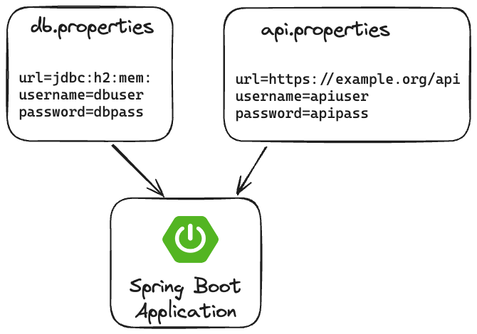

Recently, I encountered [an interesting question](https://stackoverflow.com/q/77802571/1915448) on Stack Overflow.
The question is the following; let's say I have a properties file containing my database configuration:

```properties
url=jdbc:h2:mem:
username=dbuser
password=dbpass
```

On its own, this doesn't really cause a problem.
To load it with Spring Boot, we use the `@PropertySource` annotation to load it:

```java
@SpringBootApplication
@PropertySource("classpath:db.properties")
public class Application {
    // ...
}
```

However, the problem starts when you have another properties file containing the same properties, for example a file for an API I'm consuming:

```properties
url=https://example.org/api
username=apiuser
password=apipass
```

If we load this properties file as well, Spring Boot will override the properties we earlier defined in `db.properties`.



So how do we solve this?

### The easy answer: change the properties

The easiest solution to this problem is to change the properties themselves.
If we make sure that every property is unique, there isn't any problem left:

```properties
# db.properties
db.url=jdbc:h2:mem:
db.username=dbuser
db.password=dbpass

# api.properties
api.url=https://example.org/api
api.username=apiuser
api.password=apipass
```

### Create a custom property source factory

Sometimes however, we don't have the possibility to change the properties files we have to work with.
Luckily, Spring has exactly the mechanism we need by creating a [`PropertySourceFactory`](https://docs.spring.io/spring-framework/docs/current/javadoc-api/org/springframework/core/io/support/PropertySourceFactory.html).
To use this mechanism, we create a new class implementing this interface.
For example:

```java
public class PrefixPropertySourceFactory implements PropertySourceFactory {
    @Override
    public PropertySource<?> createPropertySource(String name, EncodedResource resource) throws IOException {
        // TODO: implement
    }
}
```

When we take a look at this interface, we see that it contains a single method called `createPropertySource()` that accepts two arguments; a name and a resource.
Both these arguments come from the `@PropertySource` annotation itself.
The name matches the `@PropertySource(name = "...")` element and the resources matches the `@PropertySource(value = "...")` element.

To use this factory, we need to add another element to the `@PropertySource` annotation:

```java
@SpringBootApplication
@PropertySource(
    value = "classpath:db.properties",
    // Add this:
    factory = PrefixPropertySourceFactory.class)
public class Application {
    // ...
}
```

### Choosing a prefix

The first thing we have to think about is how we want to define the prefix.
One way we can do so is by using the `name` element.
For example:

```java
@SpringBootApplication
@PropertySource(
    value = "classpath:db.properties",
    name = "db",
    factory = PrefixPropertySourceFactory.class)
public class Application {
    // ...
}
```

The problem however is that this element isn't required.
So another alternative is to retrieve the prefix from the filename itself.

To obtain the filename, we first use the [`EncodedResource.getResource()`](https://docs.spring.io/spring-framework/docs/current/javadoc-api/org/springframework/core/io/support/EncodedResource.html#getResource()) method to get the actual resource.
Then we can get the filename with the [`Resource.getFilename()`](https://docs.spring.io/spring-framework/docs/current/javadoc-api/org/springframework/core/io/Resource.html#getFilename()) method.

After that, we need to strip everything after the last dot and return whatever remains.
Luckily this has been answered before on [Stack Overflow](https://stackoverflow.com/questions/941272/how-do-i-trim-a-file-extension-from-a-string-in-java), so we could write something like this:

```java
private static String getFilenameWithoutExtension(EncodedResource resource) {
    String filename = resource.getResource().getFilename();
    int lastPositionOfDot = filename.lastIndexOf('.');
    if (lastPositionOfDot > 0) return filename.substring(0, lastPositionOfDot);
    else return filename;
}
```

### Prefixing the properties

The next step is to retrieve the properties themselves and add the prefix to it.
To retrieve the properties, we can use the [`PropertiesLoaderUtils.loadProperties()`](https://docs.spring.io/spring-framework/docs/current/javadoc-api/org/springframework/core/io/support/PropertiesLoaderUtils.html#loadProperties(org.springframework.core.io.support.EncodedResource)) method.
After that, we can loop over the properties and create a new `Properties` object containing the prefixed properties:

```java
private static Properties getPropertiesWithPrefix(EncodedResource resource, String prefix) {
    Properties sourceProperties = PropertiesLoaderUtils.loadProperties(resource);
    Set<String> propertyNames = sourceProperties.stringPropertyNames();
    Properties resultProperties = new Properties();
    propertyNames.forEach(propertyName -> resultProperties.put(
        prefix + "." + propertyName,
        sourceProperties.getProperty(propertyName))
    );
    return resultProperties;
}
```

### Creating a `PropertySource`

The final step is to construct a `PropertySource` object.
The best implementation we can use is the [`PropertiesPropertySource`](https://docs.spring.io/spring-framework/docs/current/javadoc-api/org/springframework/core/env/PropertiesPropertySource.html).
Constructing a `PropertiesPropertySource` requires two parameters, a name and the properties themselves.

In contrary to the `name` element of the `@PropertySource` annotation, this name is required.
One way to fix this is to write some similar code as Spring does within the [`getNameForResource()`](https://github.com/spring-projects/spring-framework/blob/f1a335708a0ced4fc97cb2e1969a9887e734a70a/spring-core/src/main/java/org/springframework/core/io/support/ResourcePropertySource.java#L178-L184) method within `ResourcePropertySource`.
This method generates a unique name based on the description of the resource or the classname itself.

So for now, let's write something similar:

```java
private static String getNameFromResource(EncodedResource resource) {
    String description = resource.getResource().getDescription();
    if (!description.isBlank()) return description;
    String className = resource.getClass().getSimpleName();
    int hashCode = System.identityHashCode(resource);
    return className + "@" + hashCode;
}
```

After that, we can put everything together and create a `PropertiesPropertySource`:

```java
@Override
public PropertySource<?> createPropertySource(String name, EncodedResource resource) throws IOException {
    String prefix = getFilenameWithoutExtension(resource);
    Properties properties = getPropertiesWithPrefix(resource, prefix);
    String resultName = name == null ? getNameFromResource(resource) : name;
    return new PropertiesPropertySource(resultName, properties);
}
```

### Conclusion

By creating a custom `PropertySourceFactory`, we can control how a property-file is exactly interpreted.
The code for my `PrefixPropertySourceFactory` implementation can be found on [GitHub](https://gist.github.com/g00glen00b/9e052d34f461bf761e5e6c3892febf79).