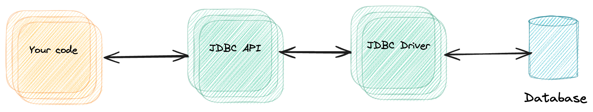
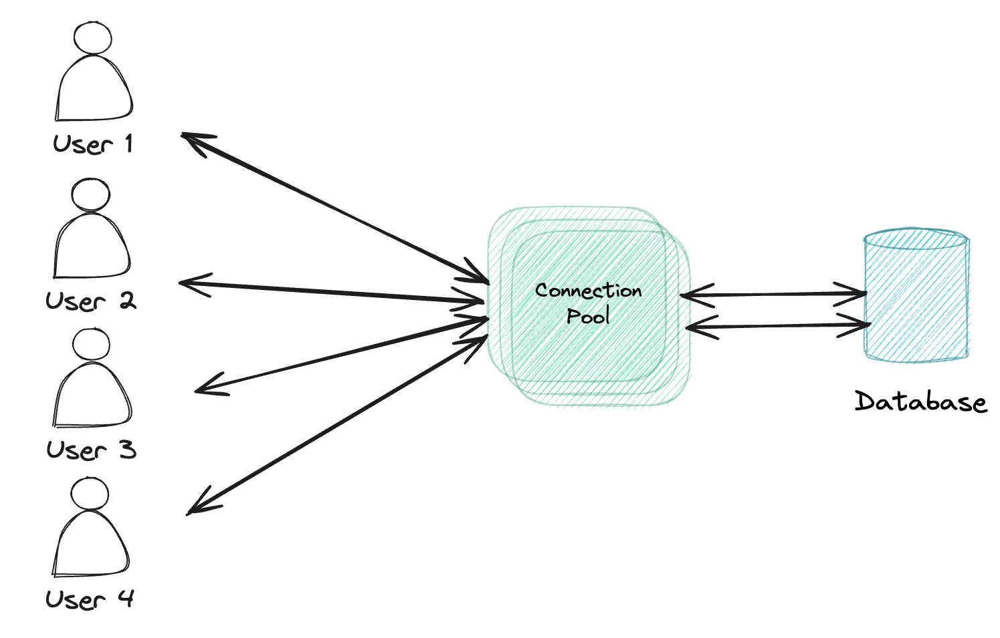
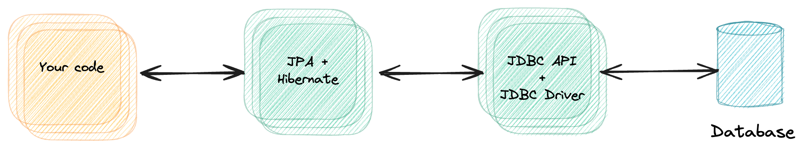
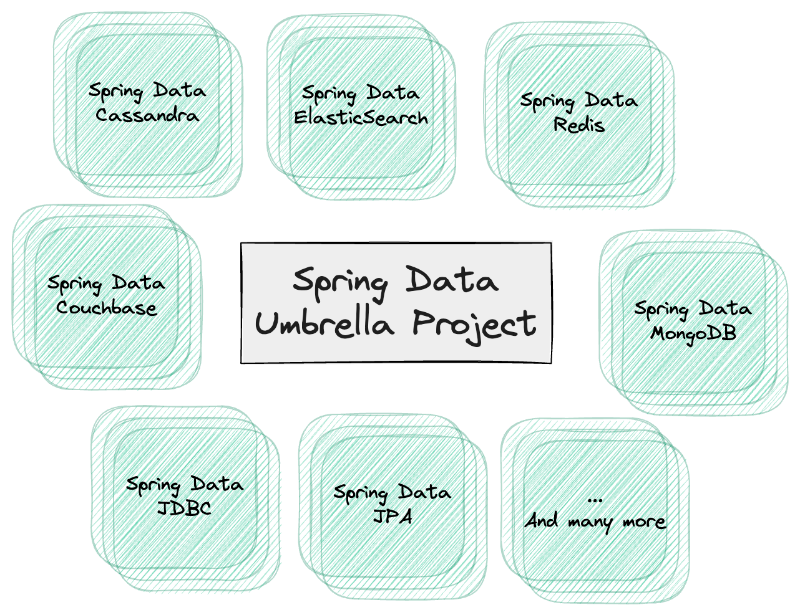
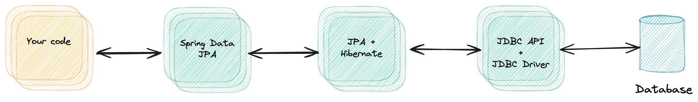
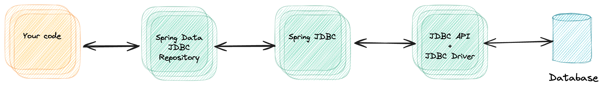

If you're working with data persistence in a Spring Boot project, you probably already encountered the terms JDBC, JPA, Spring Data and so on.
For people who are new to the Java or Spring ecosystem, this could sometimes be confusing.
So in this blogpost, I'll talk about the differences between these concepts.

1. [What is JDBC?](#what-is-jdbc)
2. [What is a connection pool?](#what-is-a-connection-pool)
3. [What is Spring JDBC?](#what-is-spring-jdbc)
4. [What is JPA and Hibernate?](#what-is-jpa-and-hibernate)
5. [What is Spring Data?](#what-is-spring-data)
6. [What is Spring Data JPA?](#what-is-spring-data-jpa)
7. [What is Spring Data JDBC?](#what-is-spring-data-jdbc)
8. [Conclusion](#conclusion)

### What is JDBC?

**JDBC** stands for **Java Database Connectivity**. The JDBC API describes how you can communicate with a database through a generic Java API.
This API consists out of a few elements, such as a `Connection`, a `ResultSet`, a `DriverManager` and so on.

For example, if you see code like below, you're using JDBC:

```java
try (Connection conn = DriverManager.getConnection("jdbc:h2:mem:")) {
    try (Statement stmt = conn.createStatement()) {
        ResultSet rs = stmt.executeQuery("select name, firstname from person");
        while (rs.next()) {
            String firstname = rs.getString("firstname");
            String name = rs.getString("name");
            System.out.println(firstname + ", " + name);
        }
    }
}
```

If you check the API docs of these elements, you'll see that most of these ([`Connection`](https://docs.oracle.com/en/java/javase/21/docs/api/java.sql/java/sql/Connection.html), [`Driver`](https://docs.oracle.com/en/java/javase/21/docs/api/java.sql/java/sql/Driver.html), ...) are interfaces.
That's because the way a connection is made, is different for each database type.

So, to make this work, each database vendor (MySQL, H2, Postgres, ...) implements these elements, which we call the **JDBC driver**.

For example, the H2 implementation of the `java.sql.Driver` interface is the [`org.h2.Driver`](https://javadoc.io/static/com.h2database/h2/2.2.224/org/h2/Driver.html) class.



### What is a connection pool?

As we've seen before, the JDBC API allows us to create connections to the database through the `Connection` interface.
While this works perfectly, in real projects you don't want to create a new connection for each database call you make.
In stead, you want to have a set of connections that you keep healthy, and that you can re-use over and over again to execute queries.

For that reason, the JDBC API also contains a [`DataSource`](https://docs.oracle.com/en/java/javase/21/docs/api/java.sql/javax/sql/DataSource.html) interface, which is used for **connection pooling**.
Some JDBC drivers already come with their own `DataSource` implementation, but there are also external libraries that work independent of the JDBC driver you use.
Examples of these are [HikariCP](https://github.com/brettwooldridge/HikariCP), [DBCP](https://commons.apache.org/proper/commons-dbcp/) and the [Tomcat JDBC connection pool](https://tomcat.apache.org/tomcat-7.0-doc/jdbc-pool.html).

These connection pool libraries allow you to easily configure the amount of connections that should be kept alive, how long they should be alive, how they should be validated and so on.
The default for Spring Boot is **HikariCP**.



### What is Spring JDBC

The next part of the puzzle I want to talk about is **Spring JDBC**, not to be confused with "Spring Data JDBC".
Spring JDBC is a wrapper around the standard JDBC API and comes with a few utility classes such as `JdbcTemplate` and the new `JdbcClient`.
To add Spring JDBC to your Spring Boot project, you include the following dependency:

```xml
<dependency>
    <groupId>org.springframework.boot</groupId>
    <artifactId>spring-boot-starter-jdbc</artifactId>
</dependency>
```

This Spring Boot starter includes both `spring-jdbc` which contains the code for `JdbcTemplate` and such, and HikariCP (which we talked about before).
It doesn't come with a JDBC driver, so you'll need to pick the right driver for your database separately.

After that, you can use it by configuring the HikariCP `DataSource` through some properties.
For example:

```properties
spring.datasource.url=jdbc:h2:mem:
spring.datasource.hikari.maximum-pool-size=2
# ...
```

Behind the screens, Spring Boot will configure a [`HikariDataSource`](https://www.javadoc.io/doc/com.zaxxer/HikariCP/latest/com.zaxxer.hikari/com/zaxxer/hikari/HikariDataSource.html) for you with the provided configuration.
It will also create a [`JdbcTemplate`](https://docs.spring.io/spring-framework/docs/current/javadoc-api/org/springframework/jdbc/core/JdbcTemplate.html) and [`NamedParameterJdbcTemplate`](https://docs.spring.io/spring-framework/docs/current/javadoc-api/org/springframework/jdbc/core/namedparam/NamedParameterJdbcOperations.html) bean, and since Spring Boot 3.2, also a [`JdbcClient`](https://docs.spring.io/spring-framework/docs/current/javadoc-api/org/springframework/jdbc/core/simple/JdbcClient.html) bean.

To use `JdbcTemplate`, you can write something like this:

```java
List<Person> people = jdbcTemplate.query(
    "select name, firstname from person", 
    (rs, rowNum) -> new Person(
        rs.getString("firstname"),
        rs.getString("name")
    ));
```

In this example, we're using the same query as before.
The main difference is that we can easily construct objects out of this by using the `RowMapper` interface, and no longer need to use `try-with-resources`.
If we want to reuse this `RowMapper`, we can define a separate class:

```java
public class PersonRowMapper implements RowMapper<Person> {
    @Override
    public Person mapRow(ResultSet rs, int rowNum) throws SQLException {
        return new Person(
            rs.getString("firstname"),
            rs.getString("name")
        );
    }
}
```

The difference between `JdbcTemplate` and `NamedParameterJdbcTemplate` becomes visible as soon as we start using parameters.
With `JdbcTemplate`, passing a parameter would look like this:

```java
List<Person> people = jdbcTemplate.query(
    "select name, firstname from person where id = ?", 
    new PersonRowMapper(),
    ), 1L);
```

While this works fine with a few parameters, it becomes a bit harder to track when you have multiple parameters.
For that reason, you can use the `NamedParameterJdbcTemplate`, which allows you to write something like this:

```java
List<Person> people = jdbcTemplate.query(
    "select name, firstname from person where id = :id",
    new MapSqlParameterSource()
        .addValue("id", 1L),
    new PersonRowMapper());
```

Since Spring Boot 3.2, the new `JdbcClient` is also autoconfigured for you.
This new class allows you to query using a fluent API.
For example:

```java
List<Person> people = jdbcClient
    .sql("select name, firstname from person where id = :id")
    .param("id", 1L)
    .query(new PersonRowMapper())
    .list();
```

So in essence, Spring's `JdbcTemplate` and `JdbcClient` provide a clean wrapper around the standard JDBC API.


### What is JPA and Hibernate?

The next part I want to talk about is **JPA**.
JPA stands for Java Persistence API and describes how you should be able to query and persist Java objects within a relational database, rather than working with plain SQL queries and mappers.
So summarized, it's a standard for Object-Relational Mapping (ORM) in Java.

Important to know is that JPA is only a specification.
If you want to use JPA in your code, you need to use one of its implementations, such as [Hibernate](https://hibernate.org/) or [EclipseLink](https://eclipse.dev/eclipselink/).

Unlike JDBC, JPA is not a part of the standard set of libraries of Java (Java SE).
Instead, it used to be part of **Java EE**, which stands for Java Platform Enterprise Edition. 
Java EE contains many specifications to be used within enterprise applications.
Recently however, Java EE was donated to the Eclipse Foundation.
Due to trademark issues, it was rebranded as **Jakarta EE**.

Hibernate works on top of JDBC.
This means that you need the same dependencies as before, but also need a few new ones.
Spring Boot does not provide a starter to work with JPA, without using Spring Data JPA (I'll cover that next).
If you really want to work with plain JPA and Hibernate, you need to add the following dependencies:

```xml
<dependency>
    <groupId>org.springframework</groupId>
    <artifactId>spring-orm</artifactId>
</dependency>
<dependency>
    <groupId>org.springframework</groupId>
    <artifactId>spring-tx</artifactId>
</dependency>
<dependency>
    <groupId>org.hibernate.orm</groupId>
    <artifactId>hibernate-core</artifactId>
</dependency>
```

After that, you need to create your own `LocalContainerEntityManagerFactoryBean` bean.
This bean is responsible for creating a JPA `EntityManagerFactory`, which is in turn responsible for creating an `EntityManager`.
The `EntityManager` can then be used to query or persist Java objects, which we call entities.

To set up the `LocalContianerEntityManagerFactoryBean`, you need the `DataSource` bean from before, and set it up like this:

```java
@Bean
public LocalContainerEntityManagerFactoryBean entityManagerFactory(DataSource dataSource) {
    var emfb = new LocalContainerEntityManagerFactoryBean();
    emfb.setJpaVendorAdapter(new HibernateJpaVendorAdapter());
    emfb.setDataSource(dataSource);
    emfb.setPackagesToScan("com.example.demo");
    Properties jpaProperties = new Properties();
    jpaProperties.put("hibernate.hbm2ddl.auto", "create-drop");
    emfb.setJpaProperties(jpaProperties);
    return emfb;
}
```

As mentioned before, we need to tell which JPA vendor we want to use, so when constructing this factory, we need to provide a JPA vendor adapter (`HibernateJpaVendorAdapter`).
In addition, you need to tell Hibernate where to look for entity classes, which we do by using the `setPackagesToScan()` method.

The last piece of the puzzle is that I'm going to let Hibernate create the tables based on the entities I have.
This is possible by setting the `hibernate.hbm2ddl.auto` property to `create` or `create-drop`.

After that, we can create our own entity class:

```java
@Entity
public class Person {
    @Id
    @GeneratedValue(strategy = GenerationType.IDENTITY)
    private Long id;
    private String name;
    private String firstname;
    
    // TODO: Implement constructors + getters + setters
}
```

Once we created our entity, we can start playing with the `EntityManager`.
To do this, we need to inject the `EntityManagerFactory` and call the `createEntityManager()` method.

To find a list of all people, we can use:

```java
try (EntityManager em = emf.createEntityManager()) {
    List<Person> people = em
        .createQuery("select p from Person p")
        .getResultList();
}
```

Inserting new data only requires us to create a new object, and persist it with the `EntityManager`:

```java
try (EntityManager em = emf.createEntityManager()) {
    em.getTransaction().begin();
    em.persist(new Person("Doe", "John"));
    em.persist(new Person("Doe", "Jane"));
    em.getTransaction().commit();
}
```

So as you can see, we're no longer writing any SQL query.
In stead, we are using JPA's Query Language, which is called JPQL.
The major difference is that we no longer refer to tables and columns, but to entities and fields.

This becomes even more clear when we start defining relationships between our entities:

```java
@Entity
public class Person {
    @Id
    @GeneratedValue(strategy = GenerationType.IDENTITY)
    private Long id;
    private String name;
    private String firstname;
    @OneToMany(mappedBy = "owner")
    private List<Pet> pets;
    
    // TODO: Implement constructors + getters + setters
}

@Entity
public class Pet {
    @Id
    @GeneratedValue(strategy = GenerationType.IDENTITY)
    private Long id;
    private String name;
    @ManyToOne
    private Person owner;
}
```

If you would like to find every person who has a pet named Snoopy, you would write a JPQL query like this:

```
List<Person> people = em
    .createQuery("select p from Person p inner join p.pets pt where pt.name = 'Snoopy'")
    .getResultList(); 
```

These JPQL queries are translated to SQL queries by Hibenrate itself, and then passed to the JDBC driver.
Due to this, Hibernate supports only a specific set of [SQL dialects](https://docs.jboss.org/hibernate/orm/current/dialect/dialect.html).



### What is Spring Data?

The final thing I want to talk about is **Spring Data**.
In contrary to what we've seen so far, Spring Data is not a concrete project.
In stead, it's an umbrella of many subprojecs.

The goal of Spring Data is to offer a **unified API across all kinds of databases**.
Do you want to talk to a relational database? MongoDB, ElasticSearch? 
With Spring Data you can do all of that.

For blocking applications that need to talk to a relational database, you can choose between **Spring Data JDBC** and **Spring Data JPA**.



### What is Spring Data JPA?

As the name implies **Spring Data JPA** is the Spring Data project on top of JPA.
By default, it uses Hibernate as its JPA vendor.

To use Spring Data JPA, you need to add the following dependency:

```xml
<dependency>
    <groupId>org.springframework.boot</groupId>
    <artifactId>spring-boot-starter-data-jpa</artifactId>
</dependency>
```

This dependency includes **spring-boot-starter-jdbc** and the dependencies we included before to work with JPA and Hibernate.
To this one dependency replaces all those dependencies from before.
As usual, you still need to include your own JDBC driver library (Postgres, MySQL, H2, ...).

The nice part of this Spring Boot starter is that it automatically configures the `EntityManager` for us.
So we no longer need to include the `LocalContainerEntityManagerFactoryBean` from before.

The unified API of Spring Data is based upon the repository design pattern.
To use it, you need to create your own repository interface:

```java
public interface PersonRepository extends JpaRepository<Person, Long> {
    
}
```

The nice part is that Spring's repository already comes with various operations out of the box, such as saving entities, retrieving a list of all entities, retrieving an entity by its ID and so on.

So all you need to do now is to inject hte `PersonRepository` somewhere and call:

```java
List<Person> people = repository.findAll();
```

You might wonder, what if I need to write a custom query?
Well in that case, you add a method to the repository and annotate it with `@Query`:

```java
public interface PersonRepository extends JpaRepository<Person, Long> {
    @Query("select p from Person p where p.firstname = ?1")
    List<Person> findAllByFirstname(String firstname);
}
```

Spring Data JPA is even capable of deriving the query from the method name if you follow [their conventions](https://docs.spring.io/spring-data/jpa/reference/jpa/query-methods.html#jpa.query-methods.query-creation).
The method name we used before, already follows this convention, so we could even remove the `@Query` annotation in its entirety:

```java
public interface PersonRepository extends JpaRepository<Person, Long> {
    List<Person> findAllByFirstname(String firstname);
}
```

If you scroll all the way back to the top of this article, and compare it to now, it becomes really clear that you need to write way less code with Spring Data.
This is all thanks to several layers of abstractions.



### What is Spring Data JDBC?

Alternatively to Spring Data JPA, you could also choose for **Spring Data JDBC** (not to be confused with Spring JDBC).
The difference is that Spring Data JDBC is **directly built upon the Spring JDBC API**, and doesn't require JPA or Hibernate.

To use it, all you need to include is the `spring-boot-starter-data-jdbc` dependency and the JDBC driver of your choice:

```xml
<dependency>
    <groupId>org.springframework.boot</groupId>
    <artifactId>spring-boot-starter-data-jdbc</artifactId>
</dependency>
```

Since Spring Data follows the repository pattern, you do need to declare your entities, similar to JPA.
However, in stead of using the JPA-related annotations, you now need to include Spring's custom annotations:

```java
public class Person {
    @Id
    private Long id;
    private String firstname;
    private String name;
    
    // TODO: Implement constructors + getters + setters
}
```

As you can see, we don't need to include an `@Entity` annotation, and the `@Id` annotation comes from `org.springframework.data.annotation` in stead of `jakarta.persistence`.

Similar to Spring Data JPA, we can now create a repository interface:

```java
public interface PersonRepository extends CrudRepository<Person, Long> {
    
}
```

Like before, you can also write your own queries:

```java
public interface PersonRepository extends CrudRepository<Person, Long> {
    @Query("select p.id, p.firstname, p.name from person where p.firstname = ?1")
    List<Person> findAllByFirstname(String firstname);
}
```

Just like with Spring Data JPA, the following also works thanks to the [the query method conventions](https://docs.spring.io/spring-data/relational/reference/jdbc/query-methods.html):

```java
public interface PersonRepository extends CrudRepository<Person, Long> {
    List<Person> findAllByFirstname(String firstname);
}
```

An important thing to know is that Spring's JDBC based ORM framework is a bit more lightweight than Hibernate.
This means that it lacks some features, but is also faster in startup time.



### Conclusion

As we've seen now, there are several API's and abstractions.
Here's a short list of what we covered:

- **JDBC API**: The JDBC API is a low-level API to execute SQL queries on a database.
- **JDBC Driver**: Each database vendor has to implement the JDBC API to allow connecting to their database. This library is called a JDBC driver.
- **Connection pool**: On top of the JDBC API, there are also a few libraries that provide a generic JDBC DataSource that provides connection pooling. The default for Spring Boot is HikariCP.
- **Spring JDBC**: Spring JDBC is a wrapper on top of the JDBC API to make it easier to write and execute queries.
- **JPA**: JPA is a specification for Object-Relational Mapping in Java. It is part of Jakarta EE.
- **Hibernate**: Hibernate is a library that implemented the JPA specification. It's the default JPA implementation for Spring Boot.
- **Spring Data**: Spring Data is an umbrella project that descibes how database interactions can happen through their repository API.
- **Spring Data JPA**: This is an implementation of Spring Data on top of JPA.
- **Spring Data JDBC**: This is an implementation of Spring Data on top of Spring JDBC. It comes with its own lightweight ORM framework.