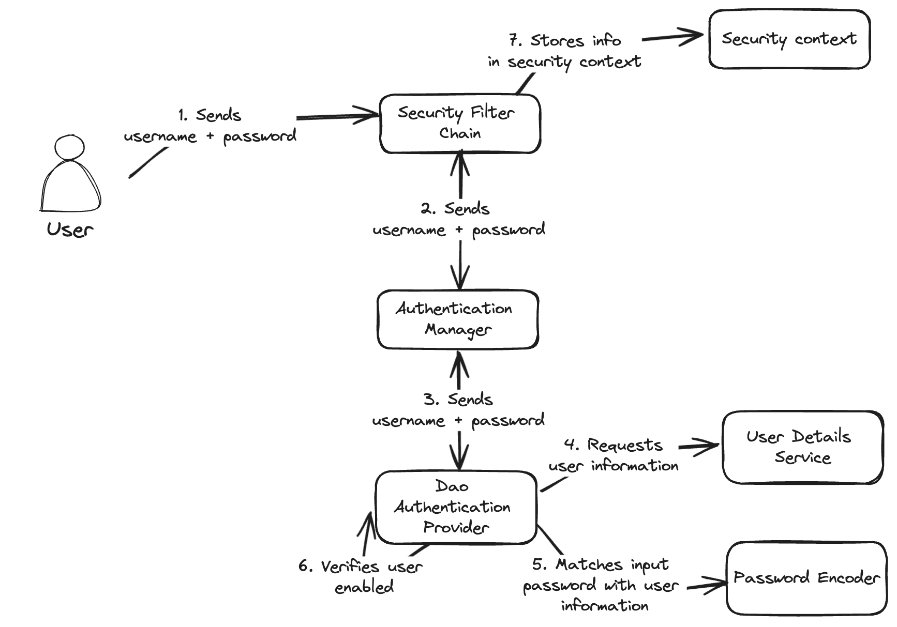

When registering a new user with an e-mail address, you usually want to verify that the e-mail address of the user is legitimate.
The easiest way to do so, is by sending them a mail with a unique link that they have to click in order to fully register.


### Project setup

In order to implement this feature, we need a few dependencies:

- **spring-boot-starter-web**: Required for developing a web application.
- **spring-boot-starter-security**: Used for applying authentication.
- **spring-boot-starter-data-jpa**: Used for persisting user information.
- **spring-boot-starter-thymeleaf**: Used for generating the e-mail content based on a template.
- **spring-boot-starter-mail**: Used for sending an e-mail.
- **commons-lang3**: Used for generating a random verification code.

If you're using Maven, you can add the following dependencies:

```xml
<dependency>
    <groupId>org.springframework.boot</groupId>
    <artifactId>spring-boot-starter-security</artifactId>
</dependency>
<dependency>
    <groupId>org.springframework.boot</groupId>
    <artifactId>spring-boot-starter-web</artifactId>
</dependency>
<dependency>
    <groupId>org.springframework.boot</groupId>
    <artifactId>spring-boot-starter-data-jpa</artifactId>
</dependency>
<dependency>
    <groupId>org.springframework.boot</groupId>
    <artifactId>spring-boot-starter-thymeleaf</artifactId>
</dependency>
<dependency>
    <groupId>org.springframework.boot</groupId>
    <artifactId>spring-boot-starter-mail</artifactId>
</dependency>
<dependency>
    <groupId>org.apache.commons</groupId>
    <artifactId>commons-lang3</artifactId>
</dependency>
```

### Setting up Spring Security

Before we can implement the registration part, we first need to configure Spring Security.
One way to implement this is by using a login mechanism like basic authentication or a form login in addition to a `PasswordEncoder`.
For example:

```java
@Bean
public PasswordEncoder passwordEncoder() {
    return new BCryptPasswordEncoder();
}

@Bean
public SecurityFilterChain securityFilterChain(HttpSecurity http) throws Exception {
    return http
        .authorizeHttpRequests(customizer -> customizer
            .requestMatchers(HttpMethod.POST, "/api/user").anonymous()
            .requestMatchers(HttpMethod.POST, "/api/user/verify").anonymous()
            .anyRequest().authenticated())
        .httpBasic(withDefaults())
        .sessionManagement(withDefaults())
        .build();
}
```

With this configuration, we're requiring authentication for all endpoints except two:

1. **POST /api/user**: This will be the endpoint to create a new user from.
2. **POST /api/user/verify**: This endpoint will be used to verify a user their e-mail address.

The final part to configure Spring Security is to create a `UserDetailsService`:

```java
@Service
@RequiredArgsConstructor
class SecurityUserDetailsService implements UserDetailsService {
    private final UserEntityRepository repository;

    @Override
    public UserDetails loadUserByUsername(String email) throws UsernameNotFoundException {
        return repository
            .findByEmail(email)
            .map(entity -> User
                .builder()
                .username(entity.getEmail())
                .password(entity.getPassword())
                .enabled(entity.isEnabled())
                .build())
            .orElseThrow(() -> new UsernameNotFoundException("No user found for the given e-mail address"));
    }
}
```

Within this `UserDetailsService` we have to implement a single method called `loadUserByUsername()`.
In our case, the e-mail address will be the username, so we use Spring Data to retrieve the user entity by their e-mail address.

The `UserDetails` interface has several fields, but we will only be using three of them:

1. The username or e-mail address.
2. The bcrypt hashed password.
3. An indication of whether our user is enabled or not. A user will be disabled as long as their e-mail address isn't verified.

The way Spring Security will invoke this is the following:

1. First it will hash the password that was used during login.
2. Then it will retrieve the `UserDetails` from the `UserDetailsService` using the given e-mail.
3. After that, it will match the given hashd password with the one within the `UserDetails`.
4. Finally, it will also check whether the `UserDetails` is enabled, non-expired, non-locked etc. 



### The registration process

Now that the authentication process is ready, we can move to the registration part.
The first part is to store the user their information inside the database:

```java
@RestController
@RequestMapping("/api/user")
@RequiredArgConstructor
class UserController {
    private final PasswordEncoder passwordEncoder;

    @PostMapping
    @Transactional
    public void register(RegisterRequestDTO request) {
        UserEntity entity = repository.save(UserEntity.builder()
            .email(request.email())
            .password(passwordEncoder.encode(request.password()))
            .build());
    }
}
```

Normally we do this by saving the e-mail together with the hashed password inside a database.
Important is that the password should be hashed with the same `PasswordEncoder` that's being used with Spring Security.

To enable the e-mail verification, we will add two things:

1. We will add an `enabled` flag to our user entity and initially disable the user.
2. We will add a `verificationCode` field to our entity and generate a random string with Apache Commons.

The result would be something like this:

```java
UserEntity entity = repository.save(UserEntity.builder()
    .email(request.email())
    .password(passwordEncoder.encode(request.password()))
    .enabled(false) // Add this
    .verificationCode(RandomStringUtils.randomAlphanumeric(32)) // Add this
    .build());
```

### Sending the e-mail

The next part of our registration process is to send the e-mail to the user.
To do this, we first need to configure our SMTP server.
This configuration depends on your SMTP provider, but in my case I will be using Mailhog for development purposes:

```properties
spring.mail.host=localhost
spring.mail.port=1025
```

In addition, I will also set up a Thymeleaf template for our e-mail inside **src/main/resources/templates/user-verify.html**:

```html
<!DOCTYPE html>
<html xmlns:th="http://www.thymeleaf.org" lang="en">
<body>
<p>Welcome to MyApp XYZ!</p>
<p>Before you can use the application, you first need to verify your account by clicking the following link:</p>
<p><a th:href="${applicationUrl}" th:text="${applicationUrl}"></a></p>
</body>
</html>
```

This template is rather simple, and contains a single `applicationUrl` variable.

To generate the e-mail, we will create a new class and autowire `JavaMailSender` and `SpringTemplateEngine` into it:

```java
@Service
@RequiredArgConstructor
class UserMailService {
    private final JavaMailSender mailSender;
    private final SpringTemplateEngine templateEngine;
}
```

Within this class, we first need to write a method to render the HTML with Thymeleaf:

```java
private String getVerificationMailContent(UserEntity entity) {
    Context context = new Context();
    String verificationUrl = String.format("http://localhost:8080/verify?code=%s", entity.getVerificationCode());
    context.setVariable("applicationUrl", verificationUrl);
    return templateEngine.process("user-verify", context);
}
```

In this method, I'm using `String.format()` to add the generated verification code to a URL.
For this demo I'm using a hardcoded URL, but in reality you probably want to put this in a separate property.
After that, I'm passing the URL as the `applicationUrl` variable so that the template can be rendered.

Another method we'll need is to create the e-mail itself.
I will use a `MimeMessage` here:

```java
private MimeMessage createMessage(UserEntity entity, String content) throws MessagingException {
    MimeMessage mimeMessage = mailSender.createMimeMessage();
    MimeMessageHelper message = new MimeMessageHelper(mimeMessage);
    message.setText(content, true);
    message.setSubject("Welcome to MyApp XYZ");
    message.setFrom("noreply@myapp.xyz");
    message.setTo(entity.getEmail());
    return mimeMessage;
}
```

And then finally, we'll create a method to put it all together and send the e-mail:

```java
public void sendVerificationMail(UserEntity entity) {
    String content = getVerificationMailContent(entity);
    try {
        mailSender.send(createMessage(entity, content));
    } catch (MessagingException ex) {
        throw new UserMailFailedException("Could not send e-mail to verify user with e-mail '" + entity.getEmail() + "'", ex);
    }
}
```

Now we have to change our controller so that it calls the `sendVerificationMail()` method we just wrote:

```java
@PostMapping
@Transactional
public void register(RegisterRequestDTO request) {
    UserEntity entity = repository.save(UserEntity.builder()
        .email(request.email())
        .password(passwordEncoder.encode(request.password()))
        .enabled(false)
        .verificationCode(RandomStringUtils.randomAlphanumeric(32))
        .build());
    userMailService.sendVerificationMail(entity); // Add this
}
```

### Verifying the user

The final step we have to take is to write an endpoint to verify the user.
To do this, I added the following controller method:

```java
@PostMapping("/verify")
@Transactional
public void verify(@RequestParam String code) {
    // TODO: implement
}
```

To implement this, we first need to retrieve the user by their verification code, and then enable the user:

```java
UserEntity entity = repository.findByVerificationCode(code).orElseThrow();
entity.setEnabled(true);
entity.setVerificationCode(null);
```

And that's basically it. 
Now you can write a verification landing page within your application to call this endpoint.