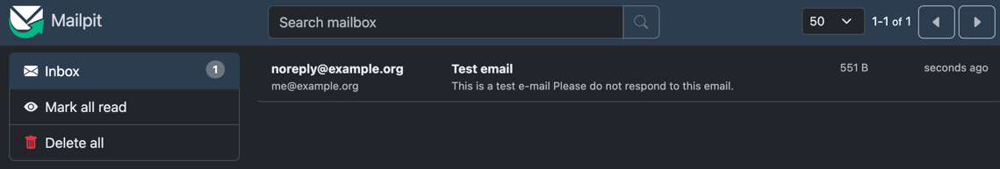

### What is Mailpit?

If you're developing an application that needs to send emails, you probably don't want to send them to your users while still in development.
However, completely disabling email sending can make it difficult to test your application.
[Mailpit](https://mailpit.axllent.org/) is a free and open source SMTP testing tool, which allows you to test email sending without actually sending emails.
In this tutorial, we will learn how to use Mailpit with Spring Boot with Docker Compose and Testcontainers.


### Setting up a Spring Boot application

The first thing we need to do is to set up a Spring Boot application.
You can create a new Spring Boot application using the [Spring Initializr](https://start.spring.io/).
For this tutorial, we will create a simple Spring Boot application using the `spring-boot-starter-mail` dependency:

```xml
<dependency>
    <groupId>org.springframework.boot</groupId>
    <artifactId>spring-boot-starter-mail</artifactId>
</dependency>
```

To send an email, you can use the `JavaMailSender` interface:

```java
public void send() {
    var mimeMessage = mailSender.createMimeMessage();
    var message = new MimeMessageHelper(mimeMessage);
    var content = """
        <html>
        <h1>This is a test email</h1>
        <p>Please do not respond to this email.</p>
        </html>
        """;
    message.setFrom("noreply@example.org");
    message.setTo("me@example.org");
    message.setSubject("Test email");
    message.setText(content, true);
    mailSender.send(message.getMimeMessage());
}
```

### Setting up Mailpit with Docker Compose

In this tutorial I'll cover a few options to set up Mailpit.
The first option is to use [Docker Compose](https://docs.docker.com/compose/).
To set up Mailpit with Docker Compose, create a `docker-compose.yml` file with the following content:

```yaml
services:
  mailpit:
    image: axllent/mailpit:v1.15
    ports:
      - 1025:1025
      - 8025:8025
```

Mailpit exposes two ports: `1025` for SMTP and `8025` for the web interface.

To start Mailpit, run the following command:

```bash
docker-compose up
```

Alternatively, you can add the following dependency to your `pom.xml` file:

```xml
<dependency>
    <groupId>org.springframework.boot</groupId>
    <artifactId>spring-boot-docker-compose</artifactId>
</dependency>
```

This dependency will allow you to start Mailpit automatically when you run your Spring Boot application.

All we need to do now is to configure the following properties in the `application.properties` file:

```properties
spring.mail.host=localhost
spring.mail.port=1025
```

### Setting up Mailpit with Testcontainers in development

Since Spring Boot 3.1, you can use [Testcontainers](https://www.testcontainers.com/) during development.
To do this, add the following dependency to your `pom.xml` file:

```xml
<dependency>
    <groupId>org.springframework.boot</groupId>
    <artifactId>spring-boot-testcontainers</artifactId>
    <scope>test</scope>
</dependency>
```

After that, create another main class in your test sources (`src/test/java`):

```java
@TestConfiguration(proxyBeanMethods = false)
public class TestSpringBootMailpitApplication {
    public static void main(String[] args) {
        SpringApplication
            .from(SpringBootMailpitApplication::main) // Your main class
            .with(TestSpringBootMailpitApplication.class)
            .run(args);
    }
}
```

Now you have two options to launch your application: you can run the `SpringBootMailpitApplication` to regularly run your application, or you can run the `TestSpringBootMailpitApplication` to run your application with Testcontainers.
Within `TestSpringBootMailpitApplication`, you can now define the Mailpit testcontainer:

```java
@Bean
GenericContainer<?> mailpitContainer() {
    return new GenericContainer<>("axllent/mailpit:v1.15")
        .withExposedPorts(1025, 8025)
        .waitingFor(Wait.forLogMessage(".*accessible via.*", 1));
}
```

This code will start a Mailpit container with the `axllent/mailpit:v1.15` image.
The `withExposedPorts` method exposes the SMTP and web interface ports, and the `waitingFor` method waits for the log message "accessible via" to appear in the logs.

The benefit of using Testcontainers is that Spring can automatically derive connection details from the container, so oftenen you don't need to configure anything in your `application.properties` file.
For example, if you create a Postgres testcontainer, Spring will automatically configure the `spring.datasource.*` properties.

Sadly, for Mailpit, you still need to configure the `spring.mail.*` properties.
However, since Testcontainers runs the container on a dynamic port, you need to use the `DynamicPropertyRegistry` as described within [the documentation](https://docs.spring.io/spring-boot/reference/features/dev-services.html#features.dev-services.testcontainers.at-development-time.dynamic-properties).
To do this, modify the `mailpitContainer()` method as follows:

```java
@Bean
GenericContainer<?> mailpitContainer(DynamicPropertyRegistry properties) {
    var container = new GenericContainer<>("axllent/mailpit:v1.15")
        .withExposedPorts(1025, 8025)
        .waitingFor(Wait.forLogMessage(".*accessible via.*", 1));
    properties.add("spring.mail.host", container::getHost);
    properties.add("spring.mail.port", container::getFirstMappedPort);
    return container;
}
```

Another thing I noticed is that the container-related properties are not immediately available.
Due to this, Spring's `MailSenderAutoConfiguration` isn't bootstrapped since it requires the `spring.mail.host` property to be present.
To work around this, you can add a dummy property to the `application.properties` file within `src/test/resources`:

```properties
spring.mail.host=dummy
```

Due to the fact that Testcontainers binds the container ports to a random port on the host, it can be a bit tricky to find out how to open the Mailpit web interface.
To solve that problem, you can map another dynamic property containing the mapped port for port 8025:

```java
@Bean
GenericContainer<?> mailpitContainer(DynamicPropertyRegistry properties) {
    var container = new GenericContainer<>("axllent/mailpit:v1.15")
        .withExposedPorts(1025, 8025)
        .waitingFor(Wait.forLogMessage(".*accessible via.*", 1));
    properties.add("spring.mail.host", container::getHost);
    properties.add("spring.mail.port", container::getFirstMappedPort);
    properties.add("mailpit.web.port", () -> container.getMappedPort(8025)); // Add this
    return container;
}
```

After that, you can write an `ApplicationRunner` to log the URL:

```java
@Bean
public ApplicationRunner logMailpitWebPort(@Value("${spring.mail.host}") String host, @Value("${mailpit.web.port}") int port) {
    Logger log = LoggerFactory.getLogger(getClass());
    return args -> log.info("Mailpit accessible through http://{}:{}", host, port);
}
```

As soon as you run your Spring boot application now through the `TestSpringBootMailpitApplication` class, you should see a log message like this:


### Demo

Now that you configured Mailpit, you can open the web interface either at http://localhost:8025 if you're using Docker Compose or at the URL that was logged if you're using Testcontainers.
The result should be something like this:



As soon as you open one of the emails, you get to see a screen like this:


Mailpit contains some nice features, such as viewing the email on different devices, and check whether the HTML markup you used is properly supported by various email clients.

### Using Mailpit for integration testing

In addition to helping you test your email sending functionality, Mailpit can also be used for integration testing.
For example, you can use Mailpit to verify that your application sends the correct emails under certain conditions.
To verify this, we can use [Mailpit's REST API](https://mailpit.axllent.org/docs/api-v1/).

Before we can interact with the Mailpit REST API, we need to add the following dependencies:

```xml
<dependency>
    <groupId>org.testcontainers</groupId>
    <artifactId>junit-jupiter</artifactId>
    <scope>test</scope>
</dependency>
<dependency>
    <groupId>org.springframework</groupId>
    <artifactId>spring-web</artifactId>
    <scope>test</scope>
</dependency>
```

The `junit-jupiter` dependency is required to use Testcontainers with JUnit 5.
The `spring-web` dependency is required to use Spring's `RestClient`.
If your application is already a web application, you don't need to include this `spring-web` dependency.

After that, we can create our integration test:

```java
@Testcontainers
@SpringBootTest(classes = {
    MailService.class,
    MailSenderAutoConfiguration.class,
    RestClientAutoConfiguration.class,
    MailServiceTest.Configuration.class
})
class MailServiceTest {
    // TODO: implement
    
    @TestConfiguration
    static class Configuration {
        // TODO: implement
    }
}
```

In this test, we bootstrap a Spring Boot application with our business logic (`MailService`) and include the necessary autoconfigurations to set up the `JavaMailSender` and `RestClient.Builder` beans.
We also define an inner `Configuration` class to set up the Mailpit REST client in the future.

The first step we need to take is to set up the testcontainer within the integration test:

```java
@Container
static GenericContainer<?> mailpitContainer = new GenericContainer<>("axllent/mailpit:v1.15")
    .withExposedPorts(1025, 8025)
    .waitingFor(Wait.forLogMessage(".*accessible via.*", 1));

@DynamicPropertySource
static void configureMail(DynamicPropertyRegistry registry) {
    registry.add("spring.mail.host", mailpitContainer::getHost);
    registry.add("spring.mail.port", mailpitContainer::getFirstMappedPort);
    registry.add("mailpit.web.port", () -> mailpitContainer.getMappedPort(8025));
}
```

Like before, we set up a `GenericContainer` for the `axllent/mailpit:v1.15` image.
We also set up the necessary properties using the `DynamicPropertyRegistry`.
The main difference is that we now use the `@DynamicPropertySource` annotation to set up the properties.

Now that we have set up the Mailpit testcontainer, we can create a `MailpitClient` class to interact with the Mailpit REST API:

```java
public class MailpitClient {
    private final RestClient restClient;

    public MailpitClient(RestClient restClient) {
        this.restClient = restClient;
    }

    public ObjectNode findFirstMessage() {
        ObjectNode listNode = listAllMessages();
        assertThat(listNode).isNotNull();
        var id = listNode.get("messages").get(0).get("ID").asText();
        ObjectNode messageNode = findMessage(id);
        assertThat(messageNode).isNotNull();
        return messageNode;
    }

    public ObjectNode listAllMessages() {
        return restClient
            .get()
            .uri(builder -> builder.pathSegment("messages").build())
            .retrieve()
            .body(ObjectNode.class);
    }

    public ObjectNode findMessage(String messageId) {
        return restClient
            .get()
            .uri(builder -> builder
                .pathSegment("message", messageId)
                .build())
            .retrieve()
            .body(ObjectNode.class);
    }

    public void deleteAllMessages() {
        restClient
            .delete()
            .uri(builder -> builder.pathSegment("messages").build())
            .retrieve()
            .toBodilessEntity();
    }
}
```

In this class, we use Spring's `RestClient` to interact with Mailpit's REST API.
We'll provide methods for listing all messages, finding a specific message, and deleting all messages.

To bootstrap the `MailpitClient`, we need to set up the `RestClient` bean within the `Configuration` class:

```java
@TestConfiguration
static class Configuration {
    @Bean
    RestClient mailpitRestClient(RestClient.Builder builder, @Value("${spring.mail.host}") String host, @Value("${mailpit.web.port}") int port) {
        return builder
            .baseUrl("http://" + host + ":" + port + "/api/v1")
            .build();
    }

    @Bean
    MailpitClient mailpitClient(RestClient mailpitRestClient) {
        return new MailpitClient(mailpitRestClient);
    }
}
```

In this class, we set up the `RestClient` bean using the `RestClient.Builder` and the properties we set up earlier.

Now we can set up our integration test by injecting both the `MailService` and `MailpitClient`:

```java
@Autowired
private MailService service;
@Autowired
private MailpitClient mailpitClient;
```

And finally, we can write our integration test:

```java
@Test
void send() throws MessagingException {
    service.send();
    ObjectNode result = mailpitClient.findFirstMessage();
    assertSoftly(softly -> {
        softly.assertThat(result.get("From").get("Address").asText()).isEqualTo("noreply@example.org");
        softly.assertThat(result.get("Subject").asText()).isEqualTo("Test email");
        softly.assertThat(result.get("To").get(0).get("Address").asText()).isEqualTo("me@example.org");
        softly.assertThat(result.get("Text").asText()).isEqualTo("""
            ********************
            This is a test email
            ********************
                            
            Please do not respond to this email.""");
    });
}
```

In this test, we send an email using the `MailService` and then use the `MailpitClient` to find the first message.
We then use AssertJ's `assertSoftly` to verify that the email contains the proper content.
We can do this by using the `Text` field from the Mailpit API, which contains the email content mapped as a text.

If you want to write more integration tests, don't forget to delete all messages after each test:

```java
@AfterEach
void tearDown() {
    mailpitClient.deleteAllMessages();
}
```

### Conclusion

In this tutorial, we learned how to use Mailpit with Spring Boot to send emails.
We set up Mailpit using Docker Compose and Testcontainers, and we used Mailpit for integration testing.
Mailpit is a great tool for testing email sending functionality without actually sending emails.

For integration testing, Mailpit might be a bit overkill.
This is because you will be testing Spring's `JavaMailSender` implementation, which is already well-tested.
However, if you want to verify that your application sends the correct emails under certain conditions, Mailpit can be a great tool.

As always, the code for this tutorial is available on [GitHub](https://github.com/g00glen00b/spring-samples/tree/master/spring-boot-mailpit).