## Introduction

Generative Artificial Intelligence is everywhere nowadays.
Luckily for us, the Spring framework also jumped on this train and made it very easy for us to integrate these Large Language Models (LLMs) into our Spring Boot applications.

Spring AI supports multiple types of AI, including chat, Model Context Protocol (MCP), text embedding, text moderation, image generation and so on.
In this blogpost I'll primarily focus on the chat capabilities, since these provide the most possibilities to integrate with your Spring Boot application.

## Table of Contents

1. [How do you integrate with a chat model](#how-do-you-integrate-with-a-chat-model)
2. [Prompting techniques](#prompting-techniques)
    1. [Templating](#prompting-technique-1-templating)
        1. [JSON Support](#issue-1-json-support-with-templating)
        2. [Advanced templating](#issue-2-advanced-templating)
    2. [System vs. User prompt](#prompting-technique-2-system-vs-user-prompt)
    3. [Conversational memory](#prompting-technique-3-conversational-memory)
    4. [Retrieval Augmented Generation (RAG)](#prompting-technique-4-retrieval-augmented-generation-rag)
    5. [Using the right parameters](#prompting-technique-5-using-the-right-parameters)
        1. [Temperature](#temperature)
        2. [Maximum Completion Tokens](#maximum-completion-tokens)
        3. [Top P](#top-p)
        4. [Frequence Penalty](#frequence-penalty)
        5. [Presence Penalty](#presence-penalty)
        6. [Tweaking the parameters](#tweaking-the-parameters)
    6. [Tool calling](#prompting-technique-6-tool-calling)
        1. [Model Context Protocol](#model-context-protocol)
3. [Response techniques](#response-techniques)
    1. [Safeguard](#response-technique-1-safeguard)
    2. [Structured response](#response-technique-2-structured-response)
        1. [By prompting](#structured-response-by-prompting)
        2. [Response format](#structured-response-by-response-format)
4. [Conclusion](#conclusion)

## How do you integrate with a chat model

Nowadays, there are many large language model providers out there, there's Open AI, DeepSeek, Claude, Mistral and so on.
However, even though there's a wide variety of providers and each provider has several models, integrating with a chat model always happens in the same way.
You, the user or an application, send a prompt to the chat model, after which it will reply with statistically the most reasonable sequence of words.

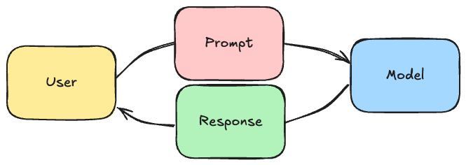

Spring recognized this, and provided an abstraction layer on top of this.
This abstraction layer includes a fluent [`ChatClient`](https://docs.spring.io/spring-ai/reference/api/chatclient.html), similar to the API's of `RestClient`, `JdbcClient` and so on:

```java
String response = chatClient
    .prompt()
    .user("Tell me a joke")
    .call()
    .content();
```

The benefit of this approach is that if you want to change between models (eg. from an Open AI model to an Ollama model), all you need to do is to change a dependency and configure a few properties (like an API key).
You don't have to change any code at all.

So for example, if you want to integrate with Open AI's models, all you need to do is add the following dependency:

```xml
<dependency>
    <groupId>org.springframework.ai</groupId>
    <artifactId>spring-ai-starter-model-openai</artifactId>
</dependency>
```

Followed by configuring an API key:

```properties
spring.ai.openai.api-key=${OPENAI_API_KEY}
```

While on the other hand, integrating with ollama requires you to add the following dependency:

```xml
<dependency>
    <groupId>org.springframework.ai</groupId>
    <artifactId>spring-ai-starter-model-ollama</artifactId>
</dependency>
```

By default, it will use the [Mistral model](https://ollama.com/library/mistral), but this can be configured through properties as well.

The only thing that does matter is that not every model has the same capabilities.
For example, while Open AI supports tool calling (which I'll cover later), HuggingFace does not at the time this tutorial was written.
A full of the capabilities of each model can be found in [the reference documentation](https://docs.spring.io/spring-ai/reference/api/chat/comparison.html).

> **Note**: At the moment, DeepSeek does not support tooling according to the Spring documentation, even though it officially does.
> The reason for this mismatch is that the tooling support in DeepSeek has been buggy and might result in looping ([see note in reference documentation](https://docs.spring.io/spring-ai/reference/api/chat/deepseek-chat.html)).

## Prompting techniques

Spring AI does not only make it easier for us to integrate with any chat model, it also includes some tools to make prompting easier.
Some of these techniques will be covered in this section.

Many of these techniques rely on Spring AI's [Advisor API](https://docs.spring.io/spring-ai/reference/api/advisors.html).
This Advisor API behaves a bit similar to a FilterChain:

1. Each advisor can mutate the `AdvisedRequest`, which is essentially a wrapper around the prompt containing additional request parameters.
2. Once the last advisor mutated the request, the request is sent to the large language model.
3. Each advisor then gets the `AdvisedResponse`, which contains the response of the the large language model.

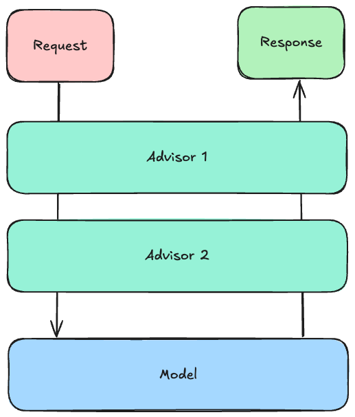

### Prompting technique 1: Templating

The first technique is that Spring AI allows you to use template files when prompting.
This is convenient because it allows you to easily add some surrounding information to the user their request.

For example, imagine writing a todo application and you want the user to be able to answer some questions about their todo items.
In that case, it might be interesting to pass the tasks and the current date together with the user their question in a single prompt.

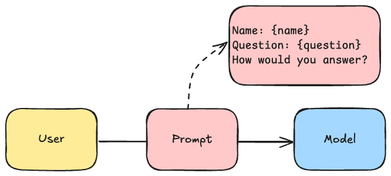

Spring allows you to write these templates using [StringTemplate](https://www.stringtemplate.org/).
This prompt template could look like this:

```
Given the following information:
------------
User's name: {name}
Current date in ISO format (YYYY-MM-DD): {date}
Tasks:
{tasks:{task|
- Task:
    - ID: {task.id}
    - Description: {task.description}
    - Due Date: {task.dueDate}
    - Completed: {task.completed}
}}
------------
How would you answer the following question:
"{question}"
```

You can save this in a file called **src/main/resources/user.st**.
The next step is to configure `ChatClient` to use this template file:

```java
@Bean
ChatClient chatClient(ChatClient.Builder builder) {
    return builder
        .defaultUser(new ClassPathResource("user.st"))
        .build();
}
```

This `ChatClient.Builder` is automatically provided by Spring, and allows you to easily set up a `ChatClient` bean.
After configuring the `ChatClient`, you can autowire it into your Spring beans and call it like this:

```java
String response = chatClient
    .prompt()
    .user(spec -> spec
        .param("tasks", taskService.findAll())
        .param("question", question)
        .param("dueDate", LocalDate.now())
        .param("name", userService.findName()))
    .call()
    .content();
```

#### Issue 1: JSON support with templating

There are currently a few issues with the `StTemplateRenderer`.
The first issue is that it sometimes resolves the same template multiple times.

For example, if the `{question}` parameter contained curly braces as well (eg. if you pass JSON), it will throw an exception.

This issue will be (partially) fixed in the next release of Spring AI.
Currently the workaround is to use another delimiter if you plan on using JSON, and to validate that the user input never contains the chosen delimiter.

Overriding the delimiter can be done with:

```java
@Bean
ChatClient chatClient(ChatClient.Builder builder) {
    return builder
        .defaultUser(new ClassPathResource("user.st"))
        .defaultTemplateRenderer(StTemplateRenderer
            .builder()
            .startDelimiterToken('<')
            .endDelimiterToken('>')
            .build())
        .build();
}
```

Please note that if you override the delimiter, you will also have to override the partial templates provided by other Spring AI building blocks.
For example, by default Spring's `PromptChatMemoryAdvisor` (I'll cover this [later](#prompting-technique-3-conversational-memory)) contains the following template:

```
Use the conversation memory from the MEMORY section to provide accurate answers.

---------------------
MEMORY:
{memory}
---------------------
```

So if you override the delimiter, you need to change the prompt provided by this advisor as well.

#### Issue 2: Advanced templating

By default, Spring AI's `StTemplateRenderer` does not allow looping like I did for the tasks.
This is because it strictly evaluates that every placeholder must match a parameter.
This works fine for `{question}`, `{name}` and `{currentDate}` because I pass these as parameters.
However, nested template variables such as `{task.id}`, `{task.description}` and so on are not recognized.

To fix this issue, you can disable Spring AI's validation mode by changing the template renderer:

```java
@Bean
ChatClient chatClient(ChatClient.Builder builder) {
    return builder
        .defaultUser(new ClassPathResource("user.st"))
        .defaultTemplateRenderer(StTemplateRenderer
            .builder()
            .validationMode(ValidationMode.NONE)
            .build())
        .build();
}
```

Interestingly, the `StTemplateRenderer` implements an interface called [`TemplateRenderer`](https://docs.spring.io/spring-ai/docs/1.0.x/api/org/springframework/ai/template/TemplateRenderer.html).
This means that if necessary, you can swap out the default StringTemplate renderer for another templating framework.

### Prompting technique 2: System vs. User prompt

If you're integrating with a large language model, you probably want the model to reply in a certain way.
For example, you want to tell it to be friendly or not, whether it should include markdown or not, whether dates should be formatted as ISO dates in the response or not, ... .

These "guidelines" for the AI are typically always the same regardless of the user input.
For that reason, we can provide them separately as a system prompt.
The advantage of separating the system and the user prompt is that the AI can differentiate between them, making it harder to override the behavior as a user.

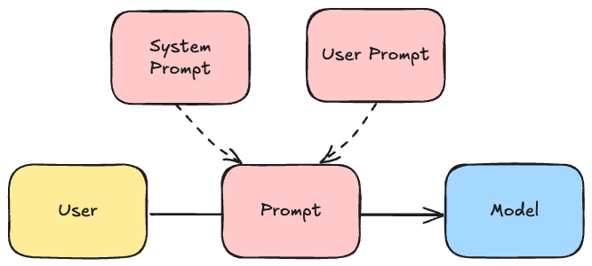

To provide this system prompt within Spring AI, you can create a separate template file, eg. **src/main/resources/system.st** and provide the necessary details:

```
You are a helpful task assistant in a chat application.
Use the information provided by the user to answer their questions.
Do not suggest other task management tools.
Always answer in plain text, don't use Markdown. Prefer phrases over bullet points.
If your message contains a date, always format the date as "MMMM D, YYYY".
If you don't know the answer, say "I don't know".
```

After that, you can reference this file when setting up a `ChatClient` bean:

```java
@Bean
ChatClient chatClient(ChatClient.Builder builder) {
    return builder
        .defaultUser(new ClassPathResource("user.st"))
        .defaultSystem(new ClassPathResource("system.st"))
        .build();
}
```

### Prompting technique 3: Conversational memory

If you've talked to a large language model before, you know that it remembers what you've asked before.
For example, let's say you ask it to solve "2 + 2", it will likely answer with "4".
If you then ask it to add 3 to last answer, it will answer with "7".

This feature is not available by default.
For example, if I make an API call to a chat model, it does not have any memory of what happened before.
The way this is usually implemented is that the client stores the previously sent prompts and responses, and sends them back with each new prompt.

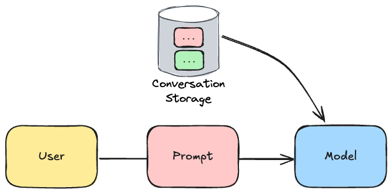

Some AI models (eg. [Open AI models](https://platform.openai.com/docs/api-reference/chat/create#chat-create-messages)) provide a way of sending previous messages as part of their API.
Not all models do this though, so alternatively you could pass the previous messages as part of the prompt of the next message.

For this reason, Spring AI provides three ways to implement a conversation history:

1. `MessageChatMemoryAdvisor`: This advisor passes the messages as part of the API (when supported).
2. `PromptChatMemoryAdvisor`: This advisor passes the messages as part of the prompt
3. `VectorStoreChatMemoryAdvisor`: This advisor also passes the messages as part of the prompt, but stores it in a different format so only relevant messages are passed to the prompt (more about the vector store can be found in the [Retrieval Augmented Generation chapter](#prompting-technique-4-retrieval-augmented-generation-rag)).

For example, if you want to ue `PromptChatMemoryAdvisor`, you could do it like this:

```java
@Bean
ChatClient chatClient(ChatClient.Builder builder) {
    return builder
        .defaultAdvisors(
            new PromptChatMemoryAdvisor(MessageWindowChatMemory
                .builder()
                // 200 is the default maxMessages
                .maxMessages(10)
                // InMemoryChatMemoryRepository is the default
                .chatMemoryRepository(new InMemoryChatMemoryRepository())
                .build())
        )
        .build();
}
```

Limiting the amount of messages is useful to make sure your prompts don't grow too large.
This is necessary to avoid high costs, but also high memory consumption in case you're using the in memory repository.

To use the conversation memory, you have to configure the conversation ID.
This can be done by writing the following code:

```java
// The unique ID of a user (depends on your code)
long userId = event.getMessage().user().getId();
// The user their prompt (depends on your code)
String question = event.getMessage().content();
// The response
String response = chatClient
    .prompt()
    .advisors(spec -> spec
        .param(AbstractChatMemoryAdvisor.CHAT_MEMORY_CONVERSATION_ID_KEY, userId))
    .user(question)
    .call()
    .content();
```

> **Note**: If you don't override this conversation ID, the default one will be used.
> Since the default conversation ID is a constant, every call will use the same shared conversation memory.

### Prompting technique 4: Retrieval Augmented Generation (RAG)

Every chat model has been trained on certain data, and has a cutoff date in its knowledge.
This means that it these models do not know about your business context, your code, your company data or up-to-date information.

So if you want a model to be able to answer based on this type of data, you have to somehow provide it to the Large Language Model.
One way of doing so would be to pass all the relevant data to the prompt.
This has a few limitations though:

1. It would be very **expensive**: You're paying for every word you send to the AI, so the more data you send, the more you pay.
2. It would be very **slow**: Interpreting huge amounts of data takes time.
3. It would be **inefficient**: Just like humans would be unable to see the forest through the trees, passing all data (and thus also irrelevant data) will make it harder for the AI to generate a proper response.
4. It would be **impossible**: All models come with a limited token size window. This means that sending huge amounts of data with each prompt would be impossible. Some models have a bigger token size window (eg. Gemini 1.5 Pro), but those models are usually more expensive as well.

The alternative to this is to interpret this data and only send the relevant parts of that data to the AI.
A typical example of this are code assistants.
Code assistants do not send your whole code base to the AI every time it suggest a code completion.
Instead, it usually only sends the open file and a few other relevant files (recently opened, imported files, ...) to the AI.

The way Spring AI offers Retrieval Augmented Generation is by providing a way for you to process documents.
The term document can be seen quite broadly.
It can be PDF files, HTML files, simple text, ... .
Spring AI then passes those documents to an **embedding model**.
These embedding models parse these documents and return the relationship between certain words and terms as numerical data.

> **Note**: Not all Large Language Model providers have an embedding model.
> For example, although DeepSeek proxies the Open AI API, it does not provide an embedding model at the time I wrote this tutorial.

This numerical data can then be stored inside a vector database.
Spring AI supports several vector databases, such as PGVector (a Postgres extension), Neo4j, Apache Cassandra and many more.

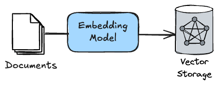

After that, each time a user makes a prompt, Spring AI can look inside that vector database to find relevant information and pass it together with the prompt to the model.
The process to "ingest" these documents usually happens in a separate process and not when you make a prompt.

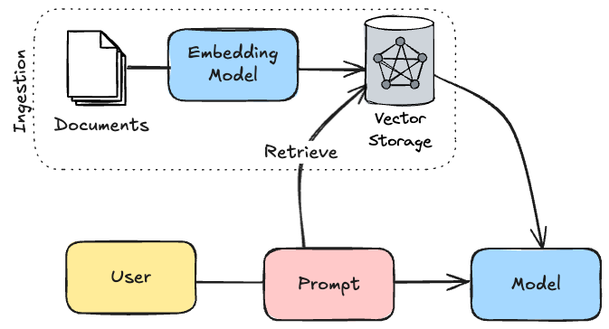

To implement this with Spring AI, you first need to determine the type of documents you plan on ingesting.
For example, to ingest PDF documents, you need to add the following dependency:

```xml
<dependency>
    <groupId>org.springframework.ai</groupId>
    <artifactId>spring-ai-pdf-document-reader</artifactId>
</dependency>
```

There's also a document reader for [Apache Tika](https://tika.apache.org/) documents, which allows you to process various document types.
If you can't find a proper reader for your purpose, you can also create your own documents:

```java
var document = Document
    .builder()
    .text(
        """
            This is the content of the document
            """)
    .build();
```

After that, you also need to determine the type of vector database you want to use.
For PGVector, you need to include the following dependency:

```xml
<dependency>
    <groupId>org.springframework.ai</groupId>
    <artifactId>spring-ai-starter-vector-store-pgvector</artifactId>
</dependency>
```

The advisor to work with vector stores are in a separate module as well.
So in addition to the previous two dependencies, you also need to include the following dependency:

```xml
<dependency>
    <groupId>org.springframework.ai</groupId>
    <artifactId>spring-ai-advisors-vector-store</artifactId>
</dependency>
```

After that, you need to implement the ingestion phase.
For example, to ingest a list of PDF files within a folder, you could write something like this:

```java
@Bean
ApplicationRunner ragIngestion(VectorStore vectorStore) {
    return args -> {
        var folder = new FileSystemResource("./.documents/");
        var files = folder.getFile().listFiles();
        var documents = new ArrayList<Document>();
        for (var file : Objects.requireNonNull(files)) {
            if (isPdf(file)) {
                var fileResource = new FileSystemResource(file);
                var reader = new PagePdfDocumentReader(fileResource);
                documents.addAll(reader.read());
            }
        }
        vectorStore.accept(documents);
    };
}
```

In practice, you probably want to paramaterize it better and don't trigger it each time you start up the application.

Now, to use the vector store for Retrieval Augmented Generation, you need to add the `QuestionAnswerAdvisor` to your `ChatClient`:

```java
@Bean
ChatClient chatClient(ChatClient.Builder builder, VectorStore vectorStore) {
    return builder
        .defaultAdvisors(new QuestionAnswerAdvisor(vectorStore))
        .build();
}
```

After that, you can ask any question related to the documents you ingested and it will work.

### Prompting technique 5: Using the right parameters

When prompting, there are several parameters you can tweak that allow you to get better responses depending on your use case.
While some of these depend on which model you're using, some others like the temperature are pretty generic.

Below is a list of some common parameters that you can use to tweak.

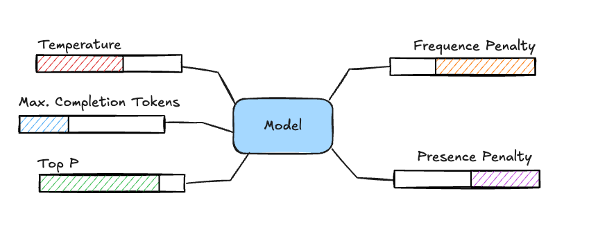

#### Temperature

The temperature is a value between 0 and 1 and essentially represents a percentage.
It allows you to tweak how creative a model can be.
The closer you get to 0, the more deterministic the output will be while the closer you get to 1, the more freedom the model has to select certain words.

#### Maximum Completion Tokens

This parameter tweaks how many tokens can be consumed when generating a response.
The less tokens you allow, the shorter the responses will be.

#### Top P

This parameter is also a value between 0 and 1 and also represents a percentage.
Using this parameter is also referred to as "nucleus sampling".
It allows you to configure from which words the model can pick.
For example, if you configure this parameter to be 0.8, then the model will pick words from 80% of the top relevant words.
This means that the higher you set this parameter, the more variety in words the model can use, and thus the more creative it can be.
As this parameter tweaks creativity just like the temperature, you should avoid using these together and only pick either "top_p" or "temperature".

#### Frequence Penalty

The frequence penalty is a number between -2.0 and +2.0.
It controls how the model will handle repetition of words.
The higher this parameter, the less likely the model will use the same words multiple times.

On the other hand, if this parameter is negative, it becomes more likely that the model will use the same word multiple times.

#### Presence Penalty

This penalty is also a number between -2.0 and +2.0.
The higher the number, the less likely the model will be to keep talking about the same topic and will try to use new words.
So in essence, it's a bit like the opposite of the frequence penalty.

#### Tweaking the parameters

Knowing these (and other) parameters allow you to generate more proper responses.
For example, if you want more creative output, you'd increase either the temperature or Top P parameter.
If you want to use a chat model for text labeling, you want to decrease the temperature and decrease the Maximum Completion Tokens as well as you're only interested in a short label (eg. positive, neutral or negative).

With Spring AI, you can configure these parameters by setting the right properties.
For example:

```properties
spring.ai.openai.chat.options.frequency-penalty=0.5
spring.ai.openai.chat.options.presence-penalty=0.5
spring.ai.openai.chat.options.temperature=0.5
spring.ai.openai.chat.options.top-p=0.9
spring.ai.openai.chat.options.max-completion-tokens=1000
```

Alternatively, you can also change these parameters when configuring or using the `ChatClient` itself:

```java
@Bean
ChatClient chatClient(ChatClient.Builder builder) {
    return builder
        .defaultOptions(OpenAiChatOptions.builder()
            .frequencyPenalty(0.5d)
            .presencePenalty(0.5d)
            .temperature(0.5d)
            .topP(0.9d)
            .maxTokens(1000)
            .build())
        .build();
}
```

### Prompting technique 6: Tool calling

A final way to enhance your prompting is by allowing the Large Language Model to interact with your code through tool calling.
With tool calling, Spring AI passes a list of available tools to the model, and then based on the prompt, the AI can decide to either call a tool or send a response to the user.
When the AI wants a tool being called, Spring AI will orchestrate that, and will send the response back to the AI as a follow-up prompt.
This can be re-iterated a few times until the AI sends a final response to the user.

For example, imagine having implemented a todo application.
Possible tools would be:

* Get a list of tasks
* Create a task
* Delete a task
* Toggle the completion of a task
* Get the current date (AI models have no knowledge about the current date)

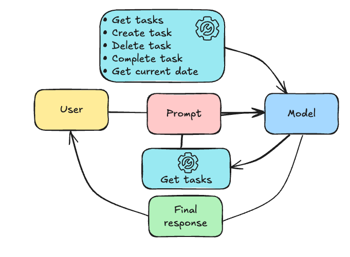

If the user asked to create a task due tomorrow to cut the grass, the AI could potentially do the following:

1. It could call the tool to get the current date.
2. Spring AI would orchestrate this and send back the current date to the AI.
3. The AI could then call the tool to create a task with the description to cut the grass with the due date being tomorrow.
4. Spring AI would orchestrate this as well and send back an OK response to the AI.
5. Finally, the AI would send a final response back to the user saying they created a task to cut the grass for tomorrow.

The easiest way to implement these tools with Spring AI is to create a class and annotate each method with `@Tool`:

```java
@Component
@RequiredArgConstructor
class TaskTools {
    private final TaskService taskService;

    @Tool(description = "get all tasks")
    public List<Task> getTasks() {
        return taskService.getAll();
    }

    @Tool(description = "create a task")
    public Task createTask(
        @ToolParam(description = "the description of the task") String description,
        @ToolParam(description = "The due date of the task in ISO format (YYYY-MM-DD)") String dueDate) {
        return taskService.create(description, LocalDate.parse(dueDate));
    }

    @Tool(description = "delete a task")
    public void deleteTask(
        @ToolParam(description = "the id of the task") long id) {
        taskService.delete(id);
    }

    @Tool(description = "toggle the completion of a task")
    public Task toggleTask(
        @ToolParam(description = "the id of the task") long id) {
        return taskService.toggle(id);
    }

    @Tool(description = "get the current date in ISO format (YYYY-MM-DD)")
    public LocalDate getCurrentDate() {
        return LocalDate.now();
    }
}

```

With `@Tool` we can describe a tool or operation.
With `@ToolParam` we can describe the parameters that are required.
Be aware that Spring AI does not support every return type.
First of all, the response types must be serialializable to JSON, so bidirectional relationships should not be used.
Secondly, it does not support functional types such as `Function`, `Optional`, ... nor does it support asynchronous types such as `Flux`, `Mono`, `CompletableFuture`, ... .

After creating the tool class, you can inject it into your `ChatClient` like this:

```java
@Bean
ChatClient chatClient(ChatClient.Builder builder, TaskTools taskTools) {
    return builder
        .defaultTools(taskTools)
        .build();
}
```

#### Model Context Protocol

Interesting to know is that Model Context Protocol (MCP) is essentially the same principle, but "on steroids".
With Model Context Protocol, any program can provide tools as an API.
Programs that do so are called MCP Servers.
Those MCP Servers are then registered within an MCP Client, which is usually a local user interface on top of a Large Language Model (eg. Claude Desktop).
In stead of Spring AI orchestrating the calls, the MCP Client will call the LLM and orchestrate the calls to the MCP servers by itself.

## Response techniques

Other than prompting, Spring AI also assists you with the response handling.

### Response technique 1: Safeguard

Considering that chat models are non-deterministic, it's impossible to know what kind of content it will produce.
Setting proper prompts will lower the risk, but there's always a risk that a Large Language Model might produce content you don't want.

One possible way to avoid this is by using Spring AI's `SafeGuardAdvisor`.
This advisor allows you to blacklist certain words so that when the AI uses them, an error response is produced.

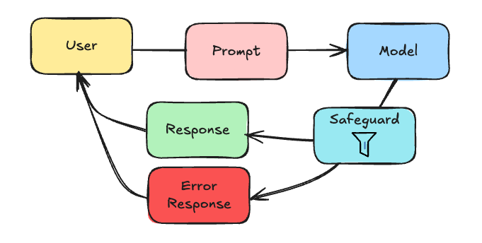

Using this `SafeGuardAdvisor` is as simple as:

```java
@Bean
ChatClient chatClient(ChatClient.Builder builder) {
    return builder
        .defaultAdvisors(
            new SafeGuardAdvisor(List.of(
                "badword1",
                "badword2"
            ))
        )
        .build();
}
```

### Response technique 2: Structured response

As we've covered so far, an LLM is great at producing text.
Sometimes, you want something more structured though, like an instance of a specific class.
In those cases, using structured responses are the solution.

Depending on which model you use, there are two options:

1. You can use prompting to ask for a specific response
2. Or, if supported, you can directly ask the AI to produce certain response format

#### Structured response by prompting

The method that works for all models is to prompt the AI to follow certain response structure.
The way Spring AI does this is by generating a [JSON schema](https://json-schema.org/) based on the class you want to get an instance of.
This JSON schema is then added to the prompt, and the AI is asked to follow the JSON schema when responding.

The AI will then (hopefully) respond with a JSON that follow that schema.
In that case, Spring AI will deserialize the JSON to an object of the requested type and you're done.

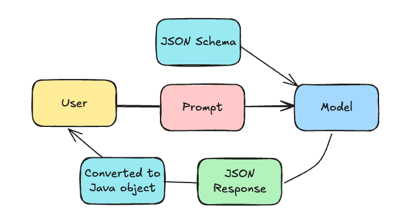

To do this, all you need to do is to call the `ChatClient`'s `entity()` method.
For example:

```java
ResponseType response = chatClient
    .prompt()
    .user(question)
    .call()
    .entity(ResponseType.class);
```

In this example, Spring AI will return an instance of `ResponseType`.

The big caveat is that you can't be 100% sure that the AI will follow the JSON schema.
Even when it responds with a valid JSON, sometimes it might prepend it with "here's the JSON: ...".
So when you use this, it's important to always have a fallback, or maybe retry a few times.

#### Structured response by response format

Some LLM providers on the other hand might provide a different way of setting a response format.
For example, Open AI allows you to specify a JSON schema through as a response format (see [documentation](https://platform.openai.com/docs/guides/structured-outputs)).

To use this with Spring AI, you need to configure the JSON schema as one of the options:

```java
@Bean
ChatClient chatClient(ChatClient.Builder builder) {
    String jsonSchema = """
    {
        "type": "object",
        "properties": {
            "steps": {
                "type": "array",
                "items": {
                    "type": "object",
                    "properties": {
                        "explanation": {
                            "type": "string"
                        },
                        "output": {
                            "type": "string"
                        }
                    },
                    "required": ["explanation", "output"],
                    "additionalProperties": false
                }
            },
            "final_answer": {
                "type": "string"
            }
        },
        "required": ["steps", "final_answer"],
        "additionalProperties": false
    }
    """;
    return builder
        .defaultOptions(OpenAiChatOptions.builder()
            .responseFormat(ResponseFormat
                .builder()
                .type(ResponseFormat.Type.JSON_OBJECT)
                .jsonSchema(ResponseFormat.JsonSchema
                    .builder()
                    .schema(jsonSchema)
                    .strict(true)
                    .build())
                .build())
            .build())
        .build();
}
```

If you have an existing class type, you can use the `BeanOutputConverter` class to both generate a JSON schema and convert the output to an instance of that type.
For example:

```java
@Bean
BeanOutputConverter<MyResponse> myResponseConverter() {
    return new BeanOutputConverter<MyResponse>();    
}

@Bean
ChatClient chatClient(ChatClient.Builder builder, BeanOutputConverter<MyResponse> myResponseConverter) {
    return builder
        .defaultOptions(OpenAiChatOptions.builder()
            .responseFormat(ResponseFormat
                .builder()
                .type(ResponseFormat.Type.JSON_OBJECT)
                .jsonSchema(ResponseFormat.JsonSchema
                    .builder()
                    .schema(myResponseConverter.getJsonSchema())
                    .strict(true)
                    .build())
                .build())
            .build())
        .build();
}
```

And then later on you can autowire the `BeanOutputConverter` and use:

```java
String jsonResponse = chatClient
    .prompt()
    .user(question)
    .call()
    .content();
MyResponse response = converter.convert(jsonResponse);
```

Be aware, you're normally able to configure the JSON schema through properties by setting `spring.ai.openai.chat.options.response-format.schema`.
This property is however bugged (see [issue](https://github.com/spring-projects/spring-ai/issues/2969)).
A solution will be available in 1.0.0 RC1.
For that reason, I recommend setting the JSON schema through the `OpenAiChatOptions` class as I've done in this example.

## Conclusion

Integrating a Large Language Model gives you new opportunities to provide a better user experience for your users.
With Spring AI, you can easily integrate these models into your Spring applications.

While Spring AI is currently still in milestone phase, it already provides a huge portfolio of modules to build many AI-integrated applications.
Due to being in milestone phase, there are still some bugs as well, which I've talked about in this blogpost.

Many of the code snippets can be found in [my Spring AI demo project](https://github.com/g00glen00b/demo-spring-ai/tree/complete).
This project contains a simple todo application that has an AI assistant.