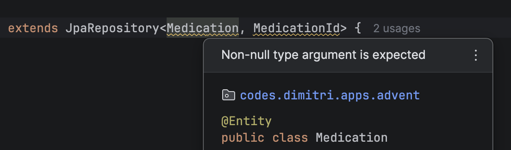

## Introduction

Spring Boot 4 has been released last month!
Considering all the new features it has, I decided to write about these features throughout the month of December.
It will be an advent of Spring Boot 4 related tips!

If you're familiar with Spring Boot, and you're upgrading to Spring Boot 4, you might notice some warnings in your IDE.



This warning happens because the Spring framework now utilizes [JSpecify](https://jspecify.dev/) to mark their code as nullable or not.
Many parts of the framework have been annotated so far (with some exceptions, which you can find in [the official blogpost](https://spring.io/blog/2025/11/12/null-safe-applications-with-spring-boot-4#a-huge-collaborative-effort)), so in many cases you'll now get IDE warnings if you use an API that expects non-null parameters.

## IDE Support

If you want to improve null-safety within your code, then the first thing you need to do is to make sure you're using an IDE that supports this static analysis of your code with JSpecify.
If you're using IntelliJ, then starting with IntelliJ 2025.3, your IDE will start showing warnings.
If JSpecify is on the classpath, it will also prefer using those annotations above their own JetBrains non-null annotations.

You can also set up a Maven or Gradle plugin, but I haven't done this so far because configuring the Maven plugin right now requires [quite some configuration](https://github.com/danvega/danvega-dev-nuxt/blob/968c80d287343bc667dc47bba059a09ae235b3ef/content/blog/2025/11/05/spring-boot-4-null-safety.md?plain=1#L213-L240) which feels a bit icky.

## How to use it?

The easiest way to start using JSpecify is to start annotating your code with `@Nullable` or `@Nonnull` depending on whether your parameter, field, generic, ... is nullable or not.
Luckily, you don't have to start putting this annotation everywhere, because you can also annotate your modules, packages, classes or methods with `@NullMarked`. 
When you apply the `@NullMarked` annotation, it's essentially the same as using `@Nonnull` everywhere.

If there are parts of your code that you do not want to annotate yet, you can also use the `@NullUnmarked` to undo the effects of `@NullMarked`.

So for example, let's say you have a record where all fields are non-null except one, you could:

1. Mark the package as `@NullMarked` by adding a `package-info.java` file to your package:

    ```java
    @NullMarked
    package codes.dimitri.apps.advent;

    import org.jspecify.annotations.NullMarked;
    ```

2. Annotate the field with `@Nullable`:

    ```java
    public record CreateMedicationRequest(
        String name,
        UUID administrationTypeId,
        UUID doseTypeId,
        @Nullable String description
    ) {
    }
    ```

Whenever you now try to create a `CreateMedicationRequest` object and keep the `name`, `administrationTypeId` or `doseTypeId` blank, your IDE will show a warning.

## Downsides

### Repetition of `package-info.java`

One of the downsides is that there's currently no easy way to annotate your entire codebase with `@NullMarked`.
Right now, you either have to create a `module-info.java`, but then you have to configure your Java modules or you have to use the next best thing, which is adding `@NullMarked` to your  `package-info.java`.

Normally this shouldn't be a problem, but JSpecify does not assume hierarchy when applying `@NullMarked` to your `package-info.java`.

So for example, if you put your `@NullMarked` annotated package in your root, it won't apply for any of the subpackages:

```none
📦 codes.dimitri.apps
├─ 📦 codes.dimitri.apps.medication
│  ├─ CreateMedicationRequest.java ← ❌
├─ 📦 codes.dimitri.apps.user
│  ├─ CreateUserRequest.java       ← ❌ 
├─ Application.java                ← ✅
├─ package-info.java               ← @NullMarked 
```

The best solution I found so far (without relying on Java modules) is to repeat the `package-info.java` in every package, which is pretty cumbersome:

```none
📦 codes.dimitri.apps
├─ 📦 codes.dimitri.apps.medication
│  ├─ CreateMedicationRequest.java ← ✅
│  ├─ package-info.java            ← @NullMarked
├─ 📦 codes.dimitri.apps.user
│  ├─ CreateUserRequest.java       ← ✅
│  ├─ package-info.java            ← @NullMarked
├─ Application.java                ← ✅  
├─ package-info.java               ← @NullMarked
```

### Bean declarations

If you've worked with `@Bean` declarations before, you probably know you can autowire those beans into other beans by calling that method.
For example:

```java
@Bean
MedicationService medicationService() {
    return new MedicationService();
}

@Bean
MedicationFacade medicationFacade() {
    return new MedicationFacade(medicationService());
}
```

Also, if `MedicationService` requires some autowiring on its own, you could just pass `null` whenever you call the bean method:

```java
@Bean
MedicationService medicationService(MedicationRepository repository) {
    return new MedicationService(repository);
}

@Bean
MedicationFacade medicationFacade() {
    return new MedicationFacade(medicationService(null)); // This works
}
```

This works because Spring does not actually invoke the bean method a second time, but rather returns the same singleton.
While I don't often use this approach, it's pretty common with Spring Batch because you end up with many interconnected beans.

The problem however is that this will result in a warning if you marked the package as `@NullMarked`.
Then the question is... what do you do? Things I've tried:

1. You could annotate `repository` with `@Nullable`: This will still result in a warning because `MedicationService` does expect `repository` as non-null.
2. You could in addition check that `repository` is non-null the oldschool way by adding `Assert.notNull()` or `Objects.requireNonNull()` within the `medicationService()` method. This will still result in a warning in your IDE and if we do that, then we aren't really fixing much with JSpecify are we?

Currently, I've found no solution that really works except trying to avoid this situation, which I usually already do because I didn't like the `null` parameter passing to begin with.
So for example, this code won't result in any issues:

```java
@Bean
MedicationService medicationService(MedicationRepository repository) {
    return new MedicationService(repository);
}

@Bean
MedicationFacade medicationFacade(MedicationService service) {
    return new MedicationFacade(service);
}
```

## Conclusion

JSpecify will help you with reducing the chance of hitting null-related issues at runtime.
Most parts of the Spring framework have been annotated with JSpecify now, which helps a lot when trying to call a Spring API when you're not sure whether the parameter could be null or not.

It does have a few downsides though, such as the Maven configuration being rather cumbersome, having repetitive `package-info.java` and some other niche problems. 
In general, I do think it's a useful addition though!

This blogpost is a part of the [Advent of Spring Boot 2025 series](/advent-of-spring).

