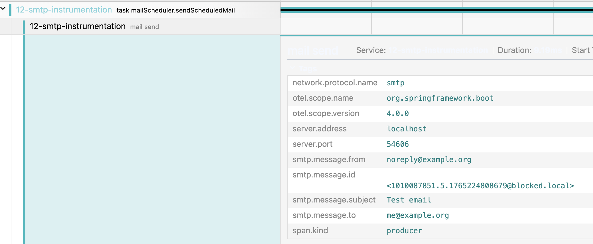

## Introduction

Spring Boot 4 has been released last month!
Considering all the new features it has, I decided to write about these features throughout the month of December.
It will be an advent of Spring Boot 4 related tips!

Upgrading your Spring Boot project doesn't mean that you're just upgrading your Spring libraries.
In addition to your Spring libraries, you're also getting library updates of a ton of managed dependencies.
One of these dependencies is [Micrometer](https://micrometer.io/).
With Spring Boot 4, you're getting the recent **Micrometer 1.16** release.
One of its features that caught my eyes, is that you're now able to instrument your Jakarta mail sender with **Micrometer** and **Spring Boot Actuator**.

## Setup

At this moment, this feature is largely undocumented, but there's [an issue](https://github.com/micrometer-metrics/micrometer/issues/6485) for that.
However, reading the pull request for this code already gives us the insights we need.
Essentially, to make this work, we need to override Spring's [`JavaMailSenderImpl.getTransport()`](https://docs.spring.io/spring-framework/docs/current/javadoc-api/org/springframework/mail/javamail/JavaMailSenderImpl.html#getTransport(jakarta.mail.Session)) method so that we're capable of wrapping the transport into an [`InstrumentedTransport`](https://javadoc.io/doc/io.micrometer/micrometer-jakarta9/latest/io/micrometer/jakarta9/instrument/mail/InstrumentedTransport.html).

```java
var sender = new JavaMailSenderImpl() {
    @Override
    protected Transport getTransport(Session session) throws NoSuchProviderException {
        return new InstrumentedTransport(session, super.getTransport(session), registry);
    }
};
```

Currently, there's no support yet from within the Spring framework to autoconfigure this for us.
This means that in order to make this work, the best solution is to create our own `JavaMailSenderImpl` bean by using the same kind of configuration as provided within the [`MailSenderPropertiesConfiguration`](https://github.com/spring-projects/spring-boot/blob/2639d1ead5223889738e85f5216a4b8989f2b9fb/module/spring-boot-mail/src/main/java/org/springframework/boot/mail/autoconfigure/MailSenderPropertiesConfiguration.java).

So if we copy the `applyProperties()` method, and combine it with the `InstrumentedTransport` from before, we get something like this:

```java
@Configuration
@EnableConfigurationProperties({MailProperties.class})
public class InstrumentedMailSenderConfiguration {
    @Bean
    JavaMailSender instrumentedJavaMailSender(ObservationRegistry registry, MailProperties properties, ObjectProvider<SslBundles> sslBundles) {
        var sender = new JavaMailSenderImpl() {
            @Override
            protected Transport getTransport(Session session) throws NoSuchProviderException {
                return new InstrumentedTransport(session, super.getTransport(session), registry);
            }
        };
        applyProperties(properties, sender, sslBundles.getIfAvailable());
        return sender;
    }

    /**
     * Taken from <code>MailSenderPropertiesConfiguration</code>
     * @see org.springframework.boot.mail.autoconfigure.MailSenderPropertiesConfiguration
     * @see <a href="https://github.com/spring-projects/spring-boot/blob/main/module/spring-boot-mail/src/main/java/org/springframework/boot/mail/autoconfigure/MailSenderPropertiesConfiguration.java">source</a>
     */
    private void applyProperties(MailProperties properties, JavaMailSenderImpl sender, @Nullable SslBundles sslBundles) {
        sender.setHost(properties.getHost());
        if (properties.getPort() != null) {
            sender.setPort(properties.getPort());
        }

        sender.setUsername(properties.getUsername());
        sender.setPassword(properties.getPassword());
        sender.setProtocol(properties.getProtocol());
        sender.setDefaultEncoding(properties.getDefaultEncoding().name());

        Properties javaMailProperties = this.asProperties(properties.getProperties());
        String protocol = properties.getProtocol();
        protocol = !StringUtils.hasLength(protocol) ? "smtp" : protocol;
        MailProperties.Ssl ssl = properties.getSsl();
        if (ssl.isEnabled()) {
            javaMailProperties.setProperty("mail." + protocol + ".ssl.enable", "true");
        }

        if (ssl.getBundle() != null) {
            Assert.state(sslBundles != null, "'sslBundles' must not be null");
            SslBundle sslBundle = sslBundles.getBundle(ssl.getBundle());
            javaMailProperties.put("mail." + protocol + ".ssl.socketFactory", sslBundle.createSslContext().getSocketFactory());
        }

        if (!javaMailProperties.isEmpty()) {
            sender.setJavaMailProperties(javaMailProperties);
        }

    }

    private Properties asProperties(Map<String, String> source) {
        Properties properties = new Properties();
        properties.putAll(source);
        return properties;
    }
}
```

## Viewing the metrics

To view the metrics, we need to enable the metrics endpoint in Spring Boot Actuator.
To do this, we can set the following property:

```properties
# application.properties
# Comma separated list, should include 'metrics'
management.endpoints.web.exposure.include=metrics
```

After that, you can open your metrics at `http://localhost:8080/actuator/metrics`.
If you send an e-mail, you should see two new metrics appear; `mail.send` and `mail.send.active`.

if we check the `mail.send` metric by visiting ``http://localhost:8080/actuator/metrics/mail.send`, we get something like this:

```json
{
  "availableTags": [
    {
      "tag": "server.address",
      "values": [
        "localhost"
      ]
    },
    {
      "tag": "server.port",
      "values": [
        "52916"
      ]
    },
    {
      "tag": "network.protocol.name",
      "values": [
        "smtp"
      ]
    },
    {
      "tag": "error",
      "values": [
        "none"
      ]
    }
  ],
  "baseUnit": "seconds",
  "measurements": [
    {
      "statistic": "COUNT",
      "value": 4.0
    },
    {
      "statistic": "TOTAL_TIME",
      "value": 0.05174829
    },
    {
      "statistic": "MAX",
      "value": 0.025504208
    }
  ],
  "name": "mail.send"
}
```

The measurements that are available are:

1. `COUNT`: The number of mails that have been sent
2. `TOTAL_TIME`: The total time taken for all mails to be sent
3. `MAX`: The maximum time for a mail to be sent

In addition, there are also tags to identify certain SMTP server.
These tags can be used in case you're using multiple SMTP servers.
For example, you could target an SMTP server by its host by visiting `http://localhost:8080/actuator/metrics/mail.send?tag=server.address:localhost`.

## Traces

In addition to metrics, Micrometer also exposes traces.
With the SMTP instrumentation available, you can now see SMTP-related traces as well.
We can expose these to platforms like Jaeger or Zipkin through OpenTelemetry.

For example, this is what it looks like in Jaeger:



As you can see, there's now a separate "mail send" span that exposes some tags such as `smtp.message.to`, `smtp.message.subject`, ... .

## Conclusion

While it's not yet documented and not yet autoconfigured, using the new `InstrumentedTransport` is a great way of monitoring SMTP performance issues within your Spirng Boot application.

This blogpost is a part of the [Advent of Spring Boot 2025 series](/advent-of-spring).