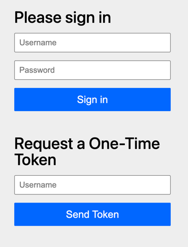
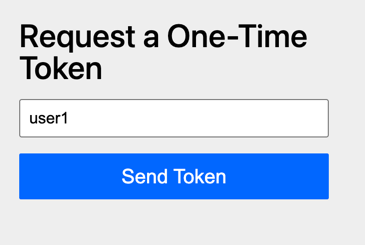

## Introduction

Spring Boot 4 has been released last month!
Considering all the new features it has, I decided to write about these features throughout the month of December.
It will be an advent of Spring Boot 4 related tips!

Today's new feature is **Multi-Factor Authentication**.
Multi-Factor Authentication was introduced in Spring Security 7, and is thus also available when using Spring Boot 4.

The way Multi-Factor Authentication (or MFA) works in Spring Security is that there's now a concept called [`FactorGrantedAuthority`](https://docs.spring.io/spring-security/site/docs/current/api/org/springframework/security/core/authority/FactorGrantedAuthority.html).
This `FactorGrantedAuthority` determines whether a user has authenticated through every factor your application requires (usually two).
As long as a user does not meet the required `FactorGrantedAuthority`s, your user won't be authenticated.

## An example

Spring supports several authentication methods such as:

- A form-based login
- Basic authentication
- Passkeys
- A One-Time Token or OTT (not to be confused with a One-Time Password such as the ones you get with an authenticator app!)
- Your own authentication method (by implementing your own `AuthenticationProvider`)
- ...

The way Spring's Multi-Factor Authentication works is that you can combine multiple of these authentication methods together.
For example, you could combine a form-based login with a One-Time Token (which usually requires access to your email), and thus implement 2FA/MFA.

To do this, we configure each factor we want to use, for example:

```java
@Bean
SecurityFilterChain securityFilterChain(HttpSecurity http) {
    return http
        // ...
        .authorizeHttpRequests(requests -> requests.anyRequest().authenticated())
        .formLogin(Customizer.withDefaults())
        .oneTimeTokenLogin(Customizer.withDefaults())
        .build();
}
```

What's new is that both these authentication methods will now give the user a `FactorGrantedAuthority`.
For example, once you log in with a form, you would get an authority with the name [`FACTOR_PASSWORD`](https://docs.spring.io/spring-security/site/docs/current/api/org/springframework/security/core/authority/FactorGrantedAuthority.html#PASSWORD_AUTHORITY).
Once you log in with a One-Time Token, you get an authority with the name [`FACTOR_OTT`](https://docs.spring.io/spring-security/site/docs/current/api/org/springframework/security/core/authority/FactorGrantedAuthority.html#OTT_AUTHORITY).

The problem is that this won't work right now.
That's because the configuration allows you to log in with a password or with an OTT, but not with both.
To make these work together, we need to add a new annotation called `@EnableMultiFactorAuthentication` and tell it which authorities should be used as authentication factors:

```java
@Configuration
// Add this
@EnableMultiFactorAuthentication(authorities = {
    FactorGrantedAuthority.PASSWORD_AUTHORITY,
    FactorGrantedAuthority.OTT_AUTHORITY
})
public class SecurityConfiguration {
    // ...
}
```

The new `@EnableMultiFactorAuthentication` annotation does two things.
First of all, it sets up all authentication filters so that they can work together instead of only allowing a single authentication method at a time.
It does this by setting [`setMfaEnabled()`](https://docs.spring.io/spring-security/reference/api/java/org/springframework/security/web/authentication/AbstractAuthenticationProcessingFilter.html#setMfaEnabled(boolean)) for all the authentication filters.

The second thing it does is to configure that all endpoints require both the `FactorGrantedAuthority.PASSWORD_AUTHORITY` and the `FactorGrantedAuthority.OTT_AUTHORITY` authorities.
Spring Security does this by setting up a new type of bean called an [`AuthorizationManagerFactory`](https://docs.spring.io/spring-security/site/docs/current/api/org/springframework/security/authorization/AuthorizationManagerFactory.html).
The equivalent code that's being generated is:

```java
@Bean
DefaultAuthorizationManagerFactory<?> mfa() {
    return AuthorizationManagerFactories
        .multiFactor()
        .requireFactors(FactorGrantedAuthority.PASSWORD_AUTHORITY, FactorGrantedAuthority.OTT_AUTHORITY)
        .build();
}
```

This `AuthorizationManagerFactory` basically has similar methods to when you use `authorizeHttpRequests()` (e.g. `authenticated()`, `hasAuthority()`, ...).
The main difference is that if you'd call `AuthorizationManagerFactory.hasAuthority()`, it would check for the given authority **AND** the required factor authorities.

So, if you log in now, you first get the default login page showing both the password authentication and the OTT authentication method:



> **Note**: Spring Security's default form does not support "ordering" the authentication methods as far as I know.
> If this is something you're looking for, you'll need to write your own form pages.

Once you authenticate with username + password, it will only show the OTT authentication method:



It's also indicated in the URL that this authentication factor is missing, since the following query parameters are appended: `factor.type=ott` and `factor.reason=missing`.
After authenticating with the OTT as well, you are finally redirected to the homepage.

## Finetuning the Multi-Factor Authentication

Spring Security also allows you to fine-tune the MFA process.
For example, let's say we only want to enable Multi-Factor Authentication on certain endpoints?

Well, in that case we no longer rely on the generated `AuthorizationManagerFactory`, and use our own instead.
To do this, we first need to pass an empty `authorities` to `@EnableMultiFactorAuthentication` so that it only sets up the authentication filters to support MFA:

```java
@Configuration
// Note: We HAVE to provide an empty authorities array!
@EnableMultiFactorAuthentication(authorities = {})
public class SecurityConfiguration {
    // ...
}
```

After that, we can manually create an `AuthorizationManagerFactory` and manually call methods such as `hasAuthority()` within our security filter chain:

```java
@Bean
SecurityFilterChain securityFilterChain(HttpSecurity http) {
    var mfa = AuthorizationManagerFactories
        .multiFactor()
        .requireFactors(FactorGrantedAuthority.PASSWORD_AUTHORITY, FactorGrantedAuthority.OTT_AUTHORITY)
        .build();
    return http
        .authorizeHttpRequests(requests -> requests
            .requestMatchers("/admin/**").access(mfa.authenticated())
            .anyRequest().authenticated())
        .formLogin(Customizer.withDefaults())
        .oneTimeTokenLogin(Customizer.withDefaults())
        .build();
}
```

So even though we didn't change anything to the `anyRequest()` matcher, it will now only check whether the user has authenticated with a single factor.
This is because we no longer have any `AuthorizationManagerFactory` bean active.

Secondly, we do use the `AuthorizationManagerFactory.authenticated()` method for our `/admin/**` matcher.
This means that this endpoint **requires Multi-Factor Authentication**.

## Conclusion

Spring Security's new Multi-Factor Authentication makes it a lot easier to configure Multi-Factor Authentication.
Personally, I don't think I'll use it though.
I think that the best authentication is one you don't write yourself, and that's why I think that integrating an existing identity platform (e.g. Microsoft Entra, Auth0, ...) is probably a better solution than shipping your own Multi-Factor Authentication.

This blogpost is a part of the [Advent of Spring Boot 2025 series](/advent-of-spring).