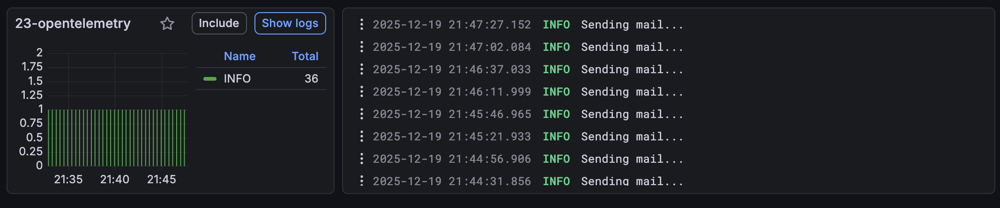
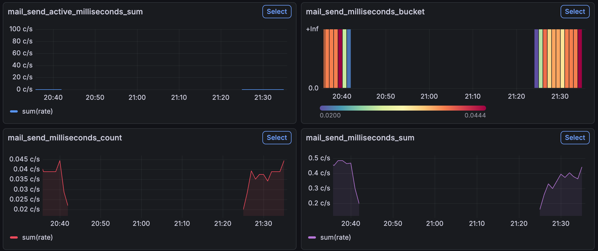
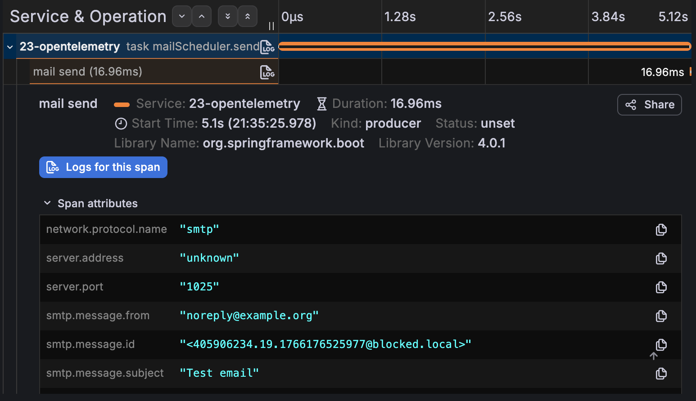

## Introduction

Spring Boot 4 has been released last month!
Considering all the new features it has, I decided to write about these features throughout the month of December.
It will be an advent of Spring Boot 4 related tips!

If you've monitored Spring Boot applications in the past, you probably heard about **OpenTelemetry**.
Since **Spring Boot 4**, Spring now has its own Spring Boot starter for OpenTelemetry.

## What is OpenTelemetry?

OpenTelemetry is an open-source observability framework that provides APIs for collecting and processing telemetry data such as logs, metrics, and traces.
Due to its popularity, many tools support the OpenTelemetry specification.

For example, a popular choice is Grafana's LGTM stack, which stands for Loki, Grafana, Tempo, and Mimir.
Within this stack, Loki is a logs database, Tempo is a traces database, Mimir is a time-series metrics database, and Grafana is a dashboard visualization on top of those three databases.
However, due to complexity, many LGTM stacks actually switch Mimir for Prometheus, including within the [official Docker image from Grafana](https://github.com/grafana/docker-otel-lgtm).

These databases expose endpoints following the specifications of OpenTelemetry, so that any OpenTelemetry library can export their logs, metrics, and traces.
This includes Spring Boot.

In this example, I'll be using this Docker image in combination with Spring Boot's Docker Compose support and a Mailpit Docker container to see the same metrics as in [my previous blogpost about SMTP metrics](/smtp-metrics-actuator):

```yaml
services:
  grafana-lgtm:
    image: 'grafana/otel-lgtm:latest'
    ports:
      - '3000'
      - '4317'
      - '4318'
  mailpit:
    image: 'axllent/mailpit:v1.28'
    ports:
      - '1025:1025'
      - '8025:8025'
```

## How do I export my OpenTelemetry data in Spring Boot?

In Spring Boot, there are now three options to export your OpenTelemetry data:

1. You can run the Java agent made by the OpenTelemetry team,
2. You can use the Spring Boot starter made by the OpenTelemetry team,
3. Or you can use the new Spring Boot starter made by the Spring team.

In this tutorial, I will be focusing on the latter, as that is a new Spring Boot starter since **Spring Boot 4.0**.
Spring also recommends this starter over the other options, because the Java agent might conflict with other agents, and the Spring Boot starter provided by the OpenTelemetry team pulls in alpha versions of some dependencies ([source](https://spring.io/blog/2025/11/18/opentelemetry-with-spring-boot#use-the-opentelemetry-spring-boot-starter-from-the-spring-team)).

To get started, you first need to add the new starter:

```xml
<dependency>
    <groupId>org.springframework.boot</groupId>
    <artifactId>spring-boot-starter-opentelemetry</artifactId>
</dependency>
```

Then we need to configure the individual exports, which are logging, metrics, and tracing.

## Exporting logs

The first thing you should do when you're trying to export logs as OpenTelemetry data is to check your Spring Boot version.
Currently, there's a bug in Spring Boot 4.0 that prevents logs from being exported unless **spring-boot-starter-actuator** is also on the classpath.
So, either upgrade your project to Spring Boot 4.0.1 (or higher), or add the spring-boot-starter-actuator dependency.

To export your logs as OpenTelemetry data, you have to configure an additional **Logback appender**.
This appender is not included in the OpenTelemetry starter, so before we change anything, we need to pull in an additional dependency:

```xml
<dependency>
    <groupId>io.opentelemetry.instrumentation</groupId>
    <artifactId>opentelemetry-logback-appender-1.0</artifactId>
    <version>2.23.0-alpha</version>
</dependency>
```

At this moment, there's no stable version yet of this appender library, so we need to use an alpha version.
    
Spring does not autoconfigure this appender for you, and it's not possible to do this with properties either.
So the solution is to create your own **logback.xml**.
However, we still want to keep Spring Boot's logging support as well, so we'll call this **logback-spring.xml** (see [documentation](https://docs.spring.io/spring-boot/reference/features/logging.html#features.logging.custom-log-configuration)).

The configuration we need looks like this:

```xml
<?xml version="1.0" encoding="UTF-8"?>
<configuration>
    <include resource="org/springframework/boot/logging/logback/base.xml"/>

    <!-- This is the new OpenTelemetry appender -->
    <appender name="OTEL" class="io.opentelemetry.instrumentation.logback.appender.v1_0.OpenTelemetryAppender">
    </appender>

    <root level="INFO">
        <appender-ref ref="CONSOLE"/>
        <appender-ref ref="OTEL"/>
    </root>
</configuration>
```

In addition to this, we also need to tell the `OpenTelemetryAppender` where to export the logs to.
This can be done by calling the static `OpenTelemetryAppender.install()` method and passing an instance of `OpenTelemetry`.
Spring already provides such a bean, so we just need something to run during startup to call this method.

There are a few options for this, such as `ApplicationRunner` or `CommandLineRunner`, but the cleanest option in this case is an `InitializingBean`:

```java
@Configuration(proxyBeanMethods = false)
class OpenTelemetryConfiguration {
    @Bean
    InitializingBean openTelemetryAppenderInitializer(OpenTelemetry openTelemetry) {
        return () -> OpenTelemetryAppender.install(openTelemetry);
    }
}
```

Now the final thing we need to do is to configure the logs export URL for the `OpenTelemetry` bean.
This can be done by setting the following properties:

```properties
management.opentelemetry.logging.export.otlp.transport=http
management.opentelemetry.logging.export.otlp.endpoint=http://localhost:4318/v1/traces
```

Please note that the transport is by default set to `http`, so we can skip that property.
If you want to use GRPC, then you can set the transport to `grpc`.

Also, if you're using Spring Boot's Docker Compose support (or Testcontainers), and you provide a container for the **grafana/otel-lgtm** image, then you **don't need to configure this property**.
In that case, Spring will set up a **service connection** for you automatically.
Currently, there's even a bug in Spring Boot 4.0.0 that causes a runtime exception if you use the service connection and you configure the property.
This is fixed in Spring Boot 4.0.1 though.

## Exporting metrics

Exporting metrics is a bit easier, as metrics are already collected by **Micrometer**.
However, one thing I noticed is that the OpenTelemetry starter does not include the **Micrometer Observation** library, nor does it include the **Micrometer support library for Jakarta EE 9**.
This could be important if you're doing things like instrumenting SMTP-related metrics (see [this blogpost](/smtp-metrics-actuator/) for an example).

So if you need those, you should add the following dependencies as well:

```xml
<dependency>
    <groupId>io.micrometer</groupId>
    <artifactId>micrometer-jakarta9</artifactId>
</dependency>
<dependency>
    <groupId>io.micrometer</groupId>
    <artifactId>micrometer-observation</artifactId>
</dependency>
```

After that, we need to expose some additional beans to configure Micrometer to work properly with OpenTelemetry:

```java
@Configuration(proxyBeanMethods = false)
class OpenTelemetryConfiguration {
    @Bean
    OpenTelemetryServerRequestObservationConvention openTelemetryServerRequestObservationConvention() {
        return new OpenTelemetryServerRequestObservationConvention();
    }

    @Bean
    OpenTelemetryJvmCpuMeterConventions openTelemetryJvmCpuMeterConventions() {
        return new OpenTelemetryJvmCpuMeterConventions(Tags.empty());
    }

    @Bean
    ProcessorMetrics processorMetrics() {
        return new ProcessorMetrics(List.of(), new OpenTelemetryJvmCpuMeterConventions(Tags.empty()));
    }

    @Bean
    JvmMemoryMetrics jvmMemoryMetrics() {
        return new JvmMemoryMetrics(List.of(), new OpenTelemetryJvmMemoryMeterConventions(Tags.empty()));
    }

    @Bean
    JvmThreadMetrics jvmThreadMetrics() {
        return new JvmThreadMetrics(List.of(), new OpenTelemetryJvmThreadMeterConventions(Tags.empty()));
    }

    @Bean
    ClassLoaderMetrics classLoaderMetrics() {
        return new ClassLoaderMetrics(new OpenTelemetryJvmClassLoadingMeterConventions());
    }
    
    // ...
}
```

These beans guarantee that Micrometer follows the OpenTelemetry conventions.
The final thing we need to do is to configure some properties again:

```properties
management.otlp.metrics.export.url=http://localhost:4318/v1/metrics
```

For some reason, these properties are prefixed with `management.otlp` instead of `management.opentelemetry`, so keep that in mind.
Also, if you're using Spring Boot's Docker Compose support (or Testcontainers) and you provide a container for the **grafana/otel-lgtm** image, then you **don't need to configure this property**.
In that case, Spring will set up a **service connection** for you automatically.

## Exporting traces

The final thing we can export are traces.
Traces are the easiest to configure of the three, as Spring Boot autoconfigures everything for you.
All you need to do is to configure the export URL again:

```properties
management.opentelemetry.tracing.export.otlp.endpoint=http://localhost:4318/v1/traces
```

Again, if you're using Spring Boot's Docker Compose support (or Testcontainers) and you provide a container for the **grafana/otel-lgtm** image, then you **don't need to configure this property**.
In that case, Spring will set up a **service connection** for you automatically.

## Testing it out

Now that we have everything configured, it's time to test it out!
If you run your application now, and you check the Grafana dashboard, you should see something like this when you check out **Drilldown** → **Logs**:



Similarly, if you check **Drilldown** → **Metrics**, you should be able to find application-related metrics including the SMTP metrics:



And finally, if you check **Drilldown** → **Traces**, you should be able to find traces related to your HTTP requests or scheduled tasks like I used:



## Conclusion

In this blogpost we explored how to use Spring Boot's own OpenTelemetry starter to export logs, metrics and traces to an OpenTelemetry-compatible backend such as Grafana's LGTM stack.
With just a few dependencies and some configuration, you can get started with OpenTelemetry in no time!

Make sure to **upgrade to Spring Boot 4.0.1** though.
If you don't do this, you might end up with some exceptions at runtime, or things not being exported properly.

This happened to me and it took me a while to figure out what was happening.
This is because if OpenTelemetry can't find any `LogRecordExporter`, OpenTelemetry will set up a `NoopLogRecordExporter`.
This means that you won't get any errors, but your logs simply won't be exported.

This blogpost is a part of the [Advent of Spring Boot 2025 series](/advent-of-spring).
