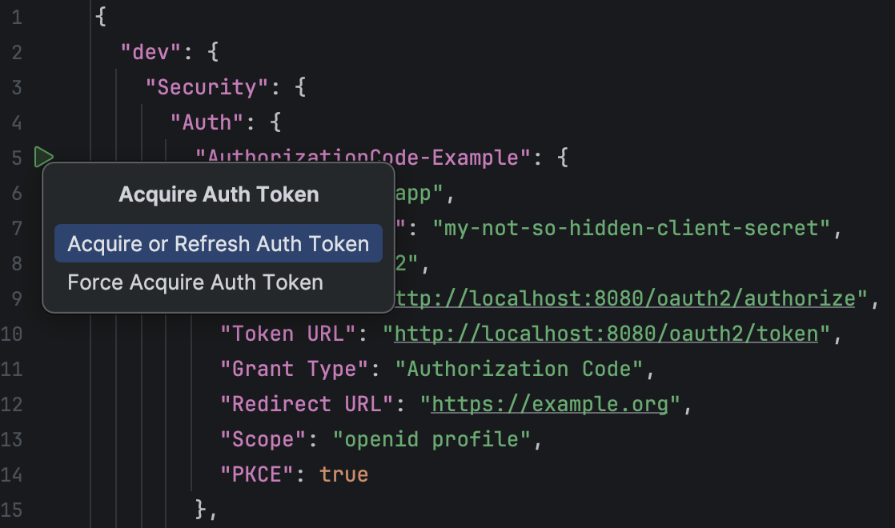
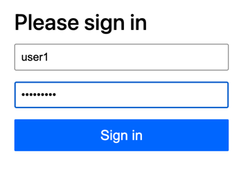
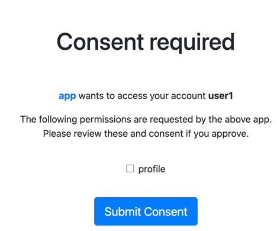
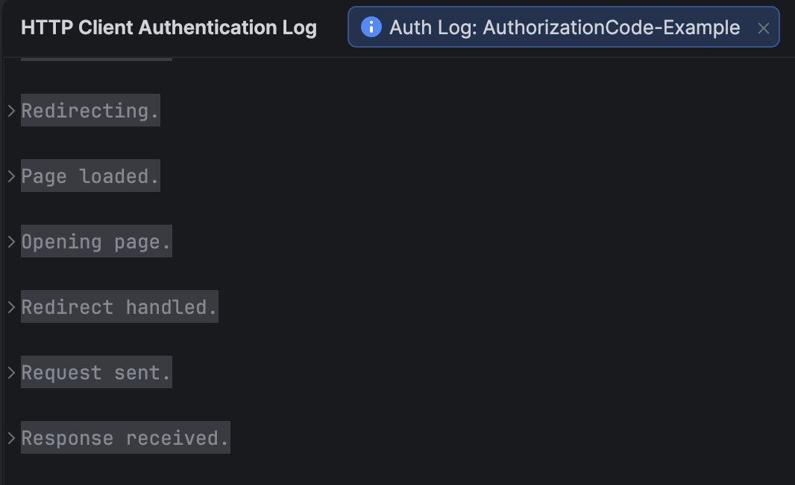
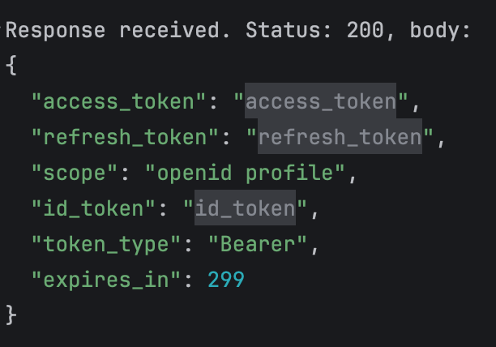

## Introduction

Spring Boot 4 has been released last month!
Considering all the new features it has, I decided to write about these features throughout the month of December.
It will be an advent of Spring Boot 4 related tips!

The final change within Spring Boot 4 and Spring Framework 7 that I'll be covering is the fact that **Spring Authorization Server** became a part of **Spring Security**.
This means that it will follow the same release cycle as Spring Security, and will be easier to use within Spring Boot applications.

This change sometimes happens within the Spring ecosystem.
Initially, a project is created as a separate project to allow for faster iterations.
Once it's stable enough, it can be merged into a larger project to allow for easier maintenance and usage.

This means it's also the ideal time to learn about Spring Authorization Server if you haven't used it before.

## What is it?

Spring Authorization Server is an implementation of an **OAuth 2.1** Authorization Server.
In addition, it also supports **OpenID Connect 1.0**.
This means that you can use Spring Authorization Server to issue OAuth 2.1 access tokens and ID tokens to your clients.

## How to use it?

To use Spring Authorization Server, we first need to import the right Spring Boot starter.
For Maven that would be:

```xml
<dependency>
    <groupId>org.springframework.boot</groupId>
    <artifactId>spring-boot-starter-security-oauth2-authorization-server</artifactId>
</dependency>
```

The next step is to provide some user details.
In this example, I'm going to keep things simple and work with an in-memory user store:

```java
@Bean
PasswordEncoder passwordEncoder() {
    return PasswordEncoderFactories.createDelegatingPasswordEncoder();
}

@Bean
InMemoryUserDetailsManager inMemoryUserDetailsManager(PasswordEncoder passwordEncoder) {
    return new InMemoryUserDetailsManager(
        User.withUsername("user1").password(passwordEncoder.encode("password1")).roles("USER").build(),
        User.withUsername("user2").password(passwordEncoder.encode("password2")).roles("USER", "ADMIN").build()
    );
}
```

So far, nothing new here as this is some standard Spring Security configuration.
After that, we can configure the authorization server itself.

You can do this in two ways, either by defining the required beans by yourself, or by using certain properties and using the default autoconfiguration.
Initially, I will rely on the autoconfiguration to keep things simple.

The properties I will be using are:

```properties
spring.security.oauth2.authorizationserver.client.app.registration.client-id=app
spring.security.oauth2.authorizationserver.client.app.registration.client-secret={bcrypt}$2a$12$KSZEokAT73BLLrZWU4/SeefwKxvLiUsmxJ6D4M5SzhnaKIHwX95wG
spring.security.oauth2.authorizationserver.client.app.registration.client-authentication-methods[0]=client_secret_basic
spring.security.oauth2.authorizationserver.client.app.registration.authorization-grant-types[0]=authorization_code
spring.security.oauth2.authorizationserver.client.app.registration.authorization-grant-types[1]=refresh_token
spring.security.oauth2.authorizationserver.client.app.registration.authorization-grant-types[2]=client_credentials
spring.security.oauth2.authorizationserver.client.app.registration.redirect-uris[0]=https://example.org
spring.security.oauth2.authorizationserver.client.app.registration.post-logout-redirect-uris[0]=https://example.org
spring.security.oauth2.authorizationserver.client.app.registration.scopes[0]=openid
spring.security.oauth2.authorizationserver.client.app.registration.scopes[1]=profile
spring.security.oauth2.authorizationserver.client.app.require-authorization-consent=true
```

All authorization server related properties are prefixed with `spring.security.oauth2.authorizationserver.client.*`.
Within these properties, we can define multiple clients (`RegisteredClient`).
You can compare this to when you set up an OAuth application within an identity provider such as Google or GitHub.
When you do that, you get to give your "application" (in this case a client) a name, a redirect URL, the scopes that can be used and so on.
In return, the identity provider usually gives you a client ID and a client secret.

So in this example, I created a client with the name `app`.
For simplicity, I also used the same name as the client ID, but this is not required.
The client secret can be any password-encoded string.
I chose to use a bcrypt-encoded string (the actual value is `my-not-so-hidden-client-secret`).

Then I configured which grant types this client can use.
These are basically the OAuth flows that your client/application can use.
In this case, I'm allowing the **Authorization Code** and **Client Credentials** flows.
The Authorization Code flow is the most common flow used by web applications, where you authenticate as a user.
The Client Credentials flow, on the other hand, is used for machine-to-machine communication, where no user is involved.

Finally, I also configured the redirect URI, but I won't be using it in this example.

The scopes are a list of things a user can give access to.
In this case, I configured the `openid` and `profile` scopes, which are standard OpenID Connect scopes.
You can, however, define other scopes.
Typically these follow a naming convention such as `user.read` or `orders.write`.

The final property I configured is that the user must explicitly grant consent to the client.
This means that when the user authenticates, they will see a consent screen where they can approve or deny the scopes requested by the client.

## Testing it out

For testing purposes, I'm going to use IntelliJ's built-in HTTP client.
Within IntelliJ, you can configure HTTP requests with a `.http` file suffix and define the OAuth2 configuration within your `http-client.env.json` file.

### Testing out the Authorization Code flow

For example, my `http-client.env.json` file looks like this:

```json
{
  "dev": {
    "Security": {
      "Auth": {
        "AuthorizationCode-Example": {
          "Client ID": "app",
          "Client Secret": "my-not-so-hidden-client-secret",
          "Type": "OAuth2",
          "Auth URL": "http://localhost:8080/oauth2/authorize",
          "Token URL": "http://localhost:8080/oauth2/token",
          "Grant Type": "Authorization Code",
          "Redirect URL": "https://example.org",
          "Scope": "openid profile",
          "PKCE": true
        }
      }
    }
  }
}
```

By default, Spring Security will set up the authorization endpoint at `/oauth2/authorize` and the token endpoint at `/oauth2/token`.
These are the URLs we need to use within our OAuth2 configuration.

In addition, we have to make sure that the client ID, client secret, redirect URL and scopes match the configuration we did earlier.
With that in place, you can directly request an access token within IntelliJ by clicking the green run button next to the configuration.
You don't have to create an actual HTTP request for this.



When you acquire a token, IntelliJ will pop up an embedded web browser window, prompting you to authenticate.
This makes sense, since we're using the **Authorization Code** flow, which means we're authenticating as a user.



Within this window, we can log in as any of the users we defined earlier (e.g. `user1:password1`).
After logging in, we will be presented with a consent screen, asking us to approve the scopes requested by the client.
The OpenID scope is always implicit, so you don't have to explicitly grant consent for it.



Once you give consent, IntelliJ will handle everything.
It will intercept the redirect to `https://example.org` and extract the authorization code from the URL.
Then it will exchange the authorization code for an access token at the token endpoint.

You can see this all happen within the logs:



Within this log, you can expand the **Response received** section to find the ID token, access token and refresh tokens.
You can also expand these to see the actual values.



After that, you can paste the JWT into a tool like [jwt.io](https://jwt.io/) to inspect the contents of the token.
The claims should be comparable to the following:

```json
{
  "sub": "user1",
  "aud": "app",
  "nbf": 1766261804,
  "scope": [
    "openid",
    "profile"
  ],
  "iss": "http://localhost:8080",
  "exp": 1766262104,
  "iat": 1766261804,
  "jti": "a671ce79-0930-4c64-a9e1-35f14ab658a0"
}
```

The most important claims are the following:
* The `sub` claim represents the **subject**.
In this case, this is the username of the authenticated user.

* The `aud` claim represents the **audience**.
This is the client ID of the client that requested the token.

* The `scope` claim represents the scopes that were granted by the user.

* The `iss` claim represents the **issuer**.
This is the URL of the authorization server.

### Testing out the Client Credentials flow

The next flow we can test is the **Client Credentials** flow.
As mentioned before, this flow is used for machine-to-machine communication, where no user is involved.
This means that we need to alter our configuration slightly.
For example:

```json
{
  "dev": {
    "Security": {
      "Auth": {
        "ClientCredentials-Example": {
          "Client ID": "app",
          "Client Secret": "my-not-so-hidden-client-secret",
          "Type": "OAuth2",
          "Grant Type": "Client Credentials",
          "Token URL": "http://localhost:8080/oauth2/token"
        }
      }
    }
  }
}
```

For this flow, we don't need an authorization URL or redirect URL, since no user is involved.
Similarly to before, we can click the green run button to acquire an access token.

If we inspect the claims of this token, we get something like:

```json
{
  "sub": "app",
  "aud": "app",
  "nbf": 1766262238,
  "iss": "http://localhost:8080",
  "exp": 1766262538,
  "iat": 1766262238,
  "jti": "9dfef69d-78c6-437c-8603-bd18f8197325"
}
```

Most of the claims are the same, however, within the Client Credentials flow we don't request any scopes.
In addition, the **subject claim** (`sub`) is now the client ID of the client that requested the token and no longer the user.

## Customizing the Authorization Server

Many aspects of the authorization server can be customized by setting up your own beans.
To do this, I recommend that you check out the [configuration model](https://docs.spring.io/spring-authorization-server/reference/configuration-model.html) and [core model](https://docs.spring.io/spring-authorization-server/reference/core-model-components.html) pages of the documentation.

For example, if you want to customize the claims of the JWT tokens that are issued, you can create your own `OAuth2TokenCustomizer`:

```java
@Bean
public OAuth2TokenCustomizer<JwtEncodingContext> jwtCustomizer() {
    return context -> {
        JwtClaimsSet.Builder claims = context.getClaims();
        claims.claim("aut", context
            .getPrincipal()
            .getAuthorities()
            .stream()
            .map(GrantedAuthority::getAuthority)
            .toList());
    };
}
```

The reason that this requires a generic of type `JwtEncodingContext` is because you can issue both JWT tokens and opaque tokens.
Opaque tokens are just random strings that have no meaning by themselves.
To access information about the token, you need to introspect it at the authorization server.
When you use JWT tokens, on the other hand, you can directly read the claims from the token itself.

So in this example, I added a custom claim called `aut`, which contains the list of granted authorities of the authenticated principal.
I'm adding this claim to both access tokens and ID tokens, but I could fine-tune this if I want.

To configure this customizer, we also need to set up a token generator bean.
This could look like this:

```java
@Bean
public OAuth2TokenGenerator<?> tokenGenerator(JWKSource<SecurityContext> jwkSource) {
    var jwtEncoder = new NimbusJwtEncoder(jwkSource);
    var jwtGenerator = new JwtGenerator(jwtEncoder);
    jwtGenerator.setJwtCustomizer(jwtCustomizer());
    var accessTokenGenerator = new OAuth2AccessTokenGenerator();
    var refreshTokenGenerator = new OAuth2RefreshTokenGenerator();
    return new DelegatingOAuth2TokenGenerator(jwtGenerator, accessTokenGenerator, refreshTokenGenerator);
}
```

If we request a token now, we should see claims like this:

```json
{
  "sub": "user1",
  "aud": "app",
  "aut": [
    "ROLE_USER",
    "FACTOR_PASSWORD"
  ],
  "nbf": 1766261804,
  "scope": [
    "openid",
    "profile"
  ],
  "iss": "http://localhost:8080",
  "exp": 1766262104,
  "iat": 1766261804,
  "jti": "a671ce79-0930-4c64-a9e1-35f14ab658a0"
}
```

As you can see, we now also have an `aut` claim containing two authorities.
The first authority is `ROLE_USER`, which matches the role of the user within `InMemoryUserDetailsManager`.

The second authority is `FACTOR_PASSWORD`, which is a new type of authority introduced in Spring Security 7.0 to allow multi-factor authentication ([see my blogpost](/multi-factor-authentication-spring-security)).

## Conclusion

In this final post of the advent of Spring Boot 4, we explored the fact that Spring Authorization Server has become a part of Spring Security 7.
Spring's Authorization Server is a great way to set up an in-house identity provider if you don't have one yet.

The benefit is that it allows you to use the whole OAuth 2.x and OpenID Connect ecosystem, which is widely adopted.
Personally I would recommend using an external identity provider such as Keycloak, Okta or a cloud provider such as AWS Cognito or Microsoft Entra for production use cases.

This blogpost is a part of the [Advent of Spring Boot 2025 series](/advent-of-spring).