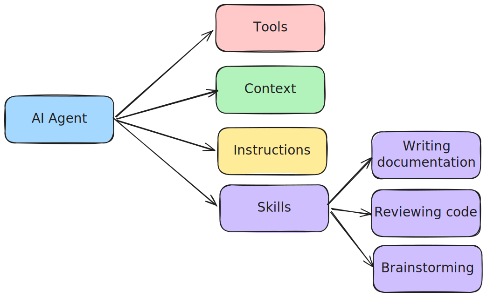
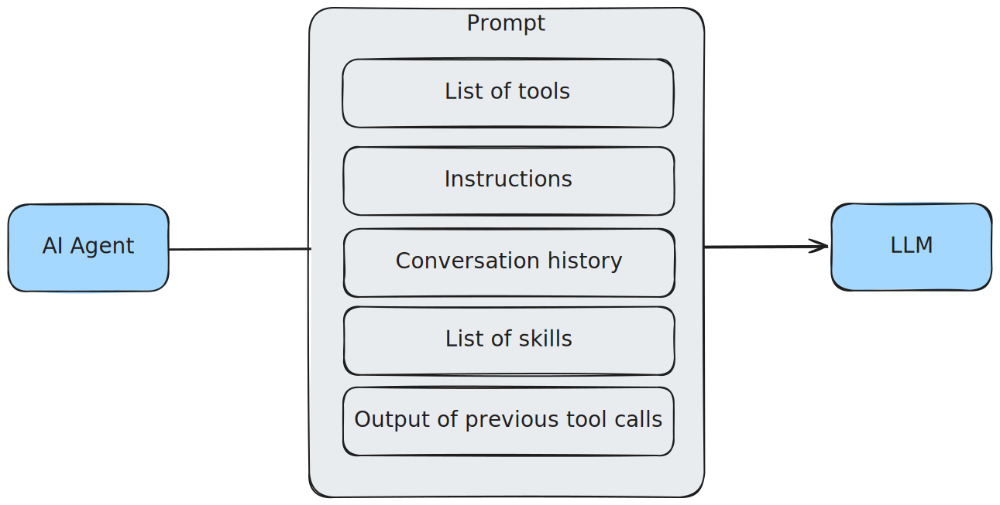
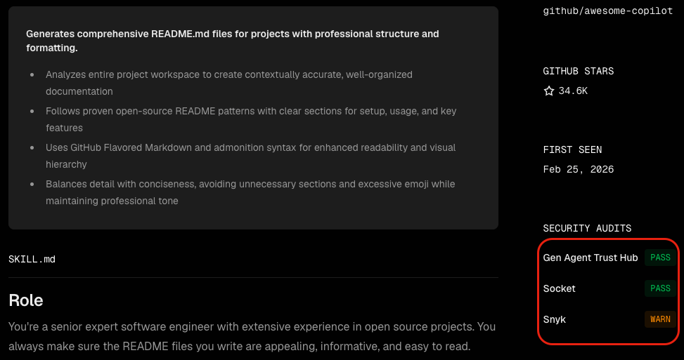

## What are skills?

AI skills are a hot topic nowadays.
These small building blocks turn your AI agents from a generic one into a domain expert.
The way they work is that they essentially contain some documentation or information about how to execute certain task.

The AI agent then gets a list of all its skills, and whenever it needs to execute that task, it can follow the documentation or instructions within that skill.



The nice thing is that this standard has been adopted by most AI agent tools.
Because of that, everyone who is working with AI agent is writing and sharing their AI skills.

## What is prompt injection?

However, similarly to other AI building blocks, they suffer from the same problem, which is that LLMs are not capable of fully separating instructions from content.
That's because the LLM is only capable of understanding text, so all tools involving LLMs have to concatenate all these inputs to one continuous text.
Examples of those inputs are:

* The prompt/instructions themselves
* The tools are MCP servers that the agent can use
* The conversation history
* The skills the agent can use
* The output of any command, tool or MCP server that the agent invoked



That means that if any of those inputs contains an instruction, the agent might follow that, regardless of whether it was part of the instruction you gave it.
This is known as **prompt injection**.

## What's the issue?

Now let's take a look at these skills.
For example, take GitHub's own [create-readme](https://github.com/github/awesome-copilot/blob/main/skills/create-readme/SKILL.md) skill.
This skill contains a single markdown file called **SKILL.md**.
It has a frontmatter/heading that contains a short description of the skill, and the guidelines themselves:

```markdown
---
name: create-readme
description: 'Create a README.md file for the project'
---

## Role

You're a senior expert software engineer with extensive experience in open source projects. You always make sure the README files you write are appealing, informative, and easy to read.

## Task

1. Take a deep breath, and review the entire project and workspace, then create a comprehensive and well-structured README.md file for the project.
2. Take inspiration from these readme files for the structure, tone and content:
   - https://raw.githubusercontent.com/Azure-Samples/serverless-chat-langchainjs/refs/heads/main/README.md
   - https://raw.githubusercontent.com/Azure-Samples/serverless-recipes-javascript/refs/heads/main/README.md
   - https://raw.githubusercontent.com/sinedied/run-on-output/refs/heads/main/README.md
   - https://raw.githubusercontent.com/sinedied/smoke/refs/heads/main/README.md
3. Do not overuse emojis, and keep the readme concise and to the point.
4. Do not include sections like "LICENSE", "CONTRIBUTING", "CHANGELOG", etc. There are dedicated files for those sections.
5. Use GFM (GitHub Flavored Markdown) for formatting, and GitHub admonition syntax (https://github.com/orgs/community/discussions/16925) where appropriate.
6. If you find a logo or icon for the project, use it in the readme's header.
```

On first sight, it might look okay, because there's no fishy instruction in this file.

However, as you might have guessed, it isn't completely safe.

The problem is that this skill contains **links to external web pages**.
Not only that, the skill is **actively encouraging** the agent to visit these pages to take inspiration.

Why is that a problem?
The agent will likely open these pages.
To do this, it will invoke some tool, and the output of that tool will be sent back to the LLM within the next prompt.
So if any of those pages contains an instruction, the AI agent might execute it.
And since you have no control over those external webpages, they inherently form a risk.
Maybe today there's no prompt injection on those pages, but what about tomorrow, next week, next month, ... .

In fact, one of those links refers to a GitHub discussion.
So even right now someone could add a comment to that discussion in an attempt to inject a prompt!

## What is the solution?

So now you're probably wondering... how do we solve this?
Well, the solution is two-fold.
First of all, the AI agent cannot do anything bad as long as you don't let it.
For every tool call the agent wants to make, you have to grant it the permissions.
So as long as you carefully review what the agent is trying to do, it cannot do anything harmful.

However, many of these AI agents also come with an autopilot mode, where every permissions is granted by default.
So if you're using that mode, you should do it in an environment where the agent cannot do anything wrong.

The second part of the solution is to carefully audit any skill you write and import.
If you're importing skills, I'd recommend using Vercel's https://skills.sh.
This is an online repository of community-provided skills.
While there are many of these repositories, the thing that differentiates it from others is that it includes security audits provided by Gen, Snyk and Socket.



If we take a look back at the create-readme skill from earlier, we can find it on [skills.sh](https://www.skills.sh/github/awesome-copilot/create-readme) and it contains [a warning from Snyk](https://www.skills.sh/github/awesome-copilot/create-readme/security/snyk) stating:

> Third-party content exposure detected (high risk: 0.80). 
> The SKILL.md explicitly instructs the agent to "take inspiration" from four raw.githubusercontent.com URLs (public GitHub raw files), which requires fetching and interpreting untrusted, user-published content that could influence the agent's output and behavior.

This is exactly the same issue I addressed.

This repository also includes its own CLI tool to install these skills.
Be aware though, this tool collects telemetry by default, so if you want to disable this you should check [their documentation](https://github.com/vercel-labs/skills#environment-variables).

## Conclusion

If you're using AI agents, you should definitely look into skills.
However, never forget to review any tool call made by those agents and review any skills you import.