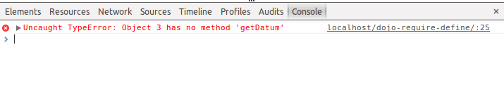

I didn't exactly plan on writing this, but after a question from an intern, I thought it might be interesting to exaplain the difference between `require()` and `define()`. Every developer who has used Dojo or even another JavaScript framework/platform like Node.js and RequireJS, knows that one time or another, you need to load your modules. In Dojo they chose to use an asynchronous module loader or the AMD loader.

If you read some other articles, then you probably know that there are two main functions to use, namely the `define()` and `require()` function.

### The Dojo AMD loader

Before explaining what they are and what the differences are, I'm going to list the advantages of the Dojo AMD loader. Before Dojo version 1.7 there was no AMD loader at all and all functions were loaded synchronously, for example:

```javascript
var myModule = dojo.require("my.module");
```

This approach had several drawbacks. The first one that this system is working **synchronously**. Do you have some code below it that doesn't need the module?  Too bad for you, as long as the **my/module** isn't loaded, nothing will happen. With the AMD loader that problem is off the road, the non-blocking approach make sure that everything will be executed. The only thing that won't be executed is the callback, which contains code that depends on the module that have to be loaded, that makes sense.

An example:

```javascript
require(["dijit/form/Button"], function(Button) {
    console.log("First?");
})
console.log("Second?");
```

If you execute this code, then there will be a big chance you will see **Second?** first and then **First?**. The reason is that before the `dijit/form/Button` module is loaded, some time has went by already. The second `console.log()` statement however is not being blocked by loading the module, so almost directly you will see **Second?**.


But be aware, if you execute the following code:

```javascript
require(["dojo/dom"], function(dom) {
    console.log("First?");
})
console.log("Second?");
```

You will probably see **First?** and then **Second?**. Weird, don't you think? The reason is that most Dojo builds (like the default one) already pre-loads several modules, including **dojo/dom**. If you want to create your own custom build you can read [this article](http://dojotoolkit.org/documentation/tutorials/1.9/build/) or you use the Dojo [web builder](http://build.dojotoolkit.org).

Another disadvantage of the old way of loading modules is that you have absolutely no overview of what is being loaded and what isn't. A developer can load a module anywhere in the code, so the following could happen:

```javascript
var myModule = dojo.require("my.module");
// Over 9000 lines of code
var myModule = dojo.require("my.other.module");
```

Not that readable if you ask me, certainly not if you have to look if your variable isn't replaced somwhere by another module. With the AMD loaer this problem is easily solved because you have to work with a certain scope before you can use the modules. So the use of a module is limited and you are forced to group all modules that have to be loaded at one specific place.

### require()

If you simply need a Dojo module, then you will normally use the `require()` function. The syntaxis is known by most Dojo developers already, but if that isn't the case then here it is:

```javascript
require([ "my/module", "my/other/module", "another/module" ], function(myModule, myOtherModule, anotherModule) {
    ...
});
```

The first parameter is an array of all modules you need to load. The second parameter on the other hand is the callback that is being executed when all modules are loaded. Each parameter will contain the corresponding module from the array in the first parameter. You're obligated to use the modules in the **same order** as they appear in the array.

Sometimes you may have a module you need, but you don't need a reference to it. Some examples of it are the Dijit widgets or the **dojo/parser** module if you're using declarative markup. Another example is the **dojo/domReady!** plugin, the **dojo/NodeList-dom** module and many more. The solution to this problem is that you just add them to the end of the  `require()` function and just don't add a parameter for it. For example:

```javascript
require(["my/module", "my/other/module", "another/module"], function(myModule, myOtherModule) {
    ...
});
```

In the code example above, the **another/module** will be loaded, but there is no reference to it in the callback function.

Another approach that is commonly used with Dijit widgets is:

```javascript
require(["dijit/form/Button", "dijit/form/TextBox"]);
require(["my/module", "my/other/module", "another/module"], function(myModule, myOtherModule) {
    ...
});
```

If you don't define a callback your modules will still be loaded, but no callback is being executed, which means you don't have a reference to these modules either.

### define()

The second method to load modules is the  `define()` function. This function has a similar syntaxis to the `require()` function. However, there are certain differences as well. The first difference is that when you're using `define()`, a return value is expected. This is already a hint that the `define()` function is mainly used to define modules. If you're writing a module it makes sense that at a certain point you will be returning an object (= your module).

An example:

```javascript
define([ "dojo/date/locale" ], function(dateLocale) {
    return {
        getDate: function() {
            return dateLocale.format(new Date(), {
                selector: "date",
                formatLength: "short"
            });
        }
    };
});
```

As you can see here, I'm using the `define()` function and inside I'm returning an object. If you would import that module now, then the reference you get would be pointing to that object that's being returned here. If you're using the `require()` function to write a module, then no return value is expected and then you would get an error if you would still call that module.



Another difference is that the `define()` function is lazy, while the `require()` function isn't. Modules imported in the `define()` function, will only be imported at the moment they're imported in another  `require()` statement.

For example, if we have the following module:

```javascript
define(["dijit/form/Button"], function() {
    console.log("Executed module!");
    return {};
});
```

And try to load it using:

```javascript
define(["my/module"], function(module) {
    console.log("Executed main define!");
});
```

Nothing will happen because we didn't use a `require()` here and because the  `define()` is lazy, nothing will happen. The console will stay empty.

If we use the `require()` function on the other hand:

```javascript
require(["my/module"], function(module) {
    console.log("Executed main require!");
});
```

Then both statements will be printed in the log. So be careful when using the module loader, you can create really weird situations if you're not using them correctly.


### Summarized

Because the `define()` functions offers the possibility to provide a **return value** and lazily loads the dependencies, this command is suitable for defining modules. When creating a module you're going to return an object.

This also means that the `require()` functions main use is importing modules, while the `define()` function is used to define your own custom modules and the dependencies it needs.
