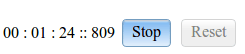

A decade ago, the web was just a place full of websites and information. Today, the web has evolved into something bigger. Next to websites, you also have web applications or rich internet applications (RIA). With the new technologies like HTML5, CSS3 and JavaScript, the web became a good alternative to many desktop applications. One of these frameworks that is directed to the web application market is Dojo. Dojo is one of the few JavaScript frameworks that allows you to do anything you need using JavaScript. From basic DOM manipulation to widgets, a mobile aspect, MVC applications, ... .

Dojo is a great framework, however, to get a proper introduction to Dojo you usually have to look around the web and start putting things together. This small series about writing a widget covers most aspects you need tok now to start with Dojo (and modules). It covers topics like:

- Dojo AMD loader
- Defining modules
- Module inheritance
- Internationalization
- Templating

While most tutorials stop at writing a widget and templating, we go a little further to localize our widget. We also go into detail about the Dojo loader and what the difference is between defining modules and writing your main JavaScript file. I'll do all of this by writing a simple widget, a stopwatch.

1. [Application structure, templating and localization](/dojo-widget-resources/)
2. [Modules, inheritance and object state](/dojo-widget-inheritance/)
3. [Module behavior](/dojo-widget-behavior/)
4. [Finishing the application and demo](/dojo-widget-demo/)

[Demo](http://g00glen00b.github.io/dojo-stopwatch/)
