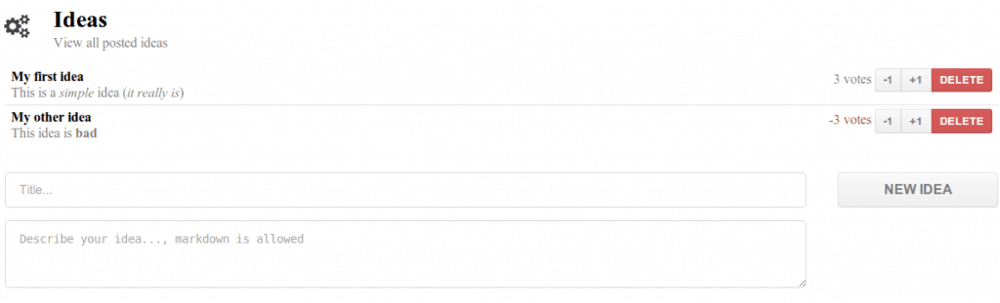

HTML5 made browsers a powerful alternative to desktop applications. However, network traffic (when using AJAX or by simply loading pages) is always in one direction. The client requests a page from the server, which in turn responds with the proper content. With HTML5 WebSockets that's a different story, websockets allow you to setup a full duplex channel between server and client, making it possible to send messages in both ways.

In this small tutorial series I'm going to setup a small CRUD application that will update across all clients simultaneous. I've chosen not to write the entire application using WebSockets, but rather than that I chose to setup a hybrid solution with RESTful webservices and WebSockets. Each time the RESTful webservice is called to update the datasource, the clients are being notified. Each client will then send an additional REST call to retrieve the data and use it as model.

The reasoning behind this is quite simple: WebSockets are still quite new and not many libraries provide integration with it and certainly not at the same level as they integrate with RESTful webservice. AngularJS for example provides integration with RESTful webservices through the **angular-resource** project and thanks to it the amount of code necessary to make a REST client is very low. However, it does not have a similar thing with WebSockets which means a bigger setup is necessary.

Frameworks I'm going to use is the recently released **Spring 4** and of course the famous front-end MVC-framework **AngularJS**.

### Writing real time applications using Spring, AngularJS and WebSockets

1. [Project setup and configuration](http://wordpress.g00glen00b.be/spring-websockets-config)
2. [RESTful webservice and WebSockets (Spring)](http://wordpress.g00glen00b.be/spring-websockets-spring)
3. [AngularJS front-end](http://wordpress.g00glen00b.be/spring-websockets-angular)

You can also find the complete code example on [Github](https://github.com/g00glen00b/spring-websockets).
