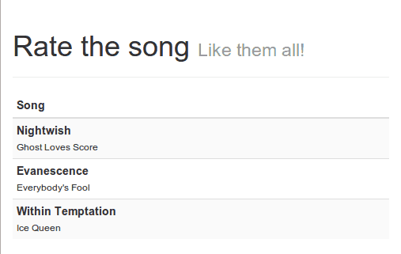
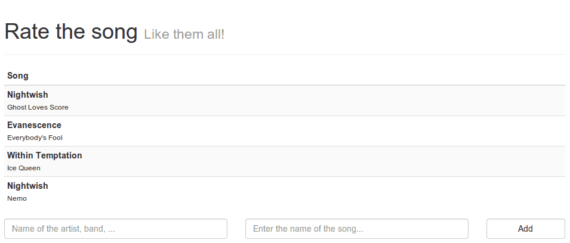
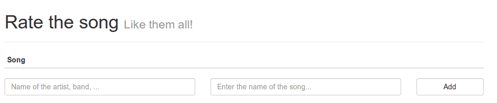
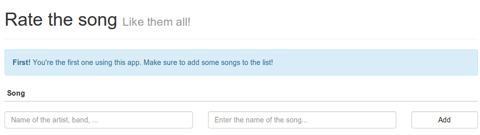

In this introduction tutorial series to [AngularJS](http://angularjs.org) I'm going to build a small webapp introducing several aspects of AngularJS like controllers, filters, services and directives. I'm going to explain all of that by creating an artist/song-rating app, which (in the end) will look like:

Awesome, don't you think?

### Project setup

First we have to create and structure our app. You can choose the structure by yourself or even use a popular project setup like the [Angular seed](https://github.com/angular/angular-seed). I'm personally a fan of creating folders named **app**, **assets** and **libs**. Inside the **app** folder I create the following files:

- **app.js**: This file contains the main application declaration, also responsible for loading all other packages
- **controllers.js**: This file contains all controllers in the application, in this case it will only be a single controller.
- **services.js**: This file contains all services, factories and resources. In this case we're going to make a single factory to persist the songs to the HTML5 LocalStorage.
- **directives.js**: Custom model/view elements can be created and are called directives. In this case I'm going to create a directive to show a rating widget
- **filters.js**: This file contains filters. Filters convert a specific input to something else. For example it can be used to trim a String, to sort an array, ... . In this tutorial I'm going to use it to convert the song title to lowercase (except the first letters of the words which will be capitalized)

I also created a folder called **templates** inside it, which will contain the templates used in my directive(s). In this case it's only one template you need to add, called **rating.html**.

The **libs** folder will contain our libraries, in this tutorial I'm going to use the following libraries:

- **AngularJS**: Doesn't need an explanation, but it's a popular JavaScript MVC framework powered by Google.
- **Twitter Bootstrap**: A popular UI framework created by the folks of Twitter.
- **Font Awesome**: Font awesome is an iconic font and adds many new icons that you can use in your application.
- **Lo-Dash**: Lo-Dash (similar to Underscore) is a utility belt for JavaScript and allows you to work with collections, functions, objects, ... .
- **Underscore.string**: Underscore.string is an extension to Underscore (or can be used standalone) and adds String utilities to your app. In this case I'm going to extend lo-dash with it, which is also perfectly compatible with Underscore.string.

If you want to use [Bower](http://bower.io) to load these dependencies, you can do that as well, the configuration I used is:

{
  "name": "angular-song-rate",
  "version": "0.0.1",
  "dependencies": {
    "angular": "1.2.15",
    "bootstrap": "3.1.1",
    "lodash": "2.4.1",
    "underscore.string": "2.3.3",
    "font-awesome": "4.0.3"
  }
}

If you're using Bower, make sure you change the destination directory to **libs**. You can do that by creating a file called **.bowerrc** with the following contents:

{
  "directory": "libs",
  "json": "bower.json"
}

Last but not least is the **assets** folder which, in my case, contains a folder called **css** with a file **style.css**. The entire project structure would become something like:

### Index HTML page

Let's start with developing our application. The first thing we're going to do is set up our **index.html** page and include all scripts/stylesheets:

<!DOCTYPE html>
<html>
  <head>
    <meta charset="utf-8" />
    <meta name="viewport" content="initial-scale=1, maximum-scale=1, user-scalable=no, width=device-width" />
    <title>Rate the song</title>
    <link rel="stylesheet" href="libs/bootstrap/dist/css/bootstrap.min.css" />
    <link rel="stylesheet" href="libs/font-awesome/css/font-awesome.min.css" />
    <link rel="stylesheet" href="assets/css/style.css" />
  </head>

  <body ng-app="myApp">
    <!-- Write code here -->    

    
    
    
    
    
    
    
    
  </body>
</html>

We're adding the stylesheets ([Twitter Bootstrap](http://getbootstrap.com), [Font awesome](http://fontawesome.io) and our own) and the scripts (AngularJS, [Lo-Dash](http://lodash.com), [Underscore.string](http://epeli.github.io/underscore.string/) and our own scripts). One special thing I'm already doing here is adding the `ng-app` attribute to the `<body>` tag. This means we're bootstrapping AngularJS to this page and "Angularify" it.

The next step is to write a controller, so inside our `<body>` tag we write the following:

  

    <h1>Rate the song <small>Like them all!</small></h1>
  

  <!-- Write code here -->

Notice the `ng-controller` attribute. This means that everything inside the `
` is now managed by the controller called **songCtrl**. The final step is that I'm going to show a list of songs, in this first stage it's going to be a simple table containing the artist and the song, for example:

<table class="table table-striped table-condensed">
  <thead>
    <tr>
      <th>Song</th>
    </tr>
  </thead>
  <tbody>
    <tr ng-repeat="song in songs">
      <td>
        

          <strong>{{song.artist}}</strong> 
          <small>{{song.title}}</small>
        

      </td>
    </tr>
  </tbody>
</table>

This is a simple table styled with Twitter bootstrap. The only difference is that in this case we want to show a row **dynamically** based upon the songs that are listed. We can create such a dynamic structure by using the `ng-repeat` attribute. In this case the attribute is saying "for each song in the songs array do ...". The songs-array is something we will define later on in our controller. Now, for each song I want to show the artist and the title. To do that, we add a **placeholder** which will be replaced for each song. The placeholders in this example are `{{song.artist}}` and `{{song.title}}`.

### Writing your first controller

So right now we wrote our first view in AngularJS. Of course, there's some JavaScript we need to write as well to make this app work. Before we actually start writing a controller, we first have to open up **app.js** and add the following code to it:

angular.module("myApp", \[
  'myApp.controllers'
\]);

This makes sure that for the app called **myApp** (remember from the `ng-app` attribute), we're depending on the "package" called `myApp.controllers`. So now we can go and edit **controllers.js**. Just like in app.js we also have to define something first, in this case the package **myApp.controllers** which we can do by writing:

angular.module("myApp.controllers", \[\])

To add a controller to this package, we write the following:

angular.module("myApp.controllers", \[\]).controller("songCtrl", function($scope) {
  // Write your code here
});

So in this case we're adding a controller called **songCtrl** (remember from the `ng-controller` attribute). We also get a parameter called `$scope`. This parameter is actually representing the controller object. Right now it's kind of empty, so let's start by adding functionality to it.

If you remember well, we used the `ng-repeat` attribute to make a list of all songs. Now it's time to define those songs, you can do that by adding the following code:

$scope.songs = \[{
  artist: "Nightwish",
  title: "Ghost Loves Score"
}, {
  artist: "Evanescence",
  title: "Everybody's Fool"
}, {
  artist: "Within Temptation",
  title: "Ice Queen"
}\];

Right now we have a perfect example of a simple view + controller, so it's time to test everything out! Open up your app and you should be able to see something like the following screenshot.

### Changing the model

Woohoo! It works like magic. However, I don't think you came all this way just to make a small app that does nothing. Well, now it's time for enhancing the app a bit. First, let's start off by adding a form just below the table to add new songs:

<form role="form" ng-submit="addSong(newSong.artist, newSong.title)">
  

    

      <label class="sr-only" for="artist">Artist</label>
      <input type="text" class="form-control" name="artist" placeholder="Name of the artist, band, ..." 
        ng-model="newSong.artist" autofocus />
    

    

      <label class="sr-only" for="song">Song</label>
      <input type="text" class="form-control" name="song" placeholder="Enter the name of the song..." 
        ng-model="newSong.title" />
    

    

      <button type="submit" class="btn btn-default form-control">Add</button>
    

  

</form>

This is just some plain HTML with a few Bootstrap classnames to style everything. What we're interested in is the AngularJS stuff. The first thing you may notice is the `ng-submit` attribute onto the form. If you're familiar with JavaScript, you probably know what `onsubmit` does. If you don't, well, it's an event that is executed when the form is submitted. In this case, it will call a function called `addSong()` with parameters `newSong.artist` and `newSong.title`.

If you want to know where they come from, you should look a bit further to the `<input>` fields which have a `ng-model` attribute. This means that they're **bound** to the value of the property title or artist from the object `newSong` in our controller.

We didn't do that yet, so let's edit our controller once more and add the `newSong` object:

$scope.newSong = { };

We also have to write the function `addSong()` to do something when the form is submitted. In this case it will just add a new object to the `songs` array and AngularJS will do the rest.

$scope.addSong = function(/\*\* String \*/ artist, /\*\* String \*/ title) {
  $scope.songs.push({
    artist: artist,
    title: title
  });
  $scope.newSong.title = "";
  $scope.newSong.artist = "";
};

So, what I'm doing here is that I'm adding a new song to the array and then I reset the title and artist properties. If you scroll a bit higher, you will notice that I told you that the form fields are **bound** to the properties. This means that if I type a letter into the textbox, the property in our controller is **automatically** (or better said: magically) updated with the value from our textbox. However, the opposite is also true. If we change the property in our controller, then the textbox is also being updated **automagically**. This magic thing has a cool name and it's being called **two way data binding**, where the "two way" means that the form can update the property and vice versa. This is where the real power behind AngularJS lies. It totally decouples your HTML from your controller, which improves your code design and makes it way easier to test later on.

So now it's time to test our app again! If we open our app we can see our form and we can now add new songs to the list.

### Hiding and disabling

So right now we made our app a little bit better and made it more dynamic. This means it's time remove the static data from the `$scope.songs` array and just leave an empty array behind:

$scope.songs = \[ \];

However, this makes our initial screen look so empty and unattractive:

So let's make our app even better and show a small message if there are no songs yet in the songs array. With AngularJS this is quite easy, just open your **index.html** and add the following piece of HTML just above the table:

  <strong>First!</strong> You're the first one using this app. Make sure to add some songs to the list!

This will show you a simple message, and thanks to the `ng-if` attribute, it is only being displayed if the songs array is empty.

So right now we're seeing the message, but the moment we add a song to the array, the message is gone.

Another thing I'm not happy about is that we can just leave the form empty and add a new song which means an empty row is being added. I only want the user to be able to submit the form **only** if he entered a value in both the artist and song field. This is quite easy as well, just add the `ng-disabled` attribute to the submit button of the form like this:

<button type="submit" class="btn btn-default form-control"
  ng-disabled="isEmpty(newSong.title) || isEmpty(newSong.artist)">Add</button>

This means that we're going to disable the form when the artist or title property is empty. The only thing we have to do now is to define the `isEmpty()` function by adding it to our controller:

$scope.isEmpty = function(/\*\* String \*/ str) {
  return \_.isBlank(str);
};

We're using a combination of **Lo-Dash** and **Underscore.string** to validate if the given string is empty or not. The only thing we didn't do yet is to integrate Underscore.string with Lo-Dash. Open up your **app.js** and add the following line to the bottom of the script:

\_.mixin(\_.string.exports());

This has nothing to do with AngularJS, so I'm not going to explain this into detail, but what happens here is that we extend Lo-Dash (by using the `mixin()`) function with the functionality of underscore.string (`_.string.exports()`).

So if we test our app again, we will notice that by default the submit button is disabled, making it impossible to submit the form. However, when we enter a value in both the artist and song field, the button is no longer disabled.

With the disable-functionality finished, I'm going to end this tutorial. We now made a small application using AngularJS. The most important things to remember are:

- AngularJS is **automagically**
- **Two way data binding** makes your life easier

In the next tutorial of this series I'm going to extend the controller a bit, write a filter and also use HTML5 LocalStorage to store our songs. If you're interested in the code, then wait a bit longer. After everything is finished I'm going to put it all up on to Github, so make sure to check it out regularly. Make sure to leave comments, questions, ideas or even the contents of your diary into the comment section below. It's appreciated a lot (yes, even the diary!).

### The story continues...

1. [Writing your first controller](http://wordpress.g00glen00b.be/introduction-angularjs-controller/ "An introduction to AngularJS: Writing your first controller")
2. [Filters and factories](http://wordpress.g00glen00b.be/introduction-angularjs-filter-factory)
3. [A rating directive](http://wordpress.g00glen00b.be/introduction-angularjs-directives)
