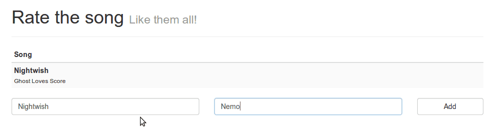
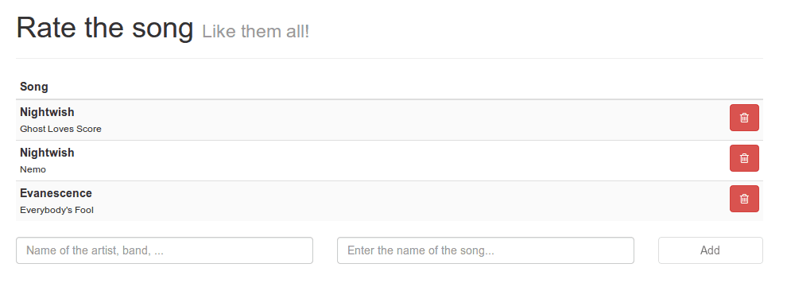

In the previous tutorial I talked about setting up a simple application using Ember.js. We wrote a simple app containing a route, a controller and a store (using Ember-data). In this tutorial we will go further using stores by adding an adapter to the store and removing elements from our store as well. Another feature I'm going to talk about is defining your own Handlebars helpers.

### Persisting data

You may have noticed it already, but if you add songs to the list and reload the page, they're all gone. The store we're currently using is a simple in memory store using JavaScript. Obviously it's gone when the page is refreshed. To persist our changes we could connect our store to a back-end service (using RESTful webservices for example), but we could also use the HTML5 LocalStorage to locally persist the data. [Most browsers](http://caniuse.com/#feat=namevalue-storage) nowadays support the HTML5 LocalStorage, but be aware when you use it and you have to support older browsers as well.

The step to persisting is pretty small when using Ember.js and ember-data. You do it by defining an adapter. In this tutorial I'm going to use a custom adapter called the [LSAdapter](https://github.com/rpflorence/ember-localstorage-adapter) (LS stands for LocalStorage). To do that you have to add the following to **app.js**:

```javascript
App.ApplicationAdapter = DS.LSAdapter.extend({
  namespace: 'myApp.songs'
});
```

This adapter will automatically persist all changes to the store to the local storage using **myApp.songs** as the key. Another small thing we have to change (I don't have an idea if this is a bug or not) is that we have to replace the `all()` function in **routes.js** by the `find()` function:

```javascript
return this.store.find('song');
```

If we now open our app, add a new song and refresh the page, then the songs you added should still be there.


### Improving the form

If I have to name this tutorial, it will probably be "the tutorial of the small improvements". In this part I will improve the form a bit. At the moment there's a small problem, if we don't enter the name of the artist or the song, it will add a blank song to the list, something we really don't want. To solve that, I'm going to disable the submit button as long as not all fields are entered.  Open **index.html**, locate the "Add" button and add the following to it:

```html
{{bind-attr disabled=isNotComplete}}
```

Make sure that it's inside the `<button>` tag, similar to how we added the `{{action}}` to the `<form>`. This code will add an attribute (disabled) and bind it to the value of **isNotComplete**. If this value is `true`, then the attribute is activated, if it isn't, then the attribute is not there (and the form can be submitted).

The only thing we have to do now is to defined the `isNotComplete` property, open **controllers.js** and add the following to it:

```javascript
isNotComplete: function() {
  return _.isBlank(this.get('newArtist')) || _.isBlank(this.get('newTitle'));
}.property('newArtist', 'newTitle')
```

This is similar to how we defined the `isEmpty` complex property, so I'm not going to explain this one into detail, just read the previous tutorial. The only thing that's different here is the implementation. The `_.isBlank()` function is a part of the **underscore.string** library and will return `true` if the field is blank (= empty, only spaces, null or undefined). We do that for both the **newArtist** and **newTitle** property and also end with adding `.property()` to it to make sure that the field is being updated as soon as one of the properties changes.

If we launch our app again, we will notice that the "Add" button is now disabled, making it impossible to submit the form.


As soon as we enter a value in both fields, the button is enabled again.



### Deleting songs

So right now we handled two aspects of many applications out there:

- Reading data
- Adding data

In this section I will add a "delete" button to each song, allowing us to delete a specific song from the list. So let's start by adding the button to **index.html**. To do that, first locate the `<div class="pull-left">` element (inside the table) and put the following content after the closing tag of that div:

```html
<div class="pull-right">
  <button type="button" class="btn btn-danger pull-right" {{action "deleteSong" this on="click"}}>
    <i class="fa fa-trash-o"></i>
  </button>
</div>
```

This is just some simple HTML, but notice that there's an `{{action}}` again, this time on the button calling the `deleteSong` action when the button is being clicked. Another difference is that we put `this` right after the name of the action (deleteSong). This means that we're adding the current song (`this`) as an argument to the deleteSong action.

So let's go and implement that action in our controller by adding the following piece of code to the `actions` object in **controllers.js**:

```javascript
deleteSong: function(song) {
 song.deleteRecord();
 song.save();
},
```

As I told before, the current song is passed as a parameter to the deleteSong action. The only thing we have to do is calling the functions `deleteRecord()` and `save()` on it to remove it from the list.

If we open our app once again, then we will see that there's a "delete" button at the right side of each song.


The moment we click on the button, the song is being removed from the list.


### Custom helpers

Handlebars is a very popular templating framework, used in other frameworks as well. In this part I will talk about how you can define your own custom helpers. I've added several songs to the list, but as you can see in the screenshot I (ab)used the Shift key a lot.


To solve that, I'm going to format the name of the artist and the song before showing them to the user. I'm going to "titleize" them, which means that all letters are converted to lowercase, except the first letter of each word which will be uppercase. This might not be the best solution (some artists really have capital letters or not), but for demonstration purposes I'm going to use it anyways!

To define our custom helper we open **helpers.js** and add the following code:

```javascript
Ember.Handlebars.helper('titleize', function(title) {
  return _.titleize(title);
});
```

This helper will use the `_.titleize()` function, which is part of the **underscore.string** library to convert the given string to the titleized format. All that's left now is to use this helper wherever we need. So, let's open **index.html** and look for `{{artist}}` and `{{title}}`. To use the helper, we convert those by `{{titleize artist}}` and `{{titleize title}}` respectively.

If we open our app again, we will notice that the weird capital letters are gone, which means our helper is applied pretty good.



But be aware, we defined this as a helper, which means that it is only executed when rendering the output, it is not applied to the actual data inside the store.

That's it for this small tutorial. Next time we're going to add the rating component to our application, gazing into components and views. Stay tuned!

### Ember.js in action: The series

1. [Ember.js in action: Routes and controllers](/ember-routes-controllers/ "Ember.js in action: Routes and controllers")
2. [Ember.js in action: Helpers and adapters](/ember-helpers-adapters/ "Ember.js in action: Helpers and adapters")
3. [Ember.js in action: Components and views](/ember-components-views/ "Ember.js in action: Components and views")
